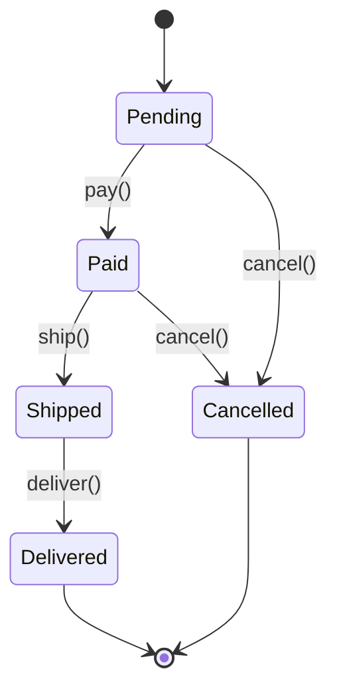
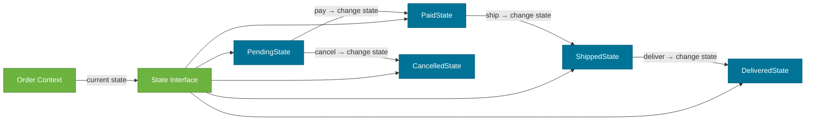

# State Pattern

> A behavioral design pattern that allows an object (the **context**) to alter its behavior when its internal state changes — as if the object changed its class.

## What Problem Does It Solve?

An `Order` can be in states: `PENDING` → `PAID` → `SHIPPED` → `DELIVERED` (or `CANCELLED`). Each state allows different operations: you can cancel a `PENDING` order but not a `SHIPPED` one; you can ship a `PAID` order but not a `PENDING` one.

Without the State pattern, all this logic lives inside the `Order` class as a tangle of `if (state == PENDING)` / `else if (state == PAID)` blocks in every method (`cancel()`, `pay()`, `ship()`, etc.). Adding a new state means finding and updating every conditional in every method. This is the **state explosion** problem — the class becomes unmaintainable.

The State pattern solves this by extracting each state's behavior into a separate `State` class. The `Order` delegates method calls to its current `State` object. Transitions update the current state object reference.

## What Is It?

The State pattern has three participants:

| Role | Description |
|------|-------------|
| **Context** | Holds a reference to the current `State`. Delegates all state-dependent behavior to it. |
| **State** | Interface declaring the state-specific methods |
| **ConcreteState** | Implements `State` for one specific state; controls transitions to other states |

The key difference from Strategy: **State** transitions automatically (the state controls the transitions); **Strategy** is injected externally. State objects often hold a back-reference to the Context to trigger transitions.

## How It Works


*Order lifecycle: each arrow is a valid transition. The State pattern encodes these rules inside each state class — no `if/else` needed in the Order itself.*


*Context delegates calls to the current State. Each ConcreteState drives the transition by calling context.setState(newState).*

## Code Examples

### Order State Machine

```java
// ── State interface ────────────────────────────────────────────────────
public interface OrderState {
    void pay(Order order);
    void ship(Order order);
    void deliver(Order order);
    void cancel(Order order);
    String getStatus();
}

// ── Context ────────────────────────────────────────────────────────────
public class Order {

    private OrderState state;              // ← current state reference
    private final long id;

    public Order(long id) {
        this.id    = id;
        this.state = new PendingState();   // ← initial state
    }

    // Delegates all behavior to the current state
    public void pay()     { state.pay(this);     }
    public void ship()    { state.ship(this);    }
    public void deliver() { state.deliver(this); }
    public void cancel()  { state.cancel(this);  }

    // Package-visible so states can transition
    void setState(OrderState newState) { this.state = newState; }

    public String getStatus() { return state.getStatus(); }
    public long getId()       { return id; }
}

// ── Concrete States ────────────────────────────────────────────────────

public class PendingState implements OrderState {
    public void pay(Order order) {
        System.out.println("Order " + order.getId() + " paid.");
        order.setState(new PaidState());   // ← transition to next state
    }
    public void ship(Order order) {
        throw new IllegalStateException("Cannot ship: order not paid yet");
    }
    public void deliver(Order order) {
        throw new IllegalStateException("Cannot deliver: order not shipped");
    }
    public void cancel(Order order) {
        System.out.println("Order " + order.getId() + " cancelled.");
        order.setState(new CancelledState());
    }
    public String getStatus() { return "PENDING"; }
}

public class PaidState implements OrderState {
    public void pay(Order order) {
        throw new IllegalStateException("Order already paid");
    }
    public void ship(Order order) {
        System.out.println("Order " + order.getId() + " shipped.");
        order.setState(new ShippedState());
    }
    public void deliver(Order order) {
        throw new IllegalStateException("Cannot deliver: order not shipped");
    }
    public void cancel(Order order) {
        System.out.println("Order " + order.getId() + " cancelled (refund issued).");
        order.setState(new CancelledState());
    }
    public String getStatus() { return "PAID"; }
}

public class ShippedState implements OrderState {
    public void pay(Order o)    { throw new IllegalStateException("Already paid"); }
    public void ship(Order o)   { throw new IllegalStateException("Already shipped"); }
    public void cancel(Order o) { throw new IllegalStateException("Cannot cancel shipped order"); }
    public void deliver(Order order) {
        System.out.println("Order " + order.getId() + " delivered.");
        order.setState(new DeliveredState());
    }
    public String getStatus() { return "SHIPPED"; }
}

public class DeliveredState implements OrderState {
    public void pay(Order o)     { throw new IllegalStateException("Already delivered"); }
    public void ship(Order o)    { throw new IllegalStateException("Already delivered"); }
    public void deliver(Order o) { throw new IllegalStateException("Already delivered"); }
    public void cancel(Order o)  { throw new IllegalStateException("Cannot cancel: already delivered"); }
    public String getStatus()    { return "DELIVERED"; }
}

public class CancelledState implements OrderState {
    public void pay(Order o)     { throw new IllegalStateException("Order is cancelled"); }
    public void ship(Order o)    { throw new IllegalStateException("Order is cancelled"); }
    public void deliver(Order o) { throw new IllegalStateException("Order is cancelled"); }
    public void cancel(Order o)  { throw new IllegalStateException("Already cancelled"); }
    public String getStatus()    { return "CANCELLED"; }
}

// ── Usage ──────────────────────────────────────────────────────────────
Order order = new Order(1001L);
System.out.println(order.getStatus()); // PENDING

order.pay();
System.out.println(order.getStatus()); // PAID

order.ship();
System.out.println(order.getStatus()); // SHIPPED

order.cancel(); // ← throws IllegalStateException: Cannot cancel shipped order
```

### Spring State Machine (Spring Statemachine)

For complex state machines, Spring provides the `spring-statemachine` library:

```java
@Configuration
@EnableStateMachine
public class OrderStateMachineConfig extends StateMachineConfigurerAdapter<OrderStatus, OrderEvent> {

    @Override
    public void configure(StateMachineStateConfigurer<OrderStatus, OrderEvent> states) throws Exception {
        states.withStates()
            .initial(OrderStatus.PENDING)
            .states(EnumSet.allOf(OrderStatus.class));
    }

    @Override
    public void configure(StateMachineTransitionConfigurer<OrderStatus, OrderEvent> transitions) throws Exception {
        transitions
            .withExternal().source(PENDING).target(PAID).event(PAY).and()
            .withExternal().source(PAID).target(SHIPPED).event(SHIP).and()
            .withExternal().source(SHIPPED).target(DELIVERED).event(DELIVER).and()
            .withExternal().source(PENDING).target(CANCELLED).event(CANCEL).and()
            .withExternal().source(PAID).target(CANCELLED).event(CANCEL);
    }
}
```

:::info
`spring-statemachine` is worth using when the state machine has: guard conditions (transitions that are conditional), parallel states, sub-state machines, or action hooks on entering/exiting states. For simpler cases, the manual State pattern is more readable and has no extra dependency.
:::

## Trade-offs & When To Use / Avoid

| | Pros | Cons |
|--|------|------|
| **State** | Eliminates conditional branches; each state is isolated and testable; transitions are explicit and discoverable | More classes — one per state; if states are few and simple, if/else is clearer |
| **vs if/else** | Scales cleanly to many states and operations; Open/Closed for new states | — |
| **vs Strategy** | State self-transitions; Strategy is externally injected | Use Strategy when the algorithm is independent of the object's lifecycle state |

**When to use:**
- Domain objects with a clear lifecycle and state-dependent behavior (Order, Ticket, Workflow, Connection).
- Objects whose behavior changes significantly based on state.
- When you have many operations on a finite-state object and the if/else is becoming unmaintainable.

**When to avoid:**
- Two or three simple states with minimal behavior differences — a `boolean` flag or `enum` with a small switch is cleaner.
- Stateless behavior — there's no state to manage.

## Common Pitfalls

- **State objects holding their own mutable state** — ConcreteState objects are typically stateless (all state lives in the Context). If a State holds data, sharing it across multiple Context instances causes bugs. Use a state-per-context approach or keep State objects stateless.
- **Forgetting transition guards** — if `PaidState.ship()` doesn't verify that a warehouse is assigned, the state machine allows invalid transitions. Add guard conditions.
- **Inconsistent exception types** — some states throw `IllegalStateException`; others return silently. Be consistent: always throw for invalid transitions so the caller knows the operation was rejected.
- **Deep state hierarchies** — nested states (a sub-state machine inside a state) work in Spring Statemachine but are hard to reason about in the manual pattern. Keep states flat unless complexity requires nesting.

## Interview Questions

### Beginner

**Q:** What is the State pattern?
**A:** It allows an object to change its behavior when its internal state changes. Each state is encapsulated in a separate class, and the context delegates operations to the current state object.

**Q:** What is the difference between State and Strategy?
**A:** Both use an interface with multiple implementations held by a context. The difference is intent: Strategy is *externally* set — the client chooses which algorithm to inject. State *self-transitions* — the state objects themselves trigger transitions to other states based on the context's internal lifecycle.

### Intermediate

**Q:** How would you persist the state of an Order entity to a database?
**A:** Store the state as a `String` or `Enum` column (e.g., `ORDER_STATUS VARCHAR`). When loading, reconstruct the appropriate State object based on the persisted enum: `state = StateFactory.fromEnum(status)`. Use JPA's `@Enumerated(EnumType.STRING)` for the status field.

**Q:** How does the State pattern apply to Spring Statemachine?
**A:** Spring Statemachine is a full-featured implementation of the State pattern. You configure states, events (triggers), transitions, guards, and actions in a `StateMachineConfigurerAdapter`. The `StateMachine` is the Context; events drive transitions; guards add conditional logic; actions are hooks on enter/exit.

### Advanced

**Q:** How does the State pattern support the Open/Closed Principle?
**A:** Adding a new state (e.g., `REFUNDED`) requires creating one new `RefundedState` class and registering its transitions. You never modify the existing state classes or the Context class for the common transition paths — they are closed for modification. The system is open for extension via the new `ConcreteState`.

**Follow-up:** What challenges arise when persisting a distributed state machine?
**A:** Distributed systems must handle: (1) concurrent transitions — two services trying to transition the same Order simultaneously (use optimistic locking on the `status` version field); (2) partial failures — state updated but side effects (email) not completed (use the outbox pattern with `@TransactionalEventListener`); (3) replaying state from events (event sourcing) — complex but enables full audit trail.

## Further Reading

- [State Pattern — Refactoring Guru](https://refactoring.guru/design-patterns/state) — illustrated lifecycle walkthrough with Java examples
- [State Design Pattern in Java — Baeldung](https://www.baeldung.com/java-state-design-pattern) — order processing and connection state machine examples

## Related Notes

- [Strategy Pattern](./strategy-pattern.md) — structurally similar to State but used for independent algorithm selection, not lifecycle state management.
- [Observer Pattern](./observer-pattern.md) — State transitions often trigger events that Observers respond to (e.g., `OrderShippedEvent` when state changes to `SHIPPED`).
- [Command Pattern](./command-pattern.md) — commands often trigger state transitions; Command encapsulates the action that moves the Context from one State to another.
