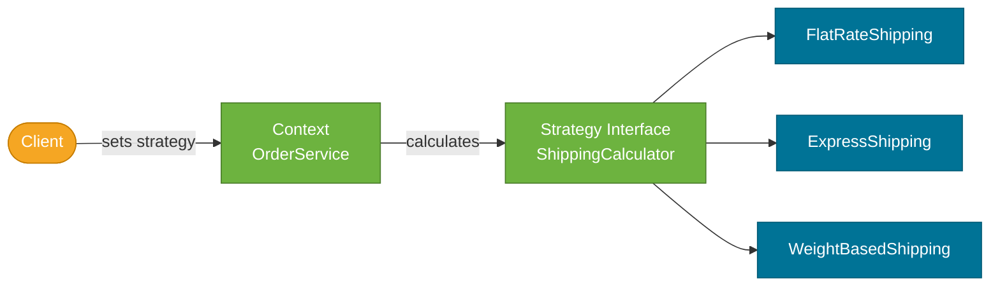

# Strategy Pattern

> A behavioral design pattern that defines a family of interchangeable algorithms, encapsulates each in its own class, and lets clients switch between them at runtime.

## What Problem Does It Solve?

You have an `OrderService` that calculates shipping cost. It starts with one algorithm: standard flat-rate shipping. A week later, you add express shipping. Then overnight, then economy, then calculated-by-weight. Each new variant is added as an `if/else` or `switch` branch inside the `calculateShipping()` method.

The method grows to 100 lines. Tests for one algorithm accidentally affect others. Adding a new variant requires re-testing the whole method. Removing one means finding and deleting the right `else if`. This is the **conditional complexity smell** — algorithm variants buried inside one method.

The Strategy pattern solves this by extracting each algorithm into its own class behind a common interface. The client holds a reference to the interface and can swap the algorithm at runtime without knowing which one is active.

## What Is It?

The Strategy pattern has three participants:

| Role | Description |
|------|-------------|
| **Strategy** | Interface that all algorithm variants implement |
| **ConcreteStrategy** | A specific algorithm implementation |
| **Context** | The class that holds a `Strategy` reference and delegates calculations to it |

The Context doesn't know which specific strategy it holds — it just calls `strategy.execute()`. Swapping strategies changes behavior without changing the Context.

## How It Works


*Context delegates to the Strategy interface. Swapping the concrete implementation changes the algorithm — the client and Context code don't change.*

## Code Examples

:::tip Practical Demo
See [Strategy Pattern Demo](./demo/strategy-pattern-demo.md) for runnable examples: class-based strategies, lambda strategies, Spring `@Qualifier` selection, and a registry approach.
:::

### Shipping Cost Calculator

```java
// ── Strategy interface ────────────────────────────────────────────────
@FunctionalInterface                        // ← Strategy with one method fits @FunctionalInterface
public interface ShippingCalculator {
    BigDecimal calculate(Order order);
}

// ── Concrete Strategies ───────────────────────────────────────────────
public class FlatRateShipping implements ShippingCalculator {
    public BigDecimal calculate(Order order) {
        return new BigDecimal("5.99"); // ← flat fee regardless of order
    }
}

public class ExpressShipping implements ShippingCalculator {
    public BigDecimal calculate(Order order) {
        return new BigDecimal("19.99"); // ← fixed premium rate
    }
}

public class WeightBasedShipping implements ShippingCalculator {
    private static final BigDecimal RATE_PER_KG = new BigDecimal("2.50");

    public BigDecimal calculate(Order order) {
        return RATE_PER_KG.multiply(BigDecimal.valueOf(order.getTotalWeightKg())); // ← scales with weight
    }
}

// ── Context ────────────────────────────────────────────────────────────
public class OrderService {

    private ShippingCalculator shippingCalculator; // ← holds the strategy

    public OrderService(ShippingCalculator shippingCalculator) {
        this.shippingCalculator = shippingCalculator;
    }

    // Allow runtime swap
    public void setShippingCalculator(ShippingCalculator calc) {
        this.shippingCalculator = calc;
    }

    public BigDecimal checkout(Order order) {
        BigDecimal itemsTotal = order.getItemsTotal();
        BigDecimal shipping   = shippingCalculator.calculate(order); // ← delegates; doesn't know which
        return itemsTotal.add(shipping);
    }
}

// ── Usage ─────────────────────────────────────────────────────────────
OrderService service = new OrderService(new FlatRateShipping());
service.checkout(order1);                                // uses flat rate

service.setShippingCalculator(new WeightBasedShipping()); // ← runtime swap
service.checkout(order2);                                // now uses weight-based
```

### Lambda Shortcut (Java 8+)

Because `ShippingCalculator` is a `@FunctionalInterface`, you can define strategies as lambdas — no extra class needed for simple cases:

```java
ShippingCalculator freeShipping = order -> BigDecimal.ZERO;      // ← one-liner strategy

ShippingCalculator promoRate = order ->
    order.getItemsTotal().compareTo(new BigDecimal("100")) > 0
        ? BigDecimal.ZERO                  // ← free shipping over $100
        : new BigDecimal("5.99");

OrderService service = new OrderService(freeShipping);
service.checkout(order);
```

### Spring DI — Injecting Strategies

Spring makes Strategy injection trivial — define each strategy as a `@Component` and inject the desired one via `@Qualifier` or `@ConditionalOnProperty`:

```java
@Component("flatRate")
public class FlatRateShipping implements ShippingCalculator { /* ... */ }

@Component("express")
public class ExpressShipping implements ShippingCalculator { /* ... */ }

@Service
public class OrderService {
    private final ShippingCalculator calculator;

    // ← @ConditionalOnProperty switches strategy based on app config
    public OrderService(@Qualifier("flatRate") ShippingCalculator calculator) {
        this.calculator = calculator;
    }
}
```

To pick the strategy at runtime from a config property:

```java
@Configuration
public class ShippingConfig {
    @Value("${shipping.mode:flat}")
    private String mode;

    @Bean
    public ShippingCalculator shippingCalculator(
            FlatRateShipping flat, ExpressShipping express, WeightBasedShipping weight) {
        return switch (mode) {
            case "express" -> express;
            case "weight"  -> weight;
            default        -> flat;
        };
    }
}
```

### `Comparator` — Strategy in the JDK

`java.util.Comparator` is the Strategy pattern built into Java. The sorting algorithm (`Collections.sort`, `Arrays.sort`) is the Context; the `Comparator` is the Strategy; each lambda/implementation is a ConcreteStrategy:

```java
List<User> users = loadUsers();

// Sort by name — one strategy
users.sort(Comparator.comparing(User::getName));

// Sort by age descending — different strategy, same sorting context
users.sort(Comparator.comparing(User::getAge).reversed());
```

## Trade-offs & When To Use / Avoid

| | Pros | Cons |
|--|------|------|
| **Strategy** | Eliminates `if/else` branching; each algorithm is isolated and independently testable; swap at runtime | More classes/objects if many strategies; client must be aware of which strategies exist |
| **vs if/else** | Open/Closed — add new strategy without modifying existing code | — |
| **vs Template Method** | Composition over inheritance; strategies are interchangeable objects | Template Method uses inheritance; preferred when the skeleton is fixed and only a step varies |

**When to use:**
- Multiple algorithm variants that share the same interface but differ in implementation.
- You want to swap algorithms at runtime based on config, user preference, or request data.
- You have a `switch` or long `if/else` chain that selects algorithm behavior.

**When to avoid:**
- Only one algorithm ever needed — adds abstraction for no benefit.
- Algorithms don't share a meaningful common interface — forced Strategy is worse than a well-placed `if/else`.

## Common Pitfalls

- **Stateful strategies without protection** — if a `ConcreteStrategy` has mutable state and is shared (singleton bean), concurrent calls cause bugs. Either make strategies stateless or ensure they're prototype-scoped.
- **Context becoming a mini-factory** — if the context is also responsible for *choosing* the strategy (`if (mode == X) strategy = new X()`), extract that logic into a Strategy Factory or Spring configuration.
- **Using Strategy when State is more appropriate** — if the context automatically transitions between strategies based on internal state, use the **State pattern** instead.

## Interview Questions

### Beginner

**Q:** What is the Strategy pattern?
**A:** It defines a family of algorithms, encapsulates each in its own class behind a common interface, and lets you swap them at runtime. This replaces conditional branching with polymorphism.

**Q:** Where does the JDK use Strategy?
**A:** `java.util.Comparator` is the classic example — it's the strategy for the sorting algorithm. `java.util.concurrent.RejectedExecutionHandler` on `ThreadPoolExecutor` is another — it's the strategy for what to do when the task queue is full.

### Intermediate

**Q:** What is the difference between Strategy and Template Method?
**A:** Both vary an algorithm. Template Method uses **inheritance** — the algorithm skeleton is in a base class, and subclasses override specific steps. Strategy uses **composition** — the algorithm is a separate object injected into the context. Strategy supports runtime swapping; Template Method fixes the structure at compile time.

**Q:** How do you implement Strategy cleanly in Spring Boot?
**A:** Define a `@FunctionalInterface` as the Strategy interface. Implement each `@Component` variant. Inject the desired strategy via `@Qualifier` or pick it in a `@Configuration` class based on a config property. This keeps each algorithm independently testable and injectable.

### Advanced

**Q:** How can you support selecting a strategy dynamically at request time (not just startup)?
**A:** Use a **Strategy Registry** — a `Map<String, Strategy>` of all registered strategies. Inject all `ShippingCalculator` beans (Spring supports injecting a `Map<String, T>` of all `T` beans). The Context looks up the appropriate strategy by key at request time:
```java
@Service
public class OrderService {
    private final Map<String, ShippingCalculator> calculators;

    // Spring injects all ShippingCalculator beans: {"flatRate" -> ..., "express" -> ...}
    public OrderService(Map<String, ShippingCalculator> calculators) {
        this.calculators = calculators;
    }

    public BigDecimal checkout(Order order, String shippingMode) {
        ShippingCalculator calc = calculators.getOrDefault(shippingMode,
            calculators.get("flatRate"));                  // ← default fallback
        return order.getItemsTotal().add(calc.calculate(order));
    }
}
```

## Further Reading

- [Strategy Pattern — Refactoring Guru](https://refactoring.guru/design-patterns/strategy) — illustrated walkthrough with Java examples
- [Strategy Design Pattern in Java — Baeldung](https://www.baeldung.com/java-strategy-design-pattern) — practical sorting and payment examples

## Related Notes

- [Template Method Pattern](./template-method-pattern.md) — also varies an algorithm; Strategy uses composition, Template Method uses inheritance. Contrast is crucial for interviews.
- [Factory Method Pattern](./factory-method-pattern.md) — often used alongside Strategy to select the right strategy object to create.
- [Observer Pattern](./observer-pattern.md) — both are behavioral patterns; Observer decouples event producers from consumers; Strategy decouples algorithm selection from usage.
