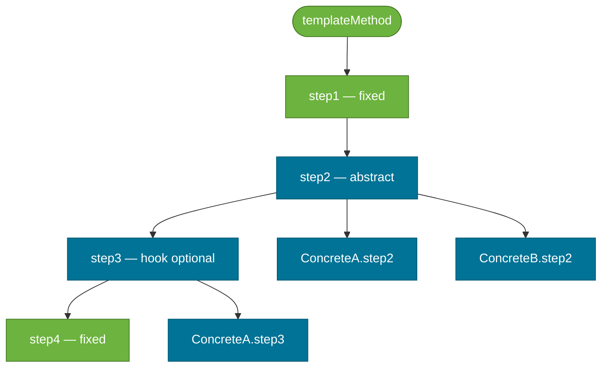

# Template Method Pattern

> A behavioral design pattern that defines the **skeleton of an algorithm** in a base class method and defers specific steps to subclasses, letting them override parts without changing the algorithm's structure.

## What Problem Does It Solve?

You have a data export pipeline: load data from the source, transform it, write it to the destination. You need two flavors: CSV export and JSON export. The overall flow is identical — only the *transform* and *write* steps differ.

Without Template Method, both `CsvExporter` and `JsonExporter` each implement the full pipeline — duplicating load logic, error handling, and cleanup. Change the load logic, and you update both classes. Add a third format, and you duplicate once more.

The Template Method pattern solves this by putting the invariant skeleton (`loadData()` → `transform()` → `write()`) in a base class, making `transform()` and `write()` abstract. Subclasses implement only what varies.

## What Is It?

The Template Method pattern has two participants:

| Role | Description |
|------|-------------|
| **AbstractClass** | Defines the `templateMethod()` that calls abstract or hook methods in a fixed sequence |
| **ConcreteClass** | Extends `AbstractClass`; overrides abstract steps with a specific implementation |

**Two types of methods in the template:**
- **Abstract steps** — must be overridden by subclasses (vary by subclass).
- **Hook methods** — have a default (often empty) implementation; subclasses *may* override to add optional behavior.

## How It Works


*Fixed steps (green) run the same for all subclasses. Abstract steps (blue) must be implemented per subclass. Hook methods are optionally overridden.*

## Code Examples

### Data Exporter

```java
// ── AbstractClass — defines the template ─────────────────────────────
public abstract class DataExporter {

    // THE TEMPLATE METHOD — final prevents subclasses from reordering steps
    public final void export(String source, String destination) {
        List<Record> records = loadData(source);       // ← fixed step
        List<String> formatted = transform(records);   // ← abstract — varies
        writeOutput(destination, formatted);           // ← abstract — varies
        cleanup();                                     // ← hook — optional override
        System.out.println("Export complete: " + destination);
    }

    private List<Record> loadData(String source) {
        System.out.println("Loading data from: " + source);
        return recordRepository.findAll(); // ← shared logic — no duplication
    }

    protected abstract List<String> transform(List<Record> records); // ← subclass fills in
    protected abstract void writeOutput(String dest, List<String> data); // ← subclass fills in

    // Hook method — default is no-op; subclass may override
    protected void cleanup() {}
}

// ── ConcreteClass A — CSV export ─────────────────────────────────────
public class CsvExporter extends DataExporter {

    @Override
    protected List<String> transform(List<Record> records) {
        return records.stream()
            .map(r -> r.id() + "," + r.name() + "," + r.value())  // ← CSV format
            .collect(Collectors.toList());
    }

    @Override
    protected void writeOutput(String dest, List<String> data) {
        String csv = String.join("\n", data);
        Files.writeString(Path.of(dest), csv);
    }

    @Override
    protected void cleanup() {
        System.out.println("Cleaning up temp CSV files");   // ← optional hook
    }
}

// ── ConcreteClass B — JSON export ────────────────────────────────────
public class JsonExporter extends DataExporter {

    private final ObjectMapper mapper = new ObjectMapper();

    @Override
    protected List<String> transform(List<Record> records) {
        return records.stream()
            .map(r -> { try { return mapper.writeValueAsString(r); }
                        catch (Exception e) { throw new RuntimeException(e); } })
            .collect(Collectors.toList());
    }

    @Override
    protected void writeOutput(String dest, List<String> data) {
        String json = "[" + String.join(",", data) + "]";
        Files.writeString(Path.of(dest), json);
    }
    // ← no cleanup override — uses default no-op hook
}

// ── Usage ──────────────────────────────────────────────────────────────
DataExporter exporter = new CsvExporter();
exporter.export("db://orders", "/tmp/orders.csv");

exporter = new JsonExporter();
exporter.export("db://orders", "/tmp/orders.json");
```

### Spring's `JdbcTemplate` — Template Method in Production

`JdbcTemplate` is the most famous Java Template Method: the algorithm skeleton (get connection → prepare statement → execute → map results → close resources) is fixed. You provide only the varying parts via callbacks:

```java
@Autowired JdbcTemplate jdbc;

// You provide the mapping step (RowMapper) — JdbcTemplate handles the rest
List<User> users = jdbc.query(
    "SELECT id, name, email FROM users WHERE active = ?",
    (rs, rowNum) -> new User(rs.getLong("id"), rs.getString("name"), rs.getString("email")), // ← your step
    true
);
```


*JdbcTemplate owns all infrastructure steps (green). You provide one step (orange) — the row mapping. This is Template Method via callback instead of inheritance.*

### Spring Security's `AbstractAuthenticationProcessingFilter`

Spring Security's authentication filter is a Template Method: the `doFilterInternal()` skeleton is fixed in `AbstractAuthenticationProcessingFilter`, and `attemptAuthentication()` is the abstract step you override:

```java
public class JwtAuthenticationFilter extends AbstractAuthenticationProcessingFilter {

    @Override
    public Authentication attemptAuthentication(HttpServletRequest req, HttpServletResponse res) {
        // ← your implementation: extract JWT, validate, build Authentication object
        String token = extractBearerToken(req);
        return getAuthenticationManager().authenticate(new JwtAuthToken(token));
    }
    // The rest of the filter lifecycle is handled by the superclass template
}
```

## Trade-offs & When To Use / Avoid

| | Pros | Cons |
|--|------|------|
| **Template Method** | Eliminates code duplication across variants; algorithm structure is centralized; easy to extend | Uses inheritance — tightly couples subclass to base class; Java doesn't support multiple inheritance |
| **vs Strategy** | Less indirection; natural for fixed pipelines | Strategy uses composition — more flexible; can swap at runtime; doesn't require inheritance |
| **vs directly implementing full algorithm** | Shared steps are written once | Subclasses can accidentally break the algorithm if `templateMethod()` is not `final` |

**When to use:**
- Multiple subclasses share the same algorithm skeleton but differ only in specific steps.
- Framework hooks (Spring Security filters, Spring Batch listeners, JUnit lifecycle methods).
- When the algorithm order is fixed but certain steps are customizable.

**When to avoid:**
- When you want runtime algorithm swapping (use Strategy instead).
- When inheritance depth becomes excessive — prefer composition.

## Common Pitfalls

- **Not marking `templateMethod()` as `final`** — subclasses can override the template itself, reordering or skipping critical steps. Always make the template method `final` to protect the skeleton.
- **Too many abstract steps** — if every step is abstract, the base class provides no value. Keep fixed steps in the base class and limit abstract steps to what truly varies.
- **Calling abstract hooks from the constructor** — if the constructor calls an overridable method, the subclass override may run before the subclass is fully initialized. Avoid calling abstract or overridable methods in constructors.
- **Inheritance fragility** — the "fragile base class" problem: changing a fixed step in the base class can unexpectedly break subclass behavior. Document your base class's contract clearly.

## Interview Questions

### Beginner

**Q:** What is the Template Method pattern?
**A:** It defines an algorithm's skeleton in a base class method, with certain steps declared abstract or overridable. Subclasses implement the varying steps without changing the overall algorithm structure.

**Q:** Where does Java or Spring use Template Method?
**A:** `JdbcTemplate`, `RestTemplate`, `KafkaTemplate` — Spring's `*Template` classes all fix the infrastructure skeleton and let you provide the row mapper/callback. Spring Security's `AbstractAuthenticationProcessingFilter` is another example. JUnit's `setUp()`/`tearDown()` hooks are classic Template Method hook methods.

### Intermediate

**Q:** What is the difference between Template Method and Strategy?
**A:** Template Method uses **inheritance** — the skeleton is in a superclass and subclasses override steps. Strategy uses **composition** — the algorithm is a separate injected object. Template Method is compile-time fixed; Strategy can be swapped at runtime. Template Method is preferred for natural inheritance hierarchies with a fixed pipeline (like Spring filter chains); Strategy is preferred when algorithms should be interchangeable at runtime.

**Q:** Why should the template method be marked `final`?
**A:** To prevent subclasses from overriding the algorithm skeleton itself — which could reorder, skip, or add steps in ways that break the contract. Subclasses should only override the designated abstract or hook steps, never the template itself.

### Advanced

**Q:** How does `JdbcTemplate` implement Template Method without inheritance?
**A:** Instead of forcing you to subclass `JdbcTemplate`, it accepts a `RowMapper` or `PreparedStatementSetter` callback. The template calls your callback at the appropriate step. This is Template Method via **functional interfaces / callback** rather than inheritance — achieves the same inversion of control without a class hierarchy. This is sometimes called the **Hollywood Principle** ("don't call us, we'll call you").

## Further Reading

- [Template Method Pattern — Refactoring Guru](https://refactoring.guru/design-patterns/template-method) — illustrated walkthrough with Java examples
- [Template Method Design Pattern in Java — Baeldung](https://www.baeldung.com/java-template-method-pattern) — practical export pipeline example
- [JdbcTemplate Reference — Spring Docs](https://docs.spring.io/spring-framework/reference/data-access/jdbc/core.html#jdbc-JdbcTemplate) — official docs on Spring's most-used Template Method class

## Related Notes

- [Strategy Pattern](./strategy-pattern.md) — Strategy is the composition-based alternative to Template Method for varying algorithms; essential for understanding their contrast.
- [Factory Method Pattern](./factory-method-pattern.md) — Factory Method is structurally a Template Method where the varying step is object creation.
- [Decorator Pattern](./decorator-pattern.md) — Decorator wraps a component to add behavior; Template Method builds the behavior into the inheritance hierarchy.
