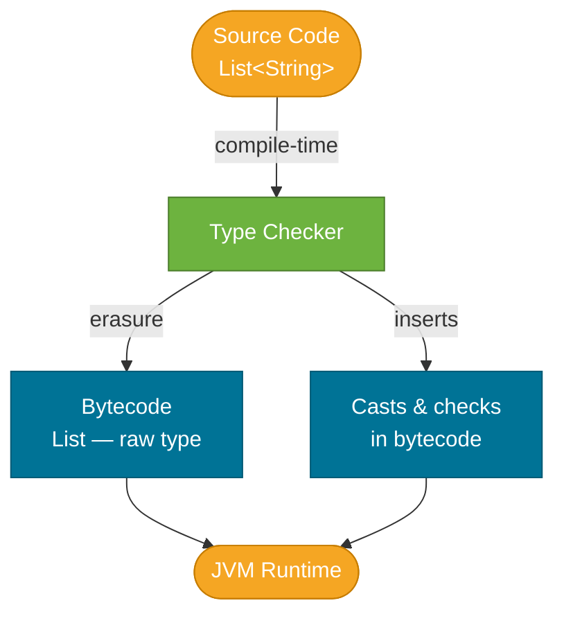

# Generics

> Generics let you write a single class or method that works correctly with any type, while the compiler enforces type safety at compile time and eliminates the need for manual casts.

## What Problem Does It Solve?

Before Java 5, collections stored `Object` references. Every retrieval required an explicit cast, and the compiler had no way to catch a type mismatch:

```java
// Pre-generics (Java 1.4) — unsafe
List names = new ArrayList();
names.add("Alice");
names.add(42);               // compiles fine — a bug waiting to happen

String first = (String) names.get(0); // must cast manually
String second = (String) names.get(1); // ClassCastException at runtime!
```

Generics move that error from **runtime** to **compile time**, making type errors visible the moment you write the code.

## What Are Generics?

A **generic type** is a class, interface, or method parameterised by one or more **type parameters** — placeholders (like `T`, `E`, `K`, `V`) that are replaced by actual types at the call site.

```java
// Generic class — T is the type parameter
public class Box<T> {
    private T value;

    public void set(T value) { this.value = value; }
    public T get() { return value; }
}

// Usage — T is replaced with String at the call site
Box<String> box = new Box<>();
box.set("Hello");
String s = box.get();   // no cast needed — compiler knows the type
```

The `<T>` after the class name declares the type parameter. When you write `Box<String>`, every occurrence of `T` inside `Box` is treated as `String` by the compiler.

### Common Type Parameter Naming Conventions

| Letter | Convention |
|--------|-----------|
| `T` | Type (generic single type) |
| `E` | Element (used in collections) |
| `K`, `V` | Key, Value (used in `Map<K,V>`) |
| `N` | Number |
| `R` | Return type (used in `Function<T,R>`) |

These are conventions only — any valid identifier works.

## How It Works

### Generic Classes

```java
public class Pair<A, B> {          // ← two type parameters
    private final A first;
    private final B second;

    public Pair(A first, B second) {
        this.first = first;
        this.second = second;
    }

    public A getFirst()  { return first;  }
    public B getSecond() { return second; }
}

Pair<String, Integer> person = new Pair<>("Alice", 30);
String name = person.getFirst();   // String — no cast
int age = person.getSecond();      // auto-unboxes Integer → int
```

### Generic Methods

A method can introduce its own type parameter, independent of the class's type parameter:

```java
public class Utils {
    // <T> before the return type declares a generic method
    public static <T> T firstOrDefault(List<T> list, T defaultValue) {
        return list.isEmpty() ? defaultValue : list.get(0);
    }
}

String result = Utils.firstOrDefault(List.of("a", "b"), "none"); // T inferred as String
```

### Bounded Type Parameters

You can restrict `T` to a subset of types using `extends` (for both classes and interfaces):

```java
// T must be a Number or a subclass of Number
public <T extends Number> double sum(List<T> list) {
    double total = 0;
    for (T item : list) {
        total += item.doubleValue(); // ← safe because T is guaranteed to be a Number
    }
    return total;
}

sum(List.of(1, 2, 3));       // T = Integer — works
sum(List.of(1.5, 2.5));      // T = Double  — works
sum(List.of("a", "b"));      // compile error — String is not a Number
```

You can combine multiple bounds with `&`:

```java
// T must implement both Comparable and Serializable
public <T extends Comparable<T> & Serializable> T max(T a, T b) {
    return a.compareTo(b) >= 0 ? a : b;
}
```

### The Diamond Operator `<>`

Since Java 7, the compiler can infer the type arguments on the right-hand side:

```java
// Before Java 7 — verbose, redundant
Map<String, List<Integer>> map = new HashMap<String, List<Integer>>();

// Java 7+ — diamond operator; type inferred from the left side
Map<String, List<Integer>> map = new HashMap<>();
```


*Type parameters exist only at compile time. The compiler checks types, inserts casts into the bytecode, then erases the type information. The JVM sees only raw types at runtime.*

## Code Examples

:::tip Practical Demo
See the [Generics Demo](./demo/generics-demo.md) for runnable examples: raw types vs. generics, generic classes, generic methods, and bounded type parameters.
:::

### Generic Stack Implementation

```java
public class Stack<T> {
    private final List<T> elements = new ArrayList<>();

    public void push(T item) {
        elements.add(item);
    }

    public T pop() {
        if (elements.isEmpty()) throw new NoSuchElementException();
        return elements.remove(elements.size() - 1);
    }

    public boolean isEmpty() { return elements.isEmpty(); }
}

Stack<Integer> intStack = new Stack<>();
intStack.push(1);
intStack.push(2);
int top = intStack.pop();   // returns 2 — no cast needed
```

### Bounded Generic Method — Finding the Min

```java
// T must implement Comparable so we can call compareTo
public static <T extends Comparable<T>> T min(T a, T b) {
    return a.compareTo(b) <= 0 ? a : b;
}

System.out.println(min(3, 7));          // 3  (T = Integer)
System.out.println(min("apple", "fig")); // "apple"  (T = String)
```

### Generic Interface

```java
public interface Repository<T, ID> {
    Optional<T> findById(ID id);
    List<T> findAll();
    T save(T entity);
}

// Implementation pins T and ID to concrete types
public class UserRepository implements Repository<User, Long> {
    @Override
    public Optional<User> findById(Long id) { ... }
    ...
}
```

## Trade-offs & When To Use / Avoid

| | Pros | Cons |
|--|------|------|
| Generics | Compile-time safety, eliminates casts, self-documenting code | Only work with reference types (no `List<int>`), type erasure limits runtime reflection |
| Raw types (no generics) | Compatible with legacy pre-Java 5 code | Unchecked compiler warnings, runtime `ClassCastException` risks |
| Bounded params | Constrained APIs with meaningful method access | Complex signatures; multiple bounds (`T extends A & B`) are hard to read |

## Best Practices

- **Prefer generics over raw types** — never write `List list`; always write `List<SomeType>`.
- **Use the most specific bound** — if your method only needs `Comparable`, bound to `Comparable<T>` rather than declaring `Object`.
- **Favour generic methods over generic classes** when the type scope is limited to one method.
- **Use `?` wildcards for flexibility in parameters** — e.g., `List<?>` when you only need to read and don't care about the element type. (Covered in depth in the [Wildcards](./wildcards.md) note.)
- **Avoid `@SuppressWarnings("unchecked")` unless you've manually verified safety** — document why it's safe when you do use it.
- **Do not create arrays of generic types** — `new T[]` is a compile error; use `List<T>` instead.

## Common Pitfalls

1. **Using raw types by accident** — forgetting `<T>` in a variable declaration causes an entire chain of unchecked warnings.
2. **Confusing `extends` in bounds with inheritance** — `<T extends Number>` does not mean `List<Integer>` is a subtype of `List<Number>`. Generics are **invariant** by default.
3. **Trying to instantiate `T`** — `new T()` is illegal; the type is erased at runtime. Use a factory function or `Class<T>` token instead.
4. **Overloading with generic types** — `void process(List<String> list)` and `void process(List<Integer> list)` are the same method after erasure; the compiler rejects this.
5. **Assuming `instanceof` works with generic types** — `list instanceof List<String>` is a compile error because type info is erased. Use `list instanceof List<?>` or a raw `List` check.

## Interview Questions

### Beginner

**Q:** Why were generics introduced in Java?
**A:** To provide compile-time type safety for collections and other container classes. Before Java 5, collections stored `Object` references, requiring manual casts and allowing type mismatches that only surfaced as `ClassCastException` at runtime.

**Q:** What is a type parameter?
**A:** A placeholder identifier (like `T` or `E`) declared on a class or method that is replaced by a concrete type when the class is instantiated or the method is called. For example, `List<T>` uses `T` as a type parameter; `List<String>` replaces `T` with `String`.

### Intermediate

**Q:** Is `List<Integer>` a subtype of `List<Number>`?
**A:** No. Java generics are **invariant** — `List<Integer>` and `List<Number>` are unrelated types even though `Integer extends Number`. This is intentional: if `List<Integer>` were a subtype of `List<Number>`, you could add a `Double` to it through the `List<Number>` reference and corrupt the list. To express "a list of some subtype of Number," use the wildcard `List<? extends Number>`.

**Q:** What does `<T extends Comparable<T>>` mean?
**A:** It declares a type parameter `T` that must implement the `Comparable<T>` interface. This lets you call `compareTo()` on values of type `T` inside the method body. A practical example: a `sort` or `max` method that needs to compare elements.

### Advanced

**Q:** What is type erasure and how does it affect generics?
**A:** At compile time, the Java compiler checks generic types and inserts casts where needed, then **erases** all type parameter information from the bytecode. At runtime, `List<String>` and `List<Integer>` are both just `List`. This means you cannot use `T` in `instanceof` checks, cannot create `new T[]`, and cannot call `T.class`. See [Type Erasure](./type-erasure.md) for the full picture.

**Q:** How would you implement a generic method that creates instances of `T`?
**A:** Pass a `Class<T>` token or a `Supplier<T>` factory, because `new T()` is erased at runtime. Example:

```java
public <T> T create(Supplier<T> factory) {
    return factory.get();
}
// Call: create(MyClass::new)
```

## Further Reading

- [Oracle Java Tutorial — Generics](https://docs.oracle.com/javase/tutorial/java/generics/index.html) — the canonical lesson series covering all generics concepts
- [Baeldung — Java Generics](https://www.baeldung.com/java-generics) — practical examples with bounded types and wildcards

## Related Notes

- [Primitives vs. Objects](./primitives-vs-objects.md) — generics only accept reference types; understanding why requires knowing the primitive/object split first.
- [Wildcards](./wildcards.md) — extends generics with `?` to express variance; build this concept after understanding plain generics.
- [Type Erasure](./type-erasure.md) — explains why the JVM sees only raw types at runtime and what limitations that imposes.
- [Collections Framework](../collections-framework/index.md) — the entire collections API is built on generics; this note is the foundation for reading collection signatures.
