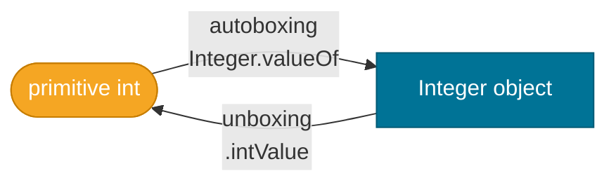

# Primitives vs. Objects

> Java has two kinds of values — the eight primitive types that live on the stack and wrapper objects that live on the heap — and understanding the boundary between them prevents a whole class of subtle bugs.

## What Problem Does It Solve?

Early languages like C treat everything as raw memory, making programs fast but dangerous (null pointer dereferences, buffer overflows). Java's designers wanted safety and interoperability with the object-oriented `Collections` framework, but they also wanted performance for numeric computation. The solution was a split: **primitives** for raw speed and **wrapper objects** for type-system compatibility. The cost? A boundary between the two that occasionally surprises developers through autoboxing, null references, and unexpected performance overhead.

## The Eight Primitive Types

Java defines exactly eight primitive types. They are not objects — they have no methods, no `null` value, and no identity.

| Primitive | Wrapper Class | Size | Default Value | Range |
|-----------|--------------|------|---------------|-------|
| `byte`    | `Byte`        | 8-bit | `0`           | −128 to 127 |
| `short`   | `Short`       | 16-bit | `0`          | −32,768 to 32,767 |
| `int`     | `Integer`     | 32-bit | `0`          | −2³¹ to 2³¹−1 |
| `long`    | `Long`        | 64-bit | `0L`         | −2⁶³ to 2⁶³−1 |
| `float`   | `Float`       | 32-bit | `0.0f`       | ~±3.4×10³⁸ |
| `double`  | `Double`      | 64-bit | `0.0d`       | ~±1.8×10³⁰⁸ |
| `char`    | `Character`   | 16-bit | `'\u0000'`   | 0 to 65,535 (Unicode) |
| `boolean` | `Boolean`     | JVM-dependent | `false` | `true` / `false` |

## Analogy — Cash vs. Cheque

Think of a primitive as **cash in your pocket** — it's the actual value, instantly accessible, with no indirection. A wrapper object is a **cheque** — it's a reference to a value held somewhere else (the heap). Giving someone a cheque means there's an extra step to get the money, and the cheque itself can be null (dishonoured). Cash can never be null.

## How It Works

### Memory Layout

```
Stack Frame                   Heap
┌──────────────┐              ┌─────────────────────┐
│  int x = 42  │  42 stored   │                     │
│  (4 bytes)   │  directly ──►│  (no heap entry)    │
├──────────────┤              ├─────────────────────┤
│ Integer y    │  reference──►│  Integer object     │
│  (ref, 4/8B) │              │  { value: 42 }      │
└──────────────┘              └─────────────────────┘
```

- **Primitive** `int x = 42` — the value `42` is stored directly in the stack frame.
- **Object** `Integer y = 42` — the stack holds a *reference* (pointer) to an `Integer` object on the heap.

### Autoboxing — Automatic Wrapping

The compiler silently converts a primitive to its wrapper when the context requires an object:

```java
List<Integer> list = new ArrayList<>();
list.add(42);        // ← autoboxing: compiler inserts Integer.valueOf(42)
```

This is purely a compile-time convenience. At bytecode level it becomes `Integer.valueOf(42)`.

### Unboxing — Automatic Unwrapping

The reverse: a wrapper is silently converted to a primitive when a numeric context requires it:

```java
Integer wrapped = Integer.valueOf(100);
int result = wrapped + 5;   // ← unboxing: compiler inserts wrapped.intValue()
```


*Autoboxing and unboxing are compiler-inserted conversions at the boundary between primitive and object contexts.*

### Integer Cache — The Sneaky Optimisation

`Integer.valueOf(n)` caches instances for values in the range **−128 to 127**. This makes identity comparisons (`==`) misleading:

```java
Integer a = 127;
Integer b = 127;
System.out.println(a == b);   // true  — same cached object

Integer c = 128;
Integer d = 128;
System.out.println(c == d);   // false — different heap objects!
System.out.println(c.equals(d)); // true — correct equality check
```

## Code Examples

:::tip Practical Demo
See the [Primitives vs. Objects Demo](./demo/primitives-vs-objects-demo.md) for step-by-step runnable examples covering the Integer cache, unboxing NPEs, and performance benchmarks.
:::

### Null NPE via Unboxing

```java
Integer count = null;          // ← valid; objects can be null
int total = count + 1;         // ← NullPointerException at runtime!
                               //   unboxing calls count.intValue() on null
```

### Performance — Summing Primitives vs. Wrappers

```java
// Fast — no heap allocation, no boxing
long sumPrimitive = 0;
for (int i = 0; i < 1_000_000; i++) {
    sumPrimitive += i;         // ← pure stack arithmetic
}

// Slow — 1 million Integer allocations + GC pressure
Long sumWrapped = 0L;          // ← already wrong type; forces boxing every iteration
for (int i = 0; i < 1_000_000; i++) {
    sumWrapped += i;           // ← unbox sumWrapped, add, re-box result
}
```

### Comparing Wrapper Objects Correctly

```java
Integer x = 200;
Integer y = 200;

// Wrong — tests reference identity, not value
if (x == y) { ... }             // false for values outside [-128, 127]

// Correct — tests value equality
if (x.equals(y)) { ... }        // true
if (Objects.equals(x, y)) { ... } // null-safe version ← prefer this
```

### Using `Optional` Instead of Nullable Wrappers

```java
// Avoid: Integer can be null, causing hidden NPEs
Integer findAge(String name) { ... }

// Better: communicate absence explicitly
OptionalInt findAge(String name) { ... }
```

## Best Practices

- **Use primitives** (`int`, `long`, `double`) for local variables and fields where `null` is not a valid state.
- **Use wrapper types** only when required by an API (`List<Integer>`, `Optional<Integer>`, generics).
- **Always use `.equals()`** (or `Objects.equals()`) to compare wrapper objects — never `==`.
- **Avoid mutable `Long`/`Integer` fields** in hot loops; reassignment triggers boxing each time.
- **Use `int[]` over `List<Integer>`** for large numeric datasets where GC pressure matters.
- **Be explicit about `null`**: if a method can return "no value," use `OptionalInt` or document the null contract.

## Common Pitfalls

1. **Unboxing a null wrapper** — the most common autoboxing NPE. Guard with a null check or `Objects.requireNonNullElse`.
2. **Using `==` on cached Integers** — works for \[-128, 127\] but silently fails outside that range.
3. **`Long sum = 0` in a loop** — boxes on every iteration; use `long sum = 0` instead.
4. **Passing `null` to a primitive parameter** — Java will not autobox `null`; the compiler rejects it at compile time but a nullable wrapper variable being passed can fool you.
5. **`switch` on a nullable `Integer`** — the `switch` statement unboxes the expression, yielding NPE if it's null.

## Interview Questions

### Beginner

**Q:** What are the eight primitive types in Java?
**A:** `byte`, `short`, `int`, `long`, `float`, `double`, `char`, and `boolean`. They are stored by value, not by reference, and cannot be `null`.

**Q:** What is autoboxing?
**A:** The compiler's automatic conversion of a primitive to its wrapper class when an object is required — for example, `list.add(5)` becomes `list.add(Integer.valueOf(5))`.

### Intermediate

**Q:** Why can `Integer a = 127; Integer b = 127; a == b` be `true` while `Integer a = 128; Integer b = 128; a == b` is `false`?
**A:** `Integer.valueOf()` caches instances for −128 to 127 (the JVM integer cache). Within that range, the two variables point to the same cached object. Outside it, new heap objects are allocated, so `==` compares different references and returns `false`. Always use `.equals()` for wrapper equality.

**Q:** Where does an `int` variable live vs. an `Integer` variable?
**A:** An `int` local variable lives on the JVM stack frame — the value is stored directly. An `Integer` variable stores a reference on the stack, but the actual `Integer` object lives on the heap, requiring an extra memory access and contributing to GC pressure.

### Advanced

**Q:** Can autoboxing cause performance issues in production code? Give an example.
**A:** Yes. A classic case is using `Long` instead of `long` as an accumulator in a tight loop. Each `+=` operation unboxes the current `Long`, performs the addition, then creates a new `Long` object (boxing), discarding the old one. This generates millions of short-lived heap objects, increasing GC pause frequency. The fix is to use the primitive `long` type and only box the final result if needed.

**Q:** What does the JVM specification say about `boolean` size?
**A:** The JVM spec does not mandate a specific size for `boolean`. In practice, it is typically stored as a 32-bit `int` on the stack (for local variables) or as a single byte in arrays (`boolean[]`). This is an implementation detail — the language spec says `boolean` has values `true` and `false`, nothing more.

## Further Reading

- [Oracle Java Tutorial — Primitive Data Types](https://docs.oracle.com/javase/tutorial/java/nutsandbolts/datatypes.html) — official reference for sizes, defaults, and literals
- [Oracle Java Tutorial — Autoboxing and Unboxing](https://docs.oracle.com/javase/tutorial/java/data/autoboxing.html) — when and how autoboxing is applied
- [Baeldung — Java Primitives vs Objects](https://www.baeldung.com/java-primitives-vs-objects) — benchmark comparisons and practical guidelines

## Related Notes

- [Variables and Data Types](../core-java/variables-and-data-types.md) — introduces primitive syntax and default values; start here if you're new to Java types.
- [Type Conversion](../core-java/type-conversion.md) — widening and narrowing conversions between primitive types; closely related to autoboxing rules.
- [Generics](./generics.md) — generics work only with reference types, which is *why* wrapper classes exist; understanding primitives makes the limitation intuitive.
