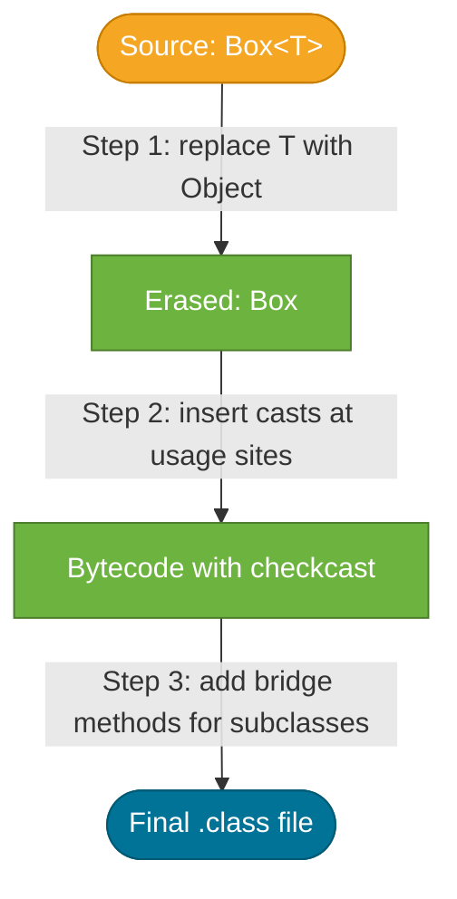

# Type Erasure

> Type erasure is the process by which the Java compiler strips all generic type parameters from the bytecode it produces, replacing them with their bounds (or `Object`), so that a single compiled class works for all instantiations.

## What Problem Does It Solve?

When generics were added in Java 5, the Java platform already had hundreds of millions of lines of compiled code deployed to production. Introducing generics in a way that required the JVM to understand them natively would have broken every existing `.class` file and every running JVM. Instead, the designers chose a **compile-time-only** approach: generics are checked by the compiler, discarded in the bytecode, and the JVM sees only the pre-generics "raw" types it has always understood. This allowed Java 5 to be backward-compatible — old `.jar` files kept working, and new generic code could interoperate with old non-generic code.

## What Is Type Erasure?

**Type erasure** is the set of rules by which the compiler:

1. Removes all type parameters and type arguments from generic classes, interfaces, and methods.
2. Replaces each type parameter with its **leftmost bound** (or `Object` if unbounded).
3. Inserts **cast instructions** at usage sites to preserve type safety.
4. Generates **bridge methods** in subclasses to handle polymorphism correctly.

The result is that `List<String>` and `List<Integer>` compile to exactly the same bytecode — just `List`. The JVM has no knowledge of the original generic types at runtime.

## Analogy — The Customs Sticker

Imagine you ship packages internationally. Each package is labelled with its contents ("fragile glassware", "books"). The customs officer checks the label and decides whether everything rules are followed. Once approved, the label is **removed** and the package is handed off to the shipping company, who just sees "a box." The shipping company doesn't need to know about glassware — that was the customs officer's job.

- **You writing code** = labelling the package with generic types.
- **Compiler** = the customs officer checking rules and then removing labels.
- **JVM** = the shipping company that only handles boxes (raw types).

## How It Works

### Step 1 — Replace Type Parameters with Bounds

```java
// Source code — generic class with type parameter T
public class Box<T> {
    private T value;
    public T get() { return value; }
    public void set(T value) { this.value = value; }
}
```

After erasure, the compiler produces bytecode equivalent to:

```java
// Erased — T replaced with Object (no bound means Object)
public class Box {
    private Object value;
    public Object get() { return value; }
    public void set(Object value) { this.value = value; }
}
```

With a bounded parameter:

```java
// Source
public <T extends Number> double sum(List<T> list) { ... }

// After erasure — T replaced with Number (its bound)
public double sum(List list) { ... }
```

### Step 2 — Insert Cast Instructions

To compensate for erasure, the compiler inserts a checkcast instruction wherever a specific type is expected:

```java
List<String> names = new ArrayList<>();
names.add("Alice");
String first = names.get(0);          // ← compiler inserts: checkcast String
```

In bytecode, `list.get(0)` returns `Object`, and the compiler adds an implicit `(String)` cast. If the list somehow contains a non-String, the cast fails with `ClassCastException` at runtime.

### Step 3 — Bridge Methods

When a generic class is subclassed and the type parameter is pinned to a concrete type, the compiler generates a **bridge method** to ensure polymorphism works correctly:

```java
public class StringBox extends Box<String> {
    @Override
    public String get() { return "hello"; }  // overrides with String return type
}
```

After erasure, `Box.get()` has signature `Object get()`. `StringBox.get()` has signature `String get()`. These are different signatures in bytecode. The compiler silently adds:

```java
// Bridge method — generated by compiler, invisible in source
public Object get() {
    return this.get();  // calls the String version
}
```


*The three-step erasure process: type parameters are replaced with bounds, casts are inserted, and bridge methods are generated.*

## Limitations Imposed by Type Erasure

Because generic type information is absent at runtime, certain operations are impossible:

| Operation | Why It Fails | Workaround |
|-----------|-------------|------------|
| `new T()` | `T` is `Object` at runtime | Pass `Supplier<T>` or `Class<T>` |
| `T[] arr = new T[10]` | Array creation needs runtime type | Use `List<T>` or pass `Class<T>` |
| `obj instanceof List<String>` | Compile error — type arg erased | `obj instanceof List<?>` |
| `List<String>.class` | Compile error — no such literal | `List.class` (raw type) |
| Overloading on generic type | `void f(List<String>)` and `void f(List<Integer>)` are the same after erasure | Use different method names |

## Code Examples

:::tip Practical Demo
See the [Type Erasure Demo](./demo/type-erasure-demo.md) for runnable examples: `instanceof` limits, `new T()` workaround, overload conflicts, heap pollution, and the super type token pattern.
:::

### Working Around `new T()` — Class Token Pattern

```java
public class Factory<T> {
    private final Class<T> type;

    public Factory(Class<T> type) {
        this.type = type;
    }

    public T create() throws ReflectiveOperationException {
        return type.getDeclaredConstructor().newInstance();  // ← runtime type still available
    }
}

Factory<ArrayList> f = new Factory<>(ArrayList.class);
ArrayList list = f.create();
```

### Heap Pollution Warning

```java
@SafeVarargs  // ← suppresses the unchecked warning when we've verified safety
public static <T> void addToList(List<T> list, T... elements) {
    for (T e : elements) list.add(e);
}
```

Mixing generic varargs with erasure can cause "heap pollution" — a variable of a parameterised type points to an object of a different type. `@SafeVarargs` tells the compiler you've verified there's no actual corruption.

### `instanceof` with Erasure

```java
Object list = new ArrayList<String>();

// Cannot check List<String> at runtime — type arg erased
if (list instanceof List<String>) { }  // compile error

// Correct — check for raw List with unbounded wildcard
if (list instanceof List<?> typedList) {  // Java 16+ pattern matching
    System.out.println("it's a list");
}
```

### Reflection and Retained Type Information

Erasure removes type *arguments* but **not** all generic metadata. Generic signatures are retained in class files as metadata and are readable via reflection:

```java
public class StringBox extends Box<String> {}  // type arg String is in metadata

Type superType = StringBox.class.getGenericSuperclass();
ParameterizedType pt = (ParameterizedType) superType;
Type arg = pt.getActualTypeArguments()[0];
System.out.println(arg);  // class java.lang.String
```

Frameworks like Jackson and Spring use this technique (often called the **super type token** pattern) to recover generic type information at runtime.

## Best Practices

- **Never suppress unchecked warnings without a comment** explaining why the code is proven safe.
- **Use `Class<T>` tokens** when you need to instantiate or check `T` at runtime.
- **Prefer `instanceof List<?>` over `instanceof List`** to get some wildcard protection.
- **Avoid overloading generic methods that differ only in type parameter** — erasure makes them identical signatures; use distinct method names.
- **Be aware of the super type token pattern** when working with Jackson `TypeReference<T>` or Spring `ParameterizedTypeReference<T>` — they exist specifically to work around erasure.

## Common Pitfalls

1. **Trying `new T[]`** — immediately flagged by the compiler. Switch to `List<T>` or pass a `Class<T>` to create arrays reflectively.
2. **Expecting `instanceof` to check the generic argument** — it can't. Check the raw type and cast carefully.
3. **Overloading on erased signatures** — `void process(List<String>)` and `void process(List<Integer>)` are the same method to the bytecode; this is a compile error.
4. **Heap pollution from raw-type interoperability** — mixing raw types with generic types can put the wrong type of object in a typed collection, causing `ClassCastException` far from the actual bug site.
5. **Forgetting that bridge methods exist** — if you're debugging with a stack trace that shows a method you never wrote, it might be a compiler-generated bridge method.

## Interview Questions

### Beginner

**Q:** What is type erasure in Java?
**A:** Type erasure is the process the Java compiler uses to remove all generic type information from bytecode. After compilation, `List<String>` and `List<Integer>` are both just `List` in the `.class` file. This was designed for backward compatibility with pre-Java 5 code.

**Q:** Why can't you write `new T()` in a generic class?
**A:** Because `T` is erased at runtime — the JVM doesn't know what `T` actually is, so it can't call the correct constructor. The common workaround is to pass a `Class<T>` or `Supplier<T>` so the runtime type is explicitly provided.

### Intermediate

**Q:** What is heap pollution?
**A:** Heap pollution occurs when a variable of a parameterised type (`List<String>`) contains a reference to an object of a different type (`List<Integer>`). This typically happens through raw-type interoperability or unchecked casts. The result is a `ClassCastException` at an unexpected point in the code, far from where the bad assignment occurred.

**Q:** What is a bridge method?
**A:** A compiler-generated synthetic method that ensures correct polymorphism after erasure. When a class overrides a generic method and pins the type parameter to a specific type, the overriding method has a more specific signature than the erased parent. The compiler adds a "bridge" with the erased signature that delegates to the specific one, so `instanceof` checks and virtual dispatch still work correctly.

### Advanced

**Q:** If type information is erased, how do frameworks like Jackson deserialise into `List<User>`?
**A:** Jackson uses the **super type token** pattern. You pass a `TypeReference<List<User>>(){}` — an anonymous subclass of `TypeReference`. The JVM retains the generic supertype information of *class definitions* (not variable declarations) in `.class` metadata. Reflection reads `getGenericSuperclass()` on the anonymous class and extracts `List<User>` as the actual type argument. Spring's `ParameterizedTypeReference<T>` works the same way.

**Q:** What is `@SuppressWarnings("unchecked")` actually suppressing?
**A:** It suppresses the compiler warning generated when you perform an unchecked cast — a cast whose safety cannot be verified at compile time due to erasure. For example, casting `Object` to `List<String>` is "unchecked" because the compiler can only verify it's a `List`, not a `List<String>`. The annotation tells the compiler you've verified safety manually; it has no effect on runtime behaviour.

## Further Reading

- [Oracle Java Tutorial — Type Erasure](https://docs.oracle.com/javase/tutorial/java/generics/erasure.html) — official explanation with erasure rules for bounded and unbounded parameters
- [Java Language Specification §4.6 — Type Erasure](https://docs.oracle.com/javase/specs/jls/se21/html/jls-4.html#jls-4.6) — the formal specification
- [Baeldung — Java Type Erasure](https://www.baeldung.com/java-type-erasure) — practical examples of erasure consequences

## Related Notes

- [Generics](./generics.md) — erasure is the implementation mechanism *behind* generics; understand generics first.
- [Wildcards](./wildcards.md) — wildcard capture interacts with erasure; the reason `List<?>` isn't the same as `List<Object>` is grounded in erasure rules.
- [JVM Internals](../jvm-internals/index.md) — the JVM's class loading and runtime representation is the environment where erased types execute.
