# Bytecode & .class Files

> Bytecode is the intermediate representation the Java compiler produces — platform-neutral instructions that any JVM can interpret or JIT-compile to native code. Reading bytecode with `javap` demystifies how generics erasure works, what lambdas really compile to, and why `+` on Strings is not as naive as it looks.

## What Problem Does It Solve?

Java source code compiles to `.class` files containing JVM bytecode rather than to native machine code. This solves the **write-once-run-anywhere** problem: the same `.class` files run on Windows, Linux, macOS, ARM, and x86 — the JVM handles the translation to native instructions per platform.

From a developer's perspective, understanding bytecode answers questions that source code alone cannot:
- Why do two lambda expressions compile to different shapes?
- What does type erasure *actually* look like at the instruction level?
- Why does `String a = "foo" + "bar"` compile to a constant, but `String a = s1 + s2` allocates a `StringBuilder`?

`javap` — the JDK's bytecode disassembler — is the practical tool for all of these questions.

## The .class File Structure

A `.class` file is a precisely-structured binary format defined in the JVM Specification (JVMS §4):

```mermaid
flowchart TD
    CF[".class File"]
    CF --> Magic["Magic Number<br>0xCAFEBABE"]
    CF --> Ver["Major / Minor Version<br>(e.g. 65.0 = Java 21)"]
    CF --> CP["Constant Pool<br>(strings, class refs, method refs, field descs)"]
    CF --> ACC["Access Flags<br>(public, final, interface, abstract...)"]
    CF --> This["this_class<br>(index into constant pool)"]
    CF --> Super["super_class<br>(index into constant pool)"]
    CF --> Ifaces["Interfaces"]
    CF --> Fields["Fields"]
    CF --> Methods["Methods<br>(each has Code attribute with bytecode)"]
    CF --> Attrs["Attributes<br>(SourceFile, Signature, Annotations...)"]

    classDef jvmClass fill:#007396,color:#fff,stroke:#005a75
    classDef springClass fill:#6db33f,color:#fff,stroke:#4a7c2a
    classDef userClass fill:#f5a623,color:#fff,stroke:#c77d00
    class CF jvmClass
    class Magic,Ver,CP,ACC userClass
    class This,Super,Ifaces,Fields,Methods,Attrs springClass
```



*Caption: The .class file is a structured binary format — the constant pool is its backbone, referenced by almost every other section via integer indices.*

### The Constant Pool

The constant pool is the most important part of the `.class` file. It is an indexed table that stores all string literals, class names, method signatures, and field descriptors used by the class. Instructions reference the pool by index (e.g., `ldc #5` — load constant at index 5).

This indirection keeps bytecode instructions compact (a 2-byte index rather than a full string) and enables efficient symbol resolution during class loading.

### Method Code Attribute

Each method's body lives in a `Code` attribute that contains:
- `max_stack` — maximum operand stack depth the method needs
- `max_locals` — number of local variable slots (index 0 = `this` for instance methods)
- `code` — the actual array of bytecode instructions
- Exception table — which bytecode ranges are covered by which `catch` handlers

## Key Bytecode Instructions

JVM bytecode is a typed, stack-based instruction set. Instructions push values onto the **operand stack**, pop them off, and push results back.

| Category | Examples | What they do |
|----------|----------|-------------|
| Load/store | `iload`, `aload`, `istore`, `astore` | Move values between local variables and operand stack |
| Arithmetic | `iadd`, `dmul`, `isub`, `idiv` | Pop operands, push result; prefix = type (i=int, d=double, l=long...) |
| Object | `new`, `getfield`, `putfield`, `invokevirtual` | Heap allocation, field access, method dispatch |
| Control | `ifeq`, `goto`, `tableswitch` | Conditional/unconditional jumps by bytecode offset |
| Return | `ireturn`, `areturn`, `return` | Return value (or void) to caller |
| Stack | `dup`, `pop`, `swap` | Manipulate the operand stack directly |

Method invocation has four opcodes reflecting Java's dispatch rules:

| Opcode | Invokes |
|--------|---------|
| `invokevirtual` | Instance method (virtual dispatch through vtable) |
| `invokeinterface` | Interface method (dispatch through itable) |
| `invokespecial` | Constructor, private method, or `super` call |
| `invokestatic` | Static method |
| `invokedynamic` | Dynamically-linked call site (lambdas, string concat since Java 9) |

## How It Works — Using javap

`javap` is the JDK tool for disassembling `.class` files. The most useful flags are:

| Flag | Output |
|------|--------|
| `javap MyClass` | Public API (field names, method signatures) |
| `javap -c MyClass` | Disassembled bytecode for each method |
| `javap -verbose MyClass` | Full detail: constant pool, stack sizes, exception table, attributes |
| `javap -p MyClass` | Include private members |

## Code Examples

### Hello World bytecode walkthrough

```java
// Source
public class Hello {
    public static void main(String[] args) {
        System.out.println("Hello, JVM!");
    }
}
```

```bash
javac Hello.java
javap -c Hello
```

```text
public static void main(java.lang.String[]);
  Code:
     0: getstatic     #7   // Field java/lang/System.out:Ljava/io/PrintStream;
                            // ← pushes System.out reference onto operand stack
     3: ldc           #13  // String "Hello, JVM!"
                            // ← pushes string constant onto operand stack
     5: invokevirtual #15  // Method java/io/PrintStream.println:(Ljava/lang/String;)V
                            // ← pops PrintStream + String, calls println, pushes nothing (void)
     8: return              // ← method returns void
```

### Generics erasure in bytecode

```java
// Source: generic method
public <T extends Comparable<T>> T max(T a, T b) {
    return a.compareTo(b) >= 0 ? a : b;
}
```

```bash
javap -c -p MyClass      # ← -p shows all members including bridge methods
```

```text
public java.lang.Comparable max(java.lang.Comparable, java.lang.Comparable);
  Code:
     0: aload_1       // ← load 'a' — type is Comparable (the erasure of T extends Comparable<T>)
     1: aload_2       // ← load 'b'
     2: invokeinterface #24, 2  // InterfaceMethod java/lang/Comparable.compareTo ...
                                // ← T erased to Comparable; no trace of T in bytecode
     7: iflt          15
    10: aload_1
    11: goto          16
    14: aload_2
    16: areturn
```

Type parameter `T` is completely absent. The bytecode uses `Comparable` (the upper bound). A cast is inserted at the **call site** by the compiler when the return value is used as a specific type.

### Lambda compilation: invokedynamic

```java
// Source
Runnable r = () -> System.out.println("run");
r.run();
```

```bash
javap -c LambdaExample
```

```text
  0: invokedynamic #9, 0   // InvokeDynamic #0:run:()Ljava/lang/Runnable;
                            // ← first call: LambdaMetafactory bootstrap creates Runnable impl
                            // ← subsequent calls: return the cached implementation
  5: astore_1
  6: aload_1
  7: invokeinterface #13, 1 // InterfaceMethod java/lang/Runnable.run:()V
 12: return
```

The lambda body (`System.out.println("run")`) is compiled into a **private synthetic method** in the same class, and `invokedynamic` at runtime links it to a `Runnable` implementation via `LambdaMetafactory`. No anonymous inner class `.class` file is generated; the class is created and cached in memory the first time the bootstrap method runs.

### String concatenation: invokedynamic (Java 9+)

```java
// Source
String name = "Alice";
int age = 30;
String msg = "Hello " + name + ", age " + age;
```

```text
# Java 8 — old: creates StringBuilder, calls append() 4 times
# Java 9+ — new: invokedynamic with StringConcatFactory
  invokedynamic #5,0  // InvokeDynamic #0:makeConcatWithConstants:(Ljava/lang/String;I)Ljava/lang/String;
                      // ← StringConcatFactory generates an optimal concatenation strategy at linkage time
```

Java 9+ replaced the `StringBuilder` chain with a single `invokedynamic` call to `StringConcatFactory`. The factory selects the most efficient strategy (often a `StringTemplate` or intrinsified routine) for the specific types involved — and can be updated in a future JDK without changing source or bytecode.

### Reading verbose output — the constant pool

```bash
javap -verbose Hello | head -30
```

```text
  minor version: 0
  major version: 65       ← Java 21; 61=Java 17, 55=Java 11, 52=Java 8
  flags: ACC_PUBLIC, ACC_SUPER
Constant pool:
   #1 = Methodref  #2.#3    // java/lang/Object."<init>":()V
   #2 = Class      #4       // java/lang/Object
   #3 = NameAndType #5:#6   // "<init>":()V
   #4 = Utf8       java/lang/Object
   #5 = Utf8       <init>
   #6 = Utf8       ()V
   ...
  #13 = String     #14      // Hello, JVM!
  #14 = Utf8       Hello, JVM!
```

## Best Practices

- **Use `javap -verbose` when debugging framework magic** — Spring AOP's CGLIB proxies, Lombok-generated code, and Kotlin coroutines all look different in bytecode. `javap` shows exactly what class files were actually generated.
- **Check major version number** to verify a JAR was compiled for the target Java version: major 65 = Java 21, 61 = Java 17, 52 = Java 8. `UnsupportedClassVersionError` means a class was compiled for a newer version than the running JVM.
- **Use `jclasslib`** (IntelliJ plugin) or `ASMifier` for interactive exploration — much friendlier than raw `javap` output for complex classes.
- **Don't hand-write bytecode** unless using ASM for a library (e.g., Mockito, ByteBuddy). Manipulate Java source or use a proper bytecode library with a well-tested API.

## Common Pitfalls

- **Assuming generics survive to runtime**: They don't. Type parameters are erased during compilation and replaced by their bounds (`Object` by default, or the declared upper bound). Runtime casts (`checkcast` opcode) enforce correct usage at the call site, not inside the generic method.
- **Thinking each lambda creates an inner class file**: Java 7 `invokedynamic` + `LambdaMetafactory` means lambdas generate a class in memory at runtime, not a `.class` file. The `$` anonymous-class files you see for pre-Java 8 anonymous inner classes do not appear for lambdas.
- **Confusing `invokespecial` with `invokevirtual`**: `this.method()` on a regular instance method uses `invokevirtual` (polymorphic). `super.method()` uses `invokespecial` (bypass dynamic dispatch). Private method calls also use `invokespecial` — important to know when debugging via `javap`.
- **`major version` mismatch crashes apps**: If your build produces Java 21 bytecode (major 65) but the runtime is Java 17 (supports up to major 61), every class load throws `UnsupportedClassVersionError`. This often happens in multi-stage Docker builds where the compile stage uses a newer JDK than the runtime image.

## Interview Questions

### Beginner

**Q:** What is bytecode, and why does Java compile to it instead of native machine code?
**A:** Bytecode is a compact, platform-neutral instruction set for the JVM stack machine. Compiling to bytecode rather than native code means the same `.class` files run unchanged on any JVM on any OS or CPU architecture. The JVM (specifically its JIT compiler) handles the final translation to native instructions per platform. This is the "write once, run anywhere" promise.

**Q:** What does `javap` do?
**A:** `javap` is the JDK's bytecode disassembler. Given a `.class` file, it prints a human-readable representation of its bytecode, constant pool, and metadata. `javap -c` shows bytecode instructions; `javap -verbose` shows the full class file structure including the constant pool, stack size requirements, and version numbers.

### Intermediate

**Q:** How are Java generics represented at the bytecode level?
**A:** Type parameters are erased during compilation — a process called **type erasure**. In bytecode, all generic type parameters are replaced by their upper bound: `Object` for unbounded `<T>`, or the declared bound for `<T extends Comparable<T>>` (replaced by `Comparable`). The compiler inserts `checkcast` instructions at call sites to maintain type safety. The `Signature` attribute in the `.class` file preserves the original generic signature for reflection and IDEs, but the JVM runtime does not use it for dispatch or memory layout.

**Q:** How do lambda expressions compile to bytecode?
**A:** Lambda bodies compile to **private synthetic methods** in the class that defines them. At the lambda's use site, the compiler emits an `invokedynamic` instruction referencing `LambdaMetafactory`. On the first call, the JVM bootstrap mechanism uses `LambdaMetafactory` to generate and cache a class implementing the target functional interface, wired to the synthetic method. Subsequent calls reuse the cached implementation. This is faster and more flexible than generating anonymous inner class files at compile time.

### Advanced

**Q:** What is `invokedynamic` and why was it added in Java 7?
**A:** `invokedynamic` (JSR 292, Java 7) adds a call site that delegates its first dispatch to a user-defined **bootstrap method**. The bootstrap method links the call site to a `MethodHandle` which is cached for all subsequent calls. This enables dynamic languages on the JVM (Groovy, JRuby) to use the same efficient dispatch mechanism as static Java. Java itself adopted `invokedynamic` for lambdas (via `LambdaMetafactory`), string concatenation (via `StringConcatFactory`), and records. The key advantage over reflection is that linked method handles are JIT-compiled just like regular invocations.

**Follow-up:** What is the difference between `invokedynamic` and reflection for dynamic dispatch?
**A:** Reflection (`Method.invoke()`) bypasses the JIT's inlining because the call target is not statically known. `invokedynamic` with a `MethodHandle` provides the same runtime flexibility but with a stable call target once linked — the JIT can inline the target method after warmup, achieving near-static-dispatch performance. This is why Java switched from generating `StringBuilder` bytecode to `invokedynamic` for string concatenation in Java 9.

## Further Reading

- [JVMS §4 — The class File Format](https://docs.oracle.com/javase/specs/jvms/se21/html/jvms-4.html) — the authoritative specification for every field in the `.class` binary format
- [Oracle javap Reference](https://docs.oracle.com/en/java/javase/21/docs/specs/man/javap.html) — complete flag reference for the bytecode disassembler
- [Baeldung: View Bytecode of a Class in Java](https://www.baeldung.com/java-class-view-bytecode) — practical guide using javap and ASMifier

## Related Notes

- [JIT Compilation](./jit-compilation.md) — the JIT compiler reads bytecode as its input; understanding bytecode sheds light on what the JIT is actually optimising
- [Java Type System — Generics & Type Erasure](../java-type-system/index.md) — type erasure is a bytecode-level choice; the generic signatures visible to `javap -verbose` are metadata only
- [Functional Programming — Lambdas](../functional-programming/index.md) — lambda compilation via `invokedynamic` is explained from the bytecode perspective in this note
