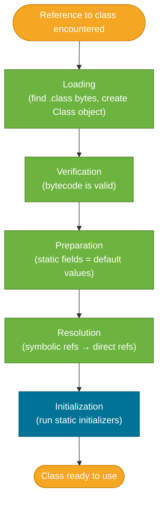
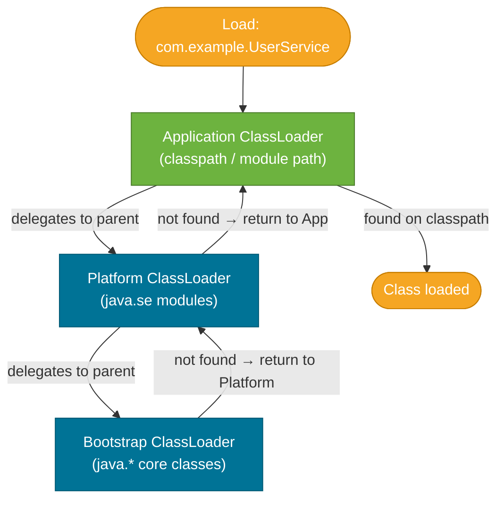

# Class Loading

> The JVM loads class files lazily and on demand — a class is loaded the first time it is needed, verified, prepared, and then initialized. Knowing this model explains everything from startup performance to `ClassNotFoundException`, `ClassCastException` from different classloaders, and how Spring Boot's DevTools achieves hot reload.

## What Problem Does It Solve?

A Java program can reference hundreds or thousands of classes. Loading and initializing all of them up front at startup would:
- slow startup dramatically (especially for large frameworks like Spring)
- waste memory for classes that may never be used in a given run
- make it impossible to load classes from dynamic or remote sources at runtime

Class loading solves this by being **lazy** (load only when first needed) and **pluggable** (custom `ClassLoader` subclasses can load bytes from anywhere — network, database, encrypted archive).

## How It Works

### Phase 1 — Loading

When the JVM first encounters a symbolic reference to a class (e.g., `com.example.UserService`), it asks a `ClassLoader` to find the `.class` file and read its bytes into memory. The result is a binary representation stored in the **method area** (Metaspace since Java 8).

A `Class` object is created in the heap to represent the loaded class in the Java world.

### Phase 2 — Linking

Linking has three sub-steps:

| Sub-step | What happens |
|----------|-------------|
| **Verification** | Bytecode is validated: stack depths are correct, type constraints hold, no illegal jumps exist. Prevents malformed bytecode from crashing the JVM. |
| **Preparation** | Static fields are allocated in Metaspace and set to their **default values** (0, null, false). Not yet assigned the declared values. |
| **Resolution** | Symbolic references in the constant pool (e.g., `com/example/UserService.findById`) are replaced with direct memory references. Can happen eagerly or lazily. |

### Phase 3 — Initialization

Static initializers and static field assignments run **exactly once**, in top-to-bottom textual order. This is when a class is fully ready to use.



*Caption: A class goes through five steps before it is usable — skipping any step is impossible; the JVM guarantees this sequence.*

### The Parent-Delegation Model

When a classloader is asked to load a class, it **first delegates to its parent** before trying to load it itself. The delegation chain is:



*Caption: The parent-delegation model ensures core Java classes (java.lang.String) are always loaded by the trusted Bootstrap ClassLoader — not potentially replaced by application code.*

**Why parent delegation?** Security and consistency. If application code could define its own `java.lang.String`, it could intercept every string operation in the JVM. Parent delegation prevents this: `java.lang.*` is always loaded by the Bootstrap ClassLoader regardless.

### The Three Standard ClassLoaders

| ClassLoader | Loads from | Implemented in |
|-------------|-----------|----------------|
| **Bootstrap** | `java.*` core modules (`java.base`, etc.) from the JDK runtime | Native C++ code; no Java representation before Java 9 |
| **Platform** (ext in Java 8) | JDK extension modules (`java.sql`, `java.xml`, etc.) | `jdk.internal.loader.ClassLoaders.PlatformClassLoader` |
| **Application** (system) | Your app's classpath and module path | `jdk.internal.loader.ClassLoaders.AppClassLoader` |

:::info Java 9 module system
Java 9 replaced the Extension ClassLoader with the Platform ClassLoader and reorganised the JDK itself into modules. Classpath apps still work unchanged, but the classloader hierarchy is now module-aware.
:::

### Custom ClassLoaders

You can extend `ClassLoader` and override `findClass()` to load bytes from anywhere:


*Caption: Custom classloaders enable dynamic class loading from any source by overriding `findClass()` and calling the protected `defineClass()` method.*

**Real-world uses of custom classloaders:**
- **Spring Boot DevTools** — uses a restart classloader to reload application classes on file change while keeping Spring framework classes loaded (fast restart)
- **Java EE / Jakarta EE containers** — each deployed application gets its own classloader for isolation; different apps can use different versions of the same library
- **OSGi / plugin systems** — each bundle/plugin has an isolated classloader; dependencies between bundles are explicit

## Code Examples

### Observing class loading at startup

```bash
# Print every class loaded by the JVM with its classloader
java -verbose:class -jar myapp.jar 2>&1 | head -50

# Sample output:
# [0.015s][info][class,load] java.lang.Object source: shared objects file
# [0.021s][info][class,load] com.example.Main source: file:///app/myapp.jar
```

### Inspecting classloaders at runtime

```java
public class ClassLoaderInspector {
    public static void main(String[] args) {
        // Application code
        ClassLoader appLoader = ClassLoaderInspector.class.getClassLoader();
        System.out.println("App CL: " + appLoader);                    // AppClassLoader

        ClassLoader parent = appLoader.getParent();
        System.out.println("Platform CL: " + parent);                  // PlatformClassLoader

        System.out.println("Bootstrap CL: " + parent.getParent());     // null — native code

        // Core Java class
        ClassLoader stringLoader = String.class.getClassLoader();
        System.out.println("String's CL: " + stringLoader);            // null = Bootstrap
    }
}
```

### Static initialization order (Preparation vs Initialization)

```java
public class StaticInit {

    // Preparation phase: DB_URL = null (default)
    // Initialization phase: DB_URL = "jdbc:postgresql://localhost/mydb"
    static final String DB_URL = "jdbc:postgresql://localhost/mydb";

    static final int MAX_POOL;

    static {
        // Static initializer block — runs during Initialization phase
        MAX_POOL = Integer.parseInt(System.getenv().getOrDefault("DB_POOL", "10"));
        System.out.println("StaticInit initialized with pool: " + MAX_POOL);
    }
}
```

### Minimal custom ClassLoader

```java
import java.nio.file.*;

public class FileSystemClassLoader extends ClassLoader {

    private final Path classDir;

    public FileSystemClassLoader(Path classDir, ClassLoader parent) {
        super(parent); // ← always pass parent to maintain delegation chain
        this.classDir = classDir;
    }

    @Override
    protected Class<?> findClass(String name) throws ClassNotFoundException {
        // Convert class name to file path: com.example.Foo → com/example/Foo.class
        String path = name.replace('.', '/') + ".class";
        Path file = classDir.resolve(path);
        try {
            byte[] bytes = Files.readAllBytes(file);     // ← read raw bytecode
            return defineClass(name, bytes, 0, bytes.length); // ← JVM creates Class object
        } catch (Exception e) {
            throw new ClassNotFoundException(name, e);
        }
    }
}
```

### Understanding the ClassCastException from separate classloaders

```java
// This compiles fine but throws ClassCastException at runtime:
ClassLoader cl1 = new FileSystemClassLoader(path, null);
ClassLoader cl2 = new FileSystemClassLoader(path, null);

Class<?> c1 = cl1.loadClass("com.example.Foo");
Class<?> c2 = cl2.loadClass("com.example.Foo");

Object obj = c1.getDeclaredConstructor().newInstance();
c2.cast(obj); // ← ClassCastException: same name, but different Class objects

// Rule: class identity = (classloader, binary name) pair.
// Two loadings of the same .class file by different ClassLoaders produce
// incompatible Class objects.
```

## Best Practices

- **Always pass a parent to custom ClassLoaders** — calling `super(parent)` preserves delegation. A `ClassLoader` with `null` parent breaks delegation for core Java classes.
- **Use `ClassLoader.getSystemClassLoader()` or the thread's context classloader** for framework code that loads resources dynamically: `Thread.currentThread().getContextClassLoader()`.
- **Avoid holding ClassLoader references in long-lived statics** — a retained ClassLoader keeps all classes it loaded alive in Metaspace. This is the most common source of Metaspace leaks in application servers.
- **Prefer `Class.forName(name, true, loader)`** over `loader.loadClass(name)` — the second argument forces initialization; `loadClass` only loads but does not initialize.
- **Limit the use of custom classloaders** — they add complexity and can cause subtle `ClassCastException` bugs when different loaders load the same class.

## Common Pitfalls

- **`ClassNotFoundException` vs `NoClassDefFoundError`**: `ClassNotFoundException` is thrown when a classloader cannot find the bytes for the class at load time (wrong classpath, missing JAR). `NoClassDefFoundError` is thrown when the class was found and *began* loading but failed (e.g., static initializer threw an exception, or the `.class` file was on the classpath at compile time but missing at runtime). The distinction matters for diagnosis.
- **Static initializer failure makes the class permanently unusable**: If a static initializer throws an unchecked exception, the class enters an error state. Subsequent attempts to load or use it throw `ExceptionInInitializerError` or `NoClassDefFoundError`. Fix: never do risky I/O or parsing in a static initializer; use lazy-initialization idiom instead.
- **Two classloaders = two class objects**: A class loaded by `ClassLoader A` and the "same" class loaded by `ClassLoader B` are *different types*. You cannot cast between them. This surprises developers working with plugin systems or hot-reload frameworks.
- **`getClass().getClassLoader()` can return `null`**: For classes loaded by the Bootstrap ClassLoader (all `java.*` classes), `getClassLoader()` returns `null`. Always null-check before using it.

## Interview Questions

### Beginner

**Q:** What is a ClassLoader, and what is its role?
**A:** A `ClassLoader` is responsible for reading `.class` bytes from a source (filesystem, JAR, network) and handing them to the JVM, which creates a `Class` object in Metaspace. The JVM ships with three built-in classloaders (Bootstrap, Platform, Application) and you can create custom ones. The class is loaded only when first referenced — loading is lazy.

**Q:** What is the parent-delegation model?
**A:** When a classloader is asked to load a class, it first asks its *parent* to load it. Only if the parent returns "not found" does the classloader try to find it itself. This ensures that core `java.*` classes are always loaded by the trusted Bootstrap ClassLoader, preventing application code from replacing or intercepting them.

### Intermediate

**Q:** What is the difference between `ClassNotFoundException` and `NoClassDefFoundError`?
**A:** `ClassNotFoundException` is a checked exception thrown when a classloader actively fails to find the bytecode for a class (e.g., missing JAR). `NoClassDefFoundError` is an error thrown when the class *was* found and began loading, but initialization failed — or the class was available at compile time but missing at runtime. The former is a dependency problem; the latter is often a runtime environment mismatch or a broken static initializer.

**Q:** Why does a `ClassCastException` sometimes occur between two objects of "the same" class?
**A:** In the JVM, class identity is the combination of the fully-qualified name *and* the classloader that loaded it. Two classloaders loading `com.example.Foo.class` produce separate, incompatible `Class` objects. Casting across them throws `ClassCastException` even though the source is identical. This is intentional — it allows classloader-based isolation in containers and plugin systems.

### Advanced

**Q:** How does Spring Boot DevTools achieve fast application restart without restarting the JVM?
**A:** DevTools uses two classloaders: a *base* classloader for Spring framework and third-party libraries (loaded once), and a *restart* classloader for your application classes. When a file changes, DevTools discards the restart classloader (releasing all application classes from Metaspace), creates a new one, and re-initializes the Spring context. Because the large framework classes never reload, restart is much faster than a full JVM restart. This exploits the classloader isolation property — different loaders, different class objects.

**Follow-up:** What must the application developer avoid to ensure DevTools restart is effective?
**A:** Avoid storing application-class instances in long-lived static fields held by framework (base) classloader objects. If a `List<UserService>` is held in a static field of a class loaded by the base classloader, the restart classloader cannot be garbage-collected — causing a Metaspace leak that grows on each restart.

## Further Reading

- [JVMS §5 — Loading, Linking, and Initializing](https://docs.oracle.com/javase/specs/jvms/se21/html/jvms-5.html) — the authoritative specification for the full class lifecycle
- [Oracle Java SE 21 API: ClassLoader](https://docs.oracle.com/en/java/javase/21/docs/api/java.base/java/lang/ClassLoader.html) — Javadoc for the `ClassLoader` class with detailed contract explanation
- [Baeldung: Class Loaders in Java](https://www.baeldung.com/java-classloaders) — practical guide with code examples for custom classloader construction

## Related Notes

- [JVM Memory Model](./jvm-memory-model.md) — loaded class metadata lives in Metaspace; classloader leaks cause Metaspace exhaustion described there
- [Garbage Collection](./garbage-collection.md) — class unloading (which frees Metaspace) happens during Full GC; a retained ClassLoader prevents class unloading
- [Java Modules](../modules/index.md) — the Java 9 module system changed classloader visibility rules and replaced the Extension ClassLoader with the Platform ClassLoader
