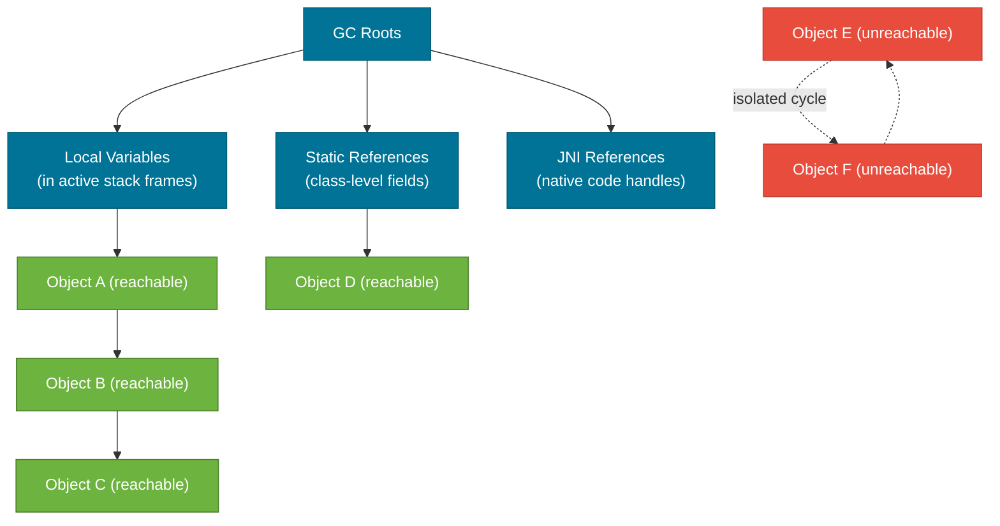
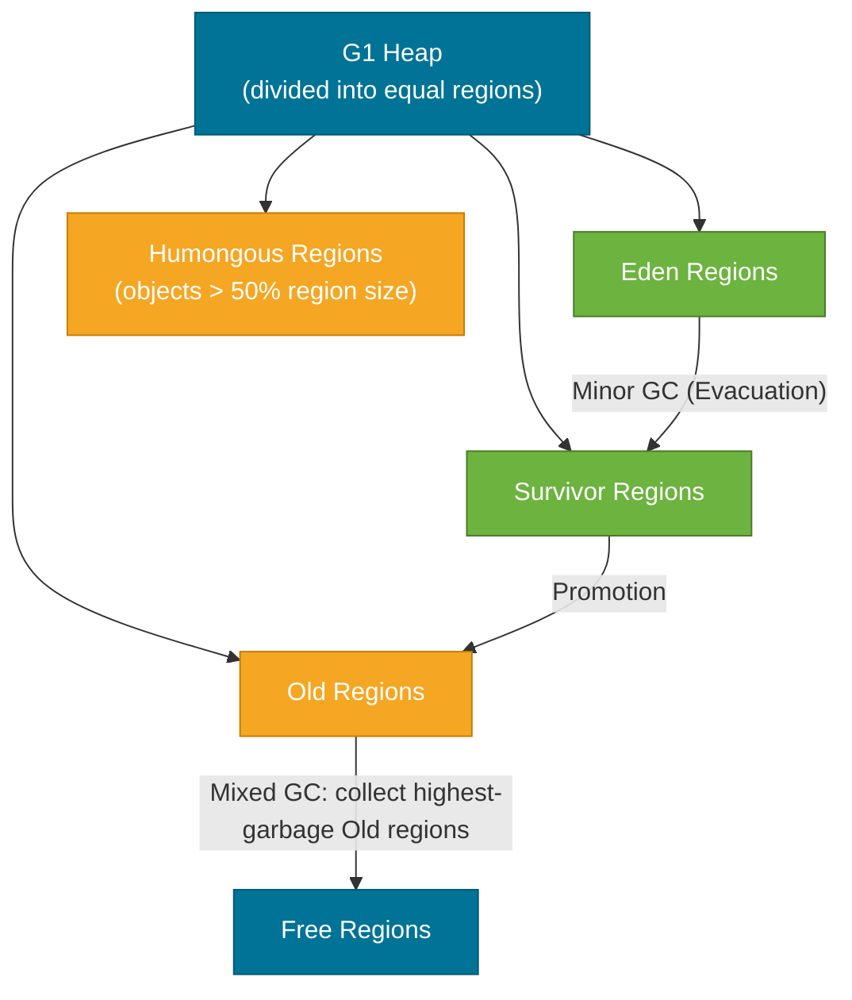

# Garbage Collection

> Garbage Collection (GC) is the JVM mechanism that automatically reclaims heap memory occupied by objects no longer reachable from any live thread — freeing developers from manual memory management while introducing the challenge of managing pause times and throughput.

## What Problem Does It Solve?

In C/C++, developers call `malloc`/`free` manually. Forgetting `free` leaks memory; calling it twice causes heap corruption; using a pointer after `free` causes undefined behavior. These bugs are notoriously hard to reproduce and diagnose.

Java eliminates this class of bug entirely. The JVM tracks which objects are reachable from running code and periodically reclaims everything else. The price is occasional **GC pauses** — brief periods where application threads stop while the collector runs. The engineering challenge of GC tuning is minimising those pauses without sacrificing throughput.

## How It Works

### Step 1 — Reachability Analysis

The GC does not use reference counting. Instead, it starts from a fixed set of **GC roots** and traces the object graph:



*Caption: GC roots are the starting points of reachability — any object not reachable from a root (E, F above) is eligible for collection, even if they reference each other.*

Every object reachable from a root is **live**. Everything else — including isolated reference cycles — is garbage. The JVM collects isolated cycles correctly; this is why Java's GC is superior to reference counting.

### Step 2 — Generational Collection

Most objects are short-lived ("weak generational hypothesis"). The JVM exploits this by dividing the heap into generations and collecting them at different frequencies:


*Caption: Objects are promoted through heap generations — Minor GC is cheap and frequent; Major/Full GC is expensive and should be rare.*

| GC Type | Region | Frequency | Pause Length |
|---------|--------|-----------|--------------|
| **Minor GC** | Young Gen (Eden + Survivors) | Very frequent | Short (ms) |
| **Major GC** | Old Gen | Less frequent | Longer |
| **Full GC** | Entire heap + Metaspace | Rare (emergency) | Long (seconds) |

:::warning Full GC is a warning sign
A Full GC that pauses the application for seconds is almost always a symptom of a problem: a memory leak promoting too many objects to Old Gen, an undersized heap, or a misconfigured collector. Monitor your GC logs; more than one Full GC per hour warrants investigation.
:::

### Step 3 — Collection Algorithms

Different collectors use different strategies to find and reclaim garbage:

| Algorithm | Used by | Approach |
|-----------|---------|----------|
| **Mark-Sweep-Compact** | Serial, Parallel | Mark live, sweep dead, compact survivors to one end |
| **Copying** | Young Gen (all collectors) | Copy live objects to empty space; old space is entirely free after |
| **Concurrent Mark** | G1, ZGC, Shenandoah | Mark live objects concurrently while app threads run |
| **Region-based** | G1, ZGC | Divide heap into equal-size regions; collect highest-garbage regions first |

## The Major Collectors

### Serial GC (`-XX:+UseSerialGC`)
- Single-threaded collector — stops all app threads (stop-the-world) for both Minor and Major GC.
- Suitable only for single-CPU machines or very small heaps (< 100 MB).
- Memory footprint is minimal — good for embedded/CLI tools, not for services.

### Parallel GC (`-XX:+UseParallelGC`)
- Multi-threaded stop-the-world collector. Uses all available CPUs for GC work.
- **Optimizes throughput** — maximises the fraction of time spent on application work.
- Default in Java 8 for server-class machines; pauses can be long for large heaps.
- Good for batch jobs tolerate pause times; bad for latency-sensitive services.

### G1 GC (`-XX:+UseG1GC`) — default since Java 9
- Divides the heap into ~2048 equal-size **regions** (1–32 MB each). Regions can be Eden, Survivor, Old, or Humongous (for large objects).
- Runs most GC work **concurrently** with application threads, then does a short final stop-the-world pause.
- **Goal**: meet a pause-time target (`-XX:MaxGCPauseMillis`, default 200 ms) while maximising throughput.
- Handles heaps from 4 GB to ~100 GB effectively.



*Caption: G1 divides the heap into regions. "Mixed GC" collects a mix of Young and the most garbage-dense Old regions, keeping pauses predictable.*

### ZGC (`-XX:+UseZGC`) — low-latency, Java 15+ GA
- Designed for sub-millisecond pause times on heaps up to **16 TB**.
- Almost all GC work (marking, relocation) runs **concurrently** — stop-the-world pauses are O(1) regardless of heap size.
- Uses **colored pointers** and **load barriers** to maintain object references during concurrent relocation.
- Best for latency-critical services (APIs, real-time systems). Slightly lower peak throughput than G1 on small heaps.

### Shenandoah (OpenJDK, `-XX:+UseShenandoahGC`)
- Similar goals to ZGC: concurrent, low-pause. Uses a **connection matrix** instead of remembered sets.
- Available in OpenJDK but not in Oracle JDK.

## Code Examples

### Configuring G1 GC in a Spring Boot service

```bash
java \
  -Xms1g -Xmx1g \                         # ← heap fixed size; avoids resize pauses
  -XX:+UseG1GC \                           # ← enable G1 (default since Java 9)
  -XX:MaxGCPauseMillis=200 \               # ← target max pause: 200 ms
  -XX:G1HeapRegionSize=16m \              # ← explicit region size for 1 GB heap
  -XX:+HeapDumpOnOutOfMemoryError \        # ← dump heap if OOM
  -XX:HeapDumpPath=/var/log/heapdump.hprof \
  -Xlog:gc*:file=/var/log/gc.log:time,uptime:filecount=5,filesize=20m \  # ← structured GC log
  -jar myapp.jar
```

### Switching to ZGC for a latency-sensitive service

```bash
java \
  -Xms2g -Xmx2g \
  -XX:+UseZGC \                            # ← enable ZGC (Java 15+ GA)
  -XX:SoftMaxHeapSize=1800m \             # ← ZGC hint: try to keep heap below this
  -Xlog:gc:file=/var/log/gc.log \
  -jar myapp.jar
```

### Forcing GC and reading stats programmatically

```java
import java.lang.management.GarbageCollectorMXBean;
import java.lang.management.ManagementFactory;

public class GcStats {
    public static void printGcInfo() {
        for (GarbageCollectorMXBean gc : ManagementFactory.getGarbageCollectorMXBeans()) {
            System.out.printf(
                "GC: %-30s  count=%d  time=%dms%n",
                gc.getName(),           // ← e.g., "G1 Young Generation"
                gc.getCollectionCount(),
                gc.getCollectionTime()  // ← cumulative time spent in this collector
            );
        }
    }
}
```

### Simulating an Old Gen memory leak

```java
// Anti-pattern: static cache with no eviction — objects promoted to Old Gen, never collected
private static final Map<String, byte[]> CACHE = new HashMap<>();

public void process(String key) {
    CACHE.put(key, new byte[1024 * 100]); // ← 100 KB per call; never evicted
    // Fix: use WeakHashMap, Caffeine, or Guava Cache with size/time eviction
}
```

:::tip Use WeakReference for caches
`WeakHashMap` allows the GC to collect values when memory is needed. For production caches, prefer [Caffeine](https://github.com/ben-manes/caffeine) which supports size-based and time-based eviction.
:::

## Best Practices

- **Use G1 as your default** for Spring Boot services. Its 200 ms pause target covers the majority of use cases without tuning.
- **Switch to ZGC** when your SLA requires p99 latency < 10 ms, or your heap exceeds 8 GB.
- **Never call `System.gc()`** in production code — it is a hint, not a guarantee, and in some containers it triggers a Full GC that pauses the entire service.
- **Log GC in production** (`-Xlog:gc*`) — you cannot retrospectively reconstruct GC behaviour without logs, and they are cheap (< 1 MB/hour for a typical service).
- **Monitor Old Gen occupancy** — if it grows monotonically, you have a memory leak. Use VisualVM or Eclipse MAT to identify the retaining path.
- **Tune heap size before tuning collector** — doubling heap is often more effective than switching GC algorithms.

## Common Pitfalls

- **Premature GC tuning**: Changing GC flags before profiling is cargo-culting. Start with GC logs; only tune when logs show a problem.
- **Setting `-Xmx` too high in containers**: The JVM heap is only part of total memory. Add Metaspace + thread stacks + Code Cache. A 4 GB container with `-Xmx4g` will be OOM-killed by the OS.
- **Ignoring Humongous allocations in G1**: Objects larger than 50% of the G1 region size go directly to "Humongous" regions, skipping Young Gen entirely. They are expensive to collect. Check GC logs for frequent Humongous allocations; consider increasing `-XX:G1HeapRegionSize`.
- **Confusing throughput and latency**: High-throughput GC (Parallel) means the GC thread finishes fast in aggregate but individual pauses can be long. Low-latency GC (ZGC) keeps individual pauses short but may use more CPU overall.
- **Finalizers**: Implementing `finalize()` delays collection — objects with finalizers must survive one extra GC cycle for the finalizer thread to run. Prefer `try-with-resources` and `Cleaner` (Java 9+) instead.

## Interview Questions

### Beginner

**Q:** How does Java garbage collection work?
**A:** The GC traces the object graph starting from GC roots (local variables, static fields, JNI references). Any object reachable from a root is kept alive. Everything else is garbage. The JVM periodically reclaims those unreachable objects, freeing heap memory for new allocations.

**Q:** What is a GC root?
**A:** A GC root is any starting point the collector uses to trace reachable objects. The main roots are: active local variables in thread stacks, static fields of loaded classes, and objects held by JNI handles. An object reachable from any root survives collection.

### Intermediate

**Q:** What is the difference between Minor GC and Major/Full GC?
**A:** A Minor GC collects only the Young Generation (Eden + Survivor spaces). It is frequent and fast because most young objects are dead. A Major GC (sometimes called Full GC) collects the Old Generation as well, and often Metaspace. It causes longer stop-the-world pauses and usually indicates either a heap too small for the workload or a memory leak filling Old Gen.

**Q:** Why is G1 GC preferred over Parallel GC for most Spring Boot services?
**A:** Parallel GC maximizes throughput but has unpredictable, long stop-the-world pauses on large heaps. G1 aims for a configurable pause-time target (`-XX:MaxGCPauseMillis`), runs most marking concurrently, and is designed for heaps 4 GB and larger. For web services where responsive latency matters, G1's predictable pauses are more valuable than Parallel's raw throughput advantage.

### Advanced

**Q:** How does G1 achieve pause-time targets, and what happens when it cannot meet them?
**A:** G1 tracks GC statistics from previous collections to predict how long collecting each region will take. It builds collection sets (CSets) of regions it can collect within the pause budget. When the Old Gen fills faster than G1 can collect it concurrently, G1 escalates to a Full GC — a single-threaded stop-the-world pass — which temporarily defeats the pause target. This is called "G1 falling back to Full GC" and appears in GC logs as `Pause Full (G1 Evacuation Pause)`. The fix is usually increasing heap or reducing allocation rate.

**Follow-up:** What are remembered sets in G1, and why do they matter?
**A:** A remembered set (RSet) is a per-region data structure that tracks references *into* that region from other regions. When G1 collects a region, it needs to know which objects in other regions point to objects in the collected region. Without RSets, it would have to scan the entire heap, defeating the purpose of regional collection. RSets add memory overhead (typically 10–20% of heap) and maintenance cost on every reference write (the "write barrier").

## Further Reading

- [Oracle: Introduction to Garbage Collection Tuning](https://docs.oracle.com/en/java/javase/21/gctuning/introduction-garbage-collection-tuning.html) — official GC tuning guide for Java 21
- [Baeldung: JVM Garbage Collectors](https://www.baeldung.com/jvm-garbage-collectors) — side-by-side comparison of Serial, Parallel, G1, ZGC
- [ZGC - What's new in JDK 16](https://malloc.se/blog/zgc-jdk16) — concise explanation of ZGC's colored-pointer design from its author

## Related Notes

- [JVM Memory Model](./jvm-memory-model.md) — the heap regions that GC operates on (Eden, Survivor, Old Gen) are defined in the memory model note
- [JIT Compilation](./jit-compilation.md) — the JIT compiler and GC both contribute to JVM warmup behavior; understanding them together explains why throughput improves after startup
- [Class Loading](./class-loading.md) — class unloading (which frees Metaspace) is triggered during Full GC; class-loader leaks prevent unloading
