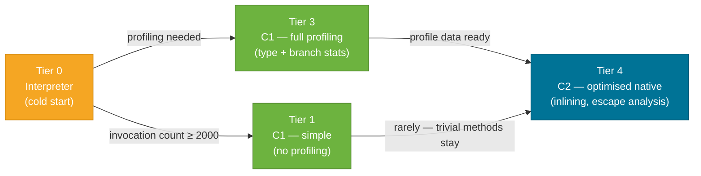
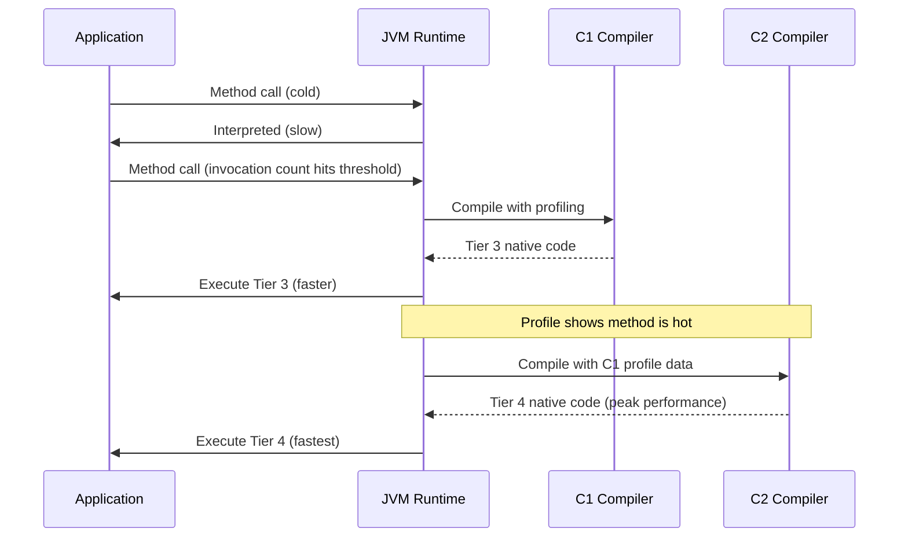

# JIT Compilation

> The JVM starts by interpreting bytecode slowly, then profiles what runs most — and at runtime, selectively compiles "hot" methods to native machine code orders of magnitude faster. This delayed, profile-guided compilation is why Java achieves C++-comparable throughput after warmup.

## What Problem Does It Solve?

There are two naive approaches to running a Java program:

1. **Interpret always** — simple, portable, but 10–50× slower than native code.
2. **Compile everything to native at startup** — fast at runtime, but startup is slow (AOT compilation pays the full cost upfront), and it cannot profile actual runtime behaviour to optimise hotspots.

JIT compilation takes a third path: start fast by interpreting, observe what actually runs hot, then compile *only those methods* to highly optimised native code, often with speculative optimisations that ahead-of-time compilers can't do safely. The result is that a long-running Java service can reach performance comparable to statically compiled languages — *after warmup*.

## Analogy

Think of a chef who has 500 recipes. On the first day, they follow every recipe step-by-step from the book (interpreter). After a busy week, they have memorised the 20 recipes they cook every day and can execute them from muscle memory at twice the speed (JIT-compiled). Rarely-ordered dishes are still cooked from the book. This is exactly how JIT works — invest optimisation effort only where it pays off.

## How It Works

### Tiered Compilation (Java 7+)

The JVM uses a **five-tier model** with increasingly aggressive compilation:



*Caption: Methods start interpreted (Tier 0), move to C1 with profiling (Tier 3), and are eventually compiled by the aggressive C2 optimizer (Tier 4) for methods that run frequently.*

| Tier | Compiler | Profiling | Typical use |
|------|----------|-----------|-------------|
| 0 | Interpreter | None | Cold code, just started |
| 1 | C1 | None | Very simple/trivial methods |
| 2 | C1 | Light (invocation/backedge counts) | Moderately called code |
| 3 | C1 | Full (type profiles, branch profiles) | Hot code preparing for C2 |
| 4 | C2 (Opto) | Uses C1 profile | Hottest methods — peak native performance |

:::info What are C1 and C2?
**C1** (Client Compiler) generates native code quickly with minimal optimisation — short compile time, lower peak performance. **C2** (Server Compiler / Opto) applies decades of optimisation research — it takes longer to compile but produces far faster code. Tiered compilation runs C1 first (early speed), then waits for profile data, then runs C2 (peak speed).
:::

### Key Optimisations

#### 1 — Method Inlining

The most impactful JIT optimisation. If a callee method is small (< ~35 bytecodes) or is called very frequently, C2 copies the callee's bytecode directly into the caller. This eliminates the frame-push overhead and enables further optimisations (constant folding, dead code elimination) across the combined code.

```java
// Before inlining (as written by the developer)
double total = 0;
for (Order o : orders) {
    total += o.getSubtotal(); // ← virtual method call each iteration
}

// After inlining (by C2, conceptually):
double total = 0;
for (Order o : orders) {
    total += o.subtotal;      // ← field access; no call frame; inner loop is now pure arithmetic
}
```

#### 2 — Escape Analysis

C2 analyses whether an object "escapes" the method or thread it was created in. If an object never escapes:
- **Stack allocation**: the object is allocated on the stack instead of the heap — zero GC pressure.
- **Scalar replacement**: the object's fields are decomposed into individual local variables — no object header, improved cache locality.
- **Lock elision**: if a synchronized block's monitor object doesn't escape, the lock is removed entirely.

```java
// Without escape analysis: new Point() goes to heap, involves GC
double distance(double x1, double y1, double x2, double y2) {
    Point p = new Point(x2 - x1, y2 - y1); // ← allocated on heap
    return Math.sqrt(p.x * p.x + p.y * p.y);
}

// After escape analysis: p doesn't escape distance(); C2 eliminates the object
// effectively compiles to: Math.sqrt((x2-x1)*(x2-x1) + (y2-y1)*(y2-y1))
```

#### 3 — Speculative (Optimistic) Optimisation

C2 makes speculative assumptions based on profiling data. For example, if a virtual method call always dispatches to `ArrayList.get()` in 99.9% of profiled calls, C2 compiles an inline cache with a fast path for `ArrayList` and a slow deoptimisation trap for anything else.

If the assumption is violated (e.g., a `LinkedList` is passed), the JVM **deoptimises** — discards the compiled code and falls back to the interpreter for that method, then eventually recompiles with the updated profile. This is transparent to the developer.

### The Warmup Phase



*Caption: Full JIT warmup takes several thousand invocations per method — this explains why JVM benchmark tools like JMH always include a warmup phase before measuring.*

## Code Examples

### Checking JIT compilation decisions with PrintCompilation

```bash
# Print each method as it is JIT-compiled
java -XX:+PrintCompilation -jar myapp.jar 2>&1 | head -30

# Sample output format:
#  timestamp  compile_id  flags  tier  class::method  (size bytes)
#     354    1       3       java.lang.String::charAt (29 bytes)
#     412    2       4       com.example.OrderService::calculateTotal (154 bytes)
#
# Tier 3 = C1 with full profiling; Tier 4 = C2 native
```

### Observing escape analysis with -XX:+PrintEscapeAnalysis

```bash
java -XX:+UnlockDiagnosticVMOptions \
     -XX:+PrintEscapeAnalysis \    # ← see which objects are stack-allocated
     -XX:+PrintEliminateAllocations \  # ← see which allocations were eliminated
     -jar myapp.jar
```

### Disabling JIT for debugging (never in production)

```bash
# Interpreter only — useful to verify a bug is JIT-related
java -Xint -jar myapp.jar

# C1 only (no C2) — medium speed, no speculative opts
java -XX:TieredStopAtLevel=3 -jar myapp.jar
```

### JMH warmup — the correct way to benchmark JIT-compiled code

```java
import org.openjdk.jmh.annotations.*;

@State(Scope.Thread)
@BenchmarkMode(Mode.AverageTime)
@OutputTimeUnit(java.util.concurrent.TimeUnit.MICROSECONDS)
@Warmup(iterations = 5, time = 1)   // ← MANDATORY: let JIT reach Tier 4 before measuring
@Measurement(iterations = 10, time = 1)
@Fork(2)
public class OrderBenchmark {

    private final List<Order> orders = generateOrders(1000);

    @Benchmark
    public double sumSubtotals() {
        double total = 0;
        for (Order o : orders) {
            total += o.getSubtotal();  // ← after warmup, C2 will inline this
        }
        return total;
    }
}
```

## Trade-offs & When To Use / Avoid

| | Pros | Cons |
|--|------|------|
| **Tiered compilation (default)** | Fast startup (C1), peak throughput (C2), adaptive | Code Cache pressure; compilation threads compete with app threads during warmup |
| **Interpreter only (`-Xint`)** | Zero Code Cache usage, deterministic behaviour | 10–50× slower; only for debugging |
| **C1 only (TieredStopAtLevel=3)** | Faster startup than full tiered; moderate performance | No speculative optimisations; lower peak throughput than C2 |
| **AOT (GraalVM Native Image)** | Instant startup, low memory, no warmup | Longer build time, limited reflection, no dynamic classloading |

## Common Pitfalls

- **Benchmarking without warmup**: Measuring performance on the first few invocations gives interpreter-speed numbers. A method needs thousands of invocations to reach Tier 4. Always use a proper benchmarking harness (JMH) with warmup iterations.
- **Code Cache exhaustion**: If you generate many classes at runtime (Hibernate CGLIB proxies, Lambda proxies), the Code Cache can fill. Symptoms: log message `CodeCache is full. Compiler has been disabled.` After this, the JVM never JIT-compiles again until restarted. Fix: `-XX:ReservedCodeCacheSize=512m`.
- **Blaming GC for latency spikes that are actually deoptimisation**: When C2's speculative assumption is wrong, it deoptimises and recompiles. The deoptimisation appears as a brief spike in call latency. `PrintCompilation` output shows an "n" flag on lines where deoptimisation occurred.
- **Micro-optimisation that defeats JIT**: Writing "clever" bit-twiddling code can prevent the JIT from recognising a standard pattern and applying its own (better) vectorisation. Writing idiomatic Java and letting JIT do its job often produces faster code than hand-optimised byte manipulation.

## Interview Questions

### Beginner

**Q:** What is JIT compilation and why does Java need it?
**A:** JIT (Just-In-Time) compilation converts bytecode to native machine code at runtime, only for methods that run frequently. This gives Java near-native performance for long-running services while preserving portability (bytecode runs on any JVM). Without JIT, the JVM would interpret every instruction, which is 10–50× slower than native code.

**Q:** What is "JVM warmup" and why does it matter?
**A:** Warmup is the period at startup during which the JVM is still profiling and compiling hot methods. During warmup, performance is lower because code runs through the interpreter or early C1 tiers. For benchmarks, warmup means the first measurements are unrepresentative. For production services, it means the first few minutes after deployment have higher latency — relevant for canary deployments and rolling restarts.

### Intermediate

**Q:** What is tiered compilation, and what are the C1 and C2 compilers?
**A:** Tiered compilation uses two JIT compilers in sequence. C1 (client compiler) compiles quickly to native code with basic optimisations and inserts profiling probes. C2 (server compiler, "Opto") receives C1's profile data and applies aggressive optimisations — inlining, escape analysis, vectorisation — producing near-optimal native code. Running C1 first means application code is already native (faster than interpreter) while C2 prepares the optimal version in a background thread.

**Q:** What is escape analysis and what optimisations does it enable?
**A:** Escape analysis determines whether an object is accessible ("escapes") outside the method or thread it was created in. For non-escaping objects, the JIT can: (1) allocate the object on the stack instead of the heap, reducing GC pressure; (2) replace the object with scalar variables (its fields become local variables); (3) elide locks on monitors that don't escape. These optimisations are transparent — the developer writes normal code and the JIT handles it.

### Advanced

**Q:** How does speculative (optimistic) compilation work, and what happens when the speculation is wrong?
**A:** At Tier 4, C2 plants *speculation traps* based on profiling data. For example, if a virtual call `animal.speak()` always dispatches to `Dog.speak()`, C2 compiles an inline cache: a type check followed by the inlined `Dog.speak()` body, with a slow-path trap for any other type. If a `Cat` is passed, the trap fires, the JVM **deoptimises** — invalidates the compiled code and resumes interpretation for that activation. Eventually, the updated profile triggers recompilation with both `Dog` and `Cat` cases handled. Deoptimisation is transparent but costs a brief latency spike on the affected invocations.

**Follow-up:** How can you observe whether excessive deoptimisation is hurting a service?
**A:** Use `-XX:+PrintCompilation` and look for lines with the `n` (not-entrant) or `zombie` flags, or the message `made not entrant`. You can also use JDK Flight Recorder with the `jdk.Deoptimization` event to see which methods and reasons account for most deoptimisations. If the same method deoptimises repeatedly due to type speculation, the application is likely using excessively polymorphic call sites — consider using `final` declarations or consolidating implementations.

## Further Reading

- [OpenJDK wiki: HotSpot Performance Techniques](https://wiki.openjdk.org/display/HotSpot/PerformanceTechniques) — internal documentation on key JIT optimisations
- [Baeldung: Introduction to JIT Compilation in Java](https://www.baeldung.com/jvm-tiered-compilation) — practical walkthrough of tiered compilation with flag examples
- [JMH (Java Microbenchmark Harness)](https://github.com/openjdk/jmh) — the correct tool for measuring JIT-compiled Java performance

## Related Notes

- [JVM Memory Model](./jvm-memory-model.md) — the Code Cache is where JIT-compiled native code lives; code cache exhaustion stops JIT
- [Garbage Collection](./garbage-collection.md) — escape analysis in the JIT reduces GC pressure by eliminating heap allocations for short-lived objects
- [Bytecode & .class Files](./bytecode.md) — JIT takes bytecode as input; reading bytecode helps you understand what the JIT is actually compiling
