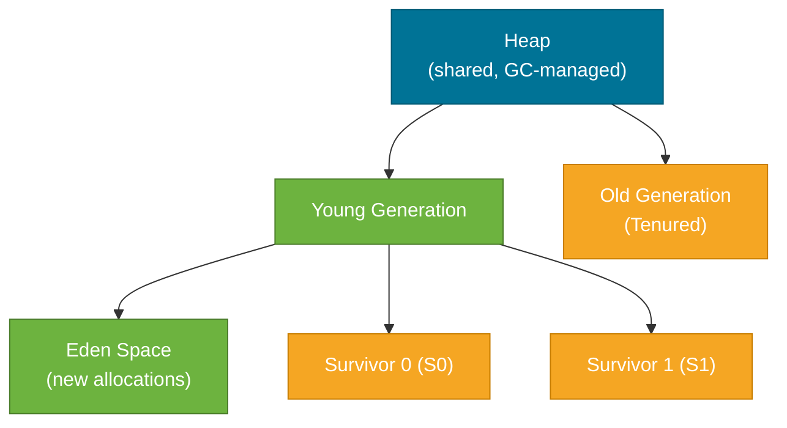
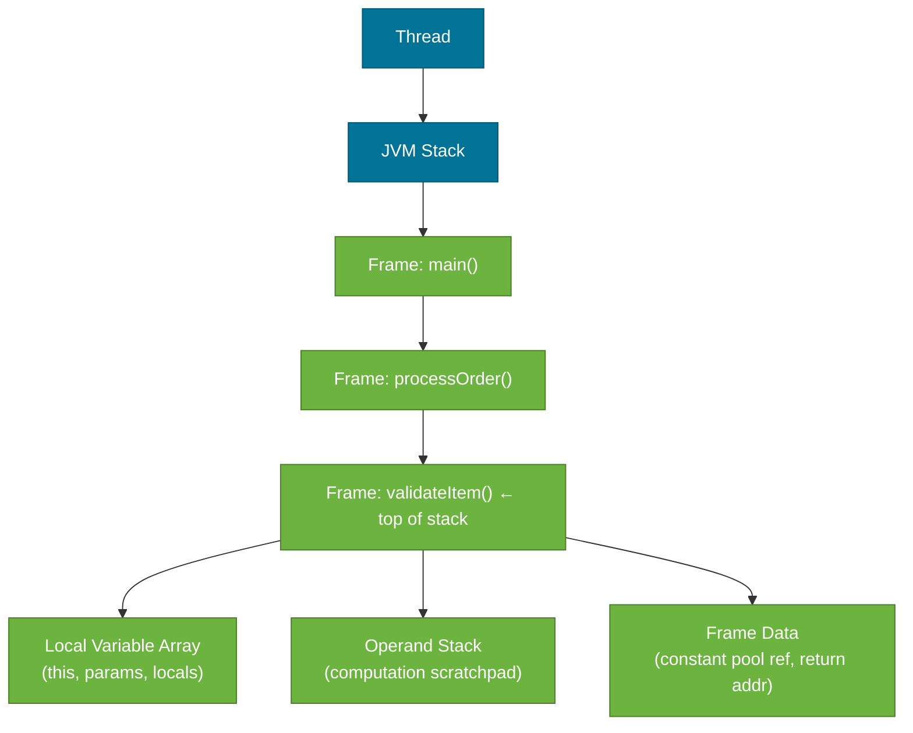

# JVM Memory Model (Runtime Data Areas)

> The JVM divides its runtime memory into distinct regions, each with a specific purpose — and understanding which region holds what is the first step to diagnosing `OutOfMemoryError`, tuning GC, and reasoning about thread safety.

:::warning Naming confusion
"JVM Memory Model" is sometimes confused with the **Java Memory Model (JMM)** — the specification for visibility and ordering of shared variables across threads. This note covers the **runtime data areas** (heap, stack, Metaspace). The JMM/happens-before rules are covered in the [Multithreading](../multithreading/index.md) domain.
:::

## What Problem Does It Solve?

Without a structured memory layout, the JVM would have no reliable way to:
- isolate each thread's execution state (local variables, call stack) from other threads
- store objects in a region that garbage collection can manage efficiently
- keep class metadata (method definitions, constant pools) separate from short-lived object data

When things go wrong — a memory leak, a `StackOverflowError`, or an `OutOfMemoryError: Metaspace` — each error message points to a different memory region. Knowing the layout tells you *where to look* and *which JVM flag to adjust*.

## Runtime Data Areas

The JVM specification (JVMS §2) defines six runtime data areas. They split into two groups:

| Area | Scope | Holds |
|------|-------|-------|
| **Heap** | Shared (all threads) | All objects and arrays |
| **Metaspace** | Shared (all threads) | Class metadata, method bytecode, constant pools |
| **Code Cache** | Shared (all threads) | JIT-compiled native code |
| **JVM Stack** | Per-thread | Stack frames (local vars, operand stack) |
| **PC Register** | Per-thread | Address of the current bytecode instruction |
| **Native Method Stack** | Per-thread | Frames for native (C/C++) method calls |

The **heap** and **Metaspace** are the areas you tune most often. The **stack** is the area that throws `StackOverflowError`.

## How It Works

### The Heap

The heap is where every `new Object()` ultimately lands. The JVM subdivides it to make garbage collection efficient:



*Caption: The heap's generational structure — new objects start in Eden and, if they survive GC cycles, are promoted to the Old Generation.*

**How objects move through the heap:**

1. A new object is allocated in **Eden**.
2. When Eden fills, a **Minor GC** runs — live objects are copied to one of the Survivor spaces (S0 or S1).
3. Objects that survive multiple Minor GC cycles ("tenure threshold", default 15) are promoted to the **Old Generation**.
4. When the Old Generation fills, a **Major GC** (or Full GC) runs — more expensive, causes longer pauses.

:::tip Why two Survivor spaces?
The JVM uses a **copy-compact** algorithm for Young GC. At any moment, exactly one Survivor space is "active". After a Minor GC, surviving objects are copied to the empty Survivor space, leaving the old one completely empty. This avoids fragmentation without a compaction step.
:::

### Non-Heap Areas

**Metaspace** (Java 8+, replaced PermGen):
- Stores class metadata: field names, method bytecode, constant pools, annotations.
- Lives in **native memory** (outside the Java heap), not limited by `-Xmx`.
- Controlled with `-XX:MaxMetaspaceSize`. Without a limit, a class-loader leak will consume all available native memory.

**Code Cache**:
- Holds native machine code produced by the JIT compiler.
- Default size ~240 MB (Java 17+). Tuned with `-XX:ReservedCodeCacheSize`.
- When the Code Cache fills, the JVM stops JIT-compiling and falls back to the interpreter, causing a performance cliff.

### Per-Thread Areas

Each thread gets its own **JVM stack** the moment it starts. The stack is a sequence of **stack frames**:



*Caption: Each method call pushes a new stack frame — `StackOverflowError` fires when the stack depth exceeds the thread's stack size (`-Xss`).*

A **stack frame** contains:
- **Local Variable Array** — `this` reference (for instance methods), method parameters, and declared local variables.
- **Operand Stack** — a small working stack where bytecode instructions push/pop intermediate values (like a calculator's stack).
- **Frame Data** — a reference to the runtime constant pool (for resolving symbolic references) and the return address.

The **PC (Program Counter) Register** holds the address of the bytecode instruction the thread is currently executing. It is undefined for native methods.

## Code Examples

### Diagnosing OutOfMemoryError regions

```java
// ── Heap overflow ──────────────────────────────────────────────
// java.lang.OutOfMemoryError: Java heap space
// Flags: -Xms256m -Xmx256m
List<byte[]> leak = new ArrayList<>();
while (true) {
    leak.add(new byte[1024 * 1024]); // ← keeps strong reference: GC can't collect
}

// ── Metaspace overflow ─────────────────────────────────────────
// java.lang.OutOfMemoryError: Metaspace
// Happens when a framework generates unlimited classes at runtime
// (e.g., CGLIB proxy leak, bad ClassLoader not garbage collected)
// Flag to reproduce in tests: -XX:MaxMetaspaceSize=32m

// ── Stack overflow ─────────────────────────────────────────────
// java.lang.StackOverflowError
void infinite() {
    infinite(); // ← each call pushes a new frame; stack has a fixed depth
}
```

### Printing heap layout at JVM start

```bash
# Show heap region sizes chosen by the JVM
java -XX:+PrintFlagsFinal -version 2>&1 | grep -i heapsize

# Dump heap to file for analysis in VisualVM / Eclipse MAT
java -XX:+HeapDumpOnOutOfMemoryError -XX:HeapDumpPath=/tmp/heap.hprof MyApp
```

### Viewing object allocation with JVM flags

```bash
# Print GC details including Eden/Survivor/Old sizes
java -Xms512m -Xmx512m \
     -XX:+PrintGCDetails \   # ← shows per-region stats after each GC
     -XX:+PrintGCDateStamps \
     -Xlog:gc*:file=/tmp/gc.log \  # ← Java 9+ unified logging syntax
     -jar myapp.jar
```

### Inspecting a running JVM with jcmd

```bash
# Show all memory regions of a running JVM process (pid 12345)
jcmd 12345 VM.native_memory summary

# Force a heap dump from outside the running app
jcmd 12345 GC.heap_dump /tmp/heap.hprof
```

## Best Practices

- **Always set both `-Xms` and `-Xmx` to the same value** in production containers — prevents the JVM from requesting more memory from the OS unpredictably, and eliminates heap-resize pauses.
- **Set `-XX:MaxMetaspaceSize`** in container environments (Kubernetes, Docker). Without it, a class-loader leak will steal memory from other processes on the node.
- **Use `-Xss` sparingly** — increasing stack size delays `StackOverflowError` but doesn't fix the root cause (likely infinite recursion). Default (512 KB–1 MB) is sufficient for almost all workloads.
- **Don't store large objects in `static` fields** — they live on the heap for the JVM's lifetime and are a common cause of heap leaks and Metaspace pressure (when classes can't be unloaded).
- **Prefer heap dump analysis** (`jmap`, VisualVM, Eclipse MAT) over guessing — the histogram in a heap dump tells you exactly which class is consuming memory.

## Common Pitfalls

- **Confusing heap size with container memory**: The JVM heap is only *part* of JVM memory. Native memory (Metaspace, Code Cache, thread stacks, direct buffers) adds on top. A container with 512 MB and `-Xmx512m` will be OOM-killed. A safe heuristic is `-Xmx` = container limit × 0.75.
- **Assuming PermGen still exists**: PermGen was removed in Java 8 and replaced by Metaspace. JVM flags like `-XX:PermSize` and `-XX:MaxPermSize` are silently ignored on Java 8+.
- **Trusting `Runtime.getRuntime().freeMemory()`**: This only reflects the current heap; it doesn't include Metaspace, Code Cache, or native allocations. Use `jcmd` or `jstat` for accurate multi-region metrics.
- **Ignoring Old Gen pressure**: A healthy app should have Old Gen usage that levels off over time. Steadily *growing* Old Gen usage is the canonical sign of a heap memory leak.

## Interview Questions

### Beginner

**Q:** What is the difference between the heap and the stack in the JVM?
**A:** The heap is shared memory where all objects are allocated; it is garbage-collected. The stack is per-thread and holds stack frames — each representing one method call — which contain local variables and intermediate computation values. When a method returns, its frame is popped automatically; no GC needed.

**Q:** What causes a `StackOverflowError`?
**A:** Each method call pushes a new stack frame onto the thread's JVM stack. If the recursion is deep enough (or infinite), the stack depth exceeds the thread's maximum (`-Xss`), and the JVM throws `StackOverflowError`.

### Intermediate

**Q:** What is Metaspace and why did it replace PermGen?
**A:** Metaspace stores class metadata (bytecode, constant pools, annotations). Unlike PermGen, which lived inside the Java heap with a fixed upper bound, Metaspace lives in native memory and can grow dynamically. This eliminated common `OutOfMemoryError: PermGen space` errors from dynamic class generation in frameworks like Spring and Hibernate. The trade-off is that without `-XX:MaxMetaspaceSize`, a class-loader leak can consume all native memory.

**Q:** What is the Young Generation and why does it exist?
**A:** The Young Generation (Eden + two Survivor spaces) is optimized for the observation that most objects die young ("weak generational hypothesis"). Minor GC runs on this region frequently and cheaply — only the live objects (a small fraction) are copied; dead objects are reclaimed by doing nothing. This avoids scanning the entire heap on every collection.

### Advanced

**Q:** How does the JVM's memory model affect container resource limits?
**A:** The JVM consumes memory in several regions: heap (`-Xmx`), Metaspace, Code Cache, thread stacks, and direct ByteBuffers. In a container, only `-Xmx` controls heap; the rest grows independently in native memory. A service with 20 threads, `-Xmx512m`, and unlimited Metaspace can easily use 1 GB+ total. Since Java 10, the JVM is container-aware and will read cgroup limits with `-XX:+UseContainerSupport` (enabled by default), using them to size the heap automatically — but Metaspace and thread count still need explicit limits.

**Follow-up:** What flag automatically sizes heap relative to container memory?
**A:** `-XX:MaxRAMPercentage` (default 25%). Set it to 75% for typical Spring Boot workloads: `-XX:MaxRAMPercentage=75.0`. This replaces the need to hardcode `-Xmx` in container deployments.

## Further Reading

- [JVMS §2 — The Structure of the Java Virtual Machine](https://docs.oracle.com/javase/specs/jvms/se21/html/jvms-2.html) — the authoritative specification for all runtime data areas
- [Baeldung: Stack Memory and Heap Space in Java](https://www.baeldung.com/java-stack-heap) — practical explanation with code examples
- [Oracle: Java Platform, Standard Edition Tools Reference — jcmd](https://docs.oracle.com/en/java/javase/21/docs/specs/man/jcmd.html) — command reference for JVM diagnostics

## Related Notes

- [Garbage Collection](./garbage-collection.md) — GC operates on the heap regions described here; understanding generation structure is a prerequisite for GC tuning
- [JIT Compilation](./jit-compilation.md) — the Code Cache is the JVM memory region where JIT-compiled native code lives
- [Class Loading](./class-loading.md) — loaded classes populate Metaspace; class-loader leaks cause Metaspace exhaustion
