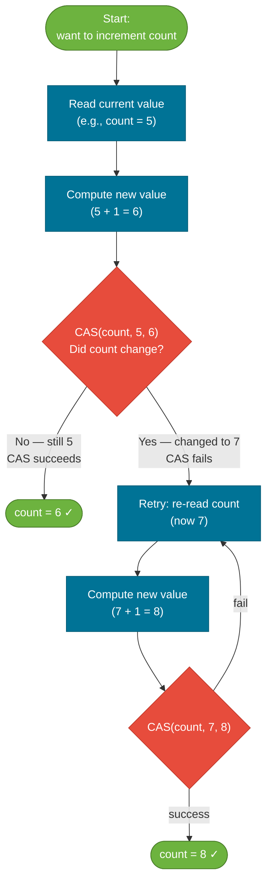

# Atomic Variables

> Atomic variables give you thread-safe compound operations (read-modify-write) without a lock — using a hardware CPU primitive called Compare-And-Swap (CAS).

## What Problem Does It Solve?

Simple counters represent the most common shared-state pattern in multithreaded code. The obvious approach — a plain `int` incremented with `++` — is not thread-safe because `i++` is a three-step operation: read, add, write. Two threads can read the same value, both add 1, and both write the same result, silently losing one increment.

The fix with `synchronized` works but pays a price:

```java
synchronized (this) { count++; } // ← correct but slow: lock acquire/release on every call
```

For a counter that is updated millions of times per second across dozens of threads, lock contention becomes a bottleneck. `AtomicInteger` solves this with a **lock-free** approach that is both correct and faster under low-to-moderate contention.

## Compare-And-Swap (CAS)

CAS is a CPU-level atomic instruction available on all modern architectures (x86: `LOCK CMPXCHG`). It does three things in a single non-interruptible step:

1. **Read** the current value at a memory address.
2. **Compare** it to an expected value.
3. **Write** a new value *only if* the current value matches the expected value.

```
CAS(address, expected, newValue) → success | failure
```

If another thread modified the value between the read and the CAS attempt, the expected value won't match and the operation fails. Java atomics loop and retry until it succeeds:



*CAS-based increment loop — threads retry until they win the race; no lock is ever acquired.*

## AtomicInteger

`AtomicInteger` wraps an `int` and exposes all common operations as atomic (thread-safe) compound ops.

```java
import java.util.concurrent.atomic.AtomicInteger;

AtomicInteger counter = new AtomicInteger(0);

// Thread-safe increment — equivalent to synchronized count++
int newVal = counter.incrementAndGet(); // ← returns new value (post-increment)
int oldVal = counter.getAndIncrement(); // ← returns old value (pre-increment analog)

counter.addAndGet(5);     // ← atomically add 5 and return new value
counter.set(100);         // ← unconditional set (writes through memory barrier)
counter.get();            // ← read (reads through memory barrier, like volatile)

// Compare-And-Set: only update if current == expected
boolean won = counter.compareAndSet(100, 0); // ← returns true if swap succeeded
```

**When `AtomicInteger` wins over `synchronized`**: low-to-moderate contention where lock overhead is significant. Under extreme contention (many CAS failures), `LongAdder` is better.

## AtomicLong and AtomicBoolean

```java
AtomicLong requestCount = new AtomicLong(0);
requestCount.incrementAndGet(); // ← same API as AtomicInteger

AtomicBoolean initialized = new AtomicBoolean(false);
// Classic one-time initialization guard:
if (initialized.compareAndSet(false, true)) { // ← only first thread succeeds
    performOneTimeSetup();
}
```

## AtomicReference

`AtomicReference<V>` applies CAS to object references — enabling lock-free reference swaps.

```java
import java.util.concurrent.atomic.AtomicReference;

class Config {
    final String host;
    final int port;
    Config(String host, int port) { this.host = host; this.port = port; }
}

AtomicReference<Config> configRef = new AtomicReference<>(new Config("localhost", 8080));

// Atomically swap to a new config only if the current config hasn't changed
Config current = configRef.get();
Config updated = new Config(current.host, 9090);
boolean swapped = configRef.compareAndSet(current, updated); // ← only succeeds if ref hasn't changed
```

`AtomicReference` is useful for implementing lock-free data structures and for configuration hot-reloading.

### The ABA Problem

A risk with CAS on references: Thread A reads value `A`, Thread B changes it to `B`, then back to `A`. Thread A's CAS succeeds (the reference looks unchanged) even though the object was replaced in the meantime.

```java
// Solution: AtomicStampedReference — pairs value with a version stamp
AtomicStampedReference<Node> ref = new AtomicStampedReference<>(node, 0);

int[] stampHolder = new int[1];
Node current = ref.get(stampHolder);  // ← reads value AND current stamp
int stamp = stampHolder[0];

ref.compareAndSet(current, newNode, stamp, stamp + 1); // ← CAS checks BOTH value and stamp
```

`AtomicStampedReference` adds a monotonically increasing stamp. Even if the value returns to `A`, the stamp will differ, so the CAS correctly fails.

## AtomicIntegerArray / AtomicReferenceArray

For thread-safe array element updates:

```java
AtomicIntegerArray scores = new AtomicIntegerArray(10); // ← 10-element array
scores.incrementAndGet(3); // ← atomically increment index 3
scores.compareAndSet(3, 5, 6); // ← CAS on array element at index 3
```

## LongAdder (Java 8+)

Under high contention, many threads fail their CAS and retry repeatedly, creating **CAS contention**. `LongAdder` solves this by maintaining **multiple internal cells** — each thread updates its own cell, reducing contention. The total is computed only when `sum()` is called.

```java
import java.util.concurrent.atomic.LongAdder;

LongAdder counter = new LongAdder();
counter.increment();        // ← distributes writes across internal cells
counter.add(5);
long total = counter.sum(); // ← sums all cells; not guaranteed to be up-to-date in real time
counter.reset();            // ← resets all cells to 0
long sumAndReset = counter.sumThenReset(); // ← atomic sum + reset
```

| | `AtomicLong` | `LongAdder` |
|--|-------------|-------------|
| Low contention | Faster (single cell, no striping) | Slightly slower (striping overhead) |
| High contention | Slow (many CAS retries) | Much faster (each thread has own cell) |
| Read current total | `get()` — always accurate | `sum()` — approximate under concurrent writes |
| Reset support | Via `set(0)` | `reset()` / `sumThenReset()` |

**Rule of thumb**: use `LongAdder` for frequently updated counters (metrics, rate counters); use `AtomicLong` when you need `compareAndSet` or an accurate real-time read.

## Trade-offs & When To Use / Avoid

| | Pros | Cons |
|--|------|------|
| Atomics | Lock-free, no deadlock risk, good cache performance | Only work on single variables; can't atomically update two fields at once |
| `synchronized` | Simple, works on any compound state | Lock contention at high throughput; can deadlock |
| `LongAdder` | Best throughput for pure counters | No CAS, no accurate real-time `get()` |

Use atomics for:
- **Counters and IDs**: request counts, sequence generators.
- **One-time init guards**: `AtomicBoolean.compareAndSet(false, true)`.
- **Lock-free data structure nodes**: stacks, queues.

Avoid atomics when:
- You need to update **two or more fields atomically** — use `synchronized` or a lock.
- The operation spans many steps — CAS retry loops become complex and hard to reason about.

## Common Pitfalls

- **Calling `get()` then `compareAndSet()` as separate steps**: The value may change between `get()` and `compareAndSet()`. Use the integrated methods like `getAndUpdate()` or `updateAndGet()`:
  ```java
  // WRONG: read then CAS — not atomic
  int val = counter.get();
  counter.compareAndSet(val, val + 1);

  // RIGHT: all-in-one update function
  counter.updateAndGet(v -> v + 1); // ← loops internally until CAS succeeds
  ```
- **Using `AtomicReference` to protect multiple fields**: CAS on a single reference doesn't protect two separate fields from being inconsistently updated. Wrap both fields in an immutable holder class and swap the reference atomically.
- **Confusing `set()` with `lazySet()`**: `lazySet()` does not guarantee immediate visibility (no full memory barrier); only use it when eventual visibility is acceptable (e.g., nulling out a reference in a pool for GC).

## Interview Questions

### Beginner

**Q:** What is an atomic variable in Java?
**A:** A class in `java.util.concurrent.atomic` (like `AtomicInteger`, `AtomicLong`, `AtomicReference`) that provides thread-safe compound operations — read-modify-write — without using `synchronized`. They are backed by CPU-level CAS instructions, making them lock-free.

**Q:** How does `AtomicInteger.incrementAndGet()` work?
**A:** It uses a compare-and-swap loop: read the current value, compute `current + 1`, then attempt CAS to write the new value only if the current value hasn't changed. If another thread changed it first, retry. This loop keeps retrying until it wins the CAS, guaranteeing correctness without a lock.

### Intermediate

**Q:** What is the difference between `AtomicLong` and `LongAdder`?
**A:** Both are thread-safe counters, but `LongAdder` is optimized for high-contention scenarios. It maintains multiple striped cells so different threads can increment different cells simultaneously, reducing CAS contention. `AtomicLong` is better when you need `compareAndSet` or a real-time accurate read. For pure frequency counters (metrics), prefer `LongAdder`.

**Q:** What is the ABA problem in CAS-based algorithms?
**A:** Thread A reads value `A`. Thread B changes it to `B`, then back to `A`. Thread A's CAS succeeds because the value looks unchanged, even though the object may have been completely replaced in the meantime. The fix is `AtomicStampedReference`, which pairs the value with a stamp (version counter) so a round-trip value change fails the CAS.

### Advanced

**Q:** When would you implement a custom lock-free stack using `AtomicReference`?
**A:** For a non-blocking stack: maintain an `AtomicReference<Node>` pointing to the head. To push: create a new node whose next points to the current head, then CAS the head from current to the new node. To pop: read the current head, then CAS from current head to `head.next`. Both operations retry on CAS failure. This avoids lock contention entirely. The risk is the ABA problem on pop — mitigated with `AtomicStampedReference` or epoch-based reclamation in high-performance libraries.

## Further Reading

- [java.util.concurrent.atomic (Java 21 API)](https://docs.oracle.com/en/java/javase/21/docs/api/java.base/java/util/concurrent/atomic/package-summary.html) — full package overview with all atomic classes
- [Guide to the Java Atomic Variables](https://www.baeldung.com/java-atomic-variables) — covers all atomic types with practical examples
- [LongAdder vs AtomicLong](https://www.baeldung.com/java-longadder-and-longaccumulator) — benchmark comparison and when each wins

:::tip Practical Demo
See the [Atomic Variables Demo](./demo/atomic-variables-demo.md) for step-by-step runnable examples and exercises — CAS loops, `LongAdder` vs `AtomicLong`, and ABA problem fixes.
:::

## Related Notes

- [Synchronization](./synchronization.md) — `synchronized` is the lock-based alternative; understand it before choosing atomics
- [Locks](./locks.md) — `ReentrantLock` for compound multi-field operations that atomics can't handle
- [Thread Safety Patterns](./thread-safety-patterns.md) — immutability and confinement are complementary non-locking strategies
