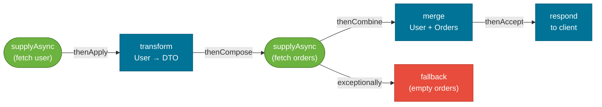

# java.util.concurrent

> `java.util.concurrent` (JUC) is the Java standard library's concurrency toolkit — it gives you thread pools, async workflows, countdown gates, and more, so you almost never need to manage threads or write `wait/notify` directly.

## What Problem Does It Solve?

Raw thread management has serious problems at scale:

- **Thread creation is expensive** — creating an OS thread costs time and memory (typically 512 KB stack). Creating a new thread per request does not scale.
- **No lifecycle management** — manually created threads have no supervisor; if one crashes, nothing catches it.
- **No result handling** — `Runnable.run()` returns void. Getting a value back from a background thread requires shared state and synchronization.
- **Complex coordination** — using `wait/notify` to synchronize multiple threads is fragile and error-prone.

`java.util.concurrent`, introduced in Java 5, provides production-grade solutions for all of these: thread pools (`ExecutorService`), task results (`Future`, `CompletableFuture`), and synchronization utilities (`CountDownLatch`, `Semaphore`, `CyclicBarrier`).

## ExecutorService

`ExecutorService` is the central abstraction for submitting tasks to a managed thread pool. You submit tasks; the executor manages threads, queuing, and lifecycle.

```java
import java.util.concurrent.*;

// Create a fixed-size thread pool
ExecutorService executor = Executors.newFixedThreadPool(4); // ← 4 reusable threads

// Submit a Runnable (fire-and-forget)
executor.execute(() -> System.out.println("Task running in: " + Thread.currentThread().getName()));

// Submit a Callable (returns a result)
Future<String> future = executor.submit(() -> {
    Thread.sleep(500);
    return "Hello from thread pool";
});

System.out.println(future.get()); // ← blocks until result is available

// Always shut down — otherwise JVM won't exit
executor.shutdown();              // ← graceful: waits for running tasks
executor.awaitTermination(10, TimeUnit.SECONDS);
```

### Built-in Factory Methods

| Factory | Behavior |
|---------|----------|
| `newFixedThreadPool(n)` | Fixed number of threads; excess tasks queued. |
| `newCachedThreadPool()` | Creates threads on demand; reuses idle threads; can grow unbounded. |
| `newSingleThreadExecutor()` | One thread, FIFO task queue — useful for ordered sequential execution. |
| `newScheduledThreadPool(n)` | Fixed pool that can run tasks with delay or on a fixed schedule. |
| `newVirtualThreadPerTaskExecutor()` | Java 21+ — one virtual thread per task, extremely cheap. |

:::warning
`Executors.newCachedThreadPool()` can create thousands of threads under load, exhausting JVM memory. Prefer `newFixedThreadPool` or a custom `ThreadPoolExecutor` with bounded queues in production.
:::

### ThreadPoolExecutor (custom config)

```java
ThreadPoolExecutor executor = new ThreadPoolExecutor(
    2,                            // ← corePoolSize: threads always kept alive
    10,                           // ← maximumPoolSize: max threads under load
    60, TimeUnit.SECONDS,         // ← keepAlive: idle threads above core live this long
    new LinkedBlockingQueue<>(100), // ← task queue capacity
    new ThreadPoolExecutor.CallerRunsPolicy() // ← rejection policy when queue full
);
```

## Future

`Future<V>` represents the result of an asynchronous computation. It is the return type of `executor.submit(Callable)`.

```java
Future<Integer> future = executor.submit(() -> expensiveComputation());

// Do other work while computation runs...
doOtherWork();

// Now retrieve the result (blocks if not yet ready)
Integer result = future.get(5, TimeUnit.SECONDS); // ← timeout variant
```

| Method | Behavior |
|--------|----------|
| `get()` | Blocks until result ready; throws `ExecutionException` if task threw |
| `get(timeout, unit)` | Blocks with timeout; throws `TimeoutException` |
| `isDone()` | Non-blocking check |
| `cancel(mayInterrupt)` | Attempts to cancel; returns `false` if already done |

:::info
`Future` is limited — you can't chain operations, combine multiple futures, or attach callbacks. That's why `CompletableFuture` was introduced in Java 8.
:::

## CompletableFuture

`CompletableFuture<T>` (Java 8+) is a full-featured async pipeline builder. It supports chaining, combining, and exception handling without blocking.



*CompletableFuture pipeline — async tasks chained together; each stage runs when the previous one completes, and exceptions are handled inline.*

### Core API

```java
// Start an async computation (runs in ForkJoinPool.commonPool() by default)
CompletableFuture<String> cf = CompletableFuture.supplyAsync(() -> {
    return fetchUserFromDb(userId); // ← runs on a background thread
});

// Transform the result (like Stream.map)
CompletableFuture<String> upper = cf.thenApply(String::toUpperCase);

// Chain another async task (like Stream.flatMap)
CompletableFuture<Order> order = cf.thenCompose(user ->
    CompletableFuture.supplyAsync(() -> fetchOrders(user))
);

// Side effect: consume result without returning
cf.thenAccept(user -> System.out.println("Got user: " + user));

// Combine two independent futures
CompletableFuture<String> result = cf.thenCombine(order,
    (user, ord) -> user + " has order " + ord.id()
);

// Exception handling
CompletableFuture<String> safe = cf.exceptionally(ex -> "fallback-user");

// Run on a custom executor instead of common pool
CompletableFuture<String> cf2 = CompletableFuture.supplyAsync(
    () -> fetchUser(id), executor // ← always provide custom executor in production
);
```

### Waiting for Multiple Futures

```java
CompletableFuture<String> f1 = CompletableFuture.supplyAsync(() -> "A");
CompletableFuture<String> f2 = CompletableFuture.supplyAsync(() -> "B");
CompletableFuture<String> f3 = CompletableFuture.supplyAsync(() -> "C");

// Wait until ALL complete
CompletableFuture<Void> all = CompletableFuture.allOf(f1, f2, f3);
all.join(); // ← like get() but throws unchecked CompletionException

// Wait until ANY one completes
CompletableFuture<Object> any = CompletableFuture.anyOf(f1, f2, f3);
```

## Synchronization Utilities

### CountDownLatch

A signal gate: one or more threads wait until a count reaches zero.

```java
int workerCount = 3;
CountDownLatch latch = new CountDownLatch(workerCount); // ← count = 3

for (int i = 0; i < workerCount; i++) {
    executor.submit(() -> {
        doWork();
        latch.countDown(); // ← decrements count; when 0, gateway opens
    });
}

latch.await(); // ← main thread blocks here until count reaches 0
System.out.println("All workers done"); // ← runs only after all countDown() calls
```

`CountDownLatch` is **one-shot** — once it reaches zero it cannot be reset.

### CyclicBarrier

All threads wait at a meeting point until everyone arrives. Unlike `CountDownLatch`, it resets and can be reused.

```java
int parties = 3;
CyclicBarrier barrier = new CyclicBarrier(parties, () ->
    System.out.println("All threads reached barrier — proceeding") // ← optional barrier action
);

for (int i = 0; i < parties; i++) {
    executor.submit(() -> {
        phase1Work();
        barrier.await(); // ← wait until all parties arrive
        phase2Work();    // ← starts only after all threads cleared the barrier
    });
}
```

### Semaphore

Controls the number of threads that can access a resource concurrently.

```java
Semaphore semaphore = new Semaphore(3); // ← at most 3 threads at a time

executor.submit(() -> {
    semaphore.acquire(); // ← blocks if no permits available
    try {
        accessLimitedResource();
    } finally {
        semaphore.release(); // ← ALWAYS release in finally
    }
});
```

### When to Use Which

| Utility | Use Case |
|---------|----------|
| `CountDownLatch` | Wait for a fixed set of one-time events ("start when all services ready") |
| `CyclicBarrier` | All-or-nothing checkpoints in iterative algorithms (parallel matrix ops) |
| `Semaphore` | Rate-limiting, connection pool guards, resource throttling |
| `BlockingQueue` | Producer-consumer pipelines |

## Best Practices

- **Always shut down `ExecutorService`** — call `shutdown()` then `awaitTermination()`. Using `try-with-resources` on `ExecutorService` (Java 19+) is even cleaner.
- **Always pass a custom `Executor` to `CompletableFuture`** — the default `ForkJoinPool.commonPool()` is shared across your whole application; a slow task starves others.
- **Handle exceptions in `CompletableFuture`** — use `exceptionally()` or `handle()`; an unhandled exception inside `supplyAsync` is silently stored until `get()` is called.
- **Use bounded queues in `ThreadPoolExecutor`** — unbounded queues can accumulate millions of tasks and cause OOM errors under load.
- **Prefer `join()` over `get()` in chains** — `CompletableFuture.join()` throws `CompletionException` (unchecked), avoiding checked exception noise in lambda chains.

## Common Pitfalls

- **Forgetting `executor.shutdown()`**: The JVM won't exit because thread pool threads are non-daemon. Always shutdown in a `finally` block or via `try-with-resources`.
- **Using the default common pool for blocking tasks**: `CompletableFuture.supplyAsync(() -> blockingDbCall())` without a custom executor ties up the `ForkJoinPool.commonPool()`, degrading performance across the entire application.
- **Chaining `thenApply` when you meant `thenCompose`**: `thenApply(x -> CompletableFuture.supplyAsync(...))` produces a `CompletableFuture<CompletableFuture<...>>` — a doubly-wrapped future. Use `thenCompose` to flatten it.
- **Catching `ExecutionException` and ignoring the cause**: `future.get()` wraps the task's exception in `ExecutionException`. Always drill into `getCause()` to find the real exception.

## Interview Questions

### Beginner

**Q:** What is `ExecutorService` and why use it over `new Thread()`?
**A:** `ExecutorService` manages a pool of reusable threads, so you submit tasks without worrying about thread creation, lifecycle, or cleanup. It's faster (threads are reused), safer (bounded pools prevent OutOfMemory), and cleaner than building your own threading logic with `new Thread()`.

**Q:** What is the difference between `execute()` and `submit()` on `ExecutorService`?
**A:** `execute(Runnable)` fires and forgets — no result and any exception is handled by the thread's uncaught exception handler. `submit(Callable)` returns a `Future` you can use to get the result or catch exceptions. Prefer `submit()` for any task where you need the outcome.

### Intermediate

**Q:** What is the difference between `Future` and `CompletableFuture`?
**A:** `Future` is passive — you can only block on it with `get()`. `CompletableFuture` is reactive — you chain transformations (`thenApply`, `thenCompose`), combine multiple futures (`allOf`, `anyOf`), and handle exceptions inline (`exceptionally`), all without blocking. `CompletableFuture` is the modern replacement for `Future` in async pipelines.

**Q:** What are the differences between `CountDownLatch` and `CyclicBarrier`?
**A:** `CountDownLatch` is one-shot: threads call `countDown()` and the waiting thread(s) proceed once the count hits zero. It cannot be reset. `CyclicBarrier` requires all parties to `await()` at the same point simultaneously, then all proceed together. It resets automatically after each cycle and supports a barrier action (a `Runnable` run after all parties arrive).

### Advanced

**Q:** Explain the risks of using `ForkJoinPool.commonPool()` with CompletableFuture.
**A:** `CompletableFuture.supplyAsync(() -> ...)` defaults to the `ForkJoinPool.commonPool()`, which is shared by all `CompletableFuture` usages and parallel streams in the JVM. If a blocking task (DB call, HTTP call) runs there, it occupies a pool thread doing nothing. Since the common pool has limited threads (usually `Runtime.availableProcessors() - 1`), a few blocking tasks can starve the entire pool. Always provide a separate `Executor` configured for blocking I/O: `CompletableFuture.supplyAsync(() -> blockingCall(), ioExecutor)`.

**Follow-up:** How does virtual threads (Project Loom) change this picture?
**A:** With virtual threads, blocking is cheap because the virtual thread is unmounted from the carrier thread during a blocking call, freeing the carrier for other work. You can use `Executors.newVirtualThreadPerTaskExecutor()` as the executor for CompletableFuture, and blocking I/O becomes a non-issue at the cost of one virtual thread per concurrent task.

## Further Reading

- [java.util.concurrent (Java 21 API)](https://docs.oracle.com/en/java/javase/21/docs/api/java.base/java/util/concurrent/package-summary.html) — full package overview with links to every class
- [Executor Interfaces (Oracle Tutorial)](https://docs.oracle.com/javase/tutorial/essential/concurrency/executors.html) — official walkthrough of Executor, ExecutorService, and ScheduledExecutorService
- [Guide to CompletableFuture](https://www.baeldung.com/java-completablefuture) — comprehensive Baeldung guide covering all major APIs with examples

:::tip Practical Demo
See the [java.util.concurrent Demo](./demo/java-util-concurrent-demo.md) for step-by-step runnable examples and exercises — thread pools, CompletableFuture pipelines, and synchronization utilities.
:::

## Related Notes

- [Threads & Lifecycle](./threads-and-lifecycle.md) — understanding platform thread costs explains why thread pools exist
- [Wait / Notify](./wait-notify.md) — `BlockingQueue` and `CountDownLatch` replace most raw wait/notify patterns
- [Virtual Threads (Java 21+)](./virtual-threads.md) — `newVirtualThreadPerTaskExecutor()` changes the performance math for blocking task pools
- [Locks](./locks.md) — for finer-grained control than `synchronized` when building concurrent data structures
