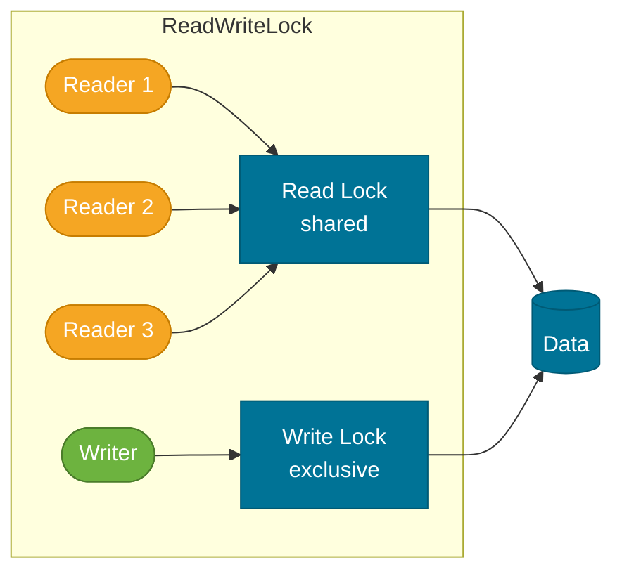

# Locks

> The `java.util.concurrent.locks` package provides explicit, flexible alternatives to `synchronized` — essential when you need timed lock attempts, interruptible waits, multiple conditions, or fine-grained read-write separation.

## What Problem Does It Solve?

The `synchronized` keyword is simple and sufficient for many use cases, but it has hard limitations:

- **No timeout**: If a thread tries to enter a `synchronized` block and the lock is held, it blocks indefinitely — you cannot attempt a lock and give up after a timeout.
- **Not interruptible**: A thread blocked waiting for an intrinsic lock cannot be interrupted; `Thread.interrupt()` has no effect while in `BLOCKED` state.
- **Single condition per monitor**: Every object has one wait set. You can't have separate "not full" and "not empty" wait sets on the same lock.
- **Exclusive-only**: `synchronized` gives one-thread-at-a-time access. For read-heavy data, this is overly strict — multiple readers can safely co-exist.

`java.util.concurrent.locks` solves all of these with `ReentrantLock`, `ReadWriteLock`, and `StampedLock`.

## ReentrantLock

`ReentrantLock` is a drop-in replacement for `synchronized` that unlocks all of the above limitations.

```java
import java.util.concurrent.locks.ReentrantLock;

class SafeCounter {
    private final ReentrantLock lock = new ReentrantLock();
    private int count = 0;

    public void increment() {
        lock.lock();           // ← acquire the lock
        try {
            count++;
        } finally {
            lock.unlock();     // ← ALWAYS unlock in finally — never skip this
        }
    }
}
```

:::danger
Always call `unlock()` inside `finally`. If the code between `lock.lock()` and `unlock()` throws an exception, a missing `finally` block leaves the lock permanently held, deadlocking every other thread that needs it.
:::

### Timed Lock Attempt

```java
if (lock.tryLock(500, TimeUnit.MILLISECONDS)) { // ← try to acquire; give up after 500ms
    try {
        doWork();
    } finally {
        lock.unlock();
    }
} else {
    // Lock not available — do fallback logic
    handleLockUnavailable();
}
```

### Interruptible Lock

```java
try {
    lock.lockInterruptibly(); // ← throws InterruptedException if thread is interrupted while waiting
    try {
        doWork();
    } finally {
        lock.unlock();
    }
} catch (InterruptedException e) {
    Thread.currentThread().interrupt(); // ← restore interrupted flag
    handleInterrupt();
}
```

### Fairness Mode

```java
ReentrantLock fairLock = new ReentrantLock(true); // ← fair: longest-waiting thread gets lock next
ReentrantLock unfairLock = new ReentrantLock(false); // ← default: higher throughput, no ordering guarantee
```

Fair mode prevents starvation but has lower throughput because threads must be scheduled in order. Use fair locks only when starvation is a real concern (e.g., long-lived background tasks competing with short-lived tasks).

### Multiple Conditions

```java
import java.util.concurrent.locks.*;

class BoundedBuffer<T> {
    private final ReentrantLock lock = new ReentrantLock();
    private final Condition notFull  = lock.newCondition(); // ← "has space" condition
    private final Condition notEmpty = lock.newCondition(); // ← "has data" condition
    private final Object[] items;
    private int count, putIdx, takeIdx;

    BoundedBuffer(int capacity) { items = new Object[capacity]; }

    public void put(T item) throws InterruptedException {
        lock.lock();
        try {
            while (count == items.length) notFull.await();  // ← wait on specific condition
            items[putIdx] = item;
            if (++putIdx == items.length) putIdx = 0;
            count++;
            notEmpty.signal(); // ← wake only consumers, not other producers
        } finally {
            lock.unlock();
        }
    }

    @SuppressWarnings("unchecked")
    public T take() throws InterruptedException {
        lock.lock();
        try {
            while (count == 0) notEmpty.await();            // ← wait on specific condition
            T item = (T) items[takeIdx];
            if (++takeIdx == items.length) takeIdx = 0;
            count--;
            notFull.signal(); // ← wake only producers, not other consumers
            return item;
        } finally {
            lock.unlock();
        }
    }
}
```

Multiple conditions let you signal only the threads that can actually make progress, avoiding the spurious wake-ups caused by `notifyAll()`.

## ReadWriteLock

`ReadWriteLock` has two locks: a **read lock** (shared) and a **write lock** (exclusive). Multiple threads can hold the read lock simultaneously; the write lock is exclusive.

```java
import java.util.concurrent.locks.*;

class CachedData {
    private final ReadWriteLock rwLock = new ReentrantReadWriteLock();
    private final Lock readLock  = rwLock.readLock();
    private final Lock writeLock = rwLock.writeLock();
    private Map<String, String> cache = new HashMap<>();

    public String get(String key) {
        readLock.lock();    // ← shared: many readers can hold this simultaneously
        try {
            return cache.get(key);
        } finally {
            readLock.unlock();
        }
    }

    public void put(String key, String value) {
        writeLock.lock();   // ← exclusive: blocks all readers and other writers
        try {
            cache.put(key, value);
        } finally {
            writeLock.unlock();
        }
    }
}
```



*ReadWriteLock — multiple readers proceed in parallel; a writer gets exclusive access, blocking all readers and other writers.*

`ReadWriteLock` is beneficial when:
- Reads are much more frequent than writes.
- Reads are non-trivial in duration, so reader-reader contention is real.

## StampedLock (Java 8+)

`StampedLock` is a more performant but more complex replacement for `ReadWriteLock`. It introduces **optimistic reads** — a mode that doesn't acquire a lock at all, instead returning a stamp that must be validated.

```java
import java.util.concurrent.locks.StampedLock;

class Point {
    private double x, y;
    private final StampedLock sl = new StampedLock();

    // Write: exclusive lock
    void move(double deltaX, double deltaY) {
        long stamp = sl.writeLock();
        try {
            x += deltaX;
            y += deltaY;
        } finally {
            sl.unlockWrite(stamp);
        }
    }

    // Optimistic read: no lock acquired
    double distanceFromOrigin() {
        long stamp = sl.tryOptimisticRead();      // ← returns a stamp; no lock taken
        double currentX = x, currentY = y;
        if (!sl.validate(stamp)) {                // ← check: did a write happen?
            stamp = sl.readLock();                // ← fall back to real read lock
            try {
                currentX = x;
                currentY = y;
            } finally {
                sl.unlockRead(stamp);
            }
        }
        return Math.sqrt(currentX * currentX + currentY * currentY);
    }
}
```

Optimistic reads assume no write occurred and validate at the end. If validation fails (a write happened during the read), it falls back to a real read lock. This gives outstanding performance when writes are rare.

:::warning
`StampedLock` is **not reentrant**. Calling `writeLock()` from a thread that already holds the write lock will deadlock. Use it only when you need maximum performance and understand the tradeoffs.
:::

## Comparison

| Feature | `synchronized` | `ReentrantLock` | `ReadWriteLock` | `StampedLock` |
|---------|---------------|-----------------|-----------------|---------------|
| Timed lock | No | Yes | Yes | Yes |
| Interruptible | No | Yes | Yes | Yes |
| Fair mode | No | Yes | Yes | No |
| Multiple conditions | No (one per object) | Yes | Yes | No |
| Read-write split | No | No | Yes | Yes |
| Optimistic read | No | No | No | Yes |
| Reentrant | Yes | Yes | Yes | No |
| Ease of use | Easiest | Moderate | Moderate | Complex |

## Best Practices

- **Default to `synchronized`** — it's simpler and less error-prone. Reach for `ReentrantLock` only when you need its extra capabilities.
- **Always unlock in `finally`** — every `lock()` must have a matching `unlock()` in a `finally` block.
- **Use `tryLock()` to avoid deadlock** — instead of blocking indefinitely, fail fast and retry or fallback.
- **Use `ReadWriteLock` for read-heavy, write-rare scenarios** — if writes are frequent, the overhead of tracking readers may cost more than it gives.
- **Avoid `StampedLock` for general use** — it is non-reentrant and requires careful validation logic. Use it only for performance-critical, well-tested code.

## Common Pitfalls

- **Not unlocking on exception**: Acquiring a `ReentrantLock` outside a `try/finally` block. If the code throws before `unlock()`, the lock is held forever.
- **Lock count mismatch with reentrant calls**: `ReentrantLock` counts reentrancy. If you call `lock()` 3 times, you must call `unlock()` 3 times. An asymmetric call permanently holds the lock.
- **Upgrading read to write lock in `ReadWriteLock`**: `ReentrantReadWriteLock` does not support lock upgrades. Releasing the read lock and acquiring the write lock is required, but now the data you read may have changed. Use `StampedLock` with `tryConvertToWriteLock()` if you need upgrades.
- **Using `StampedLock` reentrantly**: It silently deadlocks — there is no error, just a hang.

## Interview Questions

### Beginner

**Q:** What is `ReentrantLock` and how is it different from `synchronized`?
**A:** `ReentrantLock` is an explicit lock from `java.util.concurrent.locks` that provides everything `synchronized` does — mutual exclusion and memory visibility — plus extras: timed lock attempts (`tryLock`), interruptible waits (`lockInterruptibly`), fair mode, and multiple conditions. You manage `lock()`/`unlock()` manually (always in `try/finally`), whereas `synchronized` releases automatically.

### Intermediate

**Q:** When would you choose `ReadWriteLock` over a simple `ReentrantLock`?
**A:** When the data is read far more often than it is written and individual read operations are significant in duration. `ReadWriteLock` allows concurrent readers while still providing exclusive write access. If writes are frequent, the bookkeeping overhead outweighs the benefit.

**Q:** What is the difference between `Condition.await()` and `Object.wait()`?
**A:** They are equivalent in concept — both release the lock and wait for a signal. The key differences: (1) `Condition` is associated with a `ReentrantLock`, not an intrinsic lock; (2) you can have **multiple `Condition` objects per lock**, enabling selective signaling (e.g., signal only producers, not consumers); (3) `Condition.await()` can take a `TimeUnit` directly; (4) the method names are `await`/`signal`/`signalAll` instead of `wait`/`notify`/`notifyAll`.

### Advanced

**Q:** Explain optimistic reads in `StampedLock`. When do they improve performance?
**A:** An optimistic read via `tryOptimisticRead()` returns a stamp without acquiring any lock. The thread reads the shared data assuming no concurrent write is happening. After reading, it calls `validate(stamp)` — if no write occurred, the stamp is still valid and the read is complete at zero lock cost. If a write did occur, `validate` returns false and the thread falls back to a proper read lock. This is extremely fast when writes are rare (e.g., configuration caches) because the common path is lock-free. Under heavy write load, validation frequently fails and the fallback negates most of the benefit.

## Further Reading

- [java.util.concurrent.locks (Java 21 API)](https://docs.oracle.com/en/java/javase/21/docs/api/java.base/java/util/concurrent/locks/package-summary.html) — full package listing with detailed API contracts
- [Guide to java.util.concurrent.Locks](https://www.baeldung.com/java-concurrent-locks) — side-by-side comparison of all three lock types with examples
- [Guide to StampedLock](https://www.baeldung.com/java-stamped-lock) — optimistic read walkthrough and performance benchmarks

:::tip Practical Demo
See the [Locks Demo](./demo/locks-demo.md) for step-by-step runnable examples and exercises — `ReentrantLock`, `Condition`, tryLock patterns, and ReadWriteLock cache.
:::

## Related Notes

- [Synchronization](./synchronization.md) — understand intrinsic locks before moving to explicit locks
- [Wait / Notify](./wait-notify.md) — `Condition.await/signal` is the `ReentrantLock` equivalent of `Object.wait/notify`
- [Atomic Variables](./atomic-variables.md) — for simple counters and flags, atomics are lock-free and faster than any lock
