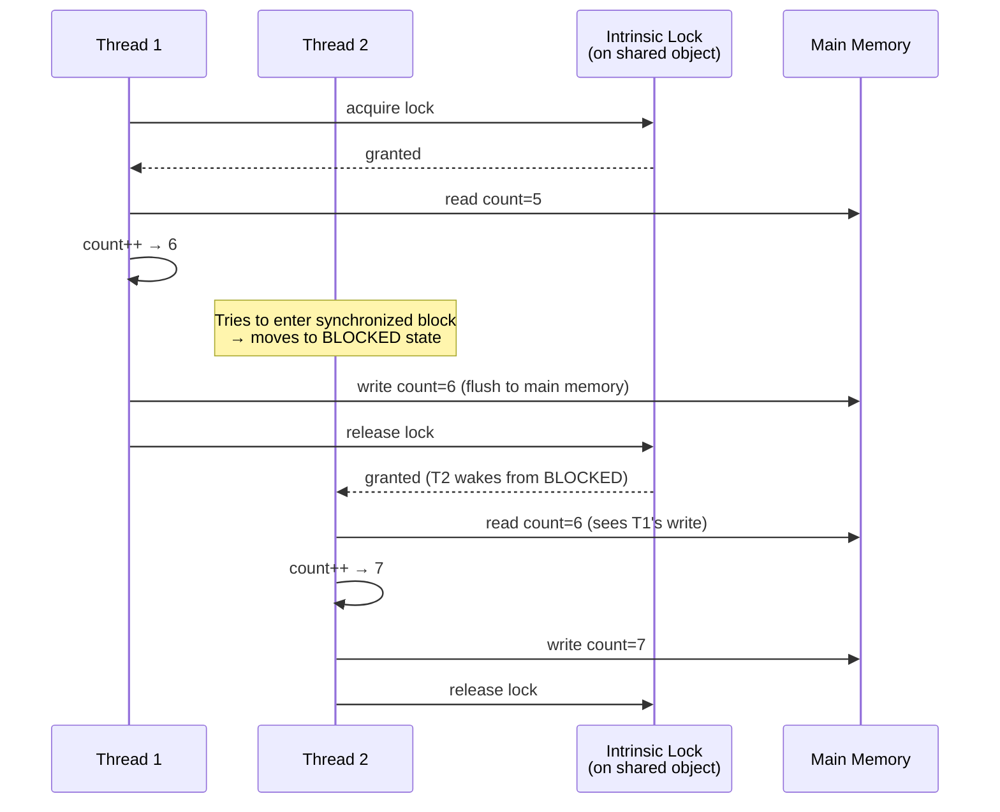

# Synchronization

> Synchronization is the mechanism that prevents multiple threads from corrupting shared data by ensuring only one thread at a time can execute a critical section.

## What Problem Does It Solve?

When two threads read and write the same variable without coordination, you get a **race condition** — the outcome depends on the unpredictable order of thread scheduling. A classic example:

```java
// Counter shared between 2 threads — BROKEN
class Counter {
    int count = 0; // ← shared mutable state, no protection
}

// Thread 1 and Thread 2 both do:
counter.count++; // ← this is NOT atomic! It's: read, increment, write
```

`count++` compiles to three bytecode instructions: load, increment, store. If Thread 1 reads `count = 5`, then Thread 2 also reads `count = 5` before Thread 1 writes back `6`, both threads write `6`, and one increment is **silently lost**. Run this with a million iterations per thread and the final count will be unpredictable — less than 2,000,000 every time.

Beyond race conditions, the JVM's memory model allows CPUs and compilers to **reorder instructions** and **cache values in CPU registers**, so even a simple read of a shared flag can return a stale value from another thread's perspective.

## synchronized

The `synchronized` keyword in Java provides two guarantees:
1. **Mutual exclusion** — only one thread can execute the synchronized block/method at a time.
2. **Visibility** — when a thread exits a synchronized block, its writes to shared variables are flushed and visible to the next thread that enters the same synchronized block.

Every Java object is associated with an **intrinsic lock** (also called a monitor). `synchronized` acquires this lock on entry and releases it on exit — including on exception.

### Synchronized Method

```java
class SafeCounter {
    private int count = 0;

    public synchronized void increment() { // ← acquires lock on 'this'
        count++;
    }

    public synchronized int getCount() {   // ← same lock, so reads are also safe
        return count;
    }
}
```

### Synchronized Block (more precise)

```java
class SafeCache {
    private final Map<String, String> cache = new HashMap<>();
    private final Object lock = new Object(); // ← explicit lock object, not 'this'

    public void put(String key, String value) {
        synchronized (lock) {            // ← acquire lock on 'lock' object
            cache.put(key, value);
        }                                // ← lock automatically released here
    }

    public String get(String key) {
        synchronized (lock) {
            return cache.get(key);
        }
    }
}
```

Synchronized blocks on an explicit `lock` object are preferred over `synchronized(this)` because:
- They expose only the minimum critical section (better performance).
- They prevent external code from accidentally locking on `this`.

### Static Synchronized Methods

```java
class Registry {
    private static int instanceCount = 0;

    public static synchronized void register() { // ← acquires lock on Registry.class object
        instanceCount++;
    }
}
```

Static synchronized methods lock on the **Class object**, not on an instance. Instance and static locks are completely independent — they do not block each other.

## How Synchronization Works



*How intrinsic locks serialize access — T2 sees T1's write because synchronized guarantees both mutual exclusion and memory visibility.*

## volatile

`volatile` is a lighter alternative to `synchronized` for simple visibility problems. A field declared `volatile`:
1. **Forces every read from main memory** — no CPU register or L1 cache caching.
2. **Forces every write directly to main memory** — flushed immediately, visible to all threads.
3. **Does NOT provide mutual exclusion** — multiple threads can still interleave reads and writes.

```java
class StatusChecker {
    private volatile boolean running = true; // ← volatile: threads always read fresh value

    public void stop() {
        running = false; // ← write is immediately visible to other threads
    }

    public void run() {
        while (running) { // ← reads from main memory every iteration
            doWork();
        }
    }
}
```

### `volatile` vs `synchronized`

| Feature | `volatile` | `synchronized` |
|---------|-----------|----------------|
| Mutual exclusion | No | Yes |
| Memory visibility | Yes | Yes |
| Atomicity | Only for reads/writes; not for compound ops (`i++`) | Yes (whole block) |
| Performance | Faster | Slower (lock acquire/release overhead) |
| Use case | Simple flag, single-writer variables | Compound operations, critical sections |

:::warning
`volatile` does **not** make `count++` thread-safe. That is a read-modify-write operation — three steps that can still be interleaved. Use `synchronized`, `AtomicInteger`, or `LongAdder` for compound operations.
:::

## The Happens-Before Relationship

The Java Memory Model (JMM) defines when a **write by Thread A is guaranteed to be visible to a read by Thread B** via a partial order called **happens-before**.

Key happens-before rules:
1. **Program order**: Each action in a thread happens-before every subsequent action in the same thread.
2. **Monitor lock**: An unlock of an intrinsic lock happens-before every subsequent lock of that same lock.
3. **Volatile write**: A write to a volatile field happens-before every subsequent read of that same field.
4. **Thread start**: `thread.start()` happens-before any action in the started thread.
5. **Thread join**: All actions in a thread happen-before `thread.join()` returns.


*Happens-before through a synchronized lock — Thread B is guaranteed to see Thread A's write to `x` because of the lock's happens-before edge.*

:::info
The happens-before relationship is what makes `volatile` and `synchronized` more than just "run slower" — they insert memory barriers that prevent CPU and compiler reordering.
:::

## Reentrancy

Java's intrinsic locks are **reentrant**: a thread that already holds a lock can acquire it again without deadlocking itself:

```java
class ReentrantExample {
    public synchronized void outer() {
        inner(); // ← calls another synchronized method on 'this'
    }

    public synchronized void inner() { // ← same lock as outer(), reentrant — no deadlock
        System.out.println("inner");
    }
}
```

This is essential for inheritance: if a subclass calls `super.method()` and both are `synchronized`, reentrancy prevents a self-deadlock.

## Liveness Problems

`synchronized` prevents race conditions but can introduce its own problems:

- **Deadlock**: Thread A holds lock X and waits for lock Y; Thread B holds lock Y and waits for lock X. Both wait forever.
- **Livelock**: Threads keep responding to each other's state changes but neither makes progress.
- **Starvation**: A thread never gets CPU time because higher-priority threads always get scheduled first.

```java
// Classic deadlock pattern — NEVER DO THIS
synchronized (lockA) {
    synchronized (lockB) { // ← Thread 1: A then B
        ...
    }
}

synchronized (lockB) {
    synchronized (lockA) { // ← Thread 2: B then A → potential deadlock
        ...
    }
}
```

Prevention: always acquire multiple locks in a **consistent global order**.

## Best Practices

- **Minimize the synchronized scope** — synchronize only the lines that access shared state, not an entire method.
- **Use an explicit private lock object** instead of `synchronized(this)` to prevent external lock interference.
- **Never call unknown methods while holding a lock** — if that method tries to acquire another lock, you risk deadlock.
- **Use `volatile` for simple, single-writer flags** — it is cheaper than `synchronized` and sufficient for stop-flags.
- **Prefer higher-level abstractions** (`java.util.concurrent` classes) over raw `synchronized` wherever possible.
- **Always lock and unlock in the same scope** — `synchronized` does this automatically; `ReentrantLock` does not.

## Common Pitfalls

- **Locking on different objects thinking it's the same lock**: Two instances of a class both using `synchronized(this)` — each has its own intrinsic lock, so they don't protect each other.
- **Double-checked locking without `volatile`**: The classic pre-Java-5 singleton bug. Without `volatile` on the instance field, the JMM allows the constructor's writes to be seen partially by another thread.
- **Assuming `synchronized` prevents all reordering**: It prevents reordering of accesses *across* the lock boundary, but code inside the synchronized block can still be reordered by the JIT.
- **Forgetting static methods use the class lock**: Instance methods lock on `this`; static methods lock on `MyClass.class`. They are independent and do not block each other.

## Interview Questions

### Beginner

**Q:** What does `synchronized` guarantee?
**A:** Two things: (1) **mutual exclusion** — only one thread can execute the synchronized block at a time, and (2) **memory visibility** — a thread that exits a synchronized block flushes its writes, and a thread entering the same synchronized block sees those writes.

**Q:** What is the difference between a synchronized method and a synchronized block?
**A:** A synchronized method locks on `this` (instance) or `MyClass.class` (static) for the entire method body. A synchronized block lets you specify any object as the lock and restricts locking to a subset of the method, giving finer granularity and better performance.

### Intermediate

**Q:** When should you use `volatile` instead of `synchronized`?
**A:** Use `volatile` when: (1) only visibility is needed (not mutual exclusion), (2) there is a single writer and multiple readers, and (3) the operation is a simple read or write, not a compound operation like `i++`. For compound operations or critical sections, use `synchronized` or `AtomicInteger`.

**Q:** What is the happens-before relationship?
**A:** It is a partial order defined by the Java Memory Model that guarantees when a write by one thread is visible to a read by another. Key rules: `synchronized` unlock happens-before the next lock on the same monitor; a `volatile` write happens-before subsequent reads of that variable; `thread.start()` happens-before actions in the new thread.

### Advanced

**Q:** Explain the double-checked locking pattern and why it requires `volatile`.
**A:** The pattern tries to avoid synchronizing on every singleton access:
```java
class Singleton {
    private static volatile Singleton instance; // ← volatile is mandatory

    public static Singleton getInstance() {
        if (instance == null) {              // ← first check (unsynchronized)
            synchronized (Singleton.class) {
                if (instance == null) {      // ← second check (inside lock)
                    instance = new Singleton();
                }
            }
        }
        return instance;
    }
}
```
Without `volatile`, the JIT can reorder the constructor writes and the assignment to `instance`. Another thread might see a non-null `instance` but read partially initialized fields. `volatile` inserts a memory barrier that prevents this reordering.

**Follow-up:** Is double-checked locking still preferred in modern Java?
**A:** For most use cases, prefer the **initialization-on-demand holder** pattern instead — it is simpler, correct without `volatile`, and just as lazy:
```java
class Singleton {
    private static class Holder {
        static final Singleton INSTANCE = new Singleton(); // ← initialized on first class load
    }
    public static Singleton getInstance() { return Holder.INSTANCE; }
}
```

## Further Reading

- [Synchronization (Oracle Tutorial)](https://docs.oracle.com/javase/tutorial/essential/concurrency/sync.html) — official walkthrough of synchronized methods, statements, and atomic access
- [JLS §17 — Threads and Locks](https://docs.oracle.com/javase/specs/jls/se21/html/jls-17.html) — the definitive specification of the Java Memory Model and happens-before
- [Guide to the Volatile Keyword in Java](https://www.baeldung.com/java-volatile) — practical examples of visibility and `volatile` behavior

:::tip Practical Demo
See the [Synchronization Demo](./demo/synchronization-demo.md) for step-by-step runnable examples and exercises — race-condition examples, synchronized fixes, and volatile flags.
:::

## Related Notes

- [Threads & Lifecycle](./threads-and-lifecycle.md) — you need to understand thread states before synchronization patterns make sense
- [Wait / Notify](./wait-notify.md) — the `Object.wait()` / `notify()` coordination mechanism builds directly on intrinsic locks
- [Locks](./locks.md) — `ReentrantLock` and `ReadWriteLock` offer explicit locking with more control than `synchronized`
- [Atomic Variables](./atomic-variables.md) — lock-free alternatives for simple compound operations like `count++`
