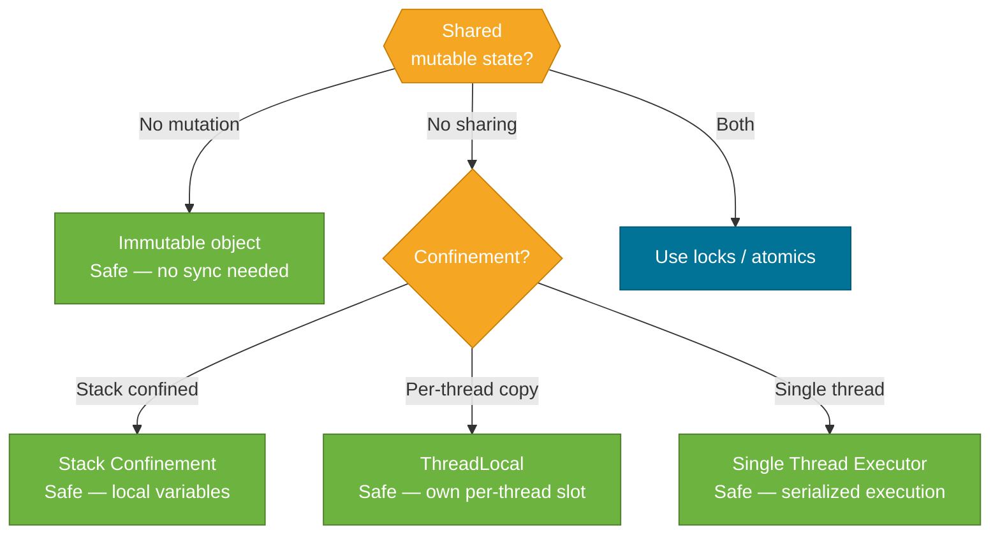

# Thread Safety Patterns

> The safest concurrency code is code that doesn't need synchronization at all — achieved through immutability, confinement, and careful object design.

## What Problem Does It Solve?

Locks, atomics, and `volatile` are all reactive tools: they compensate for shared mutable state. But shared mutable state is the root of every race condition, deadlock, and visibility bug. The cleanest solution is often to **eliminate sharing or mutation entirely**:

- If an object is **immutable**, multiple threads can read it simultaneously with no synchronization whatsoever.
- If state **never leaves the thread that created it**, there is no sharing — and no race condition possible.
- If an object is **published only after it is fully constructed**, readers always see a complete, consistent state.

These patterns — immutability, confinement, and safe publication — let you write concurrent code that is both correct and simple.

## Immutability

An immutable object's state cannot change after construction. Multiple threads can hold references to it and read it freely with zero synchronization.

### Making a Class Immutable

```java
public final class Money {            // ← final: cannot be subclassed and mutated
    private final long amount;        // ← final: value fixed at construction
    private final Currency currency;  // ← final: reference fixed; Currency itself immutable

    public Money(long amount, Currency currency) {
        this.amount = amount;
        this.currency = currency;
    }

    public long getAmount()       { return amount; }
    public Currency getCurrency() { return currency; }

    // "Mutation" returns a NEW object — original unchanged
    public Money plus(Money other) {
        if (!this.currency.equals(other.currency)) throw new IllegalArgumentException();
        return new Money(this.amount + other.amount, this.currency); // ← new instance
    }
}
```

Rules for a properly immutable class:
1. Class is `final` (prevents mutable subclasses).
2. All fields are `private final`.
3. If a field is a mutable type (array, collection), **defensive copy** on construction *and* in getters.
4. No setters or methods that modify state.

### Defensive Copying

```java
public final class Route {
    private final List<String> stops;

    public Route(List<String> stops) {
        this.stops = List.copyOf(stops); // ← defensive copy: caller's list changes don't affect us
    }

    public List<String> getStops() {
        return stops; // ← List.copyOf returns an unmodifiable list — safe to return directly
    }
}
```

:::tip
Use `List.copyOf()`, `Map.copyOf()`, `Set.copyOf()` (Java 10+) for clean, unmodifiable defensive copies. They also null-check their elements.
:::

### Effectively Immutable with Safe Publication

An object doesn't have to be deeply immutable if it is **published safely** and **never mutated after publication**:

```java
// Shared configuration — set once at startup, then read-only
public class AppConfig {
    private final Map<String, String> settings;

    public AppConfig(Map<String, String> source) {
        this.settings = Map.copyOf(source); // ← freeze contents at construction
    }

    public String get(String key) { return settings.get(key); }
}
```

## ThreadLocal

`ThreadLocal<T>` gives **each thread its own independent copy** of a variable. Threads never share the value — there is no shared state at all.

```java
// Each thread gets its own SimpleDateFormat (they are not thread-safe)
ThreadLocal<SimpleDateFormat> formatter = ThreadLocal.withInitial(
    () -> new SimpleDateFormat("yyyy-MM-dd") // ← lambda creates a fresh instance per thread
);

// Thread A calls this:
String formatted = formatter.get().format(new Date()); // ← Thread A's own SimpleDateFormat
// Thread B calls this simultaneously — gets Thread B's own instance, no contention
```

### Real-World Use: Request Context Holder

Spring Security's `SecurityContextHolder` and Spring's `RequestContextHolder` both use `ThreadLocal` internally to bind the current user/request to the thread handling it:

```java
class RequestContext {
    private static final ThreadLocal<String> currentUserId = new ThreadLocal<>();

    public static void set(String userId) {
        currentUserId.set(userId); // ← stored in this thread's slot
    }

    public static String get() {
        return currentUserId.get(); // ← reads this thread's slot
    }

    public static void clear() {
        currentUserId.remove(); // ← CRITICAL: prevents memory leaks in thread pools
    }
}

// In a servlet filter:
try {
    RequestContext.set(extractUserId(request));
    chain.doFilter(request, response);
} finally {
    RequestContext.clear(); // ← always clear — thread may be reused for the next request
}
```

:::danger
**Always call `ThreadLocal.remove()` when using thread pools.** In a pool, threads are reused. If you don't clear the `ThreadLocal` at the end of a request, the next request on the same thread will see the previous request's data — a serious data-leakage bug.
:::

### `InheritableThreadLocal`

```java
InheritableThreadLocal<String> tenantId = new InheritableThreadLocal<>();
tenantId.set("tenant-123");

Thread child = new Thread(() -> {
    System.out.println(tenantId.get()); // ← prints "tenant-123" — inherited from parent thread
});
child.start();
```

Child threads inherit the parent's `InheritableThreadLocal` values at the time of thread creation. Note: **virtual threads do not automatically inherit** InheritableThreadLocal values when submitted to an executor — use `ScopedValue` (Java 21+, preview) for structured propagation.

## Object Confinement

**Stack confinement** is the simplest form: an object that never escapes the method that created it is automatically thread-safe — no other thread can access it.

```java
public int computeSum(int[] input) {
    int[] temp = input.clone(); // ← temp is stack-confined: no other thread has a reference
    Arrays.sort(temp);
    return Arrays.stream(temp).sum(); // ← safely modified without synchronization
}
```

**Ad-hoc confinement** relies on developer discipline to ensure an object is never shared — tracked by documentation:

```java
// @GuardedBy from jcip-annotations documents the confinement contract
@GuardedBy("this")
private final List<Order> pendingOrders = new ArrayList<>();
```

## Safe Publication

Publishing an object safely means ensuring the object is **fully constructed** before any other thread can see it:

```java
// UNSAFE publication — background thread might see partially constructed Holder
class UnsafeHolder {
    public Resource resource; // ← non-final, non-volatile
    public UnsafeHolder(Resource r) { this.resource = r; }
}

// SAFE: final field — JMM guarantees all constructors writes are visible before the final field is read
class SafeHolder {
    public final Resource resource; // ← final guarantees safe publication
    public SafeHolder(Resource r) { this.resource = r; }
}
```

The JMM guarantees that a **`final` field** is fully visible to all threads after the constructor exits, without any synchronization. This is the foundation of immutable object thread safety.

Safe publication mechanisms (any of these guarantees full visibility):
- Assign to a `final` field.
- Assign to a `volatile` field.
- Assign inside a `synchronized` block.
- Put into a concurrent collection (`ConcurrentHashMap`, `BlockingQueue`).

## Comparison



*Decision tree for thread safety strategy — eliminate sharing or mutation before reaching for locks.*

## Best Practices

- **Design for immutability first** — make all fields `final` and avoid setters. Mutate by creating new instances.
- **Use `List.of()`, `Map.of()`, `Set.of()` (Java 9+)** for inline collection literals — they are unmodifiable by default.
- **Use `List.copyOf()` in constructors and getters** when accepting or returning collections.
- **Always `remove()` from `ThreadLocal` in thread pools** — put it in a `finally` block or use try-with-resources.
- **Document confinement intent** with `@GuardedBy` or comments — ad-hoc confinement easily breaks under refactoring.

## Common Pitfalls

- **Returning mutable internal state**: `public List<String> getItems() { return items; }` — the caller can mutate the list. Return `Collections.unmodifiableList(items)` or `List.copyOf(items)`.
- **ThreadLocal in thread pools without cleanup**: Next request inherits the previous request's data. Always clear in `finally`.
- **Non-final publish**: Assigning an object to a non-`volatile`, non-`final` field from one thread and reading it from another without synchronization. The receiving thread may observe a partially constructed object.
- **Mutable fields in "immutable" classes**: A class with `private final List<String> data` is not immutable if `data` can be modified through the list reference. Wrap with `Collections.unmodifiableList()` or use `List.copyOf()`.
- **Inheriting ThreadLocal into virtual threads via executor**: When you submit tasks to `ExecutorService` using virtual threads, `InheritableThreadLocal` does not propagate correctly across executor boundaries. Use `ScopedValue` (Java 21+) for structured context propagation.

## Interview Questions

### Beginner

**Q:** What makes a class immutable in Java?
**A:** A class is immutable when its state cannot change after construction. Requirements: (1) class declared `final`, (2) all fields `private final`, (3) no setters, (4) mutable fields defensively copied in constructor and getters, (5) no methods return writable references to internal mutable state. Immutable objects are inherently thread-safe.

**Q:** What is `ThreadLocal`?
**A:** `ThreadLocal<T>` gives each thread its own independent copy of a variable. Threads read and write their own slot — there is no sharing between threads, so no synchronization is needed. Common uses: per-thread non-thread-safe objects (e.g., `SimpleDateFormat`), and request-scoped context holders (e.g., `SecurityContextHolder` in Spring Security).

### Intermediate

**Q:** What is the memory leak risk with `ThreadLocal` in thread pools?
**A:** Thread pool threads are reused across requests. If you call `ThreadLocal.set()` but never call `ThreadLocal.remove()`, the value survives into the next request on that thread. The reference in the thread's `ThreadLocalMap` stays alive, potentially preventing GC of the stored object and leaking the previous request's data to the next. Always call `remove()` in a `finally` block.

**Q:** What is "safe publication" and why does it matter?
**A:** Safe publication ensures that when a reference to an object is made visible to another thread, that thread sees the object in a fully constructed state. Without it, the JVM's memory model allows writes in the constructor to be reordered, so another thread might see the object with default-valued fields. Safe publication strategies include assigning to a `final` or `volatile` field, synchronizing on publication, or using a concurrent collection.

### Advanced

**Q:** Why can't a subclass break the thread-safety of an immutable class, and how does `final` prevent it?
**A:** Without `final` on the class, a subclass can add mutable fields or override methods, creating a mutable version of what appeared to be immutable. When code expects an immutable `Money` but receives a mutable `MutableMoney extends Money`, thread-safety breaks. Declaring the class `final` prevents all subclassing, ensuring the immutability contract cannot be broken by inheritance.

**Follow-up:** Are records immutable in Java?
**A:** Record components are `final` and records cannot be subclassed (records are implicitly `final`). So a record with only primitive or immutable components is immutable. However, a record with a mutable component (e.g., `record Holder(List<String> items) {}`) is not deeply immutable — callers can modify the list. Apply `List.copyOf()` in a compact constructor to make it fully immutable.

## Further Reading

- [ThreadLocal (Java 21 API)](https://docs.oracle.com/en/java/javase/21/docs/api/java.base/java/lang/ThreadLocal.html) — official API with notes on use in thread pools
- [Guide to ThreadLocal in Java](https://www.baeldung.com/java-threadlocal) — practical examples including Spring Security context holder
- [How to Create an Immutable Class in Java](https://www.baeldung.com/java-immutable-object) — step-by-step guide with defensive copy examples

:::tip Practical Demo
See the [Thread Safety Patterns Demo](./demo/thread-safety-patterns-demo.md) for step-by-step runnable examples and exercises — immutability, defensive copying, and ThreadLocal cleanup patterns.
:::

## Related Notes

- [Synchronization](./synchronization.md) — when confinement and immutability are not possible, synchronized is the next layer
- [Atomic Variables](./atomic-variables.md) — lock-free, non-blocking alternative to synchronized for single-variable state
- [Virtual Threads (Java 21+)](./virtual-threads.md) — `ScopedValue` replaces `ThreadLocal` as the context propagation mechanism for structured-concurrency virtual thread code
