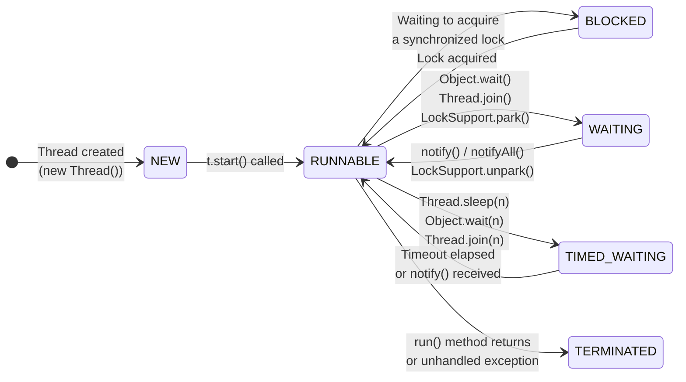

# Threads & Lifecycle

> A thread is the smallest unit of execution in the JVM — understanding its lifecycle is the foundation for every other concurrency topic.

## What Problem Does It Solve?

Early programs ran as a single sequence of instructions: one thing at a time, from top to bottom. This works fine for simple scripts but collapses under real-world demand:

- A web server handling one request at a time would make all other users wait.
- A GUI that reads a large file on the main thread freezes the entire interface.
- A batch job that could process records in parallel instead processes them serially, wasting CPU cores.

Threads solve this by letting a single JVM process run **multiple code paths concurrently**, sharing memory but executing independently. The operating system (and JVM scheduler) interleave these threads across CPU cores, allowing true parallelism on multi-core machines and apparent concurrency on single-core ones.

## What Is It?

A **thread** is an independent path of execution within a process. Every Java program starts with at least one thread: the **main thread**, which runs the `main()` method. You can create additional threads to run code in parallel.

Threads within the same process share:
- **Heap memory** (objects, static fields)
- **Open file handles and network sockets**

Each thread has its own:
- **Stack** — its own call frames, local variables, and return addresses
- **Program counter** — tracks which instruction it is currently executing

:::info
This shared-heap, separate-stack model is what makes threading both powerful (easy communication) and dangerous (race conditions, data corruption).
:::

## Code Examples

:::tip Practical Demo
See the [Threads & Lifecycle Demo](./demo/threads-and-lifecycle-demo.md) for step-by-step runnable examples and exercises — thread creation, join/interrupt patterns, and daemon behavior.
:::

Java provides three core ways to create a thread:

### 1. Extend `Thread`

```java
class PrintTask extends Thread {
    private final String message;

    PrintTask(String message) {
        this.message = message;
    }

    @Override
    public void run() {
        System.out.println(Thread.currentThread().getName() + ": " + message);
    }
}

// Usage
Thread t = new PrintTask("Hello from thread");
t.start(); // ← start() creates the OS thread and calls run(); never call run() directly
```

### 2. Implement `Runnable` (preferred over extending `Thread`)

```java
Runnable task = () -> System.out.println("Running in: " + Thread.currentThread().getName());

Thread t = new Thread(task, "my-thread"); // ← second arg sets thread name for debugging
t.start();
```

`Runnable` is preferred because:
- A class can implement `Runnable` while still extending another class.
- It cleanly separates the **task** (what to do) from the **execution mechanism** (the thread).

### 3. Use `Callable` + `ExecutorService` (modern idiomatic approach)

```java
import java.util.concurrent.*;

ExecutorService executor = Executors.newFixedThreadPool(4); // ← pool of 4 threads
Future<Integer> future = executor.submit(() -> {
    Thread.sleep(100);
    return 42; // ← Callable returns a result; Runnable cannot
});

int result = future.get(); // ← blocks until the task completes
executor.shutdown();       // ← always shut down the executor when done
```

:::tip
In production Spring Boot applications you almost never create threads directly — you use `ExecutorService`, `@Async`, or virtual threads. Direct `new Thread(...)` is mostly for learning and low-level utilities.
:::

## How It Works

A Java thread moves through six states defined in `Thread.State`:



*Thread lifecycle state machine — a thread can only move to TERMINATED once, and a terminated thread cannot be restarted.*

| State | Meaning |
|-------|---------|
| `NEW` | Thread object created but `start()` not yet called. |
| `RUNNABLE` | Ready to run or actively running on a CPU core. |
| `BLOCKED` | Waiting to acquire an intrinsic (synchronized) lock held by another thread. |
| `WAITING` | Waiting indefinitely for another thread to signal it. |
| `TIMED_WAITING` | Waiting with a timeout — will auto-resume when the timer expires. |
| `TERMINATED` | `run()` has returned (normally or via exception). |

:::warning
`RUNNABLE` does not mean the thread is *currently* running — it means it is **eligible** to run. The scheduler decides when it actually gets CPU time. A thread can be in `RUNNABLE` but parked waiting for I/O.
:::

## Key Thread Methods

### `start()` vs `run()`

```java
Thread t = new Thread(() -> System.out.println("task"));

t.run();   // ← WRONG: runs task on the current thread, no new thread is created
t.start(); // ← CORRECT: creates a new OS thread and calls run() on it
```

### `join()`

```java
Thread worker = new Thread(() -> {
    // expensive computation
    compute();
});
worker.start();
worker.join(); // ← current thread blocks until worker finishes
System.out.println("Worker done"); // ← guaranteed to print after compute()
```

### `interrupt()`

```java
Thread worker = new Thread(() -> {
    while (!Thread.interrupted()) { // ← checks the interrupted flag
        doWork();
    }
    System.out.println("Gracefully stopped");
});

worker.start();
// Later...
worker.interrupt(); // ← sets the interrupted flag; doesn't forcibly stop the thread
```

:::danger
Never use `Thread.stop()` — it is deprecated and unsafe. It releases all locks held by the thread, potentially leaving shared data in an inconsistent state. Always use an interruption flag or a `volatile boolean` flag for cooperative cancellation.
:::

### `sleep()`

```java
try {
    Thread.sleep(1000); // ← pauses current thread for ~1 second (TIMED_WAITING state)
} catch (InterruptedException e) {
    Thread.currentThread().interrupt(); // ← restore the interrupted flag; never swallow it
    throw new RuntimeException("Task interrupted", e);
}
```

## Thread Naming & Daemon Threads

```java
Thread t = new Thread(task);
t.setName("data-processor-1"); // ← meaningful names appear in stack traces and monitoring tools

t.setDaemon(true); // ← daemon threads are killed when all non-daemon threads finish
t.start();
```

**Daemon threads** are background service threads (e.g., the GC thread). The JVM exits when only daemon threads remain, even if they are still running. User threads (non-daemon) keep the JVM alive.

## Trade-offs & When To Use / Avoid

| Option | When To Use | When To Avoid |
|--------|-------------|---------------|
| `new Thread(...)` | Simple experiments, short-lived low-scale tasks, learning | Production servers; poor lifecycle and pooling control |
| `ExecutorService` (thread pools) | Server apps, bounded concurrency, lifecycle management, thread reuse | When you need per-task isolation without pooling overhead (consider virtual threads) |
| Virtual threads (Java 21+) | Massive numbers of short-blocking tasks, I/O-heavy workloads | When native libraries require thread-local state or heavy pinning; prefer platform threads for CPU-bound long-running tasks |

Use the pattern that matches your workload: prefer executors for managed production concurrency, virtual threads for scaling many blocking tasks, and avoid raw `new Thread` in server-side code.

## Best Practices

- **Name your threads** — "order-processor" is infinitely more debuggable than "Thread-7" in a heap dump.
- **Prefer `Runnable` over extending `Thread`** — separation of task from execution mechanism.
- **Use `ExecutorService` in production** — direct thread creation bypasses lifecycle management and thread pools.
- **Always handle `InterruptedException` correctly** — re-interrupt the thread (`Thread.currentThread().interrupt()`) rather than swallowing the exception.
- **Never call `run()` directly** — always call `start()` to create a real OS thread.
- **Avoid `Thread.stop()`, `Thread.suspend()`, `Thread.resume()`** — all deprecated and unsafe.

## Common Pitfalls

- **Calling `run()` instead of `start()`**: The code runs, but on the current thread — no parallelism, no new OS thread. This is a silent logic bug.
- **Swallowing `InterruptedException`**: `catch (InterruptedException e) { /* ignore */ }` discards the shutdown signal. The thread will never honor cancellation requests.
- **Not calling `executor.shutdown()`**: The JVM won't exit normally because the thread pool's non-daemon threads keep it alive.
- **Expecting `join()` to have a timeout**: `join()` without argument blocks forever if the worker never finishes. Always prefer `join(timeoutMs)` in production.
- **Race conditions on shared mutable state**: Creating threads and accessing shared fields without synchronization leads to unpredictable results. This is covered in detail in [Synchronization](./synchronization.md).

## Interview Questions

### Beginner

**Q:** What is a thread in Java?
**A:** A thread is an independent path of execution within a Java process. All threads in the same process share heap memory but each has its own call stack. The JVM starts with a single main thread and you can create additional threads to run code concurrently.

**Q:** What is the difference between `start()` and `run()`?
**A:** `start()` creates a new OS-level thread and then calls `run()` on it. Calling `run()` directly executes the method on the current thread — no new thread is created. You must always use `start()` to achieve actual concurrency.

**Q:** What are the thread lifecycle states in Java?
**A:** Six states: `NEW` (created but not started), `RUNNABLE` (eligible to run or running), `BLOCKED` (waiting for a lock), `WAITING` (waiting indefinitely for a signal), `TIMED_WAITING` (waiting with a timeout), and `TERMINATED` (finished).

### Intermediate

**Q:** What is the difference between `Runnable` and `Callable`?
**A:** `Runnable.run()` returns void and cannot throw checked exceptions. `Callable.call()` returns a result (`Future<V>`) and can throw checked exceptions. Use `Callable` when you need the result of a concurrent computation; use `Runnable` for fire-and-forget tasks.

**Q:** What is a daemon thread? When would you use one?
**A:** A daemon thread is a background thread that the JVM will kill when all user (non-daemon) threads finish. Use daemon threads for background services that should not keep the JVM alive — for example, a cache-cleanup scheduler or a monitoring heartbeat thread.

**Q:** How do you gracefully stop a thread?
**A:** Never use `Thread.stop()` (deprecated). Instead, either: (1) call `thread.interrupt()` and check `Thread.interrupted()` / handle `InterruptedException` in the thread's loop, or (2) use a `volatile boolean` stop flag that the thread periodically checks.

### Advanced

**Q:** Explain the difference between `BLOCKED` and `WAITING` states.
**A:** `BLOCKED` means the thread is trying to enter a `synchronized` block/method but another thread holds the intrinsic lock — it will automatically become `RUNNABLE` once the lock is released. `WAITING` means the thread voluntarily gave up CPU via `Object.wait()`, `Thread.join()`, or `LockSupport.park()` — it will only resume when explicitly notified via `notify()`/`notifyAll()`/`LockSupport.unpark()`. `BLOCKED` is about lock contention; `WAITING` is about explicit coordination.

**Follow-up:** Why is it important to always call `wait()` inside a loop?
**A:** Because of **spurious wakeups** — a thread can wake up from `WAITING` without `notify()` being called. The loop re-checks the condition and calls `wait()` again if it is not yet satisfied:
```java
synchronized (lock) {
    while (!conditionMet) { // ← loop, not if
        lock.wait();
    }
}
```

## Further Reading

- [Thread (Java 21 API docs)](https://docs.oracle.com/en/java/javase/21/docs/api/java.base/java/lang/Thread.html) — full API reference including virtual thread factory methods
- [Java Concurrency Tutorial](https://docs.oracle.com/javase/tutorial/essential/concurrency/) — Oracle's official tutorial covering threads, synchronization, and high-level concurrency objects
- [Guide to the Java Thread Lifecycle](https://www.baeldung.com/java-thread-lifecycle) — practical examples of each state transition

## Related Notes
- [Synchronization](./synchronization.md) — the next step: once you have threads, you need to coordinate access to shared state
- [java.util.concurrent](./java-util-concurrent.md) — `ExecutorService` is the production-grade replacement for creating threads manually
- [Virtual Threads (Java 21+)](./virtual-threads.md) — Java 21's lightweight threads that eliminate the scalability ceiling of platform threads
