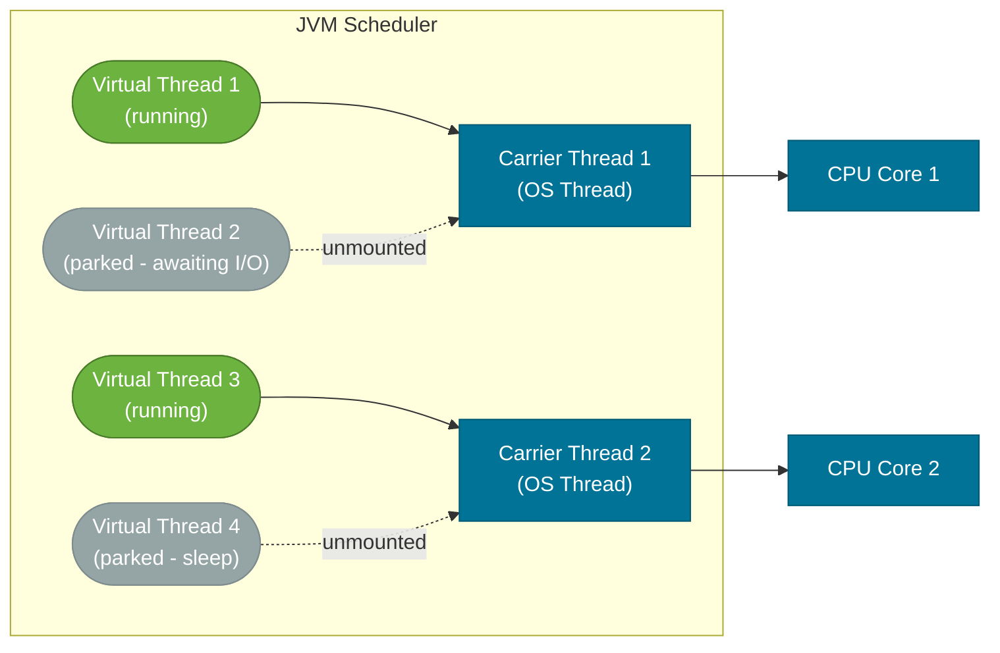

# Virtual Threads (Java 21+)

> Virtual threads are JVM-managed, extremely lightweight threads that allow you to write blocking-style code that scales like async code — without callbacks, reactive frameworks, or mental overhead.

## What Problem Does It Solve?

Traditional server applications face a fundamental tension between **simplicity** and **scalability**:

**Thread-per-request** (simple): Assign one OS (platform) thread to every incoming HTTP request. The code is sequential and easy to read. But platform threads are expensive — each requires ~512 KB–2 MB of OS stack. A server with 10,000 concurrent requests needs 10,000 platform threads, quickly exhausting memory. Typical servers are capped at a few hundred to a few thousand threads.

**Async/reactive** (scalable): Handle thousands of requests on a small thread pool by making every blocking call non-blocking (callbacks, `CompletableFuture`, Reactor, RxJava). The code scales well but becomes deeply fragmented — a single logical request is split across dozens of callback lambdas, making debugging, exception handling, and profiling extremely hard.

Virtual threads (Project Loom, GA in Java 21) solve this by making the JVM itself handle the scheduling: blocking a virtual thread is cheap because the JVM unmounts it from the underlying OS thread, freeing that OS thread for another virtual thread. **You write blocking code; the JVM turns it into non-blocking execution.**

## What Are Virtual Threads?

A **virtual thread** is a thread managed entirely by the JVM rather than the OS. It is not mapped 1:1 to an OS thread. Instead:

- Many virtual threads are **multiplexed** onto a small pool of **carrier threads** (platform threads managed by the JVM).
- When a virtual thread hits a blocking operation (I/O, `Thread.sleep()`, `wait()`), the JVM **unmounts** it from the carrier thread, allowing another virtual thread to mount and run.
- When the blocking operation completes, the virtual thread is **remounted** onto a (potentially different) carrier thread and continues.



*Virtual threads multiplexed over carrier threads — parking a virtual thread frees the carrier for another task; the OS only sees the small number of carrier threads.*

Key numbers: 
- A carrier thread pool defaults to `Runtime.availableProcessors()` (typically 8–128).
- Virtual threads can number in the **millions** with minimal memory — each has a small, growable stack starting at ~few hundred bytes.

## Creating Virtual Threads

:::tip Practical Demo
See the [Virtual Threads Demo](./demo/virtual-threads-demo.md) for step-by-step runnable examples and exercises — creating virtual-thread executors, scalability comparisons, and pinning detection.
:::

```java
// Option 1: Thread.ofVirtual() — mirrors Thread.ofPlatform() API
Thread vt = Thread.ofVirtual()
    .name("handler-", 0)           // ← numbered names: handler-0, handler-1, ...
    .start(() -> handleRequest());

// Option 2: Thread.startVirtualThread() — shorthand
Thread t = Thread.startVirtualThread(() -> processOrder(order));

// Option 3: ExecutorService (recommended for production)
try (ExecutorService executor = Executors.newVirtualThreadPerTaskExecutor()) {
    // ← try-with-resources is supported in Java 21 for executor shutdown
    for (Request req : requests) {
        executor.submit(() -> handle(req)); // ← one virtual thread per task
    }
} // ← automatically shuts down and waits for all tasks

// Option 4: Thread.Builder for factory
ThreadFactory factory = Thread.ofVirtual().name("worker-", 0).factory();
Thread t2 = factory.newThread(task);
```

## Spring Boot Integration

Spring Boot 3.2+ supports virtual threads with a single configuration property:

```yaml
# application.yaml
spring:
  threads:
    virtual:
      enabled: true  # ← all async tasks and request threads use virtual threads
```

Or explicitly with a bean:

```java
@Configuration
public class VirtualThreadConfig {

    @Bean
    public TomcatProtocolHandlerCustomizer<?> virtualThreadCustomizer() {
        return handler -> handler.setExecutor(
            Executors.newVirtualThreadPerTaskExecutor() // ← each HTTP request on its own virtual thread
        );
    }
}
```

With virtual threads enabled, you can write straightforward blocking database and HTTP code in a Spring service method, and it will scale to thousands of concurrent requests without thread pool exhaustion.

## Pinning

**Pinning** is the critical limitation of virtual threads: a virtual thread becomes **pinned** to its carrier thread (cannot be unmounted) when:

1. It is inside a `synchronized` block or method.
2. It is inside a native method or JNI call.

While pinned, the carrier thread is blocked — defeating the purpose of virtual threads.

```java
// PINNED — synchronized prevents unmounting
public synchronized void doWork() {
    Thread.sleep(1000); // ← virtual thread CANNOT unmount here; carrier is blocked
}

// NOT PINNED — ReentrantLock allows unmounting
private final ReentrantLock lock = new ReentrantLock();

public void doWork() throws InterruptedException {
    lock.lock();
    try {
        Thread.sleep(1000); // ← virtual thread CAN unmount here; carrier is freed
    } finally {
        lock.unlock();
    }
}
```

:::warning
If your application uses many `synchronized` blocks with blocking I/O inside them, virtual threads gain little. Audit hot paths and migrate `synchronized` sections that contain I/O to `ReentrantLock`. Most JDBC drivers and common libraries have been updated to avoid pinning in Java 21+.
:::

You can detect pinning by running with:
```bash
-Djdk.tracePinnedThreads=full
```

## Structured Concurrency (Preview — Java 21)

Structured concurrency (`java.util.concurrent.StructuredTaskScope`) is a companion to virtual threads that makes forking subtasks safe and clear:

```java
import java.util.concurrent.StructuredTaskScope;

try (var scope = new StructuredTaskScope.ShutdownOnFailure()) {
    StructuredTaskScope.Subtask<User> userTask = scope.fork(() -> fetchUser(userId));
    StructuredTaskScope.Subtask<Orders> ordersTask = scope.fork(() -> fetchOrders(userId));

    scope.join();           // ← wait for both subtasks
    scope.throwIfFailed();  // ← if either failed, throw the first exception

    return new Response(userTask.get(), ordersTask.get());
}
// ← scope closes: both subtasks are guaranteed to be done or cancelled
```

The key guarantee: **when the `try` block exits (normally or via exception), all subtasks are joined or cancelled**. This eliminates dangling background threads — the root cause of many async code bugs.

## Virtual Thread vs Platform Thread

| | Platform Thread | Virtual Thread |
|--|----------------|---------------|
| Managed by | OS | JVM |
| Stack size | 512 KB – 2 MB fixed | ~few hundred bytes, growable |
| Creation cost | High (~milliseconds) | Near zero |
| Practical limit | Thousands | Millions |
| Blocking cost | Blocks OS thread | Unmounts; carrier freed |
| Thread pools needed | Yes — expensive to create | No — create one-per-task freely |
| `ThreadLocal` | Works | Works (but large `ThreadLocal` values × millions of threads = memory risk) |
| `synchronized` pinning | N/A | Pins carrier thread — use `ReentrantLock` instead |
| CPU-bound tasks | Excellent | No benefit — use platform threads or ForkJoinPool |

:::info
Virtual threads are not faster for **CPU-bound** work (no I/O, no blocking). They help exclusively with **I/O-bound** workloads where threads spend most of their time waiting. For parallel computation, `ForkJoinPool` remains the right tool.
:::

## Best Practices

- **Use `Executors.newVirtualThreadPerTaskExecutor()` instead of fixed thread pools for I/O-bound tasks** — there is no longer a reason to size a thread pool for I/O tasks.
- **Avoid caching virtual threads** — they are disposable; create one per task and let it finish. Thread pools are for platform threads.
- **Replace `synchronized` with `ReentrantLock`** in paths that do I/O or call `Thread.sleep()` to avoid pinning.
- **Keep `ThreadLocal` values small** — with millions of virtual threads, large `ThreadLocal` objects multiply into large memory footprint. Use `ScopedValue` (preview in Java 21) for immutable per-task context instead.
- **Test with `-Djdk.tracePinnedThreads=full`** during development to catch pinning in hot paths.
- **Enable virtual threads in Spring Boot 3.2+** with a single property; don't convert all code manually.

## Common Pitfalls

- **Using virtual threads for CPU-bound work expecting a speedup**: Virtual threads don't parallelize CPU work — that requires more carrier threads (more cores). ForkJoinPool is designed for that.
- **Pinning in `synchronized` blocks with blocking I/O**: Your code appears to work correctly but doesn't scale. Use `ReentrantLock` or migrate to a library that doesn't pin.
- **Storing large objects in `ThreadLocal` with virtual threads**: With a million threads, a 10 KB `ThreadLocal` value costs 10 GB. Prefer `ScopedValue` for immutable context.
- **Thread identity assumptions**: Virtual threads have names like `VirtualThread[#42]/runnable@ForkJoinPool-1-worker-1`. Code that parses thread names (e.g., some MDC/logging frameworks) may behave unexpectedly.

## Interview Questions

### Beginner

**Q:** What are virtual threads in Java?
**A:** Virtual threads (introduced in Java 21 via Project Loom) are JVM-managed threads that are not 1:1 mapped to OS threads. The JVM multiplexes many virtual threads over a small pool of OS carrier threads. When a virtual thread blocks on I/O, the JVM unmounts it from its carrier (freeing the carrier for another task), and remounts it when the blocking operation completes. This allows millions of concurrent virtual threads with minimal memory.

**Q:** When should you use virtual threads over platform threads?
**A:** Virtual threads shine for I/O-bound, high-concurrency workloads — HTTP servers handling thousands of concurrent requests, applications with blocking database calls, microservices doing many parallel network calls. For CPU-bound work (no blocking), they offer no advantage; use `ForkJoinPool` or platform thread pools instead.

### Intermediate

**Q:** What is thread pinning in virtual threads and how do you avoid it?
**A:** Pinning occurs when a virtual thread cannot be unmounted from its carrier thread while blocked — specifically inside a `synchronized` block/method or a native (JNI) call. While pinned, the carrier OS thread is also blocked, negating the scalability benefit. To avoid it: replace `synchronized` with `ReentrantLock` in any code path that does blocking I/O or calls `Thread.sleep()`.

**Q:** How does Spring Boot support virtual threads?
**A:** Spring Boot 3.2+ introduced first-class support. Setting `spring.threads.virtual.enabled=true` in `application.yaml` (or properties) configures the embedded Tomcat/Jetty/Undertow, `@Async` tasks, and `@Scheduled` tasks to use a virtual thread executor. This means every HTTP request and async task runs on its own virtual thread — no thread pool sizing required for I/O-bound applications.

### Advanced

**Q:** Explain how structured concurrency (StructuredTaskScope) improves on CompletableFuture for parallel subtasks.
**A:** `CompletableFuture.allOf()` has a key problem: if you cancel the overall computation, the subtasks may continue running as orphaned background tasks. There is no automatic lifecycle linkage. `StructuredTaskScope` enforces **containment**: subtasks are children of the scope, and when the scope closes (success, exception, or timeout), all in-flight subtasks are cancelled and joined before the scope's `try` block exits. This prevents resource leaks, dangling threads, and makes stack traces coherent (subtask exceptions have the right context). It also aligns concurrency with lexical scope — just like how a `try` block contains its resources.

**Follow-up:** How do `ScopedValue` and `ThreadLocal` differ for context propagation in virtual thread code?
**A:** `ThreadLocal` is mutable and must be manually removed to prevent leaks. In virtual thread code where you create millions of threads, forgetting `remove()` is costly. `ScopedValue` (preview in Java 21) is **immutable** and **scoped** — it is bound for a specific code block and automatically unbound when the block exits, with no cleanup required. It also propagates correctly into child threads created by `StructuredTaskScope`. For new virtual-thread code, prefer `ScopedValue` for request/task context.

## Further Reading

- [JEP 444: Virtual Threads (Java 21)](https://openjdk.org/jeps/444) — the official JEP with design rationale, examples, and known limitations
- [Virtual Thread API (Java 21)](https://docs.oracle.com/en/java/javase/21/docs/api/java.base/java/lang/Thread.html) — `Thread.ofVirtual()`, `Thread.startVirtualThread()`, `Thread.isVirtual()` API docs
- [Virtual Threads in Java](https://www.baeldung.com/java-virtual-thread-vs-thread) — practical comparison with platform threads and pinning examples
- [Structured Concurrency in Java 21](https://www.baeldung.com/java-21-structured-concurrency) — `StructuredTaskScope` walkthrough

## Related Notes

- [Threads & Lifecycle](./threads-and-lifecycle.md) — understand platform thread limitations to appreciate the virtual thread breakthrough
- [java.util.concurrent](./java-util-concurrent.md) — `Executors.newVirtualThreadPerTaskExecutor()` integrates virtual threads with the existing executor framework
- [Locks](./locks.md) — replace `synchronized` with `ReentrantLock` to eliminate pinning in virtual-thread code
- [Thread Safety Patterns](./thread-safety-patterns.md) — `ScopedValue` (Java 21+ preview) supersedes `ThreadLocal` for context propagation in virtual-thread code
