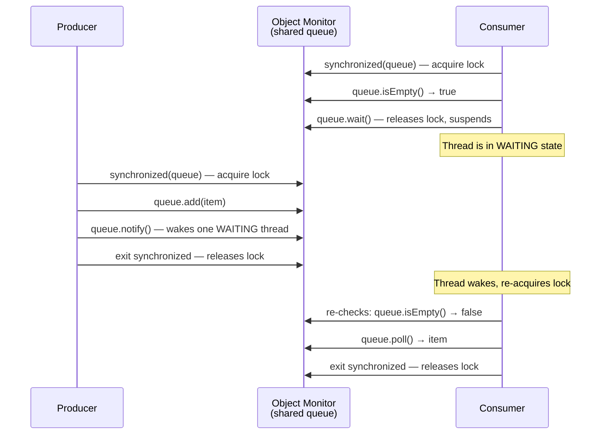

# Wait / Notify

> `wait()` and `notify()` are Java's built-in mechanism for one thread to pause and wait for a condition set by another thread — the foundation of producer-consumer coordination.

## What Problem Does It Solve?

Threads often need to **coordinate**: one thread produces data, another consumes it. The naïve approach is to have the consumer spin in a loop checking whether data is available:

```java
// Busy-waiting — TERRIBLE
while (queue.isEmpty()) {
    // keeps looping, burning CPU while waiting
}
process(queue.poll());
```

This wastes an entire CPU core doing nothing useful. What we need is a way for the consumer to **sleep until data is ready**, and for the producer to **wake the consumer** once it has added data. That is exactly what `wait()` and `notify()` provide.

## Object Monitor

Every Java object has an **intrinsic monitor** — a built-in coordination object that enables three operations:
1. **Lock acquisition** (via `synchronized`) — mutual exclusion.
2. **Wait** (`object.wait()`) — releases the lock and suspends the calling thread.
3. **Notify** (`object.notify()` / `object.notifyAll()`) — wakes one or all threads waiting on the monitor.

All three operations are on `java.lang.Object`, meaning every object in Java can serve as a monitor.

:::warning
You **must** call `wait()`, `notify()`, and `notifyAll()` from inside a `synchronized` block on the same object. Calling them outside a synchronized block throws `IllegalMonitorStateException`.
:::

## How It Works



*Producer-consumer coordination using wait/notify — the consumer releases the lock while waiting, allowing the producer to proceed.*

The sequence of events for a thread calling `wait()`:
1. Thread must hold the monitor lock (be inside `synchronized`).
2. `wait()` **atomically** releases the lock and suspends the thread.
3. When `notify()` is called by another thread (while holding the same lock), the waiting thread becomes eligible to re-acquire the lock.
4. The woken thread re-acquires the lock and resumes execution after the `wait()` call.

## The Spurious Wakeup Rule

A thread can wake from `wait()` **without `notify()` being called** — this is called a **spurious wakeup** and is permitted by the JVM specification (for OS-level reasons). Therefore, **always call `wait()` in a loop**, not in an `if`:

```java
// CORRECT: loop-based wait
synchronized (queue) {
    while (queue.isEmpty()) {   // ← LOOP — recheck condition after every wakeup
        queue.wait();           // ← releases lock; waits for notify
    }
    process(queue.poll());
}

// WRONG: if-based wait — vulnerable to spurious wakeup
synchronized (queue) {
    if (queue.isEmpty()) {      // ← only checks once; might process null after spurious wakeup
        queue.wait();
    }
    process(queue.poll());      // ← could run even if queue is still empty!
}
```

:::danger
Always use `while`, never `if`, around `wait()`. This is one of the most cited rules in Java concurrency and a guaranteed interview question.
:::

## Code Examples

:::tip Practical Demo
See the [Wait / Notify Demo](./demo/wait-notify-demo.md) for step-by-step runnable examples and exercises — bounded buffer and timed-wait patterns.
:::

### Producer-Consumer with a Bounded Buffer

```java
import java.util.LinkedList;
import java.util.Queue;

class BoundedBuffer<T> {
    private final Queue<T> queue = new LinkedList<>();
    private final int capacity;

    BoundedBuffer(int capacity) {
        this.capacity = capacity;
    }

    // Called by producer thread
    public synchronized void put(T item) throws InterruptedException {
        while (queue.size() == capacity) { // ← wait if buffer is full
            wait();                         // ← releases lock; waits for consumer
        }
        queue.add(item);
        notifyAll();                        // ← wake consumers waiting for data
    }

    // Called by consumer thread
    public synchronized T take() throws InterruptedException {
        while (queue.isEmpty()) {           // ← wait if buffer is empty
            wait();                         // ← releases lock; waits for producer
        }
        T item = queue.poll();
        notifyAll();                        // ← wake producers waiting for space
        return item;
    }
}
```

### Using a Lock Object (preferred over `synchronized(this)`)

```java
class MessageBus {
    private final Object lock = new Object();
    private String message = null;

    public void publish(String msg) {
        synchronized (lock) {
            message = msg;
            lock.notifyAll(); // ← wake all subscribers
        }
    }

    public String awaitMessage() throws InterruptedException {
        synchronized (lock) {
            while (message == null) {
                lock.wait(); // ← release lock, sleep until publish() runs
            }
            return message;
        }
    }
}
```

## `notify()` vs `notifyAll()`

| | `notify()` | `notifyAll()` |
|--|-----------|--------------|
| Wakes | Exactly one waiting thread (arbitrary) | All waiting threads |
| Risk | Missed signal if wrong thread wakes | All threads compete; only one proceeds |
| Use case | When all waiting threads are equivalent and one should proceed | Default safe choice |
| Performance | Marginally cheaper | More context switches |

**Rule of thumb**: prefer `notifyAll()` unless you have a specific reason to use `notify()`. With `notify()`, if the thread that gets woken cannot proceed (its condition isn't met), it calls `wait()` again and other threads that *could* proceed remain sleeping — a **missed signal**.

## Timed Wait

```java
synchronized (lock) {
    long deadline = System.currentTimeMillis() + 5000; // ← 5-second timeout
    while (!conditionMet()) {
        long remaining = deadline - System.currentTimeMillis();
        if (remaining <= 0) {
            throw new TimeoutException("Condition not met within 5 seconds");
        }
        lock.wait(remaining); // ← wait at most 'remaining' ms — TIMED_WAITING state
    }
}
```

After the timeout, the thread wakes, re-enters the `while`, and either proceeds (if the condition is now met) or exits via the timeout path.

## Trade-offs & When To Use / Avoid

| | Pros | Cons |
|--|------|------|
| `wait/notify` | Built into every object; no import needed; zero overhead | Error-prone (easy to forget loop, wrong lock); hard to test; low-level |
| `BlockingQueue` | Handles all locking internally; built-in timeout; production-safe | Higher-level abstraction; less control |
| `Condition` (ReentrantLock) | Named conditions, multiple per lock, `await()`/`signal()` are clearer | Requires explicit lock management |

:::tip
In production code, prefer `java.util.concurrent.BlockingQueue` (like `LinkedBlockingQueue`) over raw `wait/notify` for producer-consumer patterns. It handles all the synchronized, wait, and notify internally — and adds bounded capacity, timeouts, and thread-safety out of the box.
:::

## Common Pitfalls

- **Calling `wait()` outside `synchronized`**: Throws `IllegalMonitorStateException`. You must hold the monitor lock before calling `wait()`, `notify()`, or `notifyAll()`.
- **Using `if` instead of `while` for the wait condition**: Spurious wakeups can cause the thread to proceed even when the condition isn't met.
- **Waking wrong threads with `notify()`**: In a scenario with multiple waiting conditions (some producers, some consumers on the same lock), `notify()` might wake a producer when a consumer is needed. `notifyAll()` avoids this at the cost of extra context switches.
- **Not calling `notifyAll()` after state change**: If the producer adds an item but forgets to call `notify()`/`notifyAll()`, the consumer sleeps forever.
- **Holding the lock during long operations**: Between calling `wait()` and processing, keep the lock only for the minimum time. Do heavy work outside the synchronized block.

## Interview Questions

### Beginner

**Q:** What are `wait()` and `notify()` used for?
**A:** They coordinate threads. `wait()` causes the current thread to release its lock and sleep until another thread calls `notify()` or `notifyAll()` on the same object. `notify()` wakes one waiting thread; `notifyAll()` wakes all. They are Java's built-in producer-consumer signaling mechanism.

**Q:** Where must you call `wait()` and `notify()`?
**A:** Inside a `synchronized` block on the same object you're calling them on. For example, if you call `obj.wait()`, you must be inside `synchronized(obj)`. Calling them without holding the lock throws `IllegalMonitorStateException`.

### Intermediate

**Q:** Why must `wait()` always be called inside a `while` loop?
**A:** Because of spurious wakeups — a thread can wake from `wait()` without `notify()` being called, due to OS-level signals or JVM implementation details. The `while` loop re-checks the condition after every wakeup and calls `wait()` again if the condition is still not satisfied. Using `if` instead can cause the thread to proceed with an unmet condition.

**Q:** What is the difference between `notify()` and `notifyAll()`?
**A:** `notify()` wakes exactly one arbitrary waiting thread. `notifyAll()` wakes all waiting threads, which then compete to re-acquire the lock. `notify()` can cause missed signals if the woken thread cannot proceed and other eligible threads remain sleeping. `notifyAll()` is safer and should be the default choice unless all waiting threads are fungible and one should proceed.

### Advanced

**Q:** How is `Object.wait/notify` different from `java.util.concurrent.locks.Condition`?
**A:** `Condition` (from `ReentrantLock`) is the modern equivalent. Key differences: (1) `Condition` supports **multiple wait sets per lock** — you can have separate conditions for "not full" and "not empty"; (2) `Condition.await()` can accept a `TimeUnit` directly; (3) the API is named more clearly (`await`/`signal`/`signalAll`). `Object.wait/notify` is bound to intrinsic locks and only one wait set per object. For new code, prefer `Condition` or `BlockingQueue`.

**Follow-up:** Can `wait/notify` be replaced entirely by `BlockingQueue`?
**A:** For producer-consumer patterns: yes, `BlockingQueue` (like `ArrayBlockingQueue` or `LinkedBlockingQueue`) handles all the wait/notify internals safely. For custom multi-condition coordination patterns, `Condition` from `ReentrantLock` is more appropriate. Raw `wait/notify` is mostly needed when you are writing low-level infrastructure code or have legacy code to maintain.

## Further Reading

- [Object.wait/notify (Java 21 API)](https://docs.oracle.com/en/java/javase/21/docs/api/java.base/java/lang/Object.html#wait()) — official API docs with the spurious wakeup note
- [Guarded Blocks (Oracle Tutorial)](https://docs.oracle.com/javase/tutorial/essential/concurrency/guardmeth.html) — the official tutorial pattern for `while (condition) { wait(); }`
- [Guide to wait() and notify() in Java](https://www.baeldung.com/java-wait-notify) — practical examples with producer-consumer walkthrough

## Related Notes

- [Synchronization](./synchronization.md) — `wait/notify` builds directly on intrinsic locks; understand `synchronized` first
- [java.util.concurrent](./java-util-concurrent.md) — `BlockingQueue`, `CountDownLatch`, and `CompletableFuture` replace most direct `wait/notify` usage
- [Locks](./locks.md) — `ReentrantLock.newCondition()` gives you `wait/notify` semantics with more control
