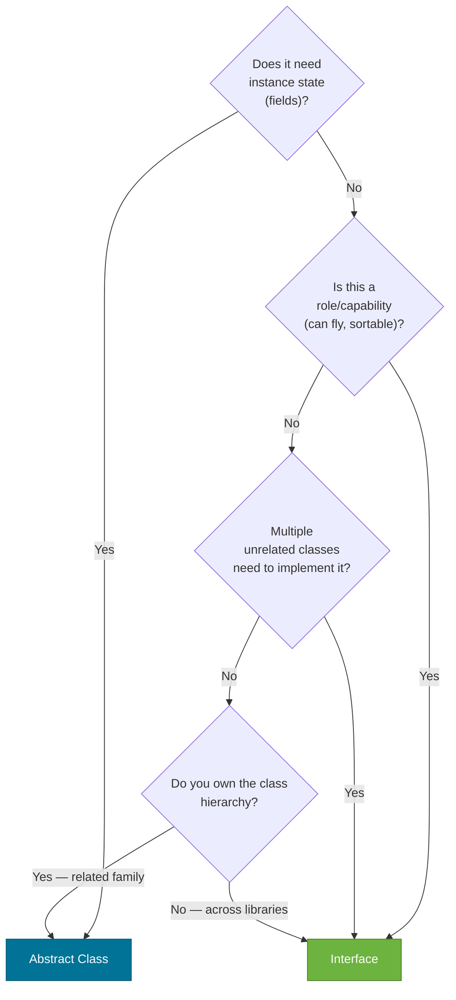

# Abstraction

> Abstraction means showing *what* something does and hiding *how* — so callers depend on a contract, not an implementation.

## What Problem Does It Solve?

Imagine you're building a data exporter that works with CSV files today, but might need JSON or XML tomorrow. If every caller is tightly coupled to `CsvExporter`, adding a new format means rewriting all callers.

Abstraction separates the **contract** ("I can export data") from the **implementation** ("I write CSV lines"). Callers depend only on the contract. Swapping the implementation doesn't touch caller code at all. This is the basis for testability, extensibility, and replaceability.

## Analogy

A **remote control** is an abstraction. You press "Volume Up" without knowing whether the TV speaks HDMI CEC, infrared, or Bluetooth. The remote hides all that complexity and exposes only the operations you care about. Java interfaces and abstract classes are the remote controls of software.

## How It Works

Java provides two mechanisms for abstraction: **interfaces** and **abstract classes**. They solve different problems.

### Interfaces

An interface is a **pure contract** — a list of method signatures (and optionally default implementations) that any implementing class must provide.

```java
public interface DataExporter {
    void export(List<Record> records, String destination); // ← abstract method

    default String format() {  // ← default method — optional to override
        return "unknown";
    }
}
```

A class implements the contract:

```java
public class CsvExporter implements DataExporter {
    @Override
    public void export(List<Record> records, String destination) {
        // write CSV to destination
    }

    @Override
    public String format() { return "csv"; }
}

public class JsonExporter implements DataExporter {
    @Override
    public void export(List<Record> records, String destination) {
        // write JSON to destination
    }
    // format() stays "unknown" — uses the default
}
```

Callers program to the interface:

```java
DataExporter exporter = new CsvExporter(); // or JsonExporter — caller doesn't care
exporter.export(records, "/output/data");
```

### Abstract Classes

An abstract class is a **partial implementation** — it can have concrete methods (shared logic), abstract methods (left for subclasses), and instance state (fields).

```java
public abstract class BaseReportGenerator {
    private final String title;          // ← state — interfaces cannot have instance fields

    protected BaseReportGenerator(String title) {
        this.title = title;
    }

    // Concrete method — shared logic all subclasses use
    public void printHeader() {
        System.out.println("=== " + title + " ===");
    }

    // Abstract method — subclass must implement
    public abstract void generate();     // ← no body
}

public class SalesReport extends BaseReportGenerator {
    public SalesReport() {
        super("Sales Report");
    }

    @Override
    public void generate() {
        printHeader();                   // ← reuses parent's concrete method
        System.out.println("... sales data ...");
    }
}
```

### Interfaces vs. Abstract Classes — Decision Guide



*Use an interface for capabilities/roles across unrelated classes; use an abstract class for shared implementation within a closely related family.*

### Feature Comparison Table

| Feature | Interface | Abstract Class |
|---------|-----------|----------------|
| Instance fields | ❌ (only `static final` constants) | ✅ |
| Constructors | ❌ | ✅ |
| Concrete methods | ✅ (via `default` / `static`) | ✅ |
| Multiple inheritance | ✅ (a class implements many) | ❌ (single extends) |
| Access modifiers on methods | `public` only (prior to Java 9) | Any |
| Constructor enforced initialization | ❌ | ✅ |

### Default Methods (Java 8+)

`default` methods let interfaces add implementation without breaking existing implementors. This is how the Collections API added `forEach`, `stream()`, and `sort()` to `Iterable` and `List` without rewriting every class that implements them.

```java
public interface Auditable {
    String getId();
    String getLastModifiedBy();

    // Default method — implementing classes get this for free
    default String auditSummary() {
        return "Entity " + getId() + " last modified by " + getLastModifiedBy();
    }
}

public class Order implements Auditable {
    private final String id;
    private final String modifier;

    public Order(String id, String modifier) {
        this.id = id;
        this.modifier = modifier;
    }

    @Override public String getId() { return id; }
    @Override public String getLastModifiedBy() { return modifier; }
    // auditSummary() is inherited — no override needed
}
```

### Diamond Problem and `default` Conflict Resolution

When a class inherits two interfaces with the same default method name, the class **must override** and resolve the conflict:

```java
interface A {
    default void hello() { System.out.println("Hello from A"); }
}
interface B {
    default void hello() { System.out.println("Hello from B"); }
}

class C implements A, B {
    @Override
    public void hello() {
        A.super.hello(); // ← explicit choice: use A's version
    }
}
```

## Code Examples

:::tip Practical Demo
See the [Abstraction Demo](./demo/abstraction-demo.md) for step-by-step runnable examples.
:::

### Combining Interface + Abstract Class (Layered Abstraction)

```java
// Layer 1: Interface (the contract)
public interface PaymentProcessor {
    boolean process(double amount, String currency);
    String getProviderName();
}

// Layer 2: Abstract class (shared infrastructure — logging, retry)
public abstract class BasePaymentProcessor implements PaymentProcessor {

    @Override
    public final boolean process(double amount, String currency) {
        System.out.printf("[%s] Processing %.2f %s%n", getProviderName(), amount, currency);
        boolean result = doProcess(amount, currency); // ← abstract — subclass implements
        System.out.printf("[%s] Result: %s%n", getProviderName(), result ? "SUCCESS" : "FAILED");
        return result;
    }

    protected abstract boolean doProcess(double amount, String currency);
}

// Layer 3: Concrete implementation
public class StripeProcessor extends BasePaymentProcessor {
    @Override
    public String getProviderName() { return "Stripe"; }

    @Override
    protected boolean doProcess(double amount, String currency) {
        // call Stripe REST API...
        return true;
    }
}
```

This pattern is extremely common in Spring: the interface defines the API, abstract classes provide reusable infrastructure, and concrete classes add provider-specific logic.

### Interface Segregation (ISP)

Avoid fat interfaces that force implementors to provide methods they don't need:

```java
// BAD — a single big interface
public interface Worker {
    void work();
    void eat();
    void sleep();
}

// A Robot can work but shouldn't need to eat/sleep
public class Robot implements Worker {
    @Override public void work()  { /* OK */ }
    @Override public void eat()   { /* nonsensical */ }
    @Override public void sleep() { /* nonsensical */ }
}

// GOOD — segregated interfaces
public interface Workable  { void work(); }
public interface Feedable  { void eat(); }
public interface Restable  { void sleep(); }

public class Human extends Object implements Workable, Feedable, Restable { ... }
public class Robot extends Object implements Workable { ... }
```

## Trade-offs & When To Use / Avoid

| | Interface | Abstract Class |
|--|-----------|---------------|
| **Choose when** | Modeling a capability or role (`Comparable`, `Serializable`, `Runnable`) | Sharing state + behavior in a closely related family |
| **Choose when** | Unrelated classes need to implement the same API | You need constructor logic to enforce initialization |
| **Choose when** | You want maximum flexibility (mock-friendly, swap implementations) | Template method pattern is the right design |
| **Avoid when** | You need shared state (use abstract class or composition) | You want a class to play multiple unrelated roles |
| **Avoid when** | You own a class hierarchy and want to share implementation | Deep hierarchies become fragile — prefer composition |

## Common Pitfalls

**`abstract` class with no abstract methods:**
```java
// This compiles but it's a design smell
// If there's nothing abstract, just make it concrete (or final)
public abstract class Config {
    // all concrete methods — why abstract?
}
```

**Overusing default methods to add business logic to interfaces:**
```java
// Interfaces should express contracts, not business logic
// BAD: default method with complex behavior violates single responsibility
default double calculateTax(double income) {
    // 20 lines of tax logic in an interface...
}
```

**Forgetting `@Override` on interface implementations:**
```java
// If the interface changes a method signature, the implementing class silently stops
// overriding it — it now has a dead method. @Override catches this at compile time.
```

**Interfaces with too many methods:**  
A 20-method interface is almost impossible to mock in tests, hard to implement, and hard to evolve. Prefer small, focused interfaces (ISP). Standard library examples: `Runnable` (1 method), `Callable` (1), `Comparator` (1 + defaults).

## Interview Questions

### Beginner

**Q: What is abstraction in Java?**  
**A:** Abstraction means exposing *what* an object does (its public contract) while hiding *how* it does it (the implementation). In Java, abstraction is achieved through interfaces and abstract classes. Callers depend on the contract, not the concrete class.

**Q: What is an abstract class? Can you instantiate it?**  
**A:** An abstract class is a class declared with the `abstract` keyword that may have abstract methods (no body) that subclasses must implement. It cannot be instantiated directly (`new AbstractClass()` is a compile error). It can have constructors, fields, and concrete methods.

**Q: What is an interface?**  
**A:** An interface is a reference type containing only abstract method declarations (and optionally `default`/`static` methods and constants). A class `implements` an interface and must provide implementations for all abstract methods. A class can implement multiple interfaces.

### Intermediate

**Q: What is the difference between an abstract class and an interface?**  
**A:** The key differences: interfaces can't have instance fields or constructors, abstract classes can. A class can implement many interfaces but extend only one abstract class. Interfaces model capabilities/roles across unrelated types; abstract classes model shared partial implementation within a related family. Since Java 8, interfaces can have `default` methods, blurring the line — but the inability to hold state remains the core difference.

**Q: What are `default` methods in interfaces and why were they added?**  
**A:** `default` methods allow interfaces to provide a standard implementation. They were added in Java 8 to evolve existing interfaces (like `Collection`) without breaking every class that implements them. A `default` method can be overridden by an implementing class. If two interfaces provide conflicting defaults, the implementing class must explicitly resolve the conflict.

**Q: When should you use an interface versus an abstract class?**  
**A:** Use an interface when modeling a role or capability implemented by unrelated classes, or when maximum flexibility/mockability is needed. Use an abstract class when you have state to share, need constructor logic, or want to provide a template method that subclasses partially fill in.

### Advanced

**Q: What is the Interface Segregation Principle?**  
**A:** ISP (the "I" in SOLID) says: clients should not be forced to implement methods they don't use. Instead of one large interface, define small, focused interfaces. This way, a class only needs to satisfy the contracts relevant to it, and callers depend only on the methods they actually call — making the system easier to test and extend.

**Q: Can an interface extend another interface? Can it extend a class?**  
**A:** Yes, an interface can extend one or more other interfaces (multiple interface inheritance is allowed). No, an interface cannot extend a class. An extending interface inherits all abstract and default methods of its parent interface(s) and can add more.

## Further Reading

- [Oracle Java Tutorial — Abstract Classes](https://docs.oracle.com/javase/tutorial/java/IandI/abstract.html) — official guide.
- [Oracle Java Tutorial — Interfaces](https://docs.oracle.com/javase/tutorial/java/concepts/interface.html) — defining and implementing interfaces.
- [Baeldung — Interface vs. Abstract Class](https://www.baeldung.com/java-interface-vs-abstract-class) — practical comparison with Java 8+ updates.

## Related Notes

- [Inheritance](./inheritance.md) — abstract classes build the inheritance mechanism; understand both together.
- [Polymorphism](./polymorphism.md) — abstraction enables polymorphism: program to the interface, get the right implementation.
- [Sealed Classes (Java 17+)](./sealed-classes.md) — sealed interfaces restrict which classes can implement a contract, enabling exhaustive pattern matching.
