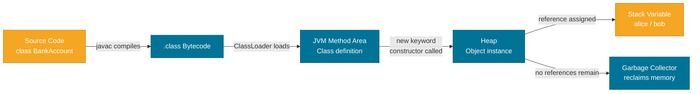

# Classes & Objects

> A class is the blueprint; an object is the building built from it — every Java program is a collection of interacting objects, each created from a class that defines its structure and behavior.

## What Problem Does It Solve?

Before OOP, programs were procedures operating on loose data. As programs grew, it became difficult to keep data and the logic that operates on it in sync. A bug in one procedure could corrupt data used by dozens of others.

Classes solve this by **bundling data (fields) and behavior (methods) together** into a single unit. The class defines *what* something looks like and *what* it can do. Once you have a class, you can create as many independent **objects** (instances) from it as you need — each with its own state, but sharing the same behavior.

## Analogy

Think of a **class** as a cookie cutter and an **object** as an individual cookie. The cutter (class) defines the shape (fields + methods). Every cookie (object) stamped out is independent — you can frost one without changing the others — but they all share the same shape (same class definition).

## How It Works

### Anatomy of a Class

```java
public class BankAccount {          // ← class declaration

    // Fields — per-instance state
    private String owner;           // ← instance field (each object gets its own copy)
    private double balance;

    // Constructor — called when 'new BankAccount(...)' is used
    public BankAccount(String owner, double initialBalance) {
        this.owner = owner;         // ← 'this' disambiguates the field from the param
        this.balance = initialBalance;
    }

    // Method — defines behavior
    public void deposit(double amount) {
        if (amount > 0) {
            this.balance += amount;
        }
    }

    public double getBalance() {
        return balance;
    }
}
```

### Creating and Using Objects

```java
// 'new' allocates heap memory and calls the constructor
BankAccount alice = new BankAccount("Alice", 1000.0);
BankAccount bob   = new BankAccount("Bob",    500.0);

alice.deposit(200.0);

System.out.println(alice.getBalance()); // 1200.0  ← alice's state
System.out.println(bob.getBalance());   //  500.0  ← bob's state is unchanged
```

Each object lives independently on the **heap**. The variable `alice` is just a **reference** (pointer) to the object on the heap — not the object itself.

### Object Lifecycle



*The class definition is loaded once into the JVM Method Area; each `new` call creates a separate object on the heap. When no variable holds a reference, the GC reclaims it.*

### Key Components

| Component | Purpose | Example |
|-----------|---------|---------|
| **Field** | Stores per-instance state | `private double balance` |
| **Constructor** | Initializes the object on creation | `BankAccount(String owner, ...)` |
| **Method** | Defines behavior | `deposit(double amount)` |
| **`this`** | Refers to the current instance | `this.balance += amount` |
| **`static` field** | Shared across all instances (class-level) | `static int count` |
| **`static` method** | Called on the class, not an instance | `Math.sqrt(4)` |

### Instance vs. Static Members

```java
public class Counter {
    private static int totalCreated = 0; // ← shared by ALL Counter objects
    private int id;                      // ← unique to each object

    public Counter() {
        totalCreated++;          // ← updates the shared count
        this.id = totalCreated;
    }

    public static int getTotalCreated() { // ← called as Counter.getTotalCreated()
        return totalCreated;
    }
}

Counter a = new Counter(); // totalCreated = 1, a.id = 1
Counter b = new Counter(); // totalCreated = 2, b.id = 2
System.out.println(Counter.getTotalCreated()); // 2
```

### Constructors in Depth

Java provides a **default no-arg constructor** automatically — but only if you declare *no* constructors at all. Once you declare one, the default is gone.

```java
public class Point {
    private final int x;
    private final int y;

    // Primary constructor
    public Point(int x, int y) {
        this.x = x;
        this.y = y;
    }

    // Overloaded convenience constructor — delegates via this(...)
    public Point() {
        this(0, 0); // ← must be the FIRST statement
    }
}
```

Constructor chaining with `this(...)` keeps initialization logic in one place — a key best practice.

## Code Examples

:::tip Practical Demo
See the [Classes & Objects Demo](./demo/classes-and-objects-demo.md) for step-by-step runnable examples.
:::

### Immutable Value Object Pattern

```java
public final class Money {        // ← 'final' prevents subclassing
    private final String currency;
    private final double amount;

    public Money(String currency, double amount) {
        if (amount < 0) throw new IllegalArgumentException("Amount cannot be negative");
        this.currency = currency;
        this.amount = amount;
    }

    public Money add(Money other) {
        if (!this.currency.equals(other.currency)) {
            throw new IllegalArgumentException("Currency mismatch");
        }
        return new Money(currency, this.amount + other.amount); // ← returns new object
    }

    public double getAmount()   { return amount; }
    public String getCurrency() { return currency; }

    @Override
    public String toString() {
        return amount + " " + currency;
    }
}
```

`Money` is **immutable** — after construction, state never changes. `add()` returns a *new* `Money` rather than mutating `this`. This is a foundational pattern you'll see throughout the JDK (e.g., `String`, `LocalDate`).

### Static Factory Method Pattern

```java
public class Connection {
    private final String url;

    // Private constructor — forces callers to use the factory method
    private Connection(String url) {
        this.url = url;
    }

    // Named factory method — more descriptive than 'new Connection(...)'
    public static Connection of(String url) {
        if (url == null || url.isBlank()) {
            throw new IllegalArgumentException("URL must not be blank");
        }
        return new Connection(url);
    }
}

// Usage:
Connection conn = Connection.of("jdbc:postgresql://localhost/mydb");
```

## Best Practices

- **Keep fields `private`** — always. Expose state only through methods (see [Encapsulation](./encapsulation.md)).
- **Make fields `final` when possible** — signals intent and prevents unintended mutation.
- **Use constructor chaining (`this(...)`)** instead of duplicating initialization logic.
- **Prefer static factory methods** over constructors for complex creation logic or named intent.
- **Use `@Override`** when overriding methods from `Object` (`toString`, `equals`, `hashCode`).
- **Do not call overridable methods from constructors** — subclass may not be fully initialized yet.

## Common Pitfalls

**Forgetting `this.` when field and parameter have the same name:**
```java
// BUG — assigns param 'name' to itself; field 'name' is never set
public Person(String name) {
    name = name; // ← should be: this.name = name
}
```

**Assuming the default constructor stays around:**
```java
class Foo {
    public Foo(int x) { ... }
    // No default constructor anymore!
}
Foo f = new Foo(); // ← compile error
```

**Treating a reference as the object itself:**
```java
BankAccount a = new BankAccount("Alice", 100);
BankAccount b = a; // ← b and a point to the SAME object
b.deposit(500);
System.out.println(a.getBalance()); // 600 — not 100!
```

**Using `==` to compare object content:**
```java
String s1 = new String("hello");
String s2 = new String("hello");
System.out.println(s1 == s2);       // false — different references
System.out.println(s1.equals(s2));  // true  — same content
```

## Interview Questions

### Beginner

**Q: What is the difference between a class and an object?**  
**A:** A class is a compile-time blueprint defining fields and methods. An object is a runtime instance of that class, allocated on the heap, with its own copy of instance fields.

**Q: What is a constructor? How is it different from a method?**  
**A:** A constructor has no return type (not even `void`), must have the same name as the class, and is called automatically by `new`. A method has a return type and is called explicitly. Constructors initialize the object's state; methods define its behavior.

**Q: What is the `this` keyword?**  
**A:** `this` is an implicit reference to the current object instance. It disambiguates instance fields from local variables/parameters of the same name, and `this(...)` is used to chain constructors within the same class.

### Intermediate

**Q: What happens if you don't define any constructor?**  
**A:** The compiler automatically generates a public no-arg constructor that calls `super()`. As soon as you define *any* constructor, the default is not generated — you must add the no-arg constructor back explicitly if it's still needed.

**Q: What is the difference between instance and static members?**  
**A:** Instance members (fields and methods without `static`) belong to a specific object — each object has its own copy of instance fields. Static members belong to the class itself and are shared across all instances. Static methods cannot reference `this` or instance fields directly.

**Q: When would you use a static factory method instead of a constructor?**  
**A:** When you need meaningful names (`of`, `from`, `getInstance`), when creation might return `null` or a cached instance (e.g., `Boolean.valueOf`), or when you want to return a subtype without exposing it in the API. Constructors always return a new instance of the declared type.

### Advanced

**Q: Explain the `new` keyword in terms of JVM internals.**  
**A:** `new` causes the JVM to: (1) check if the class is loaded and initialize it if not; (2) allocate memory on the heap (object layout determined by the JVM — fields, class pointer, lock word); (3) zero-initialize all fields; (4) execute the constructor chain up through `Object()`. The result is a reference to the initialized object.

**Q: Why should you not call overridable methods in a constructor?**  
**A:** If a subclass overrides the method and the subclass constructor hasn't run yet, the overridden method may access subclass fields that are still at their default zero-values, leading to subtle bugs. The base class constructor runs *before* the subclass constructor.

## Further Reading

- [Oracle Java Tutorial — Classes](https://docs.oracle.com/javase/tutorial/java/javaOO/classes.html) — official tutorial covering class declarations in full detail.
- [Oracle Java Tutorial — Objects](https://docs.oracle.com/javase/tutorial/java/javaOO/objectcreation.html) — covers `new`, constructor invocation, and object references.
- [Effective Java, Item 1](https://www.baeldung.com/java-constructors-vs-static-factory-methods) — static factory methods vs. constructors (Baeldung summary).

## Related Notes

- [Encapsulation](./encapsulation.md) — the next step: controlling access to the fields and methods you define in a class.
- [Inheritance](./inheritance.md) — how classes can extend other classes to reuse and specialize behavior.
- [Records (Java 16+)](./records.md) — a modern, concise alternative to writing data classes by hand.
