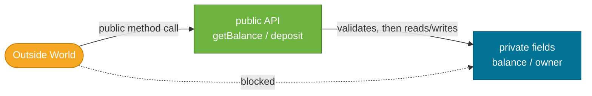

# Encapsulation

> Encapsulation is the discipline of hiding a class's internal state and only exposing what callers actually need — making your classes easier to maintain, test, and reason about.

## What Problem Does It Solve?

Imagine a `BankAccount` class where anyone could write:

```java
account.balance = -99999; // ← caller writes directly to the field
```

There is no validation, no audit trail, no protection. Any code anywhere in the codebase can put the object into an invalid state. When something goes wrong, you have no idea who changed it.

Encapsulation fixes this by **making fields `private`** and requiring all access to go through methods. The class controls what's allowed, and callers can't bypass the rules.

## What Is It?

Encapsulation is one of the four pillars of OOP. It means:

1. **Hide data** — declare fields `private` so they can't be accessed directly from outside the class.
2. **Expose intent** — provide `public` methods that let callers interact with the object in meaningful, validated ways.
3. **Protect invariants** — ensure the object is always in a valid, self-consistent state.

Encapsulation is enforced in Java through **access modifiers**.

## How It Works

### Access Modifiers

Java has four levels of visibility:

| Modifier | Same Class | Same Package | Subclass (any package) | Any Class |
|----------|:----------:|:------------:|:----------------------:|:---------:|
| `private` | ✅ | ❌ | ❌ | ❌ |
| *(package-private, no modifier)* | ✅ | ✅ | ❌ | ❌ |
| `protected` | ✅ | ✅ | ✅ | ❌ |
| `public` | ✅ | ✅ | ✅ | ✅ |

**Default rule of thumb:** make everything `private` by default. Promote visibility only when there is a clear reason to do so.



*Callers can only reach private fields through the public API — direct access is blocked by the compiler.*

### Getters and Setters

The classic pattern is to write `get<Field>()` and `set<Field>()` methods:

```java
public class BankAccount {
    private String owner;   // private — not directly accessible
    private double balance;

    public BankAccount(String owner, double initialBalance) {
        this.owner = owner;
        setBalance(initialBalance); // ← reuse validation logic in the constructor
    }

    // Getter — read-only access to owner
    public String getOwner() {
        return owner;
    }

    // No setter for owner — intentionally read-only after construction

    // Getter
    public double getBalance() {
        return balance;
    }

    // Setter with validation — enforces the invariant "balance >= 0"
    private void setBalance(double balance) {
        if (balance < 0) throw new IllegalArgumentException("Balance cannot be negative");
        this.balance = balance;
    }

    public void deposit(double amount) {
        if (amount <= 0) throw new IllegalArgumentException("Deposit amount must be positive");
        this.balance += amount;
    }

    public void withdraw(double amount) {
        if (amount <= 0 || amount > balance) {
            throw new IllegalArgumentException("Invalid withdrawal amount");
        }
        this.balance -= amount;
    }
}
```

Notice that `setBalance` is `private` — external callers must use `deposit`/`withdraw`, which carry meaningful business rules, rather than setting balance arbitrarily.

### Immutable Classes

Immutability is **the strongest form of encapsulation** — you make the object's state completely unchangeable after construction. Immutable objects are inherently thread-safe and easy to reason about.

Recipe for an immutable class:

```java
public final class Money {          // 1. 'final' — prevents subclass from breaking immutability

    private final String currency;  // 2. all fields 'final'
    private final double amount;

    public Money(String currency, double amount) {
        if (currency == null || currency.isBlank())
            throw new IllegalArgumentException("Currency required");
        if (amount < 0)
            throw new IllegalArgumentException("Amount must be >= 0");
        this.currency = currency;
        this.amount = amount;
    }

    public String getCurrency() { return currency; }
    public double getAmount()   { return amount; }

    // 3. No setters. Mutations return a new object.
    public Money add(Money other) {
        if (!this.currency.equals(other.currency))
            throw new IllegalArgumentException("Currency mismatch");
        return new Money(currency, this.amount + other.amount); // ← new instance
    }

    // 4. Override equals/hashCode for value-equality semantics
    @Override
    public boolean equals(Object o) {
        if (this == o) return true;
        if (!(o instanceof Money m)) return false;
        return Double.compare(amount, m.amount) == 0 && currency.equals(m.currency);
    }

    @Override
    public int hashCode() {
        return Objects.hash(currency, amount);
    }

    @Override
    public String toString() {
        return amount + " " + currency;
    }
}
```

The five rules for immutability:
1. Class is `final`
2. All fields are `private final`
3. No setters
4. Constructor fully initializes all fields
5. If fields reference mutable objects, **copy them in and copy them out**

### Defensive Copying for Mutable Fields

```java
public final class Schedule {
    private final List<String> tasks;

    public Schedule(List<String> tasks) {
        // Defensive copy IN — don't store the caller's reference
        this.tasks = new ArrayList<>(tasks);   // ← copy
    }

    public List<String> getTasks() {
        // Defensive copy OUT — don't expose the internal list
        return Collections.unmodifiableList(tasks); // ← read-only view
    }
}
```

If you skip defensive copies, a caller could mutate the list passed in (or returned) and your "immutable" class would become secretly mutable.

## Code Examples

:::tip Practical Demo
See the [Encapsulation Demo](./demo/encapsulation-demo.md) for step-by-step runnable examples.
:::

## Best Practices

- **Default to `private` for all fields** — promote to `protected` or `public` only when needed.
- **Prefer immutable classes** for value objects (Money, Id, DateRange). Mutability should be a conscious choice, not the default.
- **Avoid `public` setters for fields that shouldn't change after construction** — omit the setter rather than providing a blanket one.
- **Use meaningful method names** (`deposit`, `withdraw`) instead of generic `setBalance` — the method name communicates *why* the state is changing.
- **Use `Objects.requireNonNull`** in constructors to fail fast with a clear message rather than a cryptic NPE later.
- **Always override `equals`, `hashCode`, and `toString`** for value objects — Java's default Object implementations are identity-based, not value-based.

## Common Pitfalls

**Returning a mutable field directly:**
```java
// BAD — caller can mutate the internal list
public List<Order> getOrders() {
    return orders; // ← exposes internal state
}

// GOOD
public List<Order> getOrders() {
    return Collections.unmodifiableList(orders);
}
```

**Boolean getter naming — `is` not `get`:**
```java
private boolean active;
public boolean isActive() { return active; } // ← correct; getActive() won't work with some frameworks
```

**Setters that skip validation:**
```java
// BAD
public void setAge(int age) {
    this.age = age; // ← negative age becomes possible
}

// GOOD
public void setAge(int age) {
    if (age < 0 || age > 150) throw new IllegalArgumentException("Invalid age: " + age);
    this.age = age;
}
```

**Claiming immutability without making the class `final`:**
```java
public class ImmutablePoint { ... }

// A subclass can re-add mutability!
public class MutablePoint extends ImmutablePoint {
    public void setX(int x) { ... }
}
```

## Interview Questions

### Beginner

**Q: What is encapsulation?**  
**A:** Encapsulation is bundling data (fields) and the behavior that operates on it (methods) into a single class, while restricting direct external access to the data. It's enforced by declaring fields `private` and exposing only the methods callers should use.

**Q: What are the four access modifiers in Java?**  
**A:** `private` (same class only), package-private/no modifier (same package), `protected` (same package + subclasses), and `public` (accessible from anywhere). Fields should default to `private`; methods are `public` only when they form part of the class's intended API.

**Q: Why should fields be `private`?**  
**A:** So that external code can't put the object into an invalid state. By routing all writes through methods, you can validate, log, enforce invariants, and change the internal representation without breaking callers.

### Intermediate

**Q: What is the difference between encapsulation and data hiding?**  
**A:** Data hiding is a subset of encapsulation — it specifically means making fields inaccessible from outside the class. Encapsulation is the broader principle: bundling state + behavior and exposing only a controlled interface. You can have encapsulation without perfect data hiding (e.g., `protected` fields in a well-designed hierarchy).

**Q: When would you provide no setter at all?**  
**A:** When the field should not change after construction (e.g., `id`, `createdAt`). Providing no setter communicates that this field is read-only by design, and the compiler enforces it if the field is also `final`.

**Q: How does encapsulation help with refactoring?**  
**A:** Because callers depend only on the public methods and not on field names or internal representation, you can freely change how data is stored internally without breaking callers. For example, you can change `balance` from `double` to `BigDecimal` internally and only update the class itself.

### Advanced

**Q: How do you make an immutable class that contains a mutable field (e.g., `List`, `Date`)?**  
**A:** Use **defensive copying**: copy the mutable object when it's passed into the constructor (so callers can't mutate your state), and copy it again when returning it from a getter (so callers can't mutate your internal state through the returned reference). For collections, returning an `unmodifiableList` (or `List.copyOf`) is the standard approach.

**Q: Why are immutable objects inherently thread-safe?**  
**A:** Thread-safety problems arise when one thread reads a value while another thread writes it. If an object can never be written after construction, there are no writes after the object is safely published — so no synchronization is needed. This is why Java's `String`, `Integer`, and `LocalDate` are all immutable.

## Further Reading

- [Oracle Java Tutorial — Controlling Access](https://docs.oracle.com/javase/tutorial/java/javaOO/accesscontrol.html) — official guide on access modifiers.
- [Effective Java, Item 17 — Minimize Mutability](https://www.baeldung.com/java-immutable-object) — the canonical advice for designing immutable classes (Baeldung summary).
- [dev.java — Encapsulation](https://dev.java/learn/oop/) — OpenJDK team's take on encapsulation in modern Java.

## Related Notes

- [Classes & Objects](./classes-and-objects.md) — prerequisite: understand fields and constructors before locking them down with encapsulation.
- [Inheritance](./inheritance.md) — `protected` access is the encapsulation level that matters most when designing class hierarchies.
- [Records (Java 16+)](./records.md) — records automate the boilerplate of encapsulated, immutable data classes.
