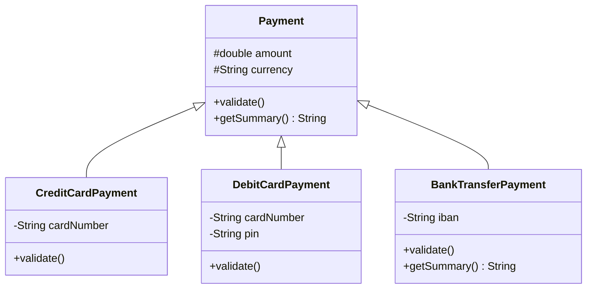
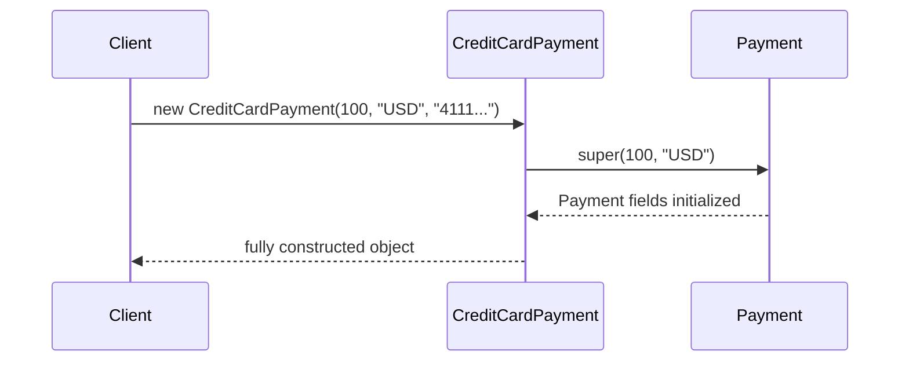

# Inheritance

> Inheritance lets a subclass absorb the state and behavior of its parent class and specialize or extend it — but using it carelessly is the single biggest source of fragile, hard-to-maintain OOP codebases.

## What Problem Does It Solve?

Suppose you're building a payment system with `CreditCardPayment`, `DebitCardPayment`, and `BankTransferPayment`. Each needs `amount`, `currency`, validation, and an `execute()` method. Without inheritance, you copy that shared logic into every class — three places to update whenever the rule changes.

Inheritance solves this with a **single source of truth**: the shared logic lives in a `Payment` base class, and each subclass extends it with only the differences. Code reuse without duplication.

## How It Works

### The `extends` Keyword

```java
// Base class (superclass / parent)
public class Payment {
    protected final double amount;    // ← 'protected' — accessible to subclasses
    protected final String currency;

    public Payment(double amount, String currency) {
        if (amount <= 0) throw new IllegalArgumentException("Amount must be positive");
        this.amount = amount;
        this.currency = currency;
    }

    public void validate() {
        System.out.println("Validating base payment: " + amount + " " + currency);
    }

    public String getSummary() {
        return amount + " " + currency;
    }
}

// Subclass — inherits all non-private members of Payment
public class CreditCardPayment extends Payment {
    private final String cardNumber;

    public CreditCardPayment(double amount, String currency, String cardNumber) {
        super(amount, currency); // ← MUST call super constructor first
        this.cardNumber = cardNumber;
    }

    @Override                  // ← tells compiler this is intentional override
    public void validate() {
        super.validate();      // ← reuse parent logic
        System.out.println("Validating card: " + maskCard(cardNumber));
    }

    private String maskCard(String card) {
        return "**** **** **** " + card.substring(card.length() - 4);
    }
}
```

### The Inheritance Hierarchy



*`CreditCardPayment`, `DebitCardPayment`, and `BankTransferPayment` all inherit `amount`, `currency`, and `getSummary()` from `Payment`. Each overrides `validate()` to add type-specific rules.*

### `super` — Calling the Parent

`super` has two uses:

```java
// 1. Call parent constructor (must be first line in subclass constructor)
public CreditCardPayment(double amount, String currency, String cardNumber) {
    super(amount, currency); // ← delegates to Payment(double, String)
    this.cardNumber = cardNumber;
}

// 2. Call parent method from an override
@Override
public void validate() {
    super.validate();  // ← runs Payment.validate() first
    // ... then add subclass-specific logic
}
```

If you don't call `super(...)` explicitly, the compiler inserts a call to the parent's **no-arg constructor**. If the parent has no no-arg constructor, you'll get a **compile error** — a common surprise.

### Method Overriding Rules

| Rule | Detail |
|------|--------|
| Same name + same parameter types | Required to be an override |
| Return type (covariant) | Subclass can return a *narrower* type (e.g., `Integer` instead of `Number`) |
| Access modifier | Subclass method can be *more* visible, never *less* |
| Checked exceptions | Subclass may not declare *new or broader* checked exceptions |
| `@Override` | Optional but strongly recommended — catches typos as compile errors |
| `final` methods | Cannot be overridden |
| `private` methods | Not inherited; cannot be overridden (only hidden) |
| `static` methods | Not overridden — they are *hidden* based on the reference type |

### Calling Chain in Constructors



*Every constructor chain ultimately reaches `Object()`. The parent is always fully initialized before the subclass constructor runs.*

### The Liskov Substitution Principle (LSP)

LSP is the "L" in SOLID. It states:

> **Wherever a parent type is used, a subclass instance must be substitutable without changing the correctness of the program.**

In practice: a subclass should only *extend* behavior — not contradict it. A classic violation:

```java
// LSP VIOLATION — Rectangle/Square problem
public class Rectangle {
    protected int width, height;
    public void setWidth(int w)  { this.width = w; }
    public void setHeight(int h) { this.height = h; }
    public int area() { return width * height; }
}

public class Square extends Rectangle {
    @Override
    public void setWidth(int w) {
        this.width = w;
        this.height = w; // ← "width == height always" — but breaks Rectangle contract!
    }
}

// Code that works for Rectangle may fail with Square:
Rectangle r = new Square();
r.setWidth(5);
r.setHeight(10);
System.out.println(r.area()); // Expects 50, gets 100
```

The fix is to **not use inheritance here** — `Square` is not a substitutable `Rectangle`. Use separate classes or composition.

### `final` Classes and Methods

```java
public final class String { ... }   // ← Java's String cannot be extended

public class Parent {
    public final void audit() {     // ← no subclass can override this
        log("Operation performed");
    }
}
```

Mark a class or method `final` to signal that the design is not meant to be extended. This is a feature, not a limitation — it enables JVM optimizations and prevents misuse.

## Code Examples

:::tip Practical Demo
See the [Inheritance Demo](./demo/inheritance-demo.md) for step-by-step runnable examples.
:::

### Template Method Pattern via Inheritance

```java
// Base class defines the skeleton; subclasses fill in the blanks
public abstract class ReportGenerator {

    // Template method — defines the algorithm structure
    public final void generate() {
        fetchData();
        process();
        render();         // ← each subclass renders differently
    }

    protected abstract void fetchData();
    protected abstract void process();
    protected abstract void render();
}

public class PdfReportGenerator extends ReportGenerator {
    @Override protected void fetchData() { System.out.println("Fetching from DB"); }
    @Override protected void process()   { System.out.println("Processing data"); }
    @Override protected void render()    { System.out.println("Rendering PDF"); }
}

// Usage:
ReportGenerator gen = new PdfReportGenerator();
gen.generate(); // fetchData → process → render
```

The `final` on `generate()` prevents subclasses from bypassing the algorithm structure — only the steps are customizable.

### Covariant Return Type

```java
public class Animal {
    public Animal create() {
        return new Animal();
    }
}

public class Dog extends Animal {
    @Override
    public Dog create() {   // ← Dog is a subtype of Animal — this is valid (covariant)
        return new Dog();
    }
}
```

## Trade-offs & When To Use / Avoid

| | Pros | Cons |
|--|------|------|
| **Use** | Natural "is-a" relationship exists | Creates tight coupling between parent and subclass |
| **Use** | Common behavior lives in one place | Subclass inherits *all* parent state, even unwanted fields |
| **Use** | Enables polymorphism and template method patterns | Parent class changes can break subclasses (fragile base class problem) |
| **Avoid** | No true "is-a" relationship (use composition instead) | Deep hierarchies are hard to navigate and understand |
| **Avoid** | You need to reuse just one method (use delegation) | Java's single inheritance limits flexibility |

**Rule of thumb:** Prefer [composition over inheritance](https://www.baeldung.com/java-composition-aggregation-association). Use inheritance only when the "is-a" relationship is genuine and the subclass is truly substitutable for the parent (LSP).

## Common Pitfalls

**Not calling `super()` when the parent has no no-arg constructor:**
```java
class Animal {
    Animal(String name) { this.name = name; }
}
class Dog extends Animal {
    Dog() {
        // Compiler error! There's no Animal() no-arg constructor.
        // Must write: super("Dog");
    }
}
```

**Overriding `equals` in subclass without updating `hashCode`:**
```java
// If you override equals, ALWAYS override hashCode too.
// Violation: two objects equal by equals() must have the same hashCode().
```

**Misusing inheritance for code reuse when there's no "is-a":**
```java
// BAD — Stack doesn't have an "is-a" relationship with Vector
// (historical Java mistake) Stack could setElementAt(i, v) — a nonsensical Stack operation
public class Stack<E> extends Vector<E> { ... }
```

**Using `protected` fields instead of `protected` methods:**
```java
// BAD — subclass can bypass all validation
protected double balance;

// GOOD — keep fields private; expose protected accessor if subclass truly needs it
private double balance;
protected double getBalance() { return balance; }
```

## Interview Questions

### Beginner

**Q: What is inheritance in Java?**  
**A:** Inheritance is a mechanism where a subclass (`extends`) acquires the non-private fields and methods of its parent class. It enables code reuse and forms the basis for runtime polymorphism. Java supports single class inheritance only (a class extends exactly one parent), but multiple interface implementation.

**Q: What does `super` do?**  
**A:** `super` refers to the parent class. `super(...)` calls the parent constructor (must be first in the subclass constructor). `super.method()` calls the parent's version of an overridden method from inside the override.

**Q: What is the difference between method overriding and method overloading?**  
**A:** Overriding (runtime): a subclass provides a new implementation of a method with **the same signature** as one in the parent. The call is dispatched at runtime based on the actual object type. Overloading (compile-time): multiple methods in the same class with the **same name but different parameter types** — resolved at compile time.

### Intermediate

**Q: What is the Liskov Substitution Principle and why does it matter?**  
**A:** LSP says a subclass must be usable wherever its parent is expected without breaking program correctness. It matters because violating LSP means `instanceof` checks proliferate, the polymorphism breaks down, and callers have to know what concrete type they're dealing with — defeating the whole purpose of inheritance.

**Q: Why is deep inheritance hierarchies a design smell?**  
**A:** Each level adds coupling. A change to level 2 in a 6-level chain can break behavior at levels 3–6 in non-obvious ways (fragile base class problem). It also makes code hard to navigate. Flat hierarchies (1–2 levels) with composition are almost always more maintainable.

**Q: Can you override a `private` method?**  
**A:** No. `private` methods are not inherited and therefore cannot be overridden. If a subclass defines a method with the same name and signature, it's a completely new (unrelated) method. `@Override` would cause a compile error in this case.

### Advanced

**Q: What is the "fragile base class" problem?**  
**A:** When a base class is changed in a seemingly safe way (e.g., adding a method or changing an internal implementation), subclasses that relied on the old behavior can break silently. This is because subclasses have access to protected internals and can override methods whose semantics they assumed. The solution is to design for extension explicitly (with `final` and `abstract`), or use composition.

**Q: Explain covariant return types.**  
**A:** Since Java 5, an overriding method can declare a return type that is a subtype of the parent method's return type. This allows subclass factory methods to return the more specific type without requiring a cast. Example: `Animal.create()` returns `Animal`; `Dog.create()` returns `Dog`.

## Further Reading

- [Oracle Java Tutorial — Inheritance](https://docs.oracle.com/javase/tutorial/java/IandI/subclasses.html) — official guide on `extends`, overriding, and the class hierarchy.
- [Oracle Java Tutorial — Overriding Methods](https://docs.oracle.com/javase/tutorial/java/IandI/override.html) — exact rules for what counts as an override.
- [Baeldung — Composition vs Inheritance](https://www.baeldung.com/java-composition-aggregation-association) — practical guide on when to prefer each.

## Related Notes

- [Classes & Objects](./classes-and-objects.md) — prerequisite: understanding fields and constructors before extending them.
- [Polymorphism](./polymorphism.md) — inheritance enables runtime polymorphism; understand both together.
- [Abstraction](./abstraction.md) — abstract classes build on inheritance to define partial implementations.
