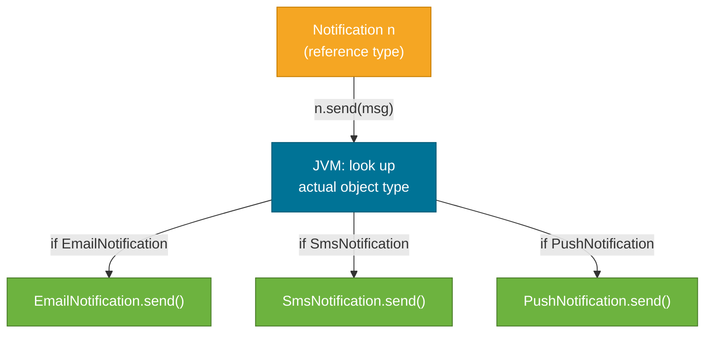

# Polymorphism

> Polymorphism — "many forms" — is Java's ability to call the same method name and get different behavior depending on which object is actually behind the reference. It is the mechanism that makes interfaces and inheritance genuinely useful.

## What Problem Does It Solve?

Without polymorphism, every caller that processes different subtypes has to be littered with `instanceof` checks:

```java
// BAD — every new payment type requires editing this method
void process(Object payment) {
    if (payment instanceof CreditCardPayment c) { c.chargeCreditCard(); }
    else if (payment instanceof PayPalPayment p) { p.callPayPalApi(); }
    else if (payment instanceof CryptoPayment cr) { cr.broadcastToBlockchain(); }
}
```

With polymorphism the caller knows nothing about which subtype it has. It just calls `payment.execute()` and the right implementation runs automatically. Adding a new payment type requires no changes to existing code — just a new class.

## What Is It?

Java has two distinct kinds of polymorphism:

| Kind | Also Called | Resolved At | Mechanism |
|------|-------------|-------------|-----------|
| **Compile-time** | Static / overloading | Compile time | Overloaded methods with different signatures |
| **Runtime** | Dynamic / overriding | Runtime | Overridden methods dispatched by actual object type |

Both use the same method name. The difference is *when* Java decides which version to call.

## How It Works

### Runtime Polymorphism (Method Overriding)

The JVM instruction `invokevirtual` looks up the method on the **actual object type** at runtime, not the declared reference type.

```java
public abstract class Notification {
    public abstract void send(String message);
}

public class EmailNotification extends Notification {
    @Override
    public void send(String message) {
        System.out.println("Email: " + message);
    }
}

public class SmsNotification extends Notification {
    @Override
    public void send(String message) {
        System.out.println("SMS: " + message);
    }
}

public class PushNotification extends Notification {
    @Override
    public void send(String message) {
        System.out.println("Push: " + message);
    }
}
```

The calling code uses the *parent type*:

```java
List<Notification> channels = List.of(
    new EmailNotification(),
    new SmsNotification(),
    new PushNotification()
);

for (Notification n : channels) {
    n.send("Order shipped!"); // ← same call, three different behaviors
}
```

Output:
```
Email: Order shipped!
SMS: Order shipped!
Push: Order shipped!
```

The `for` loop doesn't know or care which concrete type it's dealing with — it calls `send()` uniformly.

### Dynamic Dispatch Flow



*At runtime, the JVM inspects the vtable of the actual object to find the correct `send()` implementation. The reference type `Notification` is irrelevant to dispatch.*

### Compile-Time Polymorphism (Method Overloading)

Overloading lets you have multiple methods with the **same name but different parameter lists**. The compiler picks the right one based on the argument types at compile time.

```java
public class Printer {
    public void print(String text) {
        System.out.println("String: " + text);
    }

    public void print(int number) {           // same name, different parameter type
        System.out.println("Int: " + number);
    }

    public void print(String text, int copies) { // same name, different arity
        for (int i = 0; i < copies; i++) {
            System.out.println(text);
        }
    }
}

Printer p = new Printer();
p.print("Hello");      // → "String: Hello"
p.print(42);           // → "Int: 42"
p.print("Hi", 3);      // → "Hi\nHi\nHi"
```

The compiler resolves these at compile time — there is no runtime lookup. This is why overloading is called **static polymorphism**.

### Static vs Dynamic: Side by Side

```java
public class Animal {
    public String speak() { return "..."; }                         // instance method
    public static String classify() { return "Animal"; }           // static method
}

public class Dog extends Animal {
    @Override
    public String speak() { return "Woof"; }                       // overrides — runtime dispatch
    public static String classify() { return "Dog"; }              // hides — compile-time resolution
}

Animal a = new Dog();           // reference type = Animal, actual type = Dog

System.out.println(a.speak());      // "Woof"  ← runtime dispatch (overriding)
System.out.println(a.classify());   // "Animal" ← compile-time dispatch (static hiding, not overriding)
System.out.println(Animal.classify()); // "Animal" — call static methods on the class, not the reference
```

**Key rule: static methods are never polymorphic.** They are resolved by the compiler based on the reference type, not the actual object type.

### Polymorphism with Interfaces

Interfaces are the most common vehicle for runtime polymorphism in practice:

```java
public interface Sortable {
    int compareTo(Object other);
}

public interface Printable {
    void print();
}

// A class can be polymorphic across multiple unrelated types
public class Invoice implements Sortable, Printable {
    private final int id;
    public Invoice(int id) { this.id = id; }

    @Override public int compareTo(Object o) {
        return Integer.compare(this.id, ((Invoice) o).id);
    }
    @Override public void print() {
        System.out.println("Invoice #" + id);
    }
}
```

A `List<Sortable>` can hold `Invoice`, `Product`, `Customer` — all sorted by the same calling code.

## Code Examples

:::tip Practical Demo
See the [Polymorphism Demo](./demo/polymorphism-demo.md) for step-by-step runnable examples.
:::

### Open/Closed Principle via Polymorphism

```java
// Open for extension, closed for modification
public interface DiscountStrategy {
    double apply(double price);
}

public class NoDiscount implements DiscountStrategy {
    @Override public double apply(double price) { return price; }
}

public class PercentageDiscount implements DiscountStrategy {
    private final double percent;
    public PercentageDiscount(double percent) { this.percent = percent; }
    @Override public double apply(double price) { return price * (1 - percent / 100); }
}

public class FlatDiscount implements DiscountStrategy {
    private final double flat;
    public FlatDiscount(double flat) { this.flat = flat; }
    @Override public double apply(double price) { return Math.max(0, price - flat); }
}

// Calling code never changes when a new strategy is added
public class ShoppingCart {
    private DiscountStrategy strategy;

    public ShoppingCart(DiscountStrategy strategy) {
        this.strategy = strategy;
    }

    public double checkout(double rawTotal) {
        return strategy.apply(rawTotal);    // ← polymorphic call
    }
}
```

### Pattern Matching (Java 16+): `instanceof` and `switch`

Modern Java reduces the need for explicit casting in polymorphic code:

```java
// Old way (pre-Java 16)
if (shape instanceof Circle) {
    Circle c = (Circle) shape;       // ← redundant cast
    System.out.println(c.radius());
}

// Pattern matching (Java 16+) — binds and casts in one step
if (shape instanceof Circle c) {
    System.out.println(c.radius());  // ← c is already a Circle
}

// Switch pattern matching (Java 21+)
double area = switch (shape) {
    case Circle c    -> Math.PI * c.radius() * c.radius();
    case Rectangle r -> r.width() * r.height();
    case Triangle t  -> 0.5 * t.base() * t.height();
};
```

## Best Practices

- **Program to interfaces, not implementations** — declare variables as `List<x>`, not `ArrayList<x>`, so you can swap implementations freely.
- **Never use `instanceof` + cast in production logic** — it's a sign you should be using polymorphism instead.
- **Use `@Override` on every method you intend to override** — the compiler will catch typos and signature mismatches.
- **Don't overload on `null`-compatible types** — `print(String)` and `print(Object)` create ambiguous overloads that confuse callers.
- **Prefer interface-based polymorphism over class-based** — interfaces decouple callers completely; class inheritance still couples through shared state.

## Common Pitfalls

**Overloading vs. overriding confusion:**
```java
class Parent {
    void greet(Object o) { System.out.println("Object"); }
}
class Child extends Parent {
    void greet(String s) { System.out.println("String"); } // ← OVERLOAD, NOT override!
}

Parent p = new Child();
p.greet("hello");     // prints "Object" — not "String"!
// Because the compiler sees reference type Parent, which has greet(Object)
```

**Calling overridden methods from constructors:**
```java
class Base {
    Base() {
        init(); // ← dangerous — if init() is overridden, subclass state isn't ready yet
    }
    void init() { System.out.println("Base init"); }
}
class Sub extends Base {
    private String value = "sub";
    @Override void init() {
        System.out.println("Sub init: " + value); // 'value' is null here!
    }
}
new Sub(); // prints "Sub init: null" — not "Sub init: sub"
```

**Assuming `switch` on types is polymorphism:**
A `switch` that checks `instanceof` is the *opposite* of polymorphism — it's a code smell. Each new type requires editing the switch. Polymorphism moves that knowledge into the type itself via method overriding.

## Interview Questions

### Beginner

**Q: What is polymorphism?**  
**A:** Polymorphism means "many forms" — the ability to call the same method on different objects and get behavior appropriate to each object's actual type. In Java it comes in two forms: compile-time (overloading, resolved by parameter types) and runtime (overriding, resolved by actual object type at runtime).

**Q: What is method overloading?**  
**A:** Overloading means having multiple methods in the same class with the same name but different parameter lists (different types, count, or order). The compiler picks the right version at compile time. Return type alone does not distinguish overloads.

### Intermediate

**Q: What is the difference between overloading and overriding?**  
**A:** Overloading: same class, same name, different parameters — resolved at **compile time** based on argument types. Overriding: subclass redefines a parent method with the **exact same signature** — resolved at **runtime** based on the actual object type. Overloading is static dispatch; overriding is dynamic dispatch.

**Q: Can you override a static method?**  
**A:** No. Static methods belong to the class, not the instance. A subclass can *hide* a static method by defining one with the same name, but it's resolved by the reference type at compile time — not by the actual object type. It's not polymorphic.

**Q: Why is it dangerous to call overridable methods from constructors?**  
**A:** The subclass constructor runs *after* the base class constructor. If the base constructor calls a method that's overridden in the subclass, the override executes before the subclass fields are initialized. They'll be at default zero-values (`null`, `0`, `false`), causing subtle bugs.

### Advanced

**Q: How does the JVM implement runtime polymorphism?**  
**A:** Each class has a **vtable** (virtual method table) — an array of method pointers. When the JVM compiles `invokevirtual someMethod()`, at runtime it looks up `someMethod` in the vtable of the *actual object* (not the reference type). This lookup is O(1) and is heavily optimized by JIT (inline caching, devirtualization).

**Q: What is "programming to an interface" and why does it matter for polymorphism?**  
**A:** It means declaring variables and parameters as an interface type rather than a concrete class. The calling code only knows the interface contract; the specific implementation is injected or passed in. This decouples the caller from the implementation, enabling substitution of one implementation for another (e.g., a mock in tests, or a different strategy in production) without changing the caller — the essence of the Open/Closed Principle.

## Further Reading

- [Oracle Java Tutorial — Polymorphism](https://docs.oracle.com/javase/tutorial/java/IandI/polymorphism.html) — the official walkthrough with the `Bicycle` / `MountainBike` example.
- [dev.java — OOP](https://dev.java/learn/oop/) — concise modern overview including pattern-matching syntax.
- [Baeldung — Method Overloading and Overriding](https://www.baeldung.com/java-method-overload-override) — detailed comparison with JVM rules.

## Related Notes

- [Inheritance](./inheritance.md) — runtime polymorphism requires an inheritance or interface relationship.
- [Abstraction](./abstraction.md) — abstract classes and interfaces define the contracts that polymorphism operates through.
- [Sealed Classes (Java 17+)](./sealed-classes.md) — sealed classes make polymorphic switch expressions exhaustive and safe.
