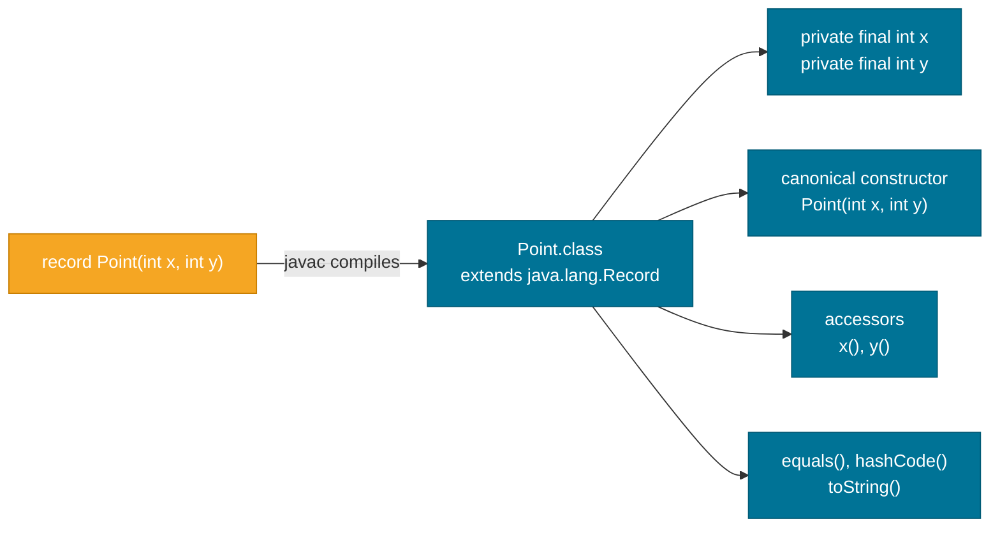

# Records (Java 16+)

> A record is Java's built-in, concise way to declare an immutable data carrier — it eliminates the boilerplate of fields, constructor, getters, `equals`, `hashCode`, and `toString` that you'd otherwise write by hand.

> Note: Clarifications — records were finalized in JDK 16 (see JEP 395). This page shows common patterns and compact constructor examples; consult the JEP and the Java language docs for exact restrictions and serialization caveats.

## What Problem Does It Solve?

Before records, writing a simple value class in Java was tedious and error-prone:

```java
// Pre-Java 16: 30+ lines for a 2-field value class
public final class Point {
    private final int x;
    private final int y;

    public Point(int x, int y) {
        this.x = x;
        this.y = y;
    }

    public int x()          { return x; }
    public int y()          { return y; }

    @Override
    public boolean equals(Object o) {
        if (!(o instanceof Point p)) return false;
        return x == p.x && y == p.y;
    }

    @Override public int hashCode()  { return Objects.hash(x, y); }
    @Override public String toString() { return "Point[x=" + x + ", y=" + y + "]"; }
}
```

Forgetting to update `equals` after adding a field is a classic bug. Records make all of this automatic.

## Records

A record declaration is a single line:

```java
public record Point(int x, int y) {}
```

The compiler automatically generates:

| Generated member | What it does |
|-----------------|--------------|
| `private final` fields | One per component (`x`, `y`) |
| **Canonical constructor** | `Point(int x, int y)` — assigns all components |
| **Accessor methods** | `x()`, `y()` — note: no `get` prefix |
| **`equals()`** | Value-based: two `Point`s are equal if all components are equal |
| **`hashCode()`** | Based on all component values |
| **`toString()`** | `"Point[x=3, y=4]"` |

### Using a Record

```java
Point p1 = new Point(3, 4);
Point p2 = new Point(3, 4);

System.out.println(p1.x());          // 3   ← accessor (not getX())
System.out.println(p1.y());          // 4
System.out.println(p1);              // Point[x=3, y=4]
System.out.println(p1.equals(p2));   // true — value equality
System.out.println(p1 == p2);        // false — different references
```

## How It Works

### Record Layout in the JVM



*A record compiles to a final class that extends `java.lang.Record`. The compiler fills in everything listed — you only declare the components.*

### Key Structural Rules

1. **Implicitly `final`** — records cannot be extended (no `extends` another class; they extend `Record`).
2. **Components are always `private final`** — immutability is built in.
3. **No extra instance fields** — you can declare static fields and static methods, but not instance fields beyond the components.
4. **Can implement interfaces** — useful for polymorphism.
5. **Cannot be `abstract`** — records represent concrete data.

### Compact Constructors

Records support a special **compact constructor** syntax for adding validation, without repeating the assignment boilerplate:

```java
public record Range(int min, int max) {

    // Compact constructor — no parameter list, no this.min = min etc.
    public Range {
        if (min > max) {
            throw new IllegalArgumentException(
                "min (" + min + ") must be <= max (" + max + ")");
        }
        // Implicit: this.min = min; this.max = max; — added by the compiler
    }
}

Range r1 = new Range(1, 10);  // OK
Range r2 = new Range(10, 1);  // IllegalArgumentException
```

The compact constructor body runs before the automatic field assignment — so validation fires first.

### Canonical vs. Custom Constructors

```java
public record User(String name, String email) {

    // Canonical constructor with extra validation (compact form)
    public User {
        Objects.requireNonNull(name, "name must not be null");
        name = name.strip();   // ← normalize before assignment
        if (!email.contains("@")) throw new IllegalArgumentException("Invalid email");
    }

    // Custom static factory — named alternative to the canonical constructor
    public static User of(String name, String email) {
        return new User(name, email);
    }
}
```

Note: you can also write the **full canonical constructor** explicitly if you prefer (with parameter list and explicit assignments), but the compact form is preferred for validation-only use cases.

### Records with Custom Methods

Records can have regular instance methods — they just can't add instance fields:

```java
public record Money(double amount, String currency) {

    public Money {
        if (amount < 0) throw new IllegalArgumentException("amount cannot be negative");
        currency = currency.toUpperCase(); // ← normalize
    }

    // Instance method — fine
    public Money add(Money other) {
        if (!this.currency.equals(other.currency))
            throw new IllegalArgumentException("Currency mismatch");
        return new Money(amount + other.amount, currency);
    }

    public boolean isZero() {
        return amount == 0;
    }

    // Static method — fine
    public static Money zero(String currency) {
        return new Money(0, currency);
    }
}
```

### Records Implementing Interfaces

```java
public interface Shape {
    double area();
}

public record Circle(double radius) implements Shape {
    public Circle {
        if (radius <= 0) throw new IllegalArgumentException("radius must be positive");
    }

    @Override
    public double area() {
        return Math.PI * radius * radius; // ← radius() accessor used implicitly
    }
}

public record Rectangle(double width, double height) implements Shape {
    @Override
    public double area() { return width * height; }
}

// Polymorphic usage
List<Shape> shapes = List.of(new Circle(5), new Rectangle(3, 4));
shapes.forEach(s -> System.out.println(s.area()));
```

### Records and Pattern Matching (Java 21)

Java 21 introduced **record patterns** for destructuring records in `switch` expressions:

```java
Object obj = new Point(3, 4);

String description = switch (obj) {
    case Point(int x, int y) when x == y -> "diagonal point at " + x; // ← record pattern + guard
    case Point(int x, int y)             -> "point at (" + x + ", " + y + ")";
    default                              -> "unknown";
};
```

This is powerful for data-oriented programming — you work with the structure of data, not its type.

## Code Examples

:::tip Practical Demo
See the [Records Demo](./demo/records-demo.md) for step-by-step runnable examples.
:::

### DTO Pattern with Records

```java
// HTTP response DTO — records are ideal: no logic, just data
public record UserResponse(
    long id,
    String name,
    String email,
    String createdAt
) {}

// In a Spring controller:
@GetMapping("/users/{id}")
public UserResponse getUser(@PathVariable long id) {
    User user = userService.findById(id);
    return new UserResponse(user.getId(), user.getName(),
                            user.getEmail(), user.getCreatedAt().toString());
}
```

### Using Records as Map Keys

Because `equals` and `hashCode` are value-based, records are safe and natural to use as `Map` keys:

```java
public record CacheKey(String region, String userId) {}

Map<CacheKey, UserData> cache = new HashMap<>();
cache.put(new CacheKey("EU", "user-123"), data);

// Later:
UserData result = cache.get(new CacheKey("EU", "user-123")); // ← works correctly
```

With a hand-written class you'd need to remember to implement `hashCode` and `equals` correctly. With a record, it's automatic.

## Trade-offs & When To Use / Avoid

| | Pros | Cons |
|--|------|------|
| **Use** | Eliminates boilerplate for data carriers | Cannot extend a class (already extends `Record`) |
| **Use** | Correct `equals`/`hashCode` by default | Cannot add mutable instance state |
| **Use** | Intrinsically immutable — thread-safe | Accessor style is `x()` not `getX()` — may conflict with JavaBean frameworks |
| **Use** | Pattern-matching destructuring (Java 21) | Not suitable for JPA entities (JPA needs mutable, no-arg constructors) |
| **Avoid** | JPA/Hibernate entities | |
| **Avoid** | Domain objects with complex mutable lifecycle | |
| **Avoid** | Classes that need to be subclassed | |

## Common Pitfalls

**Using records for JPA entities:**
```java
// BAD — JPA requires a no-arg constructor and mutable setters
@Entity
public record UserEntity(Long id, String name) {} // ← won't work with Hibernate
```

**Assuming `get` prefix accessors:**
```java
// Records use component name as accessor — NO 'get' prefix
Point p = new Point(1, 2);
p.getX(); // ← compile error
p.x();    // ← correct
```

**Adding mutable state via workarounds:**
```java
// BAD — mutable list breaks record's immutability promise
public record Playlist(String name, List<String> tracks) {
    // tracks can still be mutated externally!
}

// GOOD — defensive copy
public record Playlist(String name, List<String> tracks) {
    public Playlist {
        tracks = List.copyOf(tracks); // ← unmodifiable copy
    }
}
```

**Forgetting records extend `java.lang.Record`:** You can't write `extends Record` manually, and records can't extend any other class. They can only implement interfaces.

## Interview Questions

### Beginner

**Q: What is a record in Java?**  
**A:** A record (Java 16+) is a special kind of class for representing immutable data carriers. You declare the components (fields) in the record header, and the compiler automatically generates the canonical constructor, accessor methods (with no `get` prefix), `equals()`, `hashCode()`, and `toString()`. Records are implicitly `final`.

**Q: How do accessor methods in a record differ from JavaBean getters?**  
**A:** Record accessors use the component name directly: `point.x()` instead of `point.getX()`. This can cause issues with frameworks (Jackson, JPA) that expect the JavaBean naming convention, though Jackson handles records natively from Jackson 2.12+.

### Intermediate

**Q: What is a compact constructor?**  
**A:** A compact constructor omits the parameter list and the `this.field = param` assignments — the compiler adds them automatically. You only write the validation/normalization logic in the body. Compact constructors run before the automatic assignments, so they're ideal for input validation.

**Q: Can a record implement an interface?**  
**A:** Yes. Records can implement any number of interfaces. They cannot, however, extend a class (they already extend `java.lang.Record` implicitly). This makes interfaces the primary mechanism for using records polymorphically.

**Q: When should you use a record instead of a regular class?**  
**A:** Use a record when the type's only purpose is to carry data with no mutable behavior — DTOs, value objects, configuration snapshots, API responses, map keys. Use a regular class when you need mutable state, lifecycle management, JPA mapping, or inheritance.

### Advanced

**Q: What is a record pattern and when was it introduced?**  
**A:** Record patterns (Java 21, JEP 440) allow destructuring a record's components directly in a `switch` expression or `instanceof` pattern. For example, `case Point(int x, int y) -> ...` both matches a `Point` and binds `x` and `y` to the component values in one step, enabling concise data-oriented code without manual accessor calls.

**Q: Why can't you use records as JPA entities?**  
**A:** JPA/Hibernate requires entities to: (1) have a public or protected no-arg constructor, (2) have mutable fields (so Hibernate can set values after instantiation via reflection), and (3) not be `final` (to create proxy subclasses for lazy loading). Records violate all three requirements — they're immutable, `final`, and their canonical constructor requires all fields.

## Further Reading

- [JEP 395 — Records](https://openjdk.org/jeps/395) — the formal Java Enhancement Proposal with rationale and spec.
- [dev.java — Records](https://dev.java/learn/records/) — practical guide with modern examples.
- [Oracle Java Docs — Records](https://docs.oracle.com/en/java/javase/21/language/records.html) — Java SE 21 official language reference.

## Related Notes

- [Encapsulation](./encapsulation.md) — records automate the encapsulation boilerplate of immutable classes.
- [Sealed Classes (Java 17+)](./sealed-classes.md) — records and sealed classes work together: sealed interfaces + record implementations enable exhaustive pattern matching.
- [Classes & Objects](./classes-and-objects.md) — understand classic class structure first to appreciate what records eliminate.
