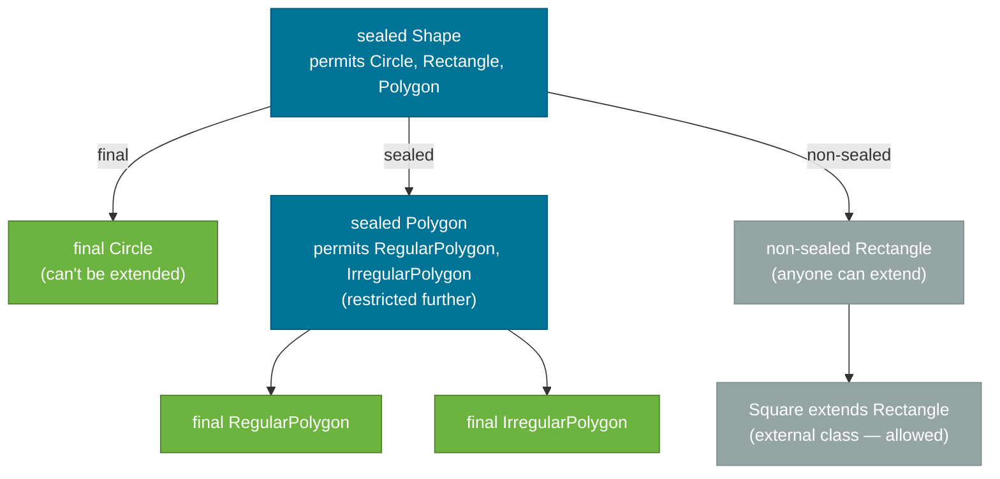

# Sealed Classes (Java 17+)

> A sealed class explicitly lists every class that is permitted to extend it — giving you a **closed type hierarchy** that the compiler can enforce, and enabling `switch` expressions to be **exhaustive without a default branch**.

> Note: Clarifications — sealed classes were finalized in JDK 17 (see JEP 409). The `permits` rules are module/package-sensitive; consult the JEP for exact visibility and JVM classfile attributes. Treat exhaustiveness guarantees as compile-time checks — runtime behavior depends on the compiled code and permitted subclasses.

## What Problem Does It Solve?

In Java, any class can be subclassed by default. This is great for open extension points, but for **domain types with a fixed set of variants**, open extension is a liability.

Consider a payment result: it's either a `Success`, a `Failure`, or a `Pending` — and nothing else ever. If `PaymentResult` is an open class:

- Someone outside your package can subclass it with an `UnknownResult`
- Your `switch` can't guarantee it handles all cases — so the compiler forces a `default` branch
- A reviewer can't tell by reading the API that the variants are exactly three

Sealed classes fix this: you declare exactly who the permitted subclasses are, the compiler enforces it, and `switch` expressions can match all variants exhaustively without a `default` fallback.

## What Is It?

A `sealed` class (or interface) uses the `permits` clause to list the **only** classes allowed to extend/implement it:

```java
public sealed class PaymentResult
    permits SuccessResult, FailureResult, PendingResult {
}
```

Each permitted subclass must be one of:
- `final` — no further extension
- `sealed` — extends the hierarchy with its own restrictions
- `non-sealed` — re-opens the class for arbitrary extension

## How It Works

### Basic Syntax

```java
// The sealed parent
public sealed class Shape
    permits Circle, Rectangle, Triangle {}

// Permitted subclasses — must be in same package (or module)
public final class Circle extends Shape {
    private final double radius;
    public Circle(double radius) { this.radius = radius; }
    public double radius() { return radius; }
}

public final class Rectangle extends Shape {
    private final double width;
    private final double height;
    public Rectangle(double width, double height) {
        this.width = width;
        this.height = height;
    }
    public double width()  { return width; }
    public double height() { return height; }
}

public final class Triangle extends Shape {
    private final double base;
    private final double height;
    public Triangle(double base, double height) {
        this.base = base;
        this.height = height;
    }
    public double base()   { return base; }
    public double height() { return height; }
}
```

### Exhaustive Pattern Matching

Once the hierarchy is sealed, the compiler knows all subtypes. A `switch` expression can cover them all **without a `default`**:

```java
double area = switch (shape) {
    case Circle c    -> Math.PI * c.radius() * c.radius();
    case Rectangle r -> r.width() * r.height();
    case Triangle t  -> 0.5 * t.base() * t.height();
    // No 'default' needed — every Shape has been handled
};
```

If you later add a new shape (e.g., `Hexagon`) to the `permits` list but forget to update the `switch`, the **compiler flags it as a compilation error** — not a runtime crash. This is a huge safety improvement.

### The Three Subclass Modifiers



*`final` closes a branch; `sealed` creates a sub-hierarchy with its own `permits`; `non-sealed` re-opens a branch to the world (use sparingly).*

### Sealed Interfaces

Sealed works on interfaces too — and this is the most idiomatic modern pattern:

```java
public sealed interface PaymentResult
    permits PaymentResult.Success, PaymentResult.Failure, PaymentResult.Pending {

    // Nested records work perfectly — concise and cohesive
    record Success(String transactionId, double amount) implements PaymentResult {}
    record Failure(String errorCode, String message)   implements PaymentResult {}
    record Pending(String pendingId, String eta)       implements PaymentResult {}
}
```

Usage:

```java
PaymentResult result = processPayment(order);

String message = switch (result) {
    case PaymentResult.Success s  -> "Paid " + s.amount() + " (tx: " + s.transactionId() + ")";
    case PaymentResult.Failure f  -> "Failed: " + f.message() + " [" + f.errorCode() + "]";
    case PaymentResult.Pending p  -> "Pending — ETA: " + p.eta();
};
```

This is the **sealed interface + nested records** pattern — clean, type-safe, and compiler-verified. It's the Java equivalent of algebraic data types (ADTs) in functional languages like Haskell or Scala.

### Location Rules

Permitted subclasses must be in **the same compilation unit** or **the same package** as the sealed class:

```
com.example.payment
├── PaymentResult.java   ← sealed interface
├── SuccessResult.java   ← permitted — same package ✅
├── FailureResult.java   ← permitted — same package ✅
└── PendingResult.java   ← permitted — same package ✅

com.example.other
└── CustomResult.java    ← NOT permitted — different package ❌
```

If using **modules** (Java 9+), permitted subclasses can be in different packages within the **same module**.

## Code Examples

:::tip Practical Demo
See the [Sealed Classes Demo](./demo/sealed-classes-demo.md) for step-by-step runnable examples.
:::

### Result Type — Railway-Oriented Design

```java
public sealed interface Result<T>
    permits Result.Ok, Result.Err {

    record Ok<T>(T value)           implements Result<T> {}
    record Err<T>(String message)   implements Result<T> {}

    // Utility: map over the success case
    default <R> Result<R> map(java.util.function.Function<T, R> mapper) {
        return switch (this) {
            case Ok<T> ok   -> new Ok<>(mapper.apply(ok.value()));
            case Err<T> err -> new Err<>(err.message());
        };
    }
}

// Usage
Result<Integer> result = divide(10, 2);

String output = switch (result) {
    case Result.Ok<Integer> ok   -> "Result: " + ok.value();
    case Result.Err<Integer> err -> "Error: " + err.message();
};

Result<Integer> divide(int a, int b) {
    if (b == 0) return new Result.Err<>("Division by zero");
    return new Result.Ok<>(a / b);
}
```

### AST Node Modeling (Compiler / Expression Evaluator)

```java
public sealed interface Expr
    permits Expr.Num, Expr.Add, Expr.Mul {

    record Num(double value)          implements Expr {}
    record Add(Expr left, Expr right) implements Expr {}
    record Mul(Expr left, Expr right) implements Expr {}
}

double eval(Expr expr) {
    return switch (expr) {
        case Expr.Num n  -> n.value();
        case Expr.Add a  -> eval(a.left()) + eval(a.right());
        case Expr.Mul m  -> eval(m.left()) * eval(m.right());
    };
}

// Evaluates: (3 + 4) * 2 = 14.0
double result = eval(new Expr.Mul(
    new Expr.Add(new Expr.Num(3), new Expr.Num(4)),
    new Expr.Num(2)
));
```

This is a classic use case: sealed classes model a closed set of expression types, and recursive `switch` evaluates them without any `instanceof` casting.

## Trade-offs & When To Use / Avoid

| | Pros | Cons |
|--|------|------|
| **Use** | Exhaustive `switch` without `default` — compiler-checked | Only works for truly closed hierarchies |
| **Use** | Documents intent: "these are the only variants" | Permitted classes must be in same package/module |
| **Use** | Replaces brittle `instanceof` chains elegantly | Not a fit for open extension points (use interfaces) |
| **Use** | Works beautifully with records as implementations | Pre-Java 17 codebases can't use it |
| **Avoid** | Open APIs designed for third-party extension | |
| **Avoid** | Hierarchies where new variants are expected from outside the module | |

## Common Pitfalls

**Using `non-sealed` loosely — defeating the purpose:**
```java
// If ALL permitted subclasses are non-sealed, you've lost exhaustiveness
sealed class Foo permits Bar {}
non-sealed class Bar extends Foo {}
// Now anyone can extend Bar, and switch on Foo can't be exhaustive
```

**Forgetting to update `switch` when adding a new variant:**
```java
// This is actually a FEATURE, not a pitfall — the compiler catches it:
// error: the switch expression does not cover all possible input values
// Add the new case and the code will compile again.
```

**Confusing sealed with `final`:**
- `final` means "this specific class can't be extended at all".
- `sealed` means "only the listed classes can extend this class". The listed classes themselves can be non-final.

**Permitted classes not being adjacent:**
```java
// Classes in different packages fail unless you're using modules
// com.a.Shape (sealed, permits com.b.Circle) — compile error unless modular
```

## Interview Questions

### Beginner

**Q: What is a sealed class in Java?**  
**A:** A sealed class (Java 17+) uses the `sealed` keyword with a `permits` clause to list the only classes that may extend it. This creates a closed type hierarchy. Each permitted subclass must be `final`, `sealed`, or `non-sealed`. Sealed classes let the compiler provide exhaustive `switch` expressions without a `default` branch.

**Q: What modifiers are permitted subclasses required to use?**  
**A:** One of exactly three: `final` (no further extension), `sealed` (extends the hierarchy with its own `permits`), or `non-sealed` (re-opens extension to any class). Not using one of these is a compile error.

### Intermediate

**Q: Why would you prefer a sealed interface with record implementations over a traditional class hierarchy?**  
**A:** It's more concise, immutable by default (records), and requires zero boilerplate (`equals`, `hashCode`, `toString` come free). The sealed interface declares the variants; each record provides the data structure for that variant. The combination models algebraic data types (ADTs) natively in Java, enabling safe, exhaustive pattern matching.

**Q: How does a sealed class enable exhaustive switch expressions?**  
**A:** When the compiler knows all permitted subtypes (because the hierarchy is sealed), it can verify that every case in a `switch` is covered. If you add a new permitted subtype and don't add a corresponding `case`, the compiler reports an error. With an unsealed hierarchy, the compiler can't guarantee completeness and requires a `default` clause.

### Advanced

**Q: How do sealed classes relate to algebraic data types (ADTs)?**  
**A:** ADTs from functional programming (Haskell's `data`, Rust's `enum`, Scala's `sealed trait`) represent a type that is exactly one of a fixed set of variants, each with its own data. Java's sealed interfaces + record implementations are the direct equivalent: the sealed interface is the sum type, and the records are the product types (variants). Pattern matching (`switch`) on them is the `case` expression of functional languages.

**Q: What happens if you add a new variant to a sealed hierarchy that is consumed by a library?**  
**A:** Downstream code that uses the sealed type in a `switch` expression will fail to **compile** (not at runtime) — the switch is no longer exhaustive. This is intentional: the compiler forces callers to handle the new case. This is a source-incompatible but type-safe change. Contrast with inheritance-based designs, where a new subclass causes runtime `ClassCastException`s in `instanceof` chains — which are much harder to track down.

## Further Reading

- [JEP 409 — Sealed Classes](https://openjdk.org/jeps/409) — the formal proposal; explains the motivation and design trade-offs.
- [dev.java — Sealed Classes](https://dev.java/learn/sealed-classes/) — concise tutorial with pattern-matching examples.
- [Oracle Java SE 21 Docs — Sealed Classes](https://docs.oracle.com/en/java/javase/21/language/sealed-classes-and-interfaces.html) — language reference.

## Related Notes

- [Records (Java 16+)](./records.md) — records are the idiomatic implementation type for sealed hierarchy variants.
- [Polymorphism](./polymorphism.md) — sealed classes improve polymorphism safety by making `switch` exhaustive and eliminating unchecked `instanceof` chains.
- [Abstraction](./abstraction.md) — sealed interfaces are a form of restricted abstraction: they define a contract that only trusted types implement.
