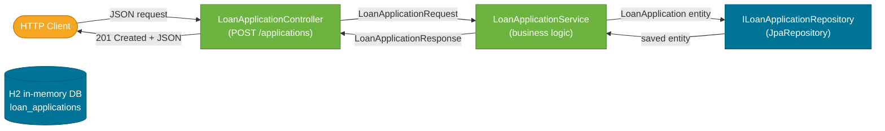

# Project Overview

> The Loan Application Evaluator is a Spring Boot 4 REST service that accepts a loan application and returns either an approved offer with calculated EMI or a list of rejection reasons — all evaluated by pure business logic, persisted to an in-memory H2 database.

## What Problem Does It Solve?

When a borrower applies for a loan, a bank needs to answer three questions fast:

1. **Is this applicant eligible?** (credit score, age, income-to-EMI ratio)
2. **How risky is this loan?** (risk band → interest rate premium)
3. **What are the repayment terms?** (EMI, total payable)

Doing this manually through spreadsheets or ad-hoc scripts is error-prone and untestable. A structured REST service centralises the rules, makes them auditable, and lets front-ends integrate cleanly.

## What Is It?

A single-endpoint Spring Boot API that:
- Accepts a `POST /applications` with applicant details and loan request
- Runs eligibility checks, risk classification, and EMI calculation in one service call
- Returns `201 Created` with either an approved loan offer or rejection reasons
- Persists every application (approved or rejected) for audit purposes

The project deliberately keeps its scope narrow — one endpoint, one service, one table — so every design decision is visible and explainable.

## Tech Stack

| Layer | Technology |
|-------|-----------|
| Language | Java 17 |
| Framework | Spring Boot 4.0.3 |
| Web | Spring Web (Spring MVC) |
| Persistence | Spring Data JPA + H2 (in-memory) |
| Validation | Spring Boot Starter Validation (Jakarta Bean Validation) |
| Tests | JUnit 5 + Mockito |
| Build | Maven (Maven Wrapper) |

:::info Why Spring Boot 4?
Spring Boot 4 targets **Jakarta EE 11** and **Java 17+**. Package names use `jakarta.*` (not `javax.*`). This project is a current-generation example — not legacy Spring Boot 2.x.
:::

## Project Architecture at a Glance



*A request enters the controller, is processed by the service (all business logic lives here), persisted via the repository, then the response flows back.*

## How to Run It Locally

### Prerequisites
- Java 17 or higher (`java -version`)
- Maven Wrapper included — no separate Maven install needed

### Steps

```bash
# 1. Navigate to the source
cd projects/loan-application-evaluator

# 2. Build (compiles + runs tests)
./mvnw clean install           # Linux/Mac
.\mvnw.cmd clean install       # Windows PowerShell

# 3. Start the app
./mvnw spring-boot:run

# App starts on: http://localhost:8084
```

### Try It with curl

```bash
curl -X POST http://localhost:8084/applications \
  -H "Content-Type: application/json" \
  -d '{
    "applicant": {
      "name": "John Doe",
      "age": 30,
      "monthlyIncome": 75000,
      "employmentType": "SALARIED",
      "creditScore": 720
    },
    "loan": {
      "amount": 500000,
      "tenureMonths": 36,
      "purpose": "PERSONAL"
    }
  }'
```

**Approved response:**

```json
{
  "applicationId": "a1b2c3d4-...",
  "status": "APPROVED",
  "riskBand": "MEDIUM",
  "offer": {
    "interestRate": 13.5,
    "tenureMonths": 36,
    "emi": 16967.64,
    "totalPayable": 610835.04
  }
}
```

### H2 Console

The H2 in-browser console is enabled for development.

- URL: `http://localhost:8084/h2-console`
- JDBC URL: `jdbc:h2:mem:loanauditdb`
- Username: `sa`, Password: *(empty)*

## Key Design Decisions

| Decision | Choice | Reason |
|----------|--------|--------|
| DTOs | Java Records | Immutable, concise, no boilerplate |
| Domain objects | `@Embeddable` value objects | Single table, simple lifecycle |
| Financial math | `BigDecimal` with scale=2, `HALF_UP` | Avoids floating-point errors |
| Rejection reasons | Enum | Type-safe, extensible, no typos |
| Database | H2 in-memory | Easy setup and switching to PostgreSQL later |
| Lombok | Not used | Java records + manual builder = no dependency |

## Common Pitfalls

- **Using `double`/`float` for money** — always use `BigDecimal` for anything financial.
- **Forgetting `@Valid` on the request body** — without it, constraint violations on nested records are silently ignored.
- **`ddl-auto=create-drop`** — the H2 schema is wiped on every restart; do not use this in production.

## Further Reading

- [Domain Model](./02-domain-model.md) — the next logical step: understand the entities and DTOs.
- [Spring Boot Auto-Configuration](../../spring-boot/index.md) — how Spring Boot wires everything together.
- [BigDecimal in Java](../../java/core-apis/index.md) — why floating-point math is unsuitable for financial calculations.

## Related Notes

- [Domain Model](./02-domain-model.md) — entities, DTOs, enums.
- [API Contract](./03-api-contract.md) — endpoint, request shape, validation rules.
- [Service & Business Logic](./04-service-and-business-logic.md) — where the real work happens.
