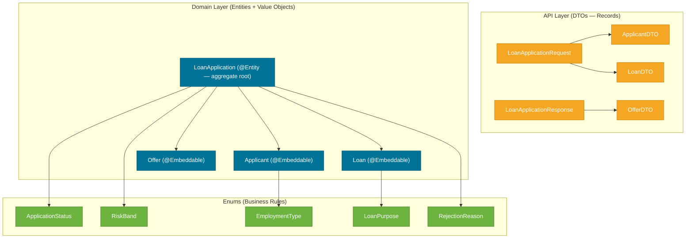

# Domain Model

> The domain model is the vocabulary of the application — it names the things that matter (Applicant, Loan, Offer) and the rules that govern them (RiskBand, RejectionReason).

## What Problem Does It Solve?

Without a well-defined domain model, business logic leaks into controllers, validation is scattered, and terms like "risk" mean different things in different places. A coherent domain model makes the code read like the business it models.

## The Three Layers of the Domain

The project separates its domain objects into three layers with distinct responsibilities:



*DTOs carry data across the HTTP boundary. Entities own persistence. Enums encode the business rules as type-safe constants.*

## DTOs — Java Records

All DTOs are **Java records** — immutable data carriers introduced in Java 16.

### `LoanApplicationRequest`

The top-level input. It composes `ApplicantDTO` and `LoanDTO` and cascades Bean Validation to both with `@Valid`.

```java
public record LoanApplicationRequest(
        @NotNull(message = "Applicant details are required")
        @Valid
        ApplicantDTO applicant,   // ← @Valid triggers validation on the nested record

        @NotNull(message = "Loan details are required")
        @Valid
        LoanDTO loan
){}
```

### `ApplicantDTO`

Captures borrower information with constraints that enforce the bank's acceptance criteria *at the API layer*.

```java
public record ApplicantDTO(
        @NotBlank
        @Pattern(regexp = "^[a-zA-Z ]+$", message = "Only letters and spaces allowed")
        String name,

        @NotNull @Min(21) @Max(60)
        Integer age,             // ← age range enforced before business logic runs

        @NotNull @DecimalMin("0.01")
        BigDecimal monthlyIncome,

        @NotNull
        EmploymentType employmentType,  // ← enum; invalid string → 400 automatically

        @NotNull @Min(300) @Max(900)
        Integer creditScore
){}
```

### `LoanDTO`

Loan request parameters with range validation that prevents unreasonable inputs from ever reaching the service.

```java
public record LoanDTO(
        @NotNull @DecimalMin("10000") @DecimalMax("5000000")
        BigDecimal amount,

        @NotNull @Min(6) @Max(360)
        Integer tenureMonths,   // ← 6 months to 30 years

        @NotNull
        LoanPurpose purpose
){}
```

### `LoanApplicationResponse`

The return value. Uses `@JsonInclude(NON_NULL)` so the JSON doesn't show `"offer": null` for rejections or `"rejectionReasons": null` for approvals.

```java
public record LoanApplicationResponse(
        String applicationId,
        ApplicationStatus status,
        RiskBand riskBand,

        @JsonInclude(JsonInclude.Include.NON_NULL)
        OfferDTO offer,           // ← absent from rejection responses

        @JsonInclude(JsonInclude.Include.NON_NULL)
        List<RejectionReason> rejectionReasons  // ← absent from approval responses
){}
```

## JPA Entities — The Persistence Side

### `LoanApplication` — The Aggregate Root

The single `@Entity` in the project. Rather than creating separate tables for `Applicant`, `Loan`, and `Offer`, this project uses **`@Embeddable` value objects** — all data lands in one table (`loan_applications`).

```java
@Entity
@Table(name = "loan_applications")
public class LoanApplication {

    @Id
    private String applicationId;   // ← UUID string, generated in @PrePersist

    @Embedded
    private Applicant applicant;    // ← columns merge into loan_applications table

    @Embedded
    @AttributeOverrides({           // ← rename columns to avoid clashes
        @AttributeOverride(name = "amount", column = @Column(name = "loan_amount")),
        @AttributeOverride(name = "tenureMonths", column = @Column(name = "loan_tenure_months")),
        @AttributeOverride(name = "purpose", column = @Column(name = "loan_purpose"))
    })
    private Loan loan;

    @Embedded
    @AttributeOverrides({
        @AttributeOverride(name = "interestRate",  column = @Column(name = "offer_interest_rate")),
        @AttributeOverride(name = "tenureMonths",  column = @Column(name = "offer_tenure_months")),
        @AttributeOverride(name = "emi",           column = @Column(name = "offer_emi")),
        @AttributeOverride(name = "totalPayable",  column = @Column(name = "offer_total_payable"))
    })
    private Offer offer;            // ← nullable for rejected applications

    @Enumerated(EnumType.STRING)
    private ApplicationStatus status;   // ← APPROVED or REJECTED stored as string

    @Enumerated(EnumType.STRING)
    private RiskBand riskBand;          // ← null for rejected applications

    @ElementCollection
    @CollectionTable(name = "rejection_reasons",
                     joinColumns = @JoinColumn(name = "application_id"))
    @Enumerated(EnumType.STRING)
    @Column(name = "reason")
    private List<RejectionReason> rejectionReasons;  // ← stored in a separate join table
```

:::info `@AttributeOverrides` — Why?
`Loan` has a `tenureMonths` field, and so does `Offer`. If both are embedded in the same table, JPA would try to create two `tenure_months` columns — a naming clash. `@AttributeOverride` renames them to `loan_tenure_months` and `offer_tenure_months`.
:::

### UUID Generation with `@PrePersist`

```java
@PrePersist
public void generateId() {
    if (this.applicationId == null) {
        this.applicationId = UUID.randomUUID().toString();  // ← generates before first INSERT
    }
    if (this.rejectionReasons == null) {
        this.rejectionReasons = new ArrayList<>();          // ← prevents NPE on save
    }
}
```

The ID is a `String` (UUID) rather than a `Long` auto-increment. This is common in distributed systems where IDs must be globally unique across nodes.

### `Applicant`, `Loan`, `Offer` — `@Embeddable` Value Objects

These are JPA value objects: they have no `@Id`, exist only inside `LoanApplication`, and share its lifecycle. The fields of each are flattened into the parent entity's table.

```java
@Embeddable
public class Applicant {
    private String name;
    private Integer age;
    private BigDecimal monthlyIncome;
    @Enumerated(EnumType.STRING)
    private EmploymentType employmentType;
    private Integer creditScore;
    // constructors, getters only — no setters
}
```

## The Five Enums

Enums encode business rules that would otherwise be magic strings scattered in `if` statements.

| Enum | Values | Role |
|------|--------|------|
| `ApplicationStatus` | `APPROVED`, `REJECTED` | Final decision on the application |
| `RiskBand` | `LOW`, `MEDIUM`, `HIGH` | Drives interest rate premium |
| `EmploymentType` | `SALARIED`, `SELF_EMPLOYED` | Adds an employment premium to the rate |
| `LoanPurpose` | `PERSONAL`, `HOME`, `VEHICLE`, `EDUCATION`, `BUSINESS` | Recorded but not used in rate calculation (extensible) |
| `RejectionReason` | `CREDIT_SCORE_TOO_LOW`, `AGE_TENURE_LIMIT_EXCEEDED`, `EMI_EXCEEDS_60_PERCENT`, `EMI_EXCEEDS_50_PERCENT` | Tells the applicant exactly why they were rejected |

## Why Records for DTOs, Not Lombok?

| Feature | Java Record | Lombok `@Data` |
|---------|------------|----------------|
| Immutability | Yes — all fields are `final` | Requires `@Value` |
| Boilerplate | Zero | Near-zero with annotation |
| External dependency | None | Lombok jar required |
| JDK support | Built-in since Java 16 | Annotation processor |
| Reflection-safety | Good | Occasional issues with some frameworks |

Records win when you want immutable data carriers with no dependencies. The project consistently uses records for DTOs and embeddable classes for persistence.

## Common Pitfalls

- **Forgetting `@AttributeOverride` on embedded types with shared field names** — JPA will fail with a "Repeated column" exception at startup.
- **Using `float`/`double` for `monthlyIncome` or `amount`** — `BigDecimal` is mandatory for money fields.
- **Using `EnumType.ORDINAL`** — always use `EnumType.STRING`; ordinal breaks if you ever reorder enum constants.
- **Mutable embedded objects** — `@Embeddable` classes should be treated as value objects (effectively immutable once set).

## Interview Questions

**Q: What is the difference between `@Embeddable` and `@Entity`?**  
**A:** An `@Entity` has its own identity (`@Id`) and lives in its own table. An `@Embeddable` has no identity and is stored inline in its owning entity's table. Use `@Embeddable` for value objects whose lifecycle is controlled entirely by the parent.

**Q: Why use `@AttributeOverride`?**  
**A:** When two `@Embeddable` types embedded in the same `@Entity` share a field name (like `tenureMonths`), JPA would try to create duplicate columns. `@AttributeOverride` maps each field to a unique column name.

**Q: Why use `@JsonInclude(NON_NULL)` on a record?**  
**A:** To prevent `null` fields from appearing in the JSON response. An approved application has no `rejectionReasons`, and a rejected one has no `offer` — without `NON_NULL`, the JSON would include `"offer": null` which is confusing for API consumers.

## Further Reading

- [Java Records (dev.java)](https://dev.java/learn/using-record-to-model-immutable-data/) — official Java record documentation.
- [JPA Embeddable entities (Baeldung)](https://www.baeldung.com/jpa-embedded-embeddable) — detailed guide with examples.

## Related Notes

- [API Contract](./03-api-contract.md) — how the DTOs are validated at the API boundary.
- [Persistence Layer](./05-persistence-layer.md) — how the entities map to the H2 schema.
- [Service & Business Logic](./04-service-and-business-logic.md) — how the enums drive the business rules.
