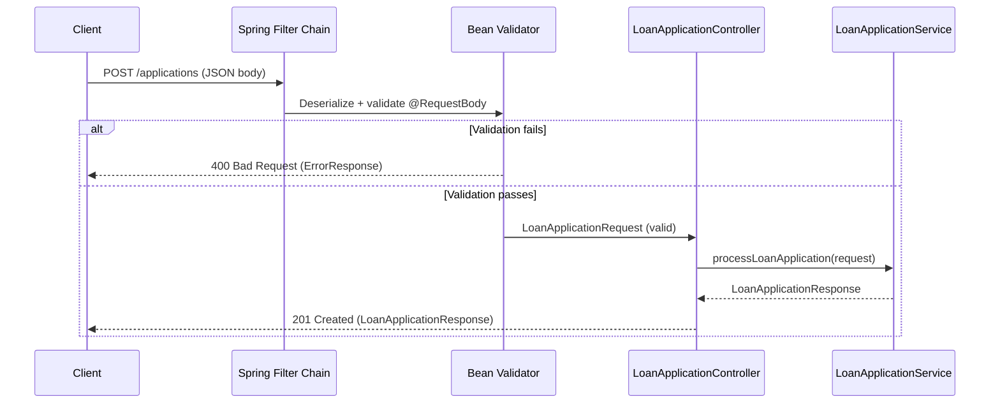

# API Contract

> The application exposes a single endpoint — `POST /applications` — which is the entire public surface of the service. Understanding its contract means understanding what the API accepts, what it rejects, and what it returns in every case.

## What Problem Does It Solve?

Without a well-defined API contract, clients guess what to send, errors are cryptic, and the backend silently processes garbage input. A contract with validation rules tells clients exactly what's required and returns machine-readable errors when something is wrong.

## The Single Endpoint

```
POST /applications
Content-Type: application/json
```

There is deliberately one endpoint. The service is built around a single use case: evaluate a loan application. There is no `GET /applications/{id}` because the project focuses on the evaluation flow, not a full CRUD API.

## Request Shape

### Full Request Example

```json
{
  "applicant": {
    "name": "John Doe",
    "age": 30,
    "monthlyIncome": 75000,
    "employmentType": "SALARIED",
    "creditScore": 720
  },
  "loan": {
    "amount": 500000,
    "tenureMonths": 36,
    "purpose": "PERSONAL"
  }
}
```

### Field Validation Rules

**Applicant fields:**

| Field | Type | Constraints |
|-------|------|------------|
| `name` | String | Required, letters and spaces only |
| `age` | Integer | Required, 21–60 |
| `monthlyIncome` | Number | Required, > 0 |
| `employmentType` | Enum | `SALARIED` or `SELF_EMPLOYED` |
| `creditScore` | Integer | Required, 300–900 |

**Loan fields:**

| Field | Type | Constraints |
|-------|------|------------|
| `amount` | Number | Required, 10,000–5,000,000 |
| `tenureMonths` | Integer | Required, 6–360 |
| `purpose` | Enum | `PERSONAL`, `HOME`, `VEHICLE`, `EDUCATION`, `BUSINESS` |

:::warning Enum fields
If `employmentType` or `purpose` contains a value not in the enum (e.g. `"PART_TIME"`), Spring returns a `400 Bad Request` with message `"Malformed JSON request"` — handled by the `HttpMessageNotReadableException` handler in `GlobalExceptionHandler`.
:::

## The Controller

```java
@RestController
@RequestMapping("/applications")
public class LoanApplicationController {

    private final LoanApplicationService loanApplicationService;

    public LoanApplicationController(LoanApplicationService loanApplicationService) {
        this.loanApplicationService = loanApplicationService;  // ← constructor injection, no @Autowired needed
    }

    @PostMapping
    public ResponseEntity<LoanApplicationResponse> createApplication(
            @Valid @RequestBody LoanApplicationRequest request) {  // ← @Valid triggers cascading validation
        LoanApplicationResponse response = loanApplicationService.processLoanApplication(request);
        return ResponseEntity.status(HttpStatus.CREATED).body(response);  // ← always 201 Created
    }
}
```

Key points:
- **Constructor injection** — not `@Autowired` field injection; easier to test and more explicit.
- **`@Valid` on `@RequestBody`** — without this, constraint annotations on the record fields are ignored. `@Valid` also cascades to nested records via `@Valid` on the `applicant` and `loan` fields in `LoanApplicationRequest`.
- **Always `201 Created`** — both approved and rejected responses return `201 Created`. The application record has been created; it just has `status: REJECTED`. This is a conscious design choice: the application was processed, not failed to process.

## Response Shapes

### Approved Response (`201 Created`)

```json
{
  "applicationId": "a1b2c3d4-e5f6-7890-abcd-ef1234567890",
  "status": "APPROVED",
  "riskBand": "MEDIUM",
  "offer": {
    "interestRate": 13.50,
    "tenureMonths": 36,
    "emi": 16967.64,
    "totalPayable": 610835.04
  }
}
```

### Rejected Response (`201 Created`)

```json
{
  "applicationId": "b2c3d4e5-f6a7-8901-bcde-f12345678901",
  "status": "REJECTED",
  "rejectionReasons": ["CREDIT_SCORE_TOO_LOW", "AGE_TENURE_LIMIT_EXCEEDED"]
}
```

Note: `offer` and `riskBand` are absent from rejected responses (not `null`) because of `@JsonInclude(NON_NULL)` on those fields.

### Validation Error Response (`400 Bad Request`)

```json
{
  "timestamp": "2026-03-08T10:30:00",
  "status": 400,
  "error": "Validation Failed",
  "messages": [
    "Minimum age must be 21",
    "Credit score must be between 300 and 900"
  ]
}
```

## Request Flow — What Happens Step by Step



*Validation happens inside the Spring MVC dispatch cycle before the controller method is called. If any constraint fires, the `GlobalExceptionHandler` intercepts it and returns `400`.*

## How `@Valid` Cascades

The validation chain works because `@Valid` is applied at every level:

```
@PostMapping
  └── @Valid @RequestBody LoanApplicationRequest
        ├── @Valid ApplicantDTO applicant
        │     ├── @NotBlank name
        │     ├── @Min(21) @Max(60) age
        │     └── @Min(300) @Max(900) creditScore
        └── @Valid LoanDTO loan
              ├── @DecimalMin("10000") amount
              └── @Min(6) @Max(360) tenureMonths
```

Without `@Valid` on the nested `applicant` and `loan` fields inside `LoanApplicationRequest`, the constraints on `ApplicantDTO` and `LoanDTO` would never be checked. This is a common mistake.

## Common Pitfalls

- **Forgetting `@Valid` on `@RequestBody`** — the controller compiles and runs without it, but no constraints fire. Everything is silently accepted.
- **Forgetting `@Valid` on nested records** — even with `@Valid` on the outer `@RequestBody`, nested records need their own `@Valid` annotation to cascade validation depth.
- **Returning `200 OK` vs `201 Created`** — think about HTTP semantics. `POST` that creates a resource should return `201`; this project correctly returns `201` even for rejected applications because a record is always created.
- **Putting business rules in the controller** — validation annotations are for format/range checks (structural validity). Business rules like "credit score must be ≥ 600 for approval" belong in the service, not the controller.

## Interview Questions

**Q: Why does the controller always return `201 Created` even for rejected applications?**  
**A:** Because the `POST /applications` endpoint *creates* a `LoanApplication` record in the database regardless of outcome. The application was processed successfully from the API's perspective — it just resulted in a rejection. `201` refers to the HTTP operation (resource created), not the business outcome.

**Q: What is the difference between `@Valid` and `@Validated`?**  
**A:** `@Valid` is from Jakarta Bean Validation and triggers standard constraint validation. `@Validated` is a Spring-specific annotation that also supports validation groups (running a subset of constraints). For simple cases like this, `@Valid` is sufficient.

**Q: What happens if an invalid enum value is sent (e.g., `"employmentType": "CONTRACTOR"`)?**  
**A:** Jackson cannot deserialize `"CONTRACTOR"` into `EmploymentType` and throws `HttpMessageNotReadableException`. The `GlobalExceptionHandler` catches this and returns `400 Bad Request` with the message `"Malformed JSON request"`.

## Further Reading

- [Spring MVC Validation (docs.spring.io)](https://docs.spring.io/spring-framework/reference/web/webmvc/mvc-controller/ann-validation.html)
- [Jakarta Bean Validation (jakarta.ee)](https://jakarta.ee/specifications/bean-validation/)

## Related Notes

- [Domain Model](./02-domain-model.md) — the DTOs and records used in the request/response.
- [Exception Handling](./06-exception-handling.md) — how validation errors become structured JSON responses.
- [Service & Business Logic](./04-service-and-business-logic.md) — what happens inside `processLoanApplication`.
