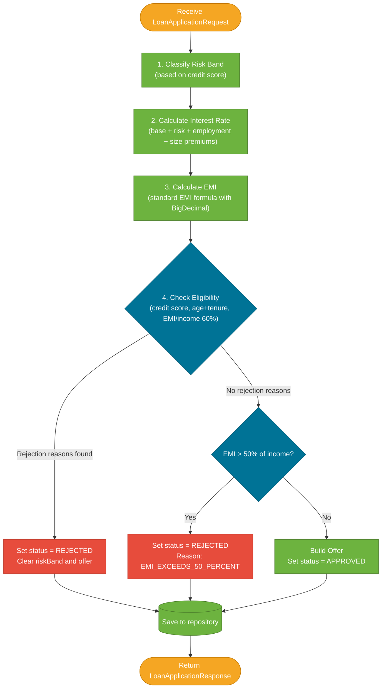

# Service & Business Logic

> `LoanApplicationService` is the heart of the project — it orchestrates four steps (risk classification → interest rate → EMI → eligibility) and builds a response record that either approves an offer or explains why the application was rejected.

## What Problem Does It Solve?

Loan evaluation involves several dependent calculations: you need the risk band before you can calculate the rate, and you need the rate before you can calculate the EMI that eligibility is checked against. Cramming this into a controller would make it untestable. Encapsulating it in a single service makes every rule visible, isolated, and easy to unit-test.

## The Four-Step Evaluation Flow



*Steps 1–3 always run. The eligibility check (step 4) is split into two tiers — the second tier only runs if the first passes.*

## Step 1: Classify Risk Band

The credit score maps to one of three risk bands:

```java
private RiskBand classifyRiskBand(Integer creditScore) {
    if (creditScore >= 750) {
        return RiskBand.LOW;     // ← excellent credit
    } else if (creditScore >= 650) {
        return RiskBand.MEDIUM;  // ← good credit
    } else {
        return RiskBand.HIGH;    // ← below 650, still eligible if >= 600
    }
}
```

| Credit Score | Risk Band |
|-------------|-----------|
| 750–900 | LOW |
| 650–749 | MEDIUM |
| 600–649 | HIGH |
| < 600 | Rejected (credit score too low — never reaches band classification) |

Note: Applications with credit score < 600 are **rejected** in the eligibility check, not blocked from classification. The risk band is calculated optimistically, then overridden to `null` if the application is rejected.

## Step 2: Calculate Interest Rate

The rate is assembled from four additive components:

```java
private BigDecimal calculateInterestRate(RiskBand riskBand, EmploymentType employmentType, BigDecimal loanAmount) {
    BigDecimal baseRate = new BigDecimal("12.0");       // ← base rate for all loans

    BigDecimal riskPremium = switch (riskBand) {
        case LOW    -> BigDecimal.ZERO;                  // ← no premium for good credit
        case MEDIUM -> new BigDecimal("1.5");
        case HIGH   -> new BigDecimal("3.0");
    };

    BigDecimal employmentPremium = switch (employmentType) {
        case SALARIED      -> BigDecimal.ZERO;           // ← salaried = stable income
        case SELF_EMPLOYED -> new BigDecimal("1.0");     // ← more variable income
    };

    BigDecimal loanSizePremium = loanAmount.compareTo(new BigDecimal("1000000")) > 0
        ? new BigDecimal("0.5")   // ← premium for loans > ₹10 lakh
        : BigDecimal.ZERO;

    return baseRate.add(riskPremium).add(employmentPremium).add(loanSizePremium);
}
```

**Rate composition table:**

| Base Rate | Risk Premium | Employment Premium | Size Premium (>10L) | Example Total |
|-----------|--------------|--------------------|---------------------|---------------|
| 12.0% | LOW: +0% | SALARIED: +0% | ≤10L: +0% | **12.0%** |
| 12.0% | MEDIUM: +1.5% | SALARIED: +0% | ≤10L: +0% | **13.5%** |
| 12.0% | HIGH: +3.0% | SELF_EMPLOYED: +1% | >10L: +0.5% | **16.5%** |

## Step 3: Calculate EMI

The standard EMI formula:

```
EMI = P × r × (1 + r)^n  /  ((1 + r)^n - 1)
```

where **P** = principal, **r** = monthly interest rate (annual% ÷ 12 ÷ 100), **n** = tenure in months.

```java
private BigDecimal calculateEmi(BigDecimal principal, BigDecimal annualInterestRate, int tenureMonths) {
    // Convert annual % to monthly decimal: 12% / 12 / 100 = 0.01
    BigDecimal monthlyRate = annualInterestRate
            .divide(BigDecimal.valueOf(12), 10, RoundingMode.HALF_UP)
            .divide(BigDecimal.valueOf(100), 10, RoundingMode.HALF_UP);

    // Edge case: zero-interest loan
    if (monthlyRate.compareTo(BigDecimal.ZERO) == 0) {
        return principal.divide(BigDecimal.valueOf(tenureMonths), 2, RoundingMode.HALF_UP);
    }

    BigDecimal onePlusR = BigDecimal.ONE.add(monthlyRate);
    BigDecimal onePlusRPowerN = onePlusR.pow(tenureMonths);            // ← (1+r)^n

    BigDecimal numerator = principal.multiply(monthlyRate).multiply(onePlusRPowerN);  // ← P * r * (1+r)^n
    BigDecimal denominator = onePlusRPowerN.subtract(BigDecimal.ONE);  // ← (1+r)^n - 1

    return numerator.divide(denominator, 2, RoundingMode.HALF_UP);     // ← scale=2, HALF_UP rounding
}
```

:::info Why scale=10 for intermediate calculations?
`monthlyRate` is calculated with scale=10 to preserve precision through the `pow()` and `multiply()` operations. The final result is then rounded to 2 decimal places. Rounding too early would compound errors across 360 multiplications.
:::

**Worked example**: ₹5,00,000 at 13.5% for 36 months
- Monthly rate: 13.5 / 12 / 100 = 0.01125
- (1 + 0.01125)^36 = 1.49416...
- EMI = 500000 × 0.01125 × 1.49416 / (1.49416 - 1) = **₹16,967.64**

## Step 4: Eligibility Check — Two Tiers

The eligibility check has two tiers applied in sequence.

### Tier 1 — Hard Rejection Rules

```java
private List<RejectionReason> checkEligibility(
        Integer creditScore, Integer age, Integer tenureMonths,
        BigDecimal emi, BigDecimal monthlyIncome) {

    List<RejectionReason> reasons = new ArrayList<>();

    // Rule 1: minimum credit score
    if (creditScore < 600) {
        reasons.add(RejectionReason.CREDIT_SCORE_TOO_LOW);
    }

    // Rule 2: applicant must not exceed 65 years at loan maturity
    int tenureYears = (int) Math.ceil(tenureMonths / 12.0);  // ← always round up
    if (age + tenureYears > 65) {
        reasons.add(RejectionReason.AGE_TENURE_LIMIT_EXCEEDED);
    }

    // Rule 3: EMI must not exceed 60% of monthly income (strict eligibility gate)
    BigDecimal maxEmi60 = monthlyIncome.multiply(new BigDecimal("0.60"))
                                       .setScale(2, RoundingMode.HALF_UP);
    if (emi.compareTo(maxEmi60) > 0) {
        reasons.add(RejectionReason.EMI_EXCEEDS_60_PERCENT);
    }

    return reasons;  // ← empty list = eligible to proceed
}
```

Multiple rejection reasons can accumulate. An applicant with a low credit score **and** age/tenure issue gets both reasons — this helps the applicant understand everything wrong in one response.

### Tier 2 — Offer Viability Check (50% Rule)

Even if Tier 1 passes (EMI ≤ 60%), the offer is only issued if EMI is also ≤ 50% of income:

```java
private boolean isOfferValid(BigDecimal emi, BigDecimal monthlyIncome) {
    BigDecimal maxEmi50 = monthlyIncome.multiply(new BigDecimal("0.50"))
                                       .setScale(2, RoundingMode.HALF_UP);
    return emi.compareTo(maxEmi50) <= 0;  // ← <= allows exactly 50%
}
```

**Why two tiers?**
- An EMI between 50%–60% of income passes the hard gate but still represents significant financial stress.
- The 60% check filters obviously unaffordable loans. The 50% check is the final commercial viability gate — banks typically won't approve loans where EMI exceeds half of net income.

### The Decision "Switch"

```java
if (!rejectionReasons.isEmpty()) {
    // Tier 1 failed
    application.setStatus(ApplicationStatus.REJECTED);
    application.setRejectionReasons(rejectionReasons);
    application.setRiskBand(null);    // ← risk band cleared for rejections
    application.setOffer(null);
} else {
    // Tier 1 passed — check Tier 2
    if (!isOfferValid(emi, applicantDTO.monthlyIncome())) {
        application.setStatus(ApplicationStatus.REJECTED);
        application.setRejectionReasons(List.of(RejectionReason.EMI_EXCEEDS_50_PERCENT));
        application.setOffer(null);
        application.setRiskBand(null);
    } else {
        // Both tiers passed — approve
        BigDecimal totalPayable = emi.multiply(BigDecimal.valueOf(loanDTO.tenureMonths()))
                                     .setScale(2, RoundingMode.HALF_UP);
        Offer offer = new Offer(interestRate, loanDTO.tenureMonths(), emi, totalPayable);
        application.setStatus(ApplicationStatus.APPROVED);
        application.setOffer(offer);
    }
}
```

## BigDecimal Discipline

Every monetary calculation uses `BigDecimal`:

| Operation | Method Used | Why |
|-----------|------------|-----|
| Monthly rate | `.divide(..., 10, HALF_UP)` | High precision for intermediate step |
| EMI | `.divide(..., 2, HALF_UP)` | Final value: 2 decimal places |
| Total payable | `.multiply(...).setScale(2, HALF_UP)` | Consistent rounding |
| Max EMI (60%/50%) | `.multiply(new BigDecimal("0.60")).setScale(2, HALF_UP)` | Exact fraction |

Never use `double` or `float` for financial calculations. A `double` cannot represent `0.1` exactly in binary, which compounds into visible errors in multi-step financial math.

## Common Pitfalls

- **Comparing `BigDecimal` with `==` or `.equals()`** — use `.compareTo()`. `new BigDecimal("1.5").equals(new BigDecimal("1.50"))` returns `false` because `equals` considers scale; `compareTo` does not.
- **Forgetting to handle the zero-rate edge case** — calling `.divide()` with zero denominator throws `ArithmeticException`. The zero-rate branch handles this.
- **Integer division for tenure years** — `tenureMonths / 12` loses the remainder. `Math.ceil(tenureMonths / 12.0)` correctly rounds up a 7-month tenure to 1 year for the age check.
- **Clearing `riskBand` on rejection** — the risk band is calculated before eligibility, so it must be explicitly nulled for rejected applications; otherwise `REJECTED` responses would show a `riskBand`.

## Interview Questions

**Q: Why is the EMI formula applied before the eligibility check rather than after?**  
**A:** Because the eligibility check needs the EMI value — it uses EMI to enforce the 60% and 50% income rules. You can't check whether the EMI is affordable before you calculate it.

**Q: Why does `BigDecimal.divide()` need a scale and rounding mode?**  
**A:** Without them, division throws `ArithmeticException` if the result is a non-terminating decimal (e.g., 1/3). Providing `scale=10, HALF_UP` says "give me 10 decimal places, rounding the last digit toward the nearest even". Always specify both when dividing monetary values.

**Q: What is the difference between the 60% and 50% income rules?**  
**A:** The 60% rule is a hard eligibility gate in `checkEligibility` — it catches clearly unaffordable loans before further computation. The 50% rule in `isOfferValid` is a commercial viability check applied only when the applicant passes the initial gates. An EMI between 50% and 60% rejects with `EMI_EXCEEDS_50_PERCENT`, not `EMI_EXCEEDS_60_PERCENT`.

## Further Reading

- [BigDecimal (Oracle JavaDocs)](https://docs.oracle.com/en/java/javase/17/docs/api/java.base/java/math/BigDecimal.html)
- [EMI formula explanation (baeldung.com)](https://www.baeldung.com/java-financial-calculations)

## Related Notes

- [Domain Model](./02-domain-model.md) — the DTOs and enums used by this service.
- [API Contract](./03-api-contract.md) — how input reaches this service.
- [Testing Strategy](./07-testing.md) — how each of these rules is verified with Mockito tests.
