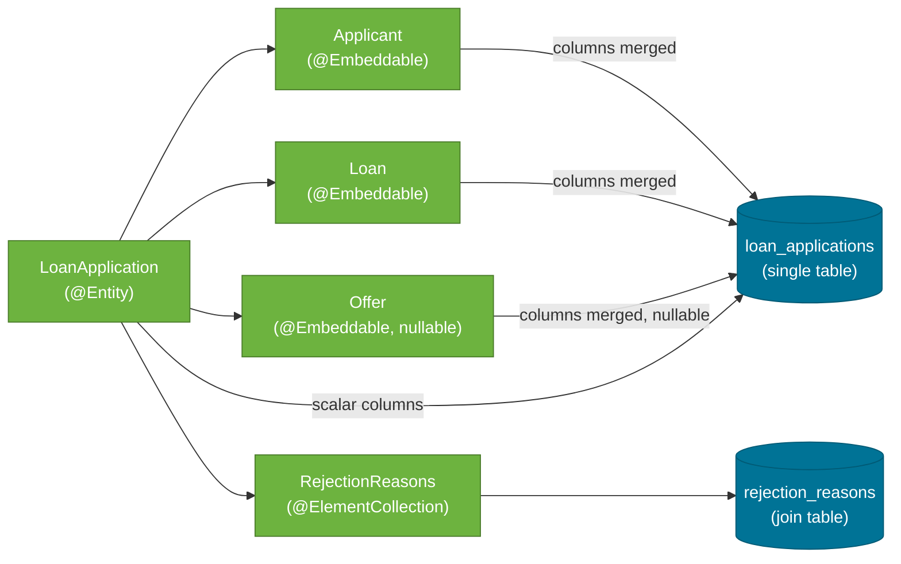

# Persistence Layer

> The persistence layer takes the result of every loan evaluation and stores it permanently for audit purposes — using a flat denormalised schema built from `@Embeddable` value objects so every application lands in a single table.

## What Problem Does It Solve?

Financial systems must retain every decision for auditing, regulatory review, and dispute resolution. Even rejected applications must be stored. The question is how to map a rich domain object (with nested Applicant, Loan, and Offer objects) to a database schema without over-normalising into too many joins.

## Architecture Overview



*Everything except rejection reasons lands in `loan_applications`. Rejection reasons go in their own join table `rejection_reasons`.*

## The `loan_applications` Table Schema

Docusaurus shows SQL as `sql` for syntax highlighting:

```sql
CREATE TABLE loan_applications (
    application_id      VARCHAR(255) NOT NULL PRIMARY KEY,

    -- Applicant (from @Embeddable Applicant)
    name                VARCHAR(255),
    age                 INTEGER,
    monthly_income      DECIMAL(19,2),
    employment_type     VARCHAR(50),
    credit_score        INTEGER,

    -- Loan (from @Embeddable Loan — renamed via @AttributeOverride)
    loan_amount         DECIMAL(19,2),
    loan_tenure_months  INTEGER,
    loan_purpose        VARCHAR(50),

    -- Status
    status              VARCHAR(20),
    risk_band           VARCHAR(20),

    -- Offer (from @Embeddable Offer — nullable for rejections)
    offer_interest_rate  DECIMAL(19,2),
    offer_tenure_months  INTEGER,
    offer_emi            DECIMAL(19,2),
    offer_total_payable  DECIMAL(19,2)
);

CREATE TABLE rejection_reasons (
    application_id  VARCHAR(255) NOT NULL,
    reason          VARCHAR(100)
);
```

H2 generates this schema automatically from the entity annotations because `spring.jpa.hibernate.ddl-auto=create-drop`.

## `@Embeddable` — Value Objects in JPA

An `@Embeddable` class has no identity of its own — its fields are added directly to the owning entity's table. This is the JPA model for a **value object** in domain-driven design.

### When to use `@Embeddable` vs a separate `@Entity`

| Criterion | Use `@Embeddable` | Use separate `@Entity` |
|-----------|------------------|-----------------------|
| Has its own identity (primary key)? | No | Yes |
| Queried independently (e.g., find all applicants)? | No | Yes |
| Lifecycle controlled by parent? | Yes | Has own lifecycle |
| One-to-one with parent? | Yes | One-to-one or one-to-many |

In this project, `Applicant`, `Loan`, and `Offer` are always accessed through `LoanApplication`, never independently — making `@Embeddable` the correct choice.

### `@AttributeOverrides` — Resolving Column Name Clashes

Both `Loan` and `Offer` have a `tenureMonths` field. If both are embedded in `LoanApplication`, JPA would try to create two `tenure_months` columns and throw:

```
org.hibernate.MappingException: Repeated column in mapping for entity: ...
```

`@AttributeOverride` maps each field to a unique column name:

```java
@Embedded
@AttributeOverrides({
    @AttributeOverride(name = "amount",       column = @Column(name = "loan_amount")),
    @AttributeOverride(name = "tenureMonths", column = @Column(name = "loan_tenure_months")),
    @AttributeOverride(name = "purpose",      column = @Column(name = "loan_purpose"))
})
private Loan loan;

@Embedded
@AttributeOverrides({
    @AttributeOverride(name = "interestRate",  column = @Column(name = "offer_interest_rate")),
    @AttributeOverride(name = "tenureMonths",  column = @Column(name = "offer_tenure_months")),
    @AttributeOverride(name = "emi",           column = @Column(name = "offer_emi")),
    @AttributeOverride(name = "totalPayable",  column = @Column(name = "offer_total_payable"))
})
private Offer offer;
```

## `@ElementCollection` — Storing the List of Rejection Reasons

`RejectionReason` is an enum. There can be multiple reasons per application. There are two ways to store a collection of basic values in JPA:

| Approach | Schema | Pros | Cons |
|----------|--------|------|------|
| `@ElementCollection` | Separate join table, no `@Entity` for the element | Simple, no extra entity class | Cannot query the reasons independently |
| Separate `@Entity` (e.g., `RejectionReasonEntity`) | Own table with FK | Full JPA power | More boilerplate |

This project uses `@ElementCollection` because the rejection reasons are never queried separately — they are always retrieved as part of the `LoanApplication`.

```java
@ElementCollection
@CollectionTable(
    name = "rejection_reasons",
    joinColumns = @JoinColumn(name = "application_id")
)
@Enumerated(EnumType.STRING)
@Column(name = "reason")
private List<RejectionReason> rejectionReasons;
```

This creates a `rejection_reasons` table:

| application_id | reason |
|----------------|--------|
| `abc-123` | `CREDIT_SCORE_TOO_LOW` |
| `abc-123` | `AGE_TENURE_LIMIT_EXCEEDED` |
| `def-456` | `EMI_EXCEEDS_50_PERCENT` |

## UUID Generation with `@PrePersist`

The application uses a `String` UUID as the primary key instead of an auto-incremented `Long`.

```java
@PrePersist
public void generateId() {
    if (this.applicationId == null) {
        this.applicationId = UUID.randomUUID().toString();  // ← runs before first INSERT
    }
    if (this.rejectionReasons == null) {
        this.rejectionReasons = new ArrayList<>();          // ← prevents null collection on save
    }
}
```

`@PrePersist` is a JPA lifecycle callback — it runs *before JPA executes the INSERT statement*. The `null` check prevents overwriting an ID that was set manually (e.g., in tests).

**UUID vs auto-increment:**

| | UUID String | Auto-increment Long |
|-|-------------|---------------------|
| Globally unique across services | Yes | No |
| Can be generated client-side | Yes | No |
| Human-readable in URLs | No (long string) | Yes |
| Performance | Slightly slower for indexed searches | Faster |

## The Repository

```java
public interface ILoanApplicationRepository
        extends JpaRepository<LoanApplication, String> {
    // No custom methods needed — save() from JpaRepository is sufficient
}
```

`JpaRepository<T, ID>` provides `save()`, `findById()`, `findAll()`, and `delete()` for free. The second type parameter is `String` because the primary key is a UUID string.

## `application.properties` Settings

```properties
spring.datasource.url=jdbc:h2:mem:loanauditdb   # ← in-memory; lost on restart
spring.datasource.driverClassName=org.h2.Driver
spring.datasource.username=sa
spring.datasource.password=

spring.jpa.database-platform=org.hibernate.dialect.H2Dialect
spring.jpa.hibernate.ddl-auto=create-drop       # ← schema created on start, dropped on shutdown
spring.jpa.show-sql=true                        # ← logs every SQL statement (useful in dev)

spring.h2.console.enabled=true
spring.h2.console.path=/h2-console
```

:::danger `ddl-auto=create-drop` in production
`create-drop` drops and recreates the schema on every application start. This is fine for development and testing against H2, but catastrophic in production. For a real database, use `validate` (check schema matches entities) combined with a migration tool like Flyway or Liquibase.
:::

## Common Pitfalls

- **Forgetting `@AttributeOverride` on clashing field names** — Hibernate will throw `MappingException: Repeated column` at startup.
- **`@ElementCollection` with no `@CollectionTable`** — JPA will auto-generate a table name, which may conflict between environments. Always specify the name explicitly.
- **Using `EnumType.ORDINAL`** — if `RejectionReason.CREDIT_SCORE_TOO_LOW` is ordinal 0, adding a new reason before it changes all existing ordinals. Always use `EnumType.STRING`.
- **`@PrePersist` not initialising the list** — `loanApplicationRepository.save()` can fail if `rejectionReasons` is `null` at persist time, because `@ElementCollection` tries to persist the elements. The `@PrePersist` guard initialises it to an empty list.

## Interview Questions

**Q: What is the difference between `@Embeddable` and `@OneToOne`?**  
**A:** `@Embeddable` maps a value object into the parent entity's table — one table, no FK. `@OneToOne` maps to a separate table with a foreign key relationship. Use `@Embeddable` when the child has no independent identity or lifecycle; use `@OneToOne` when the child is an entity in its own right.

**Q: Why does this project use a UUID string as the primary key instead of `Long`?**  
**A:** UUID keys are globally unique across distributed systems and can be assigned before the database insert. An auto-incremented `Long` requires waiting for a database round-trip. For audit records where the application ID is shared with clients (visible in the response), a UUID is also harder to enumerate/guess.

**Q: What does `@PrePersist` do and when does it run?**  
**A:** It marks a lifecycle callback method that JPA invokes just before the entity is first persisted (before the INSERT). It's used here to generate the UUID and initialise the `rejectionReasons` list if it was not set.

## Further Reading

- [Spring Data JPA Reference](https://docs.spring.io/spring-data/jpa/reference/) — JpaRepository, projections, and query methods.
- [JPA Embeddable guide (Baeldung)](https://www.baeldung.com/jpa-embedded-embeddable) — `@Embeddable` and `@AttributeOverrides` in detail.
- [JPA ElementCollection (Baeldung)](https://www.baeldung.com/jpa-element-collection) — storing collections of basic values.

## Related Notes

- [Domain Model](./02-domain-model.md) — the entity and embeddable class definitions.
- [Exception Handling](./06-exception-handling.md) — what happens when a request is invalid before it reaches persistence.
- [Testing Strategy](./07-testing.md) — how the repository is mocked in service unit tests.
