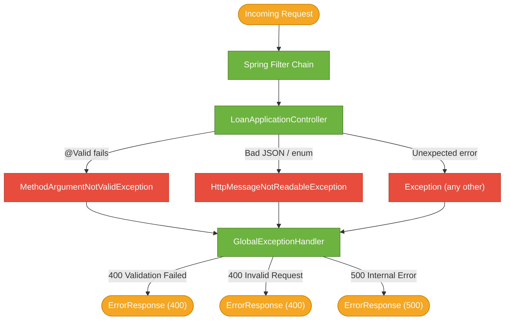

# Exception Handling

> `GlobalExceptionHandler` uses Spring's `@RestControllerAdvice` to intercept every exception that escapes a controller, translate it into a machine-readable `ErrorResponse`, and return the appropriate HTTP status — so clients always get structured JSON, never a raw stack trace.

## What Problem Does It Solve?

Without centralised exception handling:
- A validation failure returns Spring's default whitespace error page or an HTML body in a JSON API.
- Each controller would need its own `try/catch` to format errors consistently.
- Internal exceptions might leak stack traces to clients — a security risk.

`@RestControllerAdvice` solves all three: one place to handle all exceptions, consistent response format, and no leakage of internals.

## The `ErrorResponse` Record

```java
public record ErrorResponse(
        LocalDateTime timestamp,
        int status,
        String error,          // ← short human-readable error title
        List<String> messages  // ← one entry per validation violation or error message
) {}
```

Using a record means `ErrorResponse` is immutable and requires no boilerplate. The `messages` list holds multiple entries because a single request can fail multiple validations simultaneously.

## `GlobalExceptionHandler` — Overview

```java
@RestControllerAdvice  // ← combines @ControllerAdvice + @ResponseBody
public class GlobalExceptionHandler {

    @ExceptionHandler(MethodArgumentNotValidException.class)
    public ResponseEntity<ErrorResponse> handleValidationException(...) { ... }

    @ExceptionHandler(HttpMessageNotReadableException.class)
    public ResponseEntity<ErrorResponse> handleTypeMismatch(...) { ... }

    @ExceptionHandler(Exception.class)
    public ResponseEntity<ErrorResponse> handleGenericException(...) { ... }
}
```

Three handlers, each targeting a different exception type. Spring applies the **most specific match first** — so `MethodArgumentNotValidException` (a subtype of `Exception`) is handled by its own dedicated handler, not the catch-all.

## Handler 1: Bean Validation Failures

`MethodArgumentNotValidException` is thrown when `@Valid` on a `@RequestBody` detects constraint violations.

```java
@ExceptionHandler(MethodArgumentNotValidException.class)
public ResponseEntity<ErrorResponse> handleValidationException(
        MethodArgumentNotValidException ex,
        HttpServletRequest request) {

    List<String> messages = new ArrayList<>();
    for (FieldError error : ex.getBindingResult().getFieldErrors()) {
        messages.add(error.getDefaultMessage());  // ← the message from @Min, @NotBlank, etc.
    }

    ErrorResponse body = new ErrorResponse(
            LocalDateTime.now(),
            HttpStatus.BAD_REQUEST.value(),   // ← 400
            "Validation Failed",
            messages
    );

    return ResponseEntity.status(HttpStatus.BAD_REQUEST).body(body);
}
```

**Example trigger**: send `age: 17` (below `@Min(21)`).

**Response:**
```json
{
  "timestamp": "2026-03-08T10:30:00",
  "status": 400,
  "error": "Validation Failed",
  "messages": ["Minimum age must be 21"]
}
```

Multiple violations in one request accumulate in `messages`. If the request also has `creditScore: 250`, the response includes both messages.

## Handler 2: Malformed JSON or Invalid Enum Values

`HttpMessageNotReadableException` is thrown when Jackson cannot deserialise the request body — either malformed JSON syntax or an invalid enum constant.

```java
@ExceptionHandler(HttpMessageNotReadableException.class)
public ResponseEntity<ErrorResponse> handleTypeMismatch(HttpMessageNotReadableException ex) {
    ErrorResponse body = new ErrorResponse(
            LocalDateTime.now(),
            HttpStatus.BAD_REQUEST.value(),
            "Invalid Request",
            List.of("Malformed JSON request. Please check your input and try again.")
    );
    return ResponseEntity.status(HttpStatus.BAD_REQUEST).body(body);
}
```

**Example triggers:**
- `"employmentType": "CONTRACTOR"` — not a valid `EmploymentType` enum constant
- `{ "age": "thirty" }` — string where integer expected
- `{ "applicant": { "name": "John"` — unclosed JSON

**Response:**
```json
{
  "timestamp": "2026-03-08T10:30:00",
  "status": 400,
  "error": "Invalid Request",
  "messages": ["Malformed JSON request. Please check your input and try again."]
}
```

The message is intentionally generic — it does not expose which field failed or why, to avoid leaking internal schema information.

## Handler 3: Catch-All for Unexpected Errors

```java
@ExceptionHandler(Exception.class)
public ResponseEntity<ErrorResponse> handleGenericException(Exception ex, HttpServletRequest request) {
    ErrorResponse body = new ErrorResponse(
            LocalDateTime.now(),
            HttpStatus.INTERNAL_SERVER_ERROR.value(),  // ← 500
            "Internal Server Error",
            List.of("An unexpected error occurred. Please try again later.")
    );
    return ResponseEntity.status(HttpStatus.INTERNAL_SERVER_ERROR).body(body);
}
```

This is the safety net. Any exception not matched by the two specific handlers lands here and returns `500`. The message is deliberately vague — **internal implementation details must never reach the client**.

:::warning Production logging
In production code, `ex` should be logged with a correlation ID before building the error response. The current implementation silently swallows the exception, which makes debugging in production very difficult. Always log unexpected exceptions.
:::

## Exception Flow Diagram



*All exception types funnel into `GlobalExceptionHandler`, which converts them to `ErrorResponse` JSON before the response reaches the client.*

## `@RestControllerAdvice` vs `@ControllerAdvice`

| Annotation | Returns | Use when |
|-----------|---------|---------|
| `@ControllerAdvice` | View name (string) or `ModelAndView` | MVC with server-side HTML templates |
| `@RestControllerAdvice` | Object serialised to JSON/XML | REST APIs |

`@RestControllerAdvice` is equivalent to `@ControllerAdvice + @ResponseBody`. It's the idiomatic choice for REST APIs.

## Common Pitfalls

- **`@ExceptionHandler(Exception.class)` catching everything too eagerly** — put the catch-all last and ensure specific handlers are listed first. Spring resolves the most specific match, but it is still best to declare them in order.
- **Not logging the exception in the catch-all handler** — the generic handler swallows the exception entirely. In production, always log with a correlation ID.
- **Returning `200 OK` for error responses** — error responses must return the correct HTTP status code. Some teams mistakenly return `200` with an error body "for simplicity", which breaks HTTP conventions and makes monitoring harder.
- **`timestamp` using `LocalDateTime.now()` without a timezone** — for APIs shared across time zones, use `Instant.now()` or `OffsetDateTime.now(ZoneOffset.UTC)`.

## Interview Questions

**Q: What is `@RestControllerAdvice` and how does it work?**  
**A:** It is a specialisation of `@ControllerAdvice` that adds `@ResponseBody` so handler methods automatically serialise return values as JSON. It works by registering the class with Spring's `ExceptionHandlerExceptionResolver`, which intercepts exceptions that propagate out of any `@Controller` and routes them to the matching `@ExceptionHandler` method.

**Q: How does Spring decide which `@ExceptionHandler` to invoke when multiple handlers are present?**  
**A:** Spring picks the most specific match. If an exception is `MethodArgumentNotValidException` (a subtype of `BindException`, which is a subtype of `Exception`), the handler declared for `MethodArgumentNotValidException.class` wins over the catch-all `Exception.class` handler.

**Q: Why is the generic exception handler's message intentionally vague?**  
**A:** To prevent information leakage. Stack traces, class names, and internal error messages can reveal implementation details that an attacker could use to probe the system. The client receives a safe message; the full exception is logged internally.

## Further Reading

- [Spring @ExceptionHandler (docs.spring.io)](https://docs.spring.io/spring-framework/reference/web/webmvc/mvc-controller/ann-exceptionhandler.html)
- [Error handling in REST APIs (Baeldung)](https://www.baeldung.com/exception-handling-for-rest-with-spring)

## Related Notes

- [API Contract](./03-api-contract.md) — the validation rules that trigger these exceptions.
- [Domain Model](./02-domain-model.md) — the `ErrorResponse` record structure.
- [Testing Strategy](./07-testing.md) — note that `GlobalExceptionHandler` is tested implicitly through `@WebMvcTest` slices.
