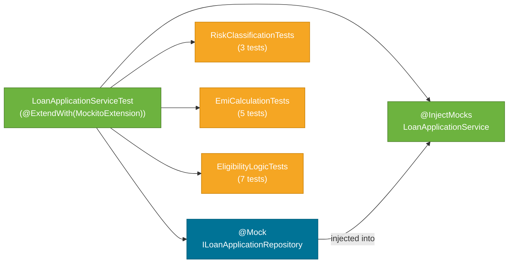

# Testing Strategy

> The project tests the entire service layer with fast, isolated JUnit 5 unit tests using Mockito to stub the repository — no Spring context, no H2, no network, just pure business logic verification.

## What Problem Does It Solve?

The service contains the most complex logic in the project: risk bands, interest rate formulas, the EMI calculation, and two tiers of eligibility rules. Integration tests with a full Spring context would be slow and hard to pinpoint when a rule changes. Unit tests with a mocked repository run in milliseconds and verify each rule independently.

## Test Architecture



*One test class, three `@Nested` groups. Each group focuses on one concern — risk, EMI maths, or eligibility.*

## Test Setup

```java
@ExtendWith(MockitoExtension.class)          // ← activates Mockito; no Spring context loaded
public class LoanApplicationServiceTest {

    @Mock
    private ILoanApplicationRepository repository;  // ← real repository replaced with a mock

    @InjectMocks
    private LoanApplicationService service;         // ← Mockito creates the service and injects the mock
```

`@ExtendWith(MockitoExtension.class)` replaces the old `MockitoAnnotations.openMocks(this)` in a `@BeforeEach`. It:
1. Creates a mock for every `@Mock`-annotated field.
2. Injects those mocks into the `@InjectMocks` target via constructor injection (preferred) or field injection.

Because `LoanApplicationService` uses constructor injection (`public LoanApplicationService(ILoanApplicationRepository repo)`), Mockito injects via constructor.

## The Repository Stub

Every test that results in a `save()` call uses the same stub:

```java
when(repository.save(any(LoanApplication.class)))
    .thenAnswer(invocation -> invocation.getArgument(0));  // ← returns the object passed to save()
```

`thenAnswer(invocation -> invocation.getArgument(0))` returns whatever was passed to `save()` unchanged. This is important because `save()` is expected to return the persisted entity (with the UUID assigned in `@PrePersist`), and the response mapping works on that returned entity.

:::info Why not `thenReturn(someFixedEntity)`?
Because `save()` is called with an object whose `applicationId` hasn't been set yet (it's set in `@PrePersist` via Hibernate). `thenAnswer` lets the test return the same object Mockito received — simulating the `@PrePersist` callback just before the entity comes back.
:::

## Helper Methods

```java
private ApplicantDTO createApplicant(String name, Integer age, BigDecimal income,
                                     EmploymentType employmentType, Integer creditScore) {
    return new ApplicantDTO(name, age, income, employmentType, creditScore);
}

private LoanDTO createLoan(BigDecimal amount, Integer tenureMonths, LoanPurpose purpose) {
    return new LoanDTO(amount, tenureMonths, purpose);
}
```

Tiny factory methods eliminate repetition and make each test's intent obvious — the test data is in the test, not hidden in a fixture class.

## `@Nested` Class: `RiskClassificationTests`

Groups all tests that verify how credit scores map to risk bands.

```java
@Nested
class RiskClassificationTests {

    @Test
    void testRiskClassification_LowRisk() {
        ApplicantDTO applicant = createApplicant("John", 30, new BigDecimal("50000"),
                                                 EmploymentType.SALARIED, 800);  // ← score 800 → LOW
        LoanDTO loan = createLoan(new BigDecimal("500000"), 120, LoanPurpose.PERSONAL);

        when(repository.save(any(LoanApplication.class)))
                .thenAnswer(inv -> inv.getArgument(0));

        LoanApplicationResponse response = service.processLoanApplication(
                new LoanApplicationRequest(applicant, loan));

        assertEquals(RiskBand.LOW, response.riskBand());
        assertEquals(ApplicationStatus.APPROVED, response.status());
        verify(repository).save(any(LoanApplication.class));  // ← confirm save was called exactly once
    }

    // Similar tests for MEDIUM (score 700) and HIGH (score 620)
}
```

| Credit Score | Expected `riskBand` | Expected `status` |
|-------------|---------------------|-------------------|
| 800 | `LOW` | `APPROVED` |
| 700 | `MEDIUM` | `APPROVED` |
| 620 | `HIGH` | `APPROVED` (just above 600 threshold) |

## `@Nested` Class: `EmiCalculationTests`

Verifies that the EMI formula produces exact values for known inputs.

```java
@Test
void testEmiCalculation_Standard() {
    ApplicantDTO applicant = createApplicant("Alice", 30, new BigDecimal("50000"),
                                             EmploymentType.SALARIED, 800);
    LoanDTO loan = createLoan(new BigDecimal("500000"), 60, LoanPurpose.PERSONAL);

    when(repository.save(any(LoanApplication.class))).thenAnswer(inv -> inv.getArgument(0));

    LoanApplicationResponse response = service.processLoanApplication(
            new LoanApplicationRequest(applicant, loan));

    BigDecimal expectedEmi = new BigDecimal("11122.22");
    // compareTo ignores scale differences; assertEquals with BigDecimal uses .equals() which considers scale
    assertEquals(0, expectedEmi.compareTo(response.offer().emi()),
            "EMI should be " + expectedEmi + " but was " + response.offer().emi());
}
```

:::warning `assertEquals` with `BigDecimal`
`assertEquals(new BigDecimal("1.50"), new BigDecimal("1.5"))` **fails** — `.equals()` considers scale, so `1.50 ≠ 1.5`. Always use `assertEquals(0, a.compareTo(b))` when comparing `BigDecimal` values in tests.
:::

**Test coverage for EMI scenarios:**

| Test | Principal | Rate | Tenure | Expected EMI |
|------|-----------|------|--------|-------------|
| Standard (LOW risk, SALARIED) | 5,00,000 | 12% | 60m | ₹11,122.22 |
| Medium risk (SALARIED) | 3,00,000 | 13.5% | 36m | ₹10,180.59 |
| Self-employed (LOW risk) | 4,00,000 | 13% | 48m | ₹10,731.00 |
| Large loan (>10L, LOW risk) | 15,00,000 | 12.5% | 120m | ₹21,956.43 |
| Total payable = EMI × tenure | 6,00,000 | 12% | 60m | Verified |

## `@Nested` Class: `EligibilityLogicTests`

The largest group — verifies every rejection path and the approval path.

### Credit Score Too Low

```java
@Test
void testEligibility_CreditScoreTooLow() {
    ApplicantDTO applicant = createApplicant("George", 30, new BigDecimal("50000"),
                                             EmploymentType.SALARIED, 550);  // ← below 600
    // ...
    assertEquals(ApplicationStatus.REJECTED, response.status());
    assertTrue(response.rejectionReasons().contains(RejectionReason.CREDIT_SCORE_TOO_LOW));
    assertNull(response.riskBand());    // ← must be cleared
    assertNull(response.offer());       // ← must be cleared
}
```

### Age + Tenure Exceeds 65

```java
@Test
void testEligibility_AgeTenureLimitExceeded() {
    // age=58, tenure=120 months (10 years) → 58+10=68 > 65
    ApplicantDTO applicant = createApplicant("Helen", 58, new BigDecimal("80000"),
                                             EmploymentType.SALARIED, 750);
    LoanDTO loan = createLoan(new BigDecimal("500000"), 120, LoanPurpose.PERSONAL);
    // ...
    assertTrue(response.rejectionReasons().contains(RejectionReason.AGE_TENURE_LIMIT_EXCEEDED));
}
```

### EMI Exactly 50% — Edge Case (Approved)

```java
@Test
void testEligibility_EmiExactly50Percent() {
    // EMI is designed to be exactly = 50% of income → should APPROVE (≤ 50% passes)
    ApplicantDTO applicant = createApplicant("Laura", 30, new BigDecimal("70000"),
                                             EmploymentType.SALARIED, 800);
    LoanDTO loan = createLoan(new BigDecimal("1500000"), 60, LoanPurpose.HOME);
    // ...
    assertEquals(ApplicationStatus.APPROVED, response.status());
}
```

This is a **boundary test** — it verifies that `emi.compareTo(maxEmi50) <= 0` uses `<=` (inclusive), not `<` (exclusive).

### Multiple Rejection Reasons

```java
@Test
void testEligibility_MultipleRejectionReasons() {
    // age=59, tenure=120 (10y) → 59+10=69 > 65  AND  credit=580 < 600
    ApplicantDTO applicant = createApplicant("Mike", 59, new BigDecimal("50000"),
                                             EmploymentType.SALARIED, 580);
    LoanDTO loan = createLoan(new BigDecimal("300000"), 120, LoanPurpose.PERSONAL);
    // ...
    assertEquals(ApplicationStatus.REJECTED, response.status());
    assertTrue(response.rejectionReasons().size() > 1);
    assertTrue(response.rejectionReasons().contains(RejectionReason.CREDIT_SCORE_TOO_LOW));
    assertTrue(response.rejectionReasons().contains(RejectionReason.AGE_TENURE_LIMIT_EXCEEDED));
}
```

Verifies that the `List<RejectionReason>` accumulates all applicable reasons rather than stopping at the first.

## What Is NOT Tested Here

| Gap | Why | Recommended Fix |
|-----|-----|-----------------|
| `GlobalExceptionHandler` | Not a unit test concern; needs `@WebMvcTest` | Add `@WebMvcTest(LoanApplicationController.class)` tests |
| Repository persistence (H2) | Mocked out | Add `@DataJpaTest` for repository-level tests |
| Invalid JSON input | Needs HTTP layer | `@WebMvcTest` with `MockMvc` |
| Concurrent access | Not tested | Load test with Gatling or k6 |

## Best Practices Demonstrated

- **`@Nested` grouping** — tests for each concern live in their own group, making failures immediately localisable.
- **`verify(repository).save(...)` in every test** — confirms the save was called; prevents a test that passes because the service returns early without saving.
- **`BigDecimal.compareTo()` for assertions** — avoids false failures from scale differences.
- **Factory methods** — `createApplicant()` and `createLoan()` keep test data readable and editable.
- **`@DisplayName`** — used in the original test class; makes JUnit output human-readable in CI reports.

## Common Pitfalls

- **Using `assertEquals` directly on `BigDecimal`** — it compares using `.equals()` which considers scale; always use `compareTo`.
- **Not calling `verify()`** — a test that only asserts on the response but never verifies `save()` was called would pass even if the response is built from hard-coded values without calling the repository.
- **Over-mocking** — mocking the `LoanApplicationService` to test itself would be circular. The service is the system under test; only its external dependency (the repository) is mocked.
- **Mixing `@SpringBootTest` with Mockito** — `@SpringBootTest` loads the full context; combine it with `@MockBean` (not `@Mock`) if you need Spring context + mocked beans. This project deliberately avoids the full context for speed.

## Interview Questions

**Q: Why use `@ExtendWith(MockitoExtension.class)` instead of `@SpringBootTest`?**  
**A:** `@ExtendWith(MockitoExtension.class)` creates and injects mocks without loading any Spring context. The test runs in milliseconds. `@SpringBootTest` starts the entire application context, including all auto-configurations, and is 10–50× slower. When testing a pure business logic service, there is no reason to involve Spring.

**Q: How does Mockito's `thenAnswer` differ from `thenReturn`?**  
**A:** `thenReturn(value)` always returns the same fixed value regardless of arguments. `thenAnswer(invocation -> ...)` executes a lambda and can inspect/transform the actual arguments passed to the mock. Here it returns `invocation.getArgument(0)` — the exact entity passed to `save()` — which simulates what a real repository would do.

**Q: What is the purpose of `@Nested` in JUnit 5?**  
**A:** `@Nested` lets you group related tests into inner classes within a single test class. Each group can have its own setup/teardown and its own descriptive name. It organises the test output into a tree structure that mirrors the concerns under test, making it easier to understand which rule a failing test covers.

## Further Reading

- [JUnit 5 `@Nested` (junit.org)](https://junit.org/junit5/docs/current/user-guide/#writing-tests-nested)
- [Mockito documentation (site.mockito.org)](https://site.mockito.org/)
- [Testing with Spring Boot (Baeldung)](https://www.baeldung.com/spring-boot-testing)

## Related Notes

- [Service & Business Logic](./04-service-and-business-logic.md) — the logic these tests verify.
- [Domain Model](./02-domain-model.md) — the DTOs and records constructed in test data.
- [Testing (domain)](../../testing/index.md) — JUnit 5, Mockito, and Spring Boot test slices in depth.
