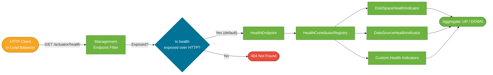

# Spring Boot Actuator

> Actuator adds a set of production-ready HTTP and JMX endpoints to your Spring Boot application — health checks, metrics, environment details, bean listings, thread dumps — without writing a single line of monitoring code.

## What Problem Does It Solve?

Running an application in production means answering operational questions constantly: Is the app healthy? Is the database connection alive? What is the JVM memory usage? Which version is deployed? What beans are wired? Before Actuator, teams wrote custom `/health` controllers, custom metrics logging, or bolted on external agents. Actuator standardizes all of this inside the app itself, making it ready for health checks, load balancers, and observability platforms the moment it starts.

## What Is Actuator?

Actuator is a Spring Boot module (`spring-boot-starter-actuator`) that auto-configures a set of *management endpoints*. Each endpoint exposes a specific type of operational data. Endpoints are accessible over HTTP (under `/actuator` by default) and optionally over JMX.

Adding the starter is all it takes to get started:

```xml
<dependency>
    <groupId>org.springframework.boot</groupId>
    <artifactId>spring-boot-starter-actuator</artifactId>
</dependency>
```

Once the app starts, hitting `GET /actuator` returns a hypermedia list of all enabled and exposed endpoints.

## Built-in Endpoints

| Endpoint | URL | What it shows |
|---|---|---|
| `health` | `/actuator/health` | Aggregate health status: UP, DOWN, OUT_OF_SERVICE |
| `info` | `/actuator/info` | Arbitrary app info (version, git commit, custom keys) |
| `metrics` | `/actuator/metrics` | JVM, HTTP, system metrics by name |
| `metrics/{name}` | `/actuator/metrics/jvm.memory.used` | A specific metric with tags |
| `env` | `/actuator/env` | All environment properties and their sources |
| `beans` | `/actuator/beans` | All Spring beans in the context with types and dependencies |
| `conditions` | `/actuator/conditions` | Auto-configuration conditions evaluation report |
| `mappings` | `/actuator/mappings` | All `@RequestMapping` / `@GetMapping` routes |
| `loggers` | `/actuator/loggers` | Current log level per logger; can be changed at runtime |
| `threaddump` | `/actuator/threaddump` | Current JVM thread dump |
| `heapdump` | `/actuator/heapdump` | Download a JVM heap dump (binary) |
| `scheduledtasks` | `/actuator/scheduledtasks` | All `@Scheduled` tasks |
| `shutdown` | `/actuator/shutdown` | POST to gracefully shut down (disabled by default) |

## How It Works

### Enabling vs exposing endpoints

Actuator separates two concepts:

- **Enabled** — the endpoint exists and collects data. All endpoints except `shutdown` and `heapdump` are enabled by default.
- **Exposed** — the endpoint is reachable via HTTP or JMX. By default, only `health` is exposed over HTTP. All are exposed via JMX.

This distinction means sensitive endpoints like `env` and `beans` can exist internally without being reachable from the network until you explicitly expose them.



*Actuator separates endpoint enablement (data collection) from exposure (network reachability). Health is exposed by default; most others must be opted in.*

### Configuration

Control which endpoints are enabled and exposed in `application.properties`:

```yaml
management:
  endpoints:
    web:
      exposure:
        include: health,info,metrics,loggers     # ← expose only these over HTTP
        # include: "*"                           # ← expose all (not recommended in production)
  endpoint:
    health:
      show-details: when-authorized              # ← show component details only to authenticated users
    shutdown:
      enabled: true                              # ← explicitly enable the shutdown endpoint
  server:
    port: 8081                                   # ← run Actuator on a separate port (production best practice)
```

Placing Actuator on a separate port (8081 vs 8080) lets you firewall the management port from external traffic while keeping the application port open.

## Health Checks

The `/actuator/health` endpoint returns the aggregate health of the application. Spring Boot ships with several built-in health indicators:

| Indicator | What it checks |
|---|---|
| `DiskSpaceHealthIndicator` | Available disk space vs threshold |
| `DataSourceHealthIndicator` | Can execute a validation query against the configured `DataSource` |
| `RedisHealthIndicator` | Can ping the Redis server |
| `RabbitHealthIndicator` | Can connect to RabbitMQ |
| `MongoHealthIndicator` | Can access MongoDB |

All indicators contribute to an aggregate status. If any contributor returns `DOWN`, the top-level status is `DOWN`.

### Example health response (with `show-details: always`)

```json
{
  "status": "UP",
  "components": {
    "db": {
      "status": "UP",
      "details": { "database": "PostgreSQL", "validationQuery": "isValid()" }
    },
    "diskSpace": {
      "status": "UP",
      "details": { "total": 499963174912, "free": 312345600, "threshold": 10485760 }
    }
  }
}
```

### Writing a custom health indicator

```java
@Component
public class PaymentGatewayHealthIndicator implements HealthIndicator {  // ← implement this interface

    private final PaymentGatewayClient client;

    public PaymentGatewayHealthIndicator(PaymentGatewayClient client) {
        this.client = client;
    }

    @Override
    public Health health() {
        try {
            boolean reachable = client.ping();                            // ← call your dependency
            if (reachable) {
                return Health.up()
                    .withDetail("gateway", "payments.example.com")
                    .build();                                             // ← UP with extra detail
            }
            return Health.down()
                .withDetail("reason", "ping timed out")
                .build();                                                 // ← DOWN with reason
        } catch (Exception ex) {
            return Health.down(ex).build();                              // ← DOWN with exception detail
        }
    }
}
```

Spring Boot automatically discovers beans implementing `HealthIndicator` and includes them in `/actuator/health`.

## Metrics

Actuator integrates with Micrometer — a metrics facade that supports dozens of monitoring backends (Prometheus, Datadog, New Relic, CloudWatch). The `/actuator/metrics` endpoint exposes the raw metric names; Micrometer ships them to your chosen backend.

```yaml
# Enable Prometheus scraping (add micrometer-registry-prometheus to pom.xml)
management:
  metrics:
    export:
      prometheus:
        enabled: true
  endpoints:
    web:
      exposure:
        include: health,metrics,prometheus
```

### Built-in metrics (sample)

```
jvm.memory.used                   — heap and non-heap memory
jvm.gc.pause                      — GC pause duration
jvm.threads.live                  — current thread count
http.server.requests               — HTTP request count, duration, status distribution
hikaricp.connections.active        — HikariCP connection pool usage
process.cpu.usage                  — JVM process CPU
```

### Custom metrics with Micrometer

```java
@Component
public class OrderService {

    private final Counter ordersPlaced;      // ← Micrometer counter

    public OrderService(MeterRegistry registry) {
        this.ordersPlaced = Counter.builder("orders.placed")
            .description("Total orders placed")
            .tag("region", "eu-west")        // ← tags enable filtering in dashboards
            .register(registry);             // ← register with the registry
    }

    public void placeOrder(Order order) {
        // ... business logic
        ordersPlaced.increment();            // ← record the event
    }
}
```

## Runtime Log Level Changes

The `/actuator/loggers` endpoint lets you change the log level of any logger at runtime without a restart — invaluable for live debugging:

```bash
# See current log level for a package
GET /actuator/loggers/com.example.payment

# Change log level to DEBUG at runtime (POST with JSON body)
curl -X POST http://localhost:8081/actuator/loggers/com.example.payment \
  -H "Content-Type: application/json" \
  -d '{"configuredLevel":"DEBUG"}'
```

The change is in-memory only. The original level returns after a restart.

## Securing Actuator Endpoints

In production, Actuator endpoints leak sensitive data — bean graphs, environment properties, thread dumps. Always secure the management port:

```java
@Configuration
public class ActuatorSecurityConfig {

    @Bean
    public SecurityFilterChain actuatorSecurity(HttpSecurity http) throws Exception {
        http
            .requestMatcher(EndpointRequest.toAnyEndpoint())             // ← target only actuator URLs
            .authorizeHttpRequests(auth -> auth
                .requestMatchers(EndpointRequest.to("health", "info"))
                    .permitAll()                                         // ← health + info: public
                .anyRequest()
                    .hasRole("ADMIN")                                    // ← everything else: admin only
            );
        return http.build();
    }
}
```

Or the simpler property-based approach for basic cases:

```yaml
management:
  endpoint:
    health:
      show-details: when-authorized    # show component details only when authenticated
  endpoints:
    web:
      exposure:
        include: health,info           # expose only non-sensitive endpoints publicly
```

## Best Practices

- **Run Actuator on a separate port** (`management.server.port=8081`) and firewall it from public ingress. Only your monitoring stack and ops team should reach it.
- **Expose the minimum needed** — start with `health` and `info` in production; add `metrics` and `prometheus` for observability; expose `env`, `beans`, and `conditions` only to admins.
- **Never expose `heapdump` or `shutdown` over the public port** — heap dumps contain plaintext credentials; the shutdown endpoint is a denial-of-service risk.
- **Write custom health indicators for every external dependency** — databases are auto-covered, but REST API dependencies, message brokers, and caches need custom indicators.
- **Use `health.show-details: when-authorized`** not `always` in production — component details can reveal infrastructure topology to attackers.
- **Instrument business metrics with Micrometer** — counter orders, record payment durations, track queue depths. These are more valuable than JVM metrics alone.

## Common Pitfalls

**`/actuator/health` returns 404 after adding the starter**
The `health` endpoint is enabled and exposed by default. 404 most often means the management base path was changed (`management.endpoints.web.base-path=/manage`) or a security configuration is blocking the request. Check the conditions report via `debug=true`.

**`show-details: always` leaking DB credentials**
The DB health indicator shows the JDBC URL and driver class in its `details` block. Leaving `show-details: always` set in production means any unauthenticated user who can reach the management port sees your database connection string.

**Actuator endpoints not visible behind a proxy**
If your app runs behind a reverse proxy and you expose Actuator on the same port as the application, ensure the proxy forwards `/actuator/**` paths correctly or use a dedicated management port.

**Adding Micrometer without a registry back-end**
`spring-boot-starter-actuator` includes the Micrometer core but no back-end. `/actuator/metrics` works for local inspection, but no metrics are shipped anywhere. Add `micrometer-registry-prometheus` or another registry to actually export metrics.

:::danger
Never expose `/actuator/env` to unauthenticated users. It displays all resolved properties including those from environment variables — which can contain API keys, database passwords, and other secrets.
:::

## Interview Questions

### Beginner

**Q:** What is Spring Boot Actuator used for?
**A:** Actuator adds production-ready management endpoints to a Spring Boot app. The most commonly used ones are `/actuator/health` (for load balancer health checks), `/actuator/metrics` (for performance monitoring), and `/actuator/info` (for displaying app version and build info). You add it by including `spring-boot-starter-actuator` and everything auto-configures.

**Q:** Why is only the `health` endpoint exposed over HTTP by default?
**A:** Security by default. Most Actuator endpoints expose sensitive operational data — beans, environment properties, thread dumps. Spring Boot starts with the safest configuration and requires you to explicitly opt in to each additional endpoint via `management.endpoints.web.exposure.include`.

### Intermediate

**Q:** How do you write a custom health indicator?
**A:** Implement the `HealthIndicator` interface in a `@Component` class, override the `health()` method, and return `Health.up()` or `Health.down()` with optional detail entries. Spring Boot's `HealthContributorRegistry` auto-discovers the bean and includes its result in the aggregate `/actuator/health` response.

**Q:** What is the difference between enabling and exposing an Actuator endpoint?
**A:** Enabling means the endpoint is active and collecting data. Exposing means it is reachable over HTTP or JMX. An enabled-but-not-exposed endpoint runs internally but returns 404 to HTTP clients. This lets you collect data for in-process use (e.g., a programmatic health check in a readiness probe) without leaking it over the network.

**Q:** How would you change the log level of a running service without restarting it?
**A:** Send an HTTP POST to `/actuator/loggers/{logger-name}` with a JSON body `{"configuredLevel":"DEBUG"}`. The Actuator's `LoggersEndpoint` calls the underlying logging framework (Logback/Log4j) to set the level dynamically. The change is ephemeral — it resets on restart.

### Advanced

**Q:** How does Actuator integrate with Micrometer for metrics export to Prometheus?
**A:** Actuator includes Micrometer as its metrics facade. Adding `micrometer-registry-prometheus` to the classpath auto-configures a `PrometheusMeterRegistry`. Micrometer collects metrics from JVM, HTTP, thread pools, and custom code into a scrape-compatible format. Setting `management.endpoints.web.exposure.include` to include `prometheus` exposes `/actuator/prometheus`, which Prometheus scrapes on its configured interval.

**Q:** How do you secure Actuator endpoints in a Spring Security-enabled app?
**A:** Define a `SecurityFilterChain` bean that uses `EndpointRequest.toAnyEndpoint()` as the request matcher. This targets only Actuator URLs. Within it, permit `health` and `info` for unauthenticated access and require `ADMIN` role or similar for the rest. Run Actuator on a separate management port to allow network-level isolation independent of the Spring Security rules.

## Further Reading

- [Spring Boot Actuator Reference](https://docs.spring.io/spring-boot/docs/current/reference/html/actuator.html) — complete reference for all endpoints, configuration properties, and customization
- [Baeldung: Spring Boot Actuators Guide](https://www.baeldung.com/spring-boot-actuators) — practical guide to the most useful endpoints with examples

## Related Notes

- [Auto-Configuration](./auto-configuration.md) — Actuator's endpoints are wired by auto-configuration; understanding conditions helps debug missing endpoints
- [Application Properties](./application-properties.md) — all Actuator behavior is controlled via `management.*` properties; the full namespace is documented in the common properties reference
- [Spring Boot Testing](./spring-boot-testing.md) — `@SpringBootTest` with `WebEnvironment.RANDOM_PORT` lets you integration-test Actuator endpoints just like regular HTTP endpoints
