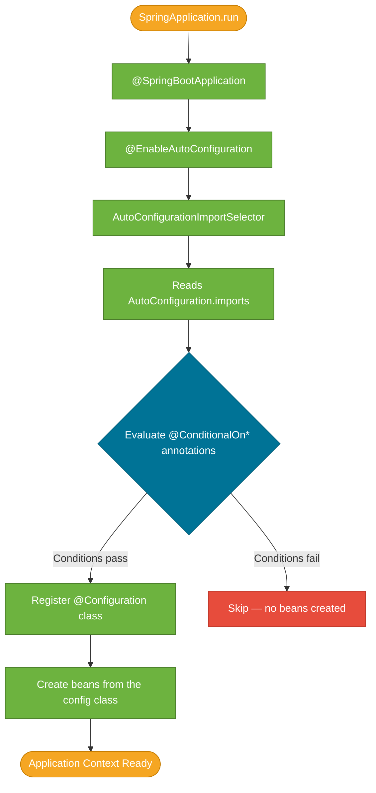

# Spring Boot Auto-Configuration

> Auto-configuration is the mechanism that reads your classpath and automatically wires the beans you would otherwise declare by hand — without a single line of XML or `@Bean` definition.

## What Problem Does It Solve?

Before Spring Boot, every Spring application required dozens of boilerplate `@Bean` methods or XML declarations. Adding a database? You wrote a `DataSource` bean. Adding Jackson? You registered a `MappingJackson2HttpMessageConverter`. Adding security? You wrote a `WebSecurityConfigurer`. Each piece was independent, easy to forget, and trivial to misconfigure.

Auto-configuration eliminates this burden by applying a **convention-over-configuration** model: if `H2` is on the classpath an in-memory `DataSource` is created; if `spring-webmvc` is present a `DispatcherServlet` is registered. You only override what differs from the sensible default.

## What Is Auto-Configuration?

Auto-configuration is a collection of `@Configuration` classes that Spring Boot loads **conditionally** at startup. Each class is guarded by one or more `@ConditionalOn*` annotations — Spring evaluates these conditions before creating any beans from that class.

The entry point is `@SpringBootApplication`, which is a composed annotation:

```java
@SpringBootApplication
public class MyApp {
    public static void main(String[] args) {
        SpringApplication.run(MyApp.class, args);
    }
}
```

Under the hood `@SpringBootApplication` combines:

| Annotation | Role |
|---|---|
| `@SpringBootConfiguration` | Marks this as a configuration source (extends `@Configuration`) |
| `@EnableAutoConfiguration` | Triggers auto-configuration loading |
| `@ComponentScan` | Scans the current package and sub-packages for `@Component` beans |

`@EnableAutoConfiguration` is what actually triggers the mechanism. Everything else is convenience.

## How It Works

### Step 1 — Loading candidate configurations

Spring Boot 3 uses a file called `META-INF/spring/org.springframework.boot.autoconfigure.AutoConfiguration.imports` (earlier versions used `META-INF/spring.factories`) to list all candidate auto-configuration classes. At startup, `AutoConfigurationImportSelector` reads this file and collects the class names.

```
# spring/org.springframework.boot.autoconfigure.AutoConfiguration.imports (excerpt)
org.springframework.boot.autoconfigure.jdbc.DataSourceAutoConfiguration
org.springframework.boot.autoconfigure.web.servlet.DispatcherServletAutoConfiguration
org.springframework.boot.autoconfigure.jackson.JacksonAutoConfiguration
```

### Step 2 — Evaluating conditions

Each listed class is annotated with conditions that Spring evaluates **before** instantiating any beans:

```java
@AutoConfiguration
@ConditionalOnClass({ DataSource.class, EmbeddedDatabaseType.class })
@ConditionalOnMissingBean(type = "io.r2dbc.spi.ConnectionFactory")
@EnableConfigurationProperties(DataSourceProperties.class)
public class DataSourceAutoConfiguration {
    // beans defined here only created if conditions pass
}
```

The most common condition annotations:

| Annotation | Condition checked |
|---|---|
| `@ConditionalOnClass` | A class exists on the classpath |
| `@ConditionalOnMissingClass` | A class is absent from the classpath |
| `@ConditionalOnBean` | A bean of a given type already exists |
| `@ConditionalOnMissingBean` | No bean of a given type exists yet |
| `@ConditionalOnProperty` | A property has a specific value |
| `@ConditionalOnResource` | A classpath resource exists |
| `@ConditionalOnWebApplication` | The app is a servlet or reactive web app |
| `@ConditionalOnExpression` | A SpEL expression evaluates to true |

### Step 3 — Ordering auto-configurations

Auto-configurations can declare ordering constraints so that dependent configurations run after their prerequisites:

```java
@AutoConfiguration(after = DataSourceAutoConfiguration.class)
public class JdbcTemplateAutoConfiguration { ... }
```

`@AutoConfigureBefore` and `@AutoConfigureAfter` (Spring Boot 2 style) also work but `after =` / `before =` on `@AutoConfiguration` is preferred in Spring Boot 3.

### Overview: Startup to Bean Creation



*Auto-configuration lifecycle: selector reads candidates, conditions are evaluated, passing configs register beans, failing configs are silently skipped.*

### Condition evaluation is eager

All conditions are evaluated before any beans are created. If a condition fails, the configuration class is discarded entirely — it is never instantiated. This is why auto-config is cheap: most configuration classes never run.

## Code Examples

### Observing what was auto-configured

Add `--debug` to your run arguments (or `debug=true` in `application.properties`). Spring Boot prints a **Conditions Evaluation Report** with positive matches (what ran) and negative matches (what was skipped):

```bash
# In application.properties
debug=true
```

```
============================
CONDITIONS EVALUATION REPORT
============================

Positive matches:
-----------------
   DataSourceAutoConfiguration matched:
      - @ConditionalOnClass found required classes 'javax.sql.DataSource'
      - @ConditionalOnMissingBean (types: ...) did not find any beans

Negative matches:
-----------------
   MongoAutoConfiguration:
      - @ConditionalOnClass did not find required class 'com.mongodb.MongoClient'
```

### Disabling a specific auto-configuration

If an auto-configuration class causes problems or you want to replace it entirely:

```java
@SpringBootApplication(exclude = { DataSourceAutoConfiguration.class }) // ← disables the JDBC DataSource auto-config
public class MyApp { }
```

Or via properties (preferred — no code change needed):

```properties
spring.autoconfigure.exclude=org.springframework.boot.autoconfigure.jdbc.DataSourceAutoConfiguration
```

### Writing your own auto-configuration

A library can provide auto-configuration for its users. The pattern:

```java
// 1. The auto-configuration class
@AutoConfiguration                                              // ← marks it as an auto-config (Spring Boot 3)
@ConditionalOnClass(MyService.class)                           // ← only run if the library is present
@ConditionalOnMissingBean(MyService.class)                     // ← back-off if the user declared their own bean
public class MyServiceAutoConfiguration {

    @Bean
    public MyService myService(MyServiceProperties props) {    // ← create the default bean
        return new MyService(props.getEndpoint());
    }
}
```

```java
// 2. Bind configuration properties
@ConfigurationProperties(prefix = "mylib")
public class MyServiceProperties {
    private String endpoint = "https://default.example.com";  // ← sensible default
    // getters + setters
}
```

```
# 3. Register the auto-config in:
# src/main/resources/META-INF/spring/
#   org.springframework.boot.autoconfigure.AutoConfiguration.imports

com.example.mylib.MyServiceAutoConfiguration
```

The `@ConditionalOnMissingBean` is the **back-off guard**: if the consuming application defines its own `MyService` bean, your auto-configuration steps aside gracefully.

## Best Practices

- **Prefer `@ConditionalOnMissingBean` in library auto-configs** — always let users override your defaults.
- **Keep auto-config classes thin** — they should delegate to `@ConfigurationProperties` for values and to dedicated `@Configuration` classes for complex wiring.
- **Use `spring.autoconfigure.exclude` over `exclude =`** — property-based exclusion is easier to toggle per environment without recompiling.
- **Run with `debug=true` when diagnosing startup issues** — the conditions report tells you exactly why a bean is or isn't created.
- **Don't fight auto-configuration** — if a bean isn't behaving as expected, define your own `@Bean` of the same type and let the `@ConditionalOnMissingBean` back-off do its job.
- **Never use `@ComponentScan` on auto-configuration classes** — these classes are loaded from outside your app's base package; scanning from them will pull in unintended beans.

## Common Pitfalls

**Mistaking `@ConditionalOnBean` for "already registered"**
`@ConditionalOnBean` checks whether a bean *of a given type* is registered. It does not check whether *this exact class* was used. Two auto-configs that both define the same type can unexpectedly interact.

**Forgetting to declare the auto-config in the imports file**
Writing an `@AutoConfiguration` class and never registering it in `AutoConfiguration.imports` is silent. Spring Boot will never discover it.

**Excluding the wrong class**
`DataSourceAutoConfiguration` and `DataSourceTransactionManagerAutoConfiguration` are separate classes. Excluding only one and leaving `spring.datasource.url` undefined causes a startup failure.

**Assuming `@ConditionalOnMissingBean` checks the current class**
The condition checks the application context for any existing bean of the target type — it looks across *all* sources, not just within the same auto-config class. Order matters.

**Spring Boot 2 vs 3 registration difference**
In Spring Boot 2, auto-configurations were listed under `spring.factories` with the key `EnableAutoConfiguration`. In Spring Boot 3 the file changed to `AutoConfiguration.imports`. Libraries targeting both versions must provide both files.

:::warning
Never include `@ComponentScan` or `@SpringBootApplication` on your auto-configuration class. Those annotations are for the application root — applying them here causes double-scanning and duplicate bean registration.
:::

## Interview Questions

### Beginner

**Q:** What does `@SpringBootApplication` do?
**A:** It is a convenience composed annotation that combines `@SpringBootConfiguration`, `@EnableAutoConfiguration`, and `@ComponentScan`. `@EnableAutoConfiguration` is the piece that triggers auto-configuration loading; the other two handle marking the class as a config source and scanning for `@Component` beans.

**Q:** How does Spring Boot know which auto-configuration classes to load?
**A:** Spring Boot reads `META-INF/spring/org.springframework.boot.autoconfigure.AutoConfiguration.imports` (Spring Boot 3) or `META-INF/spring.factories` (Spring Boot 2). These files list all candidate `@AutoConfiguration` classes. Each class is then evaluated against its conditions before any beans are created.

### Intermediate

**Q:** What is the difference between `@ConditionalOnClass` and `@ConditionalOnBean`?
**A:** `@ConditionalOnClass` checks the *classpath* — it activates the configuration if a class is present at class-loading time, before any beans are created. `@ConditionalOnBean` checks the *application context* — it activates only if a bean of the specified type has already been registered. `@ConditionalOnClass` is evaluated earlier in the startup lifecycle and is used to gate library-specific configurations; `@ConditionalOnBean` is used for ordering-sensitive conditional wiring.

**Q:** How do you disable a specific auto-configuration class?
**A:** Two ways: programmatically with `@SpringBootApplication(exclude = {SomeAutoConfig.class})`, or via properties with `spring.autoconfigure.exclude=com.example.SomeAutoConfig`. The property approach is preferred because it requires no recompilation and can be toggled per environment.

**Q:** Why is `@ConditionalOnMissingBean` important for library auto-configurations?
**A:** It is the back-off guard. When a user defines their own `@Bean` of the same type, `@ConditionalOnMissingBean` detects it and skips the library's default bean. Without it, two beans of the same type would be registered, causing a `NoUniqueBeanDefinitionException` or unexpected override.

### Advanced

**Q:** In what order are auto-configuration classes applied, and how can you control that order?
**A:** Spring Boot applies auto-configurations in the order listed in the imports file, subject to `@AutoConfigureBefore` / `@AutoConfigureAfter` / the `before` and `after` attributes on `@AutoConfiguration`. Within that order, `@ConditionalOnBean` conditions can still fail if a dependency config has not run yet. For precise control, declare explicit ordering constraints rather than relying on list order.

**Q:** How does the Conditions Evaluation Report help you debug auto-configuration?
**A:** Running with `debug=true` causes Spring Boot to print the conditions evaluation report at startup. Positive matches show which `@Configuration` classes passed all conditions and contributed beans. Negative matches show which classes were skipped and why — including which condition failed and what value it evaluated. This lets you diagnose missing beans, duplicate beans, and property-driven misconfigurations in seconds.

**Follow-up:** A `DataSource` bean is not being created even though you added the JDBC dependency. Where do you look?
**A:** Check the negative matches in the conditions report for `DataSourceAutoConfiguration`. Likely causes: `spring.datasource.url` is missing, no JDBC driver class is on the classpath, or another `DataSource` bean already exists (perhaps a test configuration) triggering `@ConditionalOnMissingBean` to skip the default.

## Further Reading

- [Spring Boot Auto-configuration Reference](https://docs.spring.io/spring-boot/docs/current/reference/html/using.html#using.auto-configuration) — official reference covering how to enable, disable, and write custom auto-configs
- [Auto-configuration Classes](https://docs.spring.io/spring-boot/docs/current/reference/html/auto-configuration-classes.html) — full list of all built-in Spring Boot auto-configuration classes
- [Baeldung: Spring Boot Auto-Configuration](https://www.baeldung.com/spring-boot-autoconfiguration) — step-by-step guide on creating your own auto-configuration

## Related Notes

- [Application Properties](./application-properties.md) — auto-configuration binds its defaults from `@ConfigurationProperties`; understanding properties binding shows how to override any auto-configured value
- [Spring Boot Starters](./spring-boot-starters.md) — starters bundle the dependencies that trigger auto-configuration conditions; the two mechanisms are designed as a pair
- [Spring Boot Testing](./spring-boot-testing.md) — test slices like `@WebMvcTest` selectively enable subsets of auto-configuration; knowing the full mechanism helps understand what each slice includes
