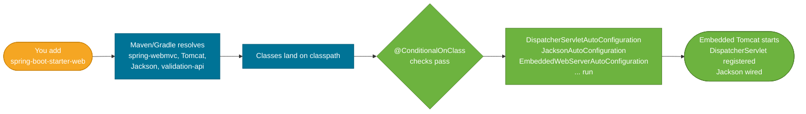

# Spring Boot Starters

> A starter is a curated, pre-tested dependency bundle that adds everything needed for a feature — libraries *and* the auto-configuration wiring — in a single Maven or Gradle coordinate.

## What Problem Does It Solve?

Adding a feature to a Spring application used to mean researching which libraries were needed, checking version compatibility, and then writing the `@Configuration` classes to wire everything together. Adding "web support", for example, required Spring MVC, an embedded Tomcat or Jetty, Jackson for JSON, and several configuration beans. Get one version wrong and you had classpath conflicts at runtime.

Starters solve three problems at once:

1. **Dependency curation** — they pull in a tested set of compatible libraries.
2. **Auto-configuration triggering** — the presence of starter dependencies satisfies `@ConditionalOnClass` conditions, activating the matching auto-configuration.
3. **Version management** — the Spring Boot BOM (Bill of Materials) pins every transitive version so you never have to wonder about compatibility.

## What Is a Starter?

A starter is a Maven/Gradle module that contains almost no Java code itself. It is a POM (or Gradle build file) that declares a set of managed dependencies. When you add a starter, your build tool resolves all its dependencies, which land on the classpath. These classpath additions then trigger the corresponding `@ConditionalOnClass`-guarded [auto-configuration](./auto-configuration.md) classes.



*Adding a single starter coordinate triggers a chain: dependency resolution → classpath check → auto-configuration → ready-to-use beans.*

## Common Starters and What They Wire Up

| Starter | What it includes | Key auto-configurations activated |
|---|---|---|
| `spring-boot-starter` | Core Spring, logging (Logback), YAML support | Base application context |
| `spring-boot-starter-web` | Spring MVC, Tomcat, Jackson, Hibernate Validator | `DispatcherServlet`, embedded Tomcat, Jackson `ObjectMapper` |
| `spring-boot-starter-webflux` | Spring WebFlux, Netty, Jackson | Reactive `DispatcherHandler`, embedded Netty |
| `spring-boot-starter-data-jpa` | Spring Data JPA, Hibernate, HikariCP, JDBC | `DataSource`, `EntityManagerFactory`, `JpaTransactionManager` |
| `spring-boot-starter-data-redis` | Spring Data Redis, Lettuce | `RedisConnectionFactory`, `RedisTemplate` |
| `spring-boot-starter-security` | Spring Security | Security filter chain, form login, HTTP Basic |
| `spring-boot-starter-test` | JUnit 5, Mockito, AssertJ, Spring Test | All test utilities and mock infrastructure |
| `spring-boot-starter-actuator` | Spring Boot Actuator | Health, metrics, info endpoints |
| `spring-boot-starter-cache` | Spring Cache abstraction | `CacheManager` auto-config |
| `spring-boot-starter-validation` | Hibernate Validator, Bean Validation API | Method-level and `@RequestBody` validation |
| `spring-boot-starter-mail` | JavaMail, Spring Email | `JavaMailSender` auto-config |
| `spring-boot-starter-logging` | Logback, SLF4J | Default logging configuration |

### What `spring-boot-starter-web` wires up in detail

This is the most commonly used starter. It pulls in:

```
spring-boot-starter-web
  ├── spring-boot-starter             (core spring, logging)
  ├── spring-boot-starter-json        (Jackson databind, jackson-datatype-jdk8, jsr310)
  ├── spring-boot-starter-tomcat      (embedded Tomcat)
  ├── spring-webmvc                   (DispatcherServlet, MVC annotations)
  └── spring-boot-starter-validation  (Hibernate Validator, JSR-303)
```

The resulting auto-configurations wire up:
- `DispatcherServlet` registered at `/`
- `ContentNegotiationManager`, `HandlerMapping`, `HandlerAdapter` for MVC
- `ObjectMapper` bean configured with sensible Jackson defaults
- Error handling via `BasicErrorController`
- Embedded Tomcat listening on port 8080

## Code Examples

### Adding starters (Maven)

```xml
<dependencies>
    <!-- Web + REST API -->
    <dependency>
        <groupId>org.springframework.boot</groupId>
        <artifactId>spring-boot-starter-web</artifactId>
        <!-- ↑ No version needed — inherited from spring-boot-starter-parent BOM -->
    </dependency>

    <!-- JPA persistence -->
    <dependency>
        <groupId>org.springframework.boot</groupId>
        <artifactId>spring-boot-starter-data-jpa</artifactId>
    </dependency>

    <!-- Testing — scope test so it doesn't ship in production jar -->
    <dependency>
        <groupId>org.springframework.boot</groupId>
        <artifactId>spring-boot-starter-test</artifactId>
        <scope>test</scope>
    </dependency>
</dependencies>
```

### Replacing the default embedded server

`spring-boot-starter-web` includes Tomcat. To switch to Jetty, exclude Tomcat and add the Jetty starter:

```xml
<dependency>
    <groupId>org.springframework.boot</groupId>
    <artifactId>spring-boot-starter-web</artifactId>
    <exclusions>
        <exclusion>
            <groupId>org.springframework.boot</groupId>
            <artifactId>spring-boot-starter-tomcat</artifactId>  <!-- ← remove Tomcat -->
        </exclusion>
    </exclusions>
</dependency>

<dependency>
    <groupId>org.springframework.boot</groupId>
    <artifactId>spring-boot-starter-jetty</artifactId>           <!-- ← add Jetty instead -->
</dependency>
```

Switching is purely declarative — no code changes needed. The embedded server auto-configuration detects which server is on the classpath.

### Writing a custom starter (library authors)

If you build a reusable library, package it as a starter so consumers get zero-config setup:

```
my-library-spring-boot-starter/        ← the starter POM (no Java)
  pom.xml
    └── depends on: my-library-autoconfigure

my-library-autoconfigure/              ← the auto-configuration module
  src/main/java/.../MyAutoConfiguration.java
  src/main/resources/META-INF/spring/
    org.springframework.boot.autoconfigure.AutoConfiguration.imports
```

Name convention: `{feature}-spring-boot-starter`. The `-autoconfigure` module holds the Java; the `-starter` module is just a dependency aggregator. This two-module split lets users include the autoconfigure module without the starter if they want finer control.

### Checking what a starter brings in (Maven)

```bash
# Print the full dependency tree showing what the web starter pulls in
mvn dependency:tree -Dincludes=org.springframework.boot
```

## Trade-offs & When To Use / Avoid

| | Pros | Cons |
|---|---|---|
| **Use starters** | Zero boilerplate; tested dependency set; easy upgrades | Pulls in transitive deps you may not need |
| **Exclude a sub-starter** | Remove a library (e.g., Tomcat) declaratively | Must know the exact artifact ID to exclude |
| **Custom starter** | Reusable zero-config setup for internal libraries | Adds a separate module to maintain |
| **Avoid over-stacking** | — | Adding five starters to a batch app that runs no HTTP adds unused Tomcat, MVC, and Jackson to the classpath |

## Common Pitfalls

**Version collision from manually adding a library already managed by the BOM**
If you add `jackson-databind` manually with no version, Maven resolves the BOM version. If you specify a version, it overrides the BOM. Mixing both causes subtle classpath incompatibilities. Let the BOM manage transitive versions — add an explicit version only when you have a known security fix.

**Forgetting `<scope>test</scope>` on `spring-boot-starter-test`**
Without `<scope>test</scope>`, JUnit and Mockito are packaged into the production fat-jar, adding ~10 MB of unnecessary size and test infrastructure to the runtime.

**Adding `spring-boot-starter-security` without configuring it**
This starter auto-configures a security filter chain that blocks all unauthenticated requests immediately. You will lose access to your own endpoints until you provide a `SecurityFilterChain` bean or configure credentials in `application.properties`.

**Using `spring-boot-starter-webflux` and `spring-boot-starter-web` together**
Both starters can coexist for mixed applications (e.g., blocking controllers + reactive WebClient), but Spring Boot will default to the servlet stack. You must explicitly set `spring.main.web-application-type=reactive` to flip to reactive, if that is the intent. Having both without intent causes confusion.

:::tip
Run `mvn dependency:tree` or `gradle dependencies` regularly on starter-heavy projects. Starters compose each other — it is easy to accidentally include three copies of Jackson from different starters.
:::

## Interview Questions

### Beginner

**Q:** What is a Spring Boot starter and why would you use one?
**A:** A starter is a dependency descriptor — a POM that bundles a curated set of compatible libraries under one coordinate. You add `spring-boot-starter-web` instead of manually adding Spring MVC, Tomcat, Jackson, and assorted versions yourself. The starter guarantees the libraries are compatible with each other and with your Spring Boot version, and it triggers the matching auto-configuration so beans are wired automatically.

**Q:** Why don't starter dependencies need version numbers in pom.xml?
**A:** When you use `spring-boot-starter-parent` as your project's parent POM, you inherit the Spring Boot BOM (Bill of Materials). The BOM declares managed dependency versions for every Spring and common third-party library. Maven resolves any starter coordinate from the BOM version without you specifying it — this is the `<dependencyManagement>` mechanism.

### Intermediate

**Q:** How does a starter trigger auto-configuration?
**A:** A starter pulls its dependency libraries onto the classpath. Spring Boot's auto-configuration classes are guarded by `@ConditionalOnClass` conditions that check for specific classes. When those classes appear on the classpath, the condition passes and the auto-configuration class runs, creating the default beans. The starter itself contains no Java code — it is purely a dependency aggregator that enables conditions.

**Q:** How do you swap Tomcat for Jetty in a Spring Boot app?
**A:** Exclude `spring-boot-starter-tomcat` from the `spring-boot-starter-web` dependency in pom.xml and add `spring-boot-starter-jetty`. No code changes are needed — the embedded server auto-configuration detects which server artifact is on the classpath and wires it accordingly.

### Advanced

**Q:** Why is a custom starter split into two modules (`-autoconfigure` and `-starter`)?
**A:** The separation serves two purposes. First, it allows users to include only the autoconfigure module if they need configuration classes without the starter's curated set of transitive dependencies. Second, it makes the `AutoConfiguration.imports` file reside in the autoconfigure module, which is loaded by Spring Boot's `AutoConfigurationImportSelector`. The starter is purely a dependency aggregator — no code, just the POM. This follows Spring Boot's own internal structure and makes the library maintainable and composable.

**Q:** A teammate added `spring-boot-starter-security` and now all endpoints return 401. What happened and how do you fix it?
**A:** Security's auto-configuration (`SpringBootWebSecurityConfiguration`) creates a default `SecurityFilterChain` that requires HTTP Basic authentication for every request. A random password is generated and logged at startup. To fix it quickly in development, set `spring.security.user.name` and `spring.security.user.password` in `application.properties`. For production, define a `@Bean` of type `SecurityFilterChain` that configures the exact access rules you need — the presence of that bean causes `@ConditionalOnDefaultWebSecurity` to skip the default chain.

## Further Reading

- [Spring Boot Starters Reference](https://docs.spring.io/spring-boot/docs/current/reference/html/using.html#using.build-systems.starters) — official list of all starters with descriptions
- [Baeldung: Spring Boot Starters](https://www.baeldung.com/spring-boot-starters) — practical walkthrough of the most common starters with examples

## Related Notes

- [Auto-Configuration](./auto-configuration.md) — starters trigger auto-configuration by placing classes on the classpath; the two mechanisms are inseparable
- [Application Properties](./application-properties.md) — every starter's auto-configuration reads from a specific property namespace; knowing the properties lets you override any starter default
- [Spring Boot Testing](./spring-boot-testing.md) — `spring-boot-starter-test` is the test starter; it pulls in JUnit 5, Mockito, and the test slices infrastructure
