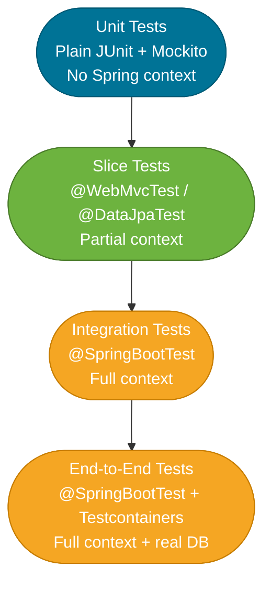

# Spring Boot Testing

> Spring Boot provides first-class testing support through auto-configured test slices, `@MockBean`, and `@SpringBootTest` — each targeting a different scope so you can write fast unit tests, focused slice tests, and full integration tests from one starter dependency.

## What Problem Does It Solve?

Spring applications are wired together by an IoC container. Unit-testing individual classes with plain JUnit and Mockito is straightforward, but verifying that the wiring is correct — that the HTTP layer serializes JSON properly, that the JPA repository generates the right SQL — requires a real (or minimal) ApplicationContext. The challenge is that loading the full context for every test is slow.

Spring Boot solves this with **test slices**: pre-configured subsets of the ApplicationContext that load only the beans relevant to one layer. A `@WebMvcTest` loads Spring MVC infrastructure without touching JPA; a `@DataJpaTest` loads JPA and an in-memory database without loading the web layer. Each slice starts in milliseconds, not seconds.

## Testing Pyramid in Spring Boot

Before diving into annotations, understand where each tool fits:



*Write most tests at the bottom (unit), supplement with slice tests for layer correctness, and use full integration tests sparingly — they're slower and harder to maintain.*

## `@SpringBootTest` — Full Integration Tests

`@SpringBootTest` loads the complete `ApplicationContext`, including all auto-configurations. Use it when you need to test the entire application stack, or when multiple layers must interact.

```java
@SpringBootTest(webEnvironment = SpringBootTest.WebEnvironment.RANDOM_PORT)  // ← start on a random port
@AutoConfigureTestDatabase(replace = NONE)                                    // ← use real DB, not in-memory replacement
class OrderIntegrationTest {

    @Autowired
    private TestRestTemplate restTemplate;                                    // ← full HTTP client for integration tests

    @Test
    void placeOrder_shouldReturn201() {
        OrderRequest req = new OrderRequest("item-1", 3);
        ResponseEntity<OrderResponse> resp = restTemplate
            .exchange("/orders", HttpMethod.POST,
                new HttpEntity<>(req), OrderResponse.class);

        assertThat(resp.getStatusCode()).isEqualTo(HttpStatus.CREATED);
        assertThat(resp.getBody().id()).isNotNull();
    }
}
```

### `WebEnvironment` options

| Value | What it does |
|---|---|
| `MOCK` (default) | Creates a mock servlet environment — no real HTTP. Use with `MockMvc`. |
| `RANDOM_PORT` | Starts a real embedded server on a random port. Use with `TestRestTemplate`. |
| `DEFINED_PORT` | Starts on `server.port` (or 8080). |
| `NONE` | Loads the context without any web environment (for service-layer tests). |

:::warning
`@SpringBootTest` loads the entire `ApplicationContext`. Each unique `@SpringBootTest` configuration creates a separate context. Multiple configurations in a test suite multiply startup time. Use the smallest scope that tests your intent.
:::

## `@WebMvcTest` — Controller Layer Slice

`@WebMvcTest` loads **only** the Spring MVC infrastructure: `DispatcherServlet`, `@Controller`, `@ControllerAdvice`, `@JsonComponent`, filters, and `WebMvcConfigurer` beans. No services, no repositories, no JPA. Services must be mocked.

```java
@WebMvcTest(OrderController.class)                // ← loads only OrderController + MVC infra
class OrderControllerTest {

    @Autowired
    private MockMvc mockMvc;                       // ← auto-configured by the slice

    @MockBean
    private OrderService orderService;             // ← replace the real service with a Mockito mock

    @Test
    void getOrder_shouldReturnOrderJson() throws Exception {
        Order fakeOrder = new Order(1L, "item-1", 3);
        when(orderService.findById(1L)).thenReturn(fakeOrder);  // ← stub the mock

        mockMvc.perform(get("/orders/1"))
            .andExpect(status().isOk())
            .andExpect(jsonPath("$.id").value(1))
            .andExpect(jsonPath("$.productId").value("item-1"))
            .andExpect(jsonPath("$.quantity").value(3));
    }

    @Test
    void createOrder_withInvalidBody_shouldReturn400() throws Exception {
        mockMvc.perform(post("/orders")
                .contentType(MediaType.APPLICATION_JSON)
                .content("{}"))                        // ← empty body fails validation
            .andExpect(status().isBadRequest());
    }
}
```

Use `@WebMvcTest` to verify:
- Correct HTTP status codes and response bodies
- Request validation (`@Valid`, `@NotBlank`)
- Custom exception handlers (`@ControllerAdvice`)
- JSON serialization / deserialization
- Security rules on endpoints

## `@DataJpaTest` — JPA Repository Slice

`@DataJpaTest` loads JPA, Hibernate, Spring Data repositories, and replaces your configured `DataSource` with an embedded H2 database by default. No web layer, no services.

```java
@DataJpaTest                                       // ← loads JPA + H2 in-memory DB
class OrderRepositoryTest {

    @Autowired
    private OrderRepository orderRepository;       // ← real repository against H2

    @Test
    void save_andFindById_shouldReturnSavedOrder() {
        Order saved = orderRepository.save(new Order(null, "item-1", 3));  // ← persist

        Optional<Order> found = orderRepository.findById(saved.getId());   // ← query

        assertThat(found).isPresent();
        assertThat(found.get().getProductId()).isEqualTo("item-1");
    }

    @Test
    void findByProductId_shouldReturnMatchingOrders() {
        orderRepository.save(new Order(null, "item-1", 2));
        orderRepository.save(new Order(null, "item-2", 5));

        List<Order> results = orderRepository.findByProductId("item-1");

        assertThat(results).hasSize(1);
        assertThat(results.get(0).getQuantity()).isEqualTo(2);
    }
}
```

Each test runs in a transaction that is **rolled back automatically** after the test completes — the database is clean for every test method.

To test with a real database instead of H2:

```java
@DataJpaTest
@AutoConfigureTestDatabase(replace = AutoConfigureTestDatabase.Replace.NONE) // ← don't replace datasource
@Testcontainers
class OrderRepositoryRealDbTest {

    @Container
    static PostgreSQLContainer<?> postgres =
        new PostgreSQLContainer<>("postgres:16");  // ← real Postgres in Docker

    // Spring Boot 3.1+ auto-detects @ServiceConnection
    @DynamicPropertySource
    static void configureProperties(DynamicPropertyRegistry registry) {
        registry.add("spring.datasource.url", postgres::getJdbcUrl);
        registry.add("spring.datasource.username", postgres::getUsername);
        registry.add("spring.datasource.password", postgres::getPassword);
    }
}
```

## `@MockBean` and `@SpyBean`

`@MockBean` creates a Mockito mock and **replaces** the real bean in the Spring context. Use it in slice or integration tests to isolate a dependency:

```java
@WebMvcTest(OrderController.class)
class OrderControllerTest {

    @MockBean
    private OrderService orderService;             // ← replaces the real OrderService in context

    @MockBean
    private PaymentClient paymentClient;           // ← replaces the real PaymentClient
}
```

`@SpyBean` wraps the *real* bean with a Mockito spy, letting you verify calls or override specific methods while keeping other method behavior real:

```java
@SpringBootTest
class AuditServiceTest {

    @SpyBean
    private AuditService auditService;             // ← real bean, but spied on

    @Test
    void createUser_shouldAuditTheAction() {
        userService.createUser(new UserDto("alice", "pw"));
        verify(auditService, times(1)).record(any());  // ← verify the real method was called
    }
}
```

:::tip
`@MockBean` causes the ApplicationContext to be recreated for each unique set of mocked beans. If multiple test classes mock the same set of beans, Spring can reuse the cached context. Keep mock sets consistent across test classes in the same suite to minimize context startup overhead.
:::

## Other Useful Test Slices

| Annotation | What it loads | Use it to test |
|---|---|---|
| `@WebFluxTest` | Spring WebFlux only | Reactive controllers and handlers |
| `@DataMongoTest` | Spring Data MongoDB | MongoDB repositories |
| `@DataRedisTest` | Spring Data Redis | Redis repositories |
| `@DataJdbcTest` | Spring Data JDBC | JDBC repositories without JPA |
| `@RestClientTest` | `RestTemplate` / `RestClient` infrastructure | HTTP client code and `@HttpExchange` interfaces |
| `@JsonTest` | Jackson / Gson serialization only | JSON serialization/deserialization |

## Test Configuration and Property Overrides

Override properties for a specific test class:

```java
@SpringBootTest
@TestPropertySource(properties = {
    "payment.timeout-ms=100",   // ← override only these values
    "feature.flag.new-checkout=true"
})
class FastPaymentTest { ... }
```

Or inline in YAML format for readability:

```java
@SpringBootTest(properties = "spring.datasource.url=jdbc:h2:mem:test")
class InMemoryDbTest { ... }
```

## Code Examples

### Testing a REST controller that has security

```java
@WebMvcTest(UserController.class)
@Import(TestSecurityConfig.class)                  // ← import a test-only security config that permits all
class UserControllerTest {

    @Autowired
    private MockMvc mockMvc;

    @MockBean
    private UserService userService;

    @Test
    @WithMockUser(roles = "ADMIN")                 // ← inject a principal without a real login flow
    void deleteUser_asAdmin_shouldReturn204() throws Exception {
        mockMvc.perform(delete("/users/42"))
            .andExpect(status().isNoContent());
        verify(userService).deleteById(42L);
    }
}
```

### Testing async behavior

```java
@SpringBootTest
class NotificationServiceTest {

    @Autowired
    private NotificationService notificationService;

    @MockBean
    private EmailSender emailSender;

    @Test
    void sendWelcomeEmail_shouldBeCalledAsynchronously() throws Exception {
        notificationService.sendWelcome("user@example.com");

        // For @Async methods, wait for the async executor to complete
        verify(emailSender, timeout(2000)).send(eq("user@example.com"), anyString());
    }
}
```

## Best Practices

- **Prefer slice tests over `@SpringBootTest` for speed** — `@WebMvcTest` and `@DataJpaTest` start in a fraction of the time of the full context.
- **Use `@MockBean` at the boundary of the layer under test** — in `@WebMvcTest`, mock the service; in `@DataJpaTest`, there are no mocks needed because the repository is real against H2.
- **Keep `@MockBean` sets consistent** — Spring caches ApplicationContexts between tests; different mock combinations create new contexts and blow up your test suite startup time.
- **Use `@TestPropertySource` or `properties =` for test-specific config** — never modify `application.properties` for tests; use a dedicated `application-test.properties` or inline overrides.
- **Use Testcontainers for repository tests** when your SQL uses database-specific features (window functions, JSON operators) that H2 does not support.
- **Don't test Spring Boot internals** — testing that `@Autowired` works is not your job; test that your business logic does what it should.

## Common Pitfalls

**`@Autowired` NullPointerException in a `@DataJpaTest` test**
The service layer is not loaded by the JPA slice. If the code under test is a service (not a repository), use `@SpringBootTest(webEnvironment = NONE)` or extract the logic into a pure unit test.

**H2 passing when Postgres fails**
H2 is permissive with SQL syntax. A `@DataJpaTest` that passes locally can fail in CI because the production database uses Postgres-specific syntax. Use `@AutoConfigureTestDatabase(replace = NONE)` with Testcontainers for repository tests that matter.

**`@SpringBootTest` loading the full context when a slice would do**
Test classes that grow sprawling often use `@SpringBootTest` for convenience. This multiplies context startup time. Audit test classes regularly and replace full-context tests with slices wherever possible.

**`@MockBean` not resetting between tests**
Mockito mocks created by `@MockBean` are reset before each test by Spring Boot. But `@SpyBean` wraps a real bean — the real state may carry over if the underlying bean is stateful. Prefer stateless beans in tests.

**Security blocking `MockMvc` requests**
Adding `spring-boot-starter-security` to the classpath affects `@WebMvcTest` — the default security filter chain blocks all requests. Either import a permissive test security config or use `@WithMockUser` / `@WithAnonymousUser` from `spring-security-test`.

## Interview Questions

### Beginner

**Q:** What is the difference between `@SpringBootTest` and `@WebMvcTest`?
**A:** `@SpringBootTest` loads the complete ApplicationContext — all beans, all auto-configurations. It is used for full integration tests. `@WebMvcTest` loads only the Spring MVC layer: controllers, filters, exception handlers. Services and repositories are not loaded and must be mocked with `@MockBean`. `@WebMvcTest` is faster and more focused.

**Q:** What does `@MockBean` do?
**A:** It creates a Mockito mock of a given type and registers it as a bean in the Spring test context, replacing the real implementation. You then use standard Mockito `when/then` stubbing. Any bean in the context that depends on the mocked type receives the mock. It differs from `@Mock` (plain Mockito, no Spring context involvement).

### Intermediate

**Q:** Why does `@DataJpaTest` use H2 by default instead of the configured database?
**A:** Spring Boot replaces the configured `DataSource` with an embedded H2 database to make repository tests fast and self-contained — no external database needed. You can opt out by adding `@AutoConfigureTestDatabase(replace = NONE)` and providing a real database, typically via Testcontainers, for tests that use database-specific SQL.

**Q:** How does context caching work in Spring's test framework?
**A:** Spring caches the `ApplicationContext` keyed by its configuration (annotations, property sources, mocked beans). If two test classes have identical configurations, they share the same context — startup happens once. If one test class adds a `@MockBean` that another doesn't have, they get separate contexts. Managing context reuse is an important performance concern in large test suites.

**Q:** When would you use `@SpyBean` instead of `@MockBean`?
**A:** Use `@SpyBean` when you want the real implementation to run but need to verify that specific methods were called, or stub only one method while letting the rest behave normally. `@MockBean` makes all methods return defaults (zero, null, empty) unless stubbed. The choice is real behavior + verification (`@SpyBean`) vs full isolation and control (`@MockBean`).

### Advanced

**Q:** How do you test a Spring Boot application with Testcontainers and `@DynamicPropertySource`?
**A:** Annotate the test class with `@Testcontainers`, declare a `@Container` static field holding a `GenericContainer` or a specific container (e.g., `PostgreSQLContainer`). In a `@DynamicPropertySource`-annotated static method, register properties like `spring.datasource.url` using the container's runtime-resolved values (port is assigned dynamically by Docker). Spring Boot injects these into the `Environment` before any beans are created, so the `DataSource` auto-configuration sees the real container URL. As of Spring Boot 3.1+, `@ServiceConnection` on a `@Container` eliminates the need for `@DynamicPropertySource` entirely for supported container types.

**Q:** How do you minimize context reloads in a Spring Boot test suite with many `@MockBean` usages?
**A:** Every unique combination of `@MockBean` types causes a separate context creation. Strategies: (1) centralize mocks into a shared base class or `@TestConfiguration` so all tests that need the same mocks use the same context; (2) use plain Mockito in unit tests and only use `@MockBean` at integration boundaries; (3) profile slow tests with Spring's `@Commit` log or build tools to identify which test classes reload the context; (4) in Spring Boot 3.2+, use `@MockitoBean` (the new name) with explicit context key sharing.

## Further Reading

- [Spring Boot Testing Reference](https://docs.spring.io/spring-boot/docs/current/reference/html/testing.html) — complete coverage of all test slices, annotations, and utilities
- [Baeldung: Spring Boot Testing](https://www.baeldung.com/spring-boot-testing) — practical guide with MockMvc, @MockBean, and slice examples
- [Baeldung: @WebMvcTest Deep Dive](https://www.baeldung.com/spring-webmvc-test) — focused guide on testing the web layer with MockMvc

## Related Notes

- [Auto-Configuration](./auto-configuration.md) — test slices are themselves conditionally activated auto-configurations; the `conditions` endpoint shows what each slice loaded
- [Application Properties](./application-properties.md) — `@TestPropertySource` and `@DynamicPropertySource` integrate with the same property source hierarchy used at runtime
- [Spring Boot Starters](./spring-boot-starters.md) — `spring-boot-starter-test` bundles JUnit 5, Mockito, AssertJ, and the Spring test infrastructure; understanding what it includes prevents version conflicts
