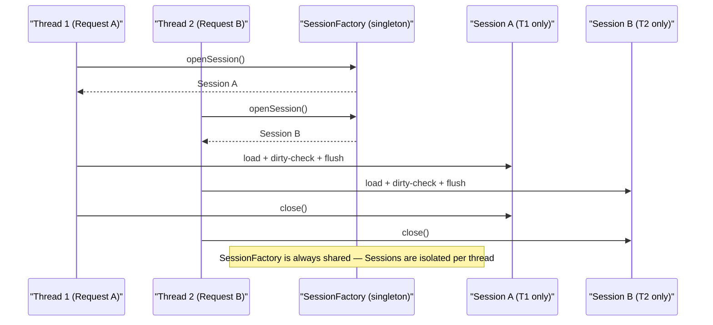
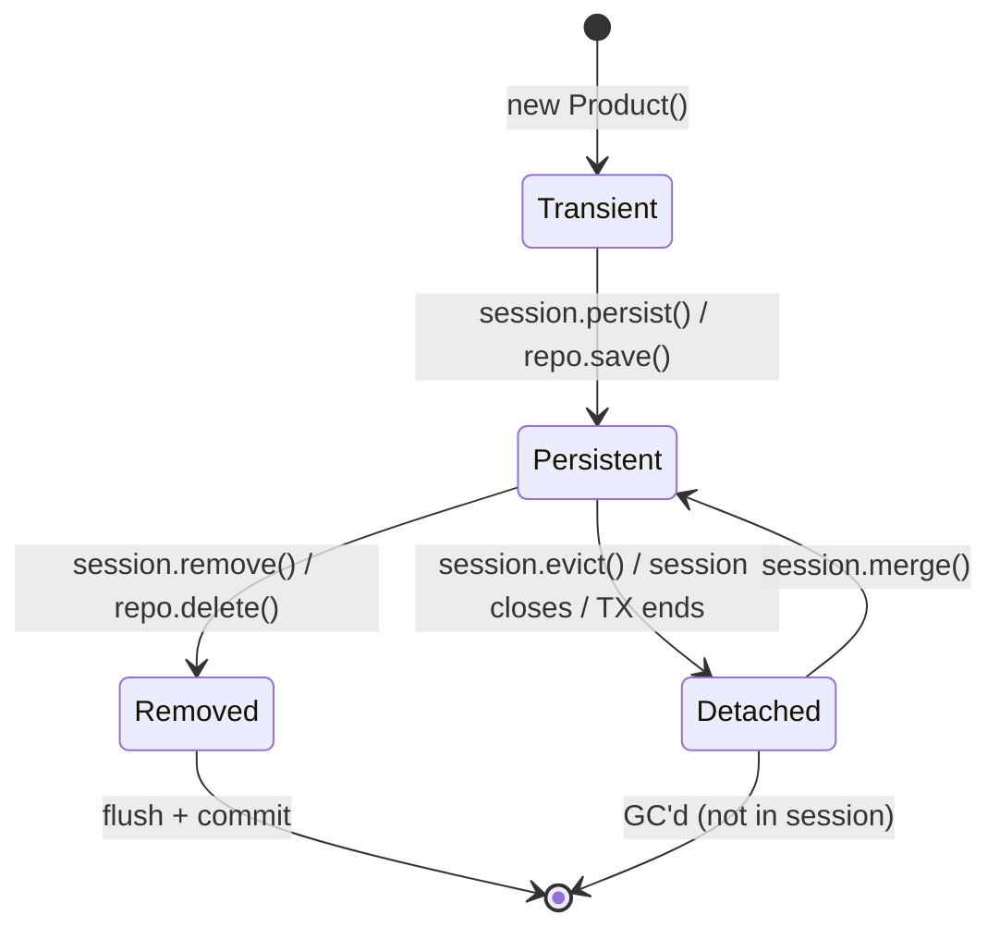

# Hibernate Basics for Spring Boot Developers

> Hibernate is the ORM (Object-Relational Mapping) engine that runs underneath every Spring Data JPA operation. Understanding how its `SessionFactory`, `Session`, entity states, dirty checking, and caching work explains most of the runtime behaviour — and bugs — that Spring Data JPA developers encounter.

## What Problem Does It Solve?

Without an ORM, persistence code is raw SQL + JDBC boilerplate: open connection, prepare statement, execute, map `ResultSet` rows to objects, close. Every table means dozens of lines of repeated plumbing. Hibernate eliminates that: you work with plain Java objects annotated with mapping metadata, and Hibernate figures out the SQL. But that convenience comes with internal machinery you need to understand to avoid subtle bugs.

## SessionFactory vs Session — The Thread Safety Question

This is the #1 interview question on Hibernate and the most important concept to get right.

| | `SessionFactory` | `Session` (/ `EntityManagerFactory` vs `EntityManager`) |
|---|---|---|
| **JPA equivalent** | `EntityManagerFactory` | `EntityManager` |
| **Creation cost** | Very expensive — reads mappings, validates schema, builds SQL templates | Lightweight — wraps a JDBC connection |
| **Instances** | **One per application** (singleton) | **One per request / transaction** |
| **Thread safety** | ✅ **Thread-safe** — designed to be shared across threads | ❌ **NOT thread-safe** — must NOT be shared |
| **Represents** | The configured ORM setup for the whole application | A single unit-of-work with the database |
| **Scope** | Application lifetime | A single transaction / HTTP request |

### Why `Session` is Not Thread-Safe

A `Session` holds:
- A **first-level cache** (in-memory map of all loaded entities, keyed by ID)
- A **dirty-checking snapshot** (original values of all loaded entities for change detection)
- An open **JDBC connection**

If two threads shared the same `Session`, they would:
- Concurrently read/modify the first-level cache (no synchronisation → data corruption)
- Write dirty-checking snapshots out of order → wrong SQL generated
- Race on the JDBC connection → SQL sent in wrong order

This is why `Session` must be **per-thread / per-request / per-transaction**.

### Why `SessionFactory` is Thread-Safe

`SessionFactory` is immutable after startup. It holds only:
- Compiled mapping metadata (class → table, field → column)
- Pre-built SQL templates
- Configuration (dialect, connection pool settings)
- Second-level cache shared data (read explained below)

Nothing mutable is modified at runtime. Multiple threads can safely call `sessionFactory.openSession()` concurrently.

### How Spring Manages This For You

Spring creates exactly one `SessionFactory` (wrapped as `EntityManagerFactory`) at startup and stores it in the application context. For every `@Transactional` method call, Spring:

1. Opens a new `Session` via `sessionFactory.openSession()`.
2. Binds it to the current thread (`ThreadLocal`-based binding via `TransactionSynchronizationManager`).
3. Executes your code.
4. Flushes + commits (or rolls back).
5. Closes the `Session` and removes it from the `ThreadLocal`.

This is why you never call `sessionFactory.openSession()` yourself in Spring — Spring's transaction infrastructure does it for you.



*One `SessionFactory`, many isolated `Session` instances — one per concurrent request. This is the thread safety model.*

## Entity Lifecycle States

Every entity object in a Hibernate `Session` is in one of four states:



*The four Hibernate entity states and the transitions between them.*

### Detailed State Definitions

**Transient** — the object exists in JVM memory but Hibernate knows nothing about it. No database row, no session tracking. A brand new `new Product()` is transient.

**Persistent** — the object is associated with the current `Session`. Hibernate tracks all changes to it. Any field change will be detected and turned into an `UPDATE` SQL when the session flushes. The entity has an ID (either just assigned or already in the DB).

**Detached** — the object was once persistent (associated with a session) but the session has since closed. The object still has an ID and represents a DB row, but Hibernate is no longer tracking it for changes. Common after a `@Transactional` method returns — the entity is returned to the caller but the session has closed.

**Removed** — the object is scheduled for deletion. The `DELETE` SQL runs on the next flush.

### Practical Implications

```java
@Transactional
public Product updateProduct(Long id, String newName) {
    Product product = repo.findById(id).orElseThrow();  // ← PERSISTENT: session is tracking it
    product.setName(newName);                           // ← no explicit save needed!
    return product;
    // ← On return, Hibernate flushes: detects name changed → issues UPDATE automatically
}

// --- outside @Transactional ---
Product product = service.getProduct(1L);   // ← now DETACHED (session closed when TX ended)
product.setName("Changed");                 // ← no session tracking: this change is LOST
// ← To persist it, you'd need productRepo.save(product) in a new @Transactional context
//   (save() calls merge(), which copies the detached state into a new persistent copy)
```

## Dirty Checking — How Hibernate Knows What Changed

When you load an entity inside a transaction, Hibernate takes a **snapshot** of all its field values. Before flushing (committing), it compares the current state against the snapshot. If anything changed, it generates an `UPDATE`. This is called **dirty checking**.

```java
@Transactional
public void applyDiscount(Long id, BigDecimal discount) {
    Product product = repo.findById(id).orElseThrow();
    // ← Hibernate took snapshot: { name="Laptop", price=999.00 }

    product.setPrice(product.getPrice().subtract(discount));
    // ← you did NOT call save() or update() — there is no such method needed

    // ← Before commit: Hibernate compares current {price=898.00} vs snapshot {price=999.00}
    // ← Detects diff → generates: UPDATE products SET price=898.00 WHERE id=?
}   // ← TX commits; UPDATE is sent to DB
```

**Key insight**: In a `@Transactional` method, you never need to call `save()` after modifying a loaded entity. The change is detected automatically. Calling `save()` is redundant (and Spring Data JPA's `save()` delegates to `merge()` for detached entities, but for already-persistent entities it's a no-op load check).

## The Hibernate Session Flush Modes

The flush is the moment Hibernate sends pending SQL to the database (but the transaction is not yet committed).

| Flush Mode | When Hibernate flushes |
|---|---|
| `AUTO` (default) | Before each query execution (to ensure queries see current state) + before commit |
| `COMMIT` | Only before commit — may miss dirty state when queries run mid-transaction |
| `MANUAL` | Never automatically — you must call `session.flush()` explicitly |
| `ALWAYS` | Before every query — highest safety, lowest performance |

Spring Data JPA + `@Transactional` uses `AUTO`. You rarely need to change this.

## First-Level Cache (Session Cache)

The `Session` maintains an **identity map** — every entity loaded from the DB is stored by (type, id). If you load the same entity twice in the same session, Hibernate returns the same Java object from cache, not a second SQL query.

```java
@Transactional
public void demo() {
    Product p1 = repo.findById(1L).orElseThrow();  // ← SQL: SELECT * FROM products WHERE id=1
    Product p2 = repo.findById(1L).orElseThrow();  // ← NO SQL: returns cached instance from session
    System.out.println(p1 == p2);                  // ← true — same Java object reference
}
```

**Scope**: First-level cache is per-`Session` (per-transaction). It is **not** shared across requests. Cleared when the session closes.

**Implication**: `deleteAllInBatch()` bypasses the first-level cache — it issues a direct `DELETE` SQL without going through entity loading. The cache can then hold stale objects. If you use `deleteAllInBatch()`, follow it with a `flush()` + `clear()` of the session.

## Second-Level Cache (SessionFactory Cache)

The second-level cache is **optional**, **shared across sessions**, and requires explicit setup. It caches entity state by ID so that separate transactions can benefit.

```yaml
# application.yml — enable second-level cache with Ehcache or Caffeine
spring:
  jpa:
    properties:
      hibernate:
        cache:
          use_second_level_cache: true
          region:
            factory_class: org.hibernate.cache.jcache.JCacheRegionFactory
```

```java
@Entity
@Cache(usage = CacheConcurrencyStrategy.READ_WRITE)  // ← org.hibernate.annotations
public class Product { ... }
```

In Spring Boot production apps, **use Spring's `@Cacheable` instead of Hibernate's second-level cache** for application-level caching. Hibernate's L2 cache is useful for reference data (lookup tables that never change) but adds coordination complexity in clustered environments. See [Spring Data Caching](./spring-data-caching.md) for the recommended approach.

## `LazyInitializationException` — The Most Common Hibernate Error

```
org.hibernate.LazyInitializationException: 
  failed to lazily initialize a collection of role: Product.tags, 
  could not initialize proxy - no Session
```

This happens when you access a LAZY association **after the `Session` (transaction) has closed**.

```java
// PROBLEM
@Transactional
public Product get(Long id) {
    return productRepo.findById(id).orElseThrow();  // ← session still open
}   // ← session closes here (TX ends)

// ... later in the controller ...
Product product = service.get(1L);
product.getTags().size();  // ← LazyInitializationException: session is gone!
```

Fixes (in order of preference):
1. **Use a DTO or projection** — return only the data you need; don't return entities across the transaction boundary.
2. **Initialize the association inside the `@Transactional` method** — call `Hibernate.initialize(entity.getTags())` or access it before returning.
3. **Use `JOIN FETCH` or `@EntityGraph`** — load the association eagerly for that specific query.
4. **Open Session in View (OSIV)** — Spring Boot enables this by default (`spring.jpa.open-in-view=true`). It keeps the session open for the entire HTTP request, solving `LazyInitializationException` but holding a DB connection for the full request duration. **Turn it off in production**: `spring.jpa.open-in-view=false`.

## Open Session in View — Why It's an Anti-Pattern

Spring Boot's default `spring.jpa.open-in-view=true` extends the Hibernate `Session` from the service layer all the way to the HTTP response writer. Each HTTP thread holds a database connection for its entire processing time.

```
Request arrives → [session opens here, DB connection acquired]
  → Controller
    → Service (@Transactional method)
    → Repository
  → View/JSON serializer  (LAZY loads happen here — session still open)
→ Response sent → [session closes here]
```

**Problem**: Under high load, all threads hold open DB connections while waiting for JSON serialization or network I/O. Connection pool exhausted. Application freezes.

**Fix**: `spring.jpa.open-in-view=false` + return DTOs / projections from services instead of entities. Then LAZY load issues surface early (at the service boundary) where they're easy to fix.

## Accessing the Native Session from Spring

Occasionally you need Hibernate-native features not available through JPA (`@BatchSize` tuning, session statistics, manual flush). You can unwrap:

```java
@PersistenceContext
private EntityManager entityManager;  // ← inject via JPA API

// Unwrap to native Hibernate Session when needed
Session session = entityManager.unwrap(Session.class);  // ← safe; same underlying object
session.setJdbcBatchSize(50);       // ← Hibernate-only feature: override batch size at runtime

// Check if entity is managed by this session
boolean isManaged = session.contains(product);

// Force a specific fetch
Hibernate.initialize(product.getTags());   // ← initializes LAZY proxy if session still open
```

## Best Practices

- **Never share a `Session` across threads** — this is the root cause of most Hibernate concurrency bugs.
- **Always use `@Transactional` to bound Session lifecycle** — let Spring open and close sessions; never do it manually unless you have a non-Spring-managed context.
- **Return DTOs from `@Transactional` methods, not entities** — detached entities received by callers will cause `LazyInitializationException` when LAZY associations are accessed.
- **Set `spring.jpa.open-in-view=false`** in all production Spring Boot apps to prevent connection pool exhaustion.
- **Understand dirty checking** — you never need to call `save()` on a loaded entity within its transaction; unnecessary saves add overhead via redundant SQL.
- **Use `clear()` after large batch inserts** — after inserting thousands of entities, call `entityManager.flush(); entityManager.clear();` periodically to prevent first-level cache from growing unbounded and consuming heap.

## Common Pitfalls

**Mutating a detached entity and expecting it to persist**
Changing fields on a detached entity (one returned from a `@Transactional` method) does nothing — no session is tracking it. You must call `repo.save(entity)` inside a new transaction, which internally calls `merge()` to copy detached state into a new persistent instance.

**Calling `save()` on an already-persistent entity inside a transaction**
Redundant but harmless for in-session entities — Spring Data JPA's `save()` calls `merge()` for entities without new state. But it wastes a `findById` check. Trust dirty checking: if the entity was loaded in the same transaction, just modify it.

**Large transactions consuming excessive memory**
Loading thousands of entities in one transaction holds all their snapshots and first-level cache entries in memory. Fix: process in smaller batches, or use a stateless session (`session.createStatelessSession()`) for bulk reads that don't need dirty checking.

**Assuming `Session` is thread-safe in legacy code**
Common in older codebases that inject a `Session` as a `@Bean`. This is incorrect; every thread must have its own session. If you see `@Bean Session session()` anywhere, it is a bug.

## Interview Questions

### Beginner

**Q:** What is the difference between `SessionFactory` and `Session` in Hibernate?
**A:** `SessionFactory` is a thread-safe, application-scoped singleton that holds all the ORM configuration and mapping metadata. It is expensive to create and created once at startup. A `Session` is a lightweight, short-lived unit-of-work that wraps a JDBC connection. It is NOT thread-safe — each request or transaction must have its own `Session`. In JPA terms: `SessionFactory` = `EntityManagerFactory`; `Session` = `EntityManager`.

**Q:** Is `Session` thread-safe?
**A:** No. A `Session` holds a first-level cache (in-memory identity map), dirty-checking snapshots, and a JDBC connection — all of which are mutable state that would be corrupted by concurrent access. Each thread (request) must use its own `Session`. Spring handles this automatically: it binds a new `Session` to a `ThreadLocal` at the start of each `@Transactional` method and removes it when the method ends.

### Intermediate

**Q:** What is Hibernate's first-level cache and what are its implications?
**A:** The first-level cache (also called the identity map or session cache) is a per-`Session` in-memory store that maps `(entityType, id)` to the loaded entity object. Loading the same entity twice in the same session returns the cached object rather than issuing a second SQL query. It also holds the dirty-checking snapshot. The implication: within a transaction, `p1 == p2` if both were loaded with the same ID. The first-level cache is cleared when the session closes — it does NOT survive between requests unless you explicitly use the second-level cache.

**Q:** What is dirty checking in Hibernate and why does it matter?
**A:** Dirty checking is Hibernate's mechanism for automatically detecting changes to persistent entities. When an entity is loaded into a session, Hibernate takes a snapshot of its state. Before flushing (before a commit or before a query), Hibernate compares each entity's current state to its snapshot. If a field changed, Hibernate generates an `UPDATE`. This means that within a `@Transactional` method, you never need to explicitly call `save()` after modifying a loaded entity — the change is detected and persisted automatically.

**Q:** What causes `LazyInitializationException` and how do you fix it?
**A:** `LazyInitializationException` occurs when you access a LAZY-loaded association after the Hibernate `Session` has closed. In Spring Boot, the session is open only during a `@Transactional` method. If you return a managed entity from the service and access a LAZY field in the controller, the session is already closed. Fixes: (1) use DTO/projection to fetch only needed data in the transaction, (2) initialize the association inside the `@Transactional` method with `Hibernate.initialize()` or `JOIN FETCH`, (3) disable `spring.jpa.open-in-view` and fix the root cause properly.

### Advanced

**Q:** Why should you disable `spring.jpa.open-in-view` in production?
**A:** Open Session in View keeps a Hibernate `Session` (and its underlying JDBC connection) open for the entire duration of the HTTP request — from controller entry to response serialization. Under high concurrency, every request thread holds a connection even while the CPU is doing JSON serialization or awaiting network I/O. This exhausts the connection pool quickly. The correct fix is to return DTOs or projections from your service layer so LAZY associations never need to load outside the transactional boundary. Disabling OSIV forces you to fix these properly.

**Q:** What is the difference between `session.flush()` and `session.clear()`, and when would you use them together?
**A:** `flush()` forces Hibernate to send pending SQL to the database (but does not commit the transaction). `clear()` evicts all entities from the first-level cache, detaching them. Used together in large batch operations: periodically call `flush()` then `clear()` to send the current batch to the DB and release memory. Without `clear()` after a large bulk insert, the first-level cache grows to hold all inserted entities plus their snapshots — a heap memory problem.

```java
@Transactional
public void bulkInsert(List<Product> products) {
    for (int i = 0; i < products.size(); i++) {
        entityManager.persist(products.get(i));
        if (i % 50 == 0) {
            entityManager.flush();   // ← send batch to DB
            entityManager.clear();  // ← release from first-level cache
        }
    }
}
```

## Further Reading

- [Hibernate ORM User Guide — Architecture](https://docs.jboss.org/hibernate/orm/6.4/userguide/html_single/Hibernate_User_Guide.html#architecture) — official SessionFactory, Session, and entity state model
- [Spring Framework — Hibernate Integration](https://docs.spring.io/spring-framework/reference/data-access/orm/hibernate.html) — how Spring manages Session lifecycle
- [Baeldung — Hibernate Object States](https://www.baeldung.com/hibernate-session-object-states) — transient/persistent/detached/removed with code examples

## Related Notes

- [JPA vs Hibernate vs Spring Data](./jpa-vs-spring-data.md) — where Hibernate sits in the overall stack and how it relates to Spring Data JPA
- [JPA Basics](./jpa-basics.md) — the JPA annotations that Hibernate implements (`@Entity`, `@OneToMany`, fetch types)
- [Transactions](./transactions.md) — Spring's `@Transactional` is the mechanism that controls Session open/close lifecycle
- [N+1 Query Problem](./n-plus-one-problem.md) — LAZY loading (Session state) and N+1 queries are tightly related
