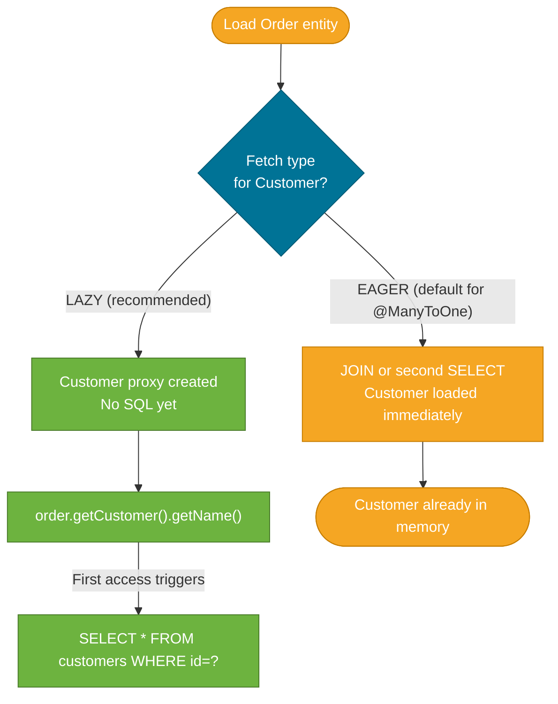

# JPA Basics — Entity Mapping and Relationships

> JPA (Java Persistence API) maps Java objects to database tables through annotations, so your code works with plain Java objects while Hibernate handles the SQL generation, connection management, and object-relational translation underneath.

## What Problem Does It Solve?

Before JPA, every database interaction required writing JDBC: obtaining a `Connection`, building `PreparedStatement` objects, mapping `ResultSet` rows to Java objects by hand, and handling cleanup in `finally` blocks. Changing a column name meant updating multiple strings across the codebase.

JPA removes this friction by letting you annotate a Java class once and letting the framework generate the SQL. Add a field to your class, and JPA creates the column. Define a relationship between two classes, and JPA handles the join. You focus on the object model; Hibernate writes the SQL.

## The Core Annotations

### `@Entity` and `@Table`

`@Entity` marks a class as a JPA-managed entity — a class whose instances are persisted to a database table. Every `@Entity` must have a primary key.

```java
@Entity                                        // ← tells JPA: this class maps to a DB table
@Table(name = "orders")                        // ← optional: table name defaults to class name
public class Order {

    @Id                                        // ← primary key — required on every @Entity
    @GeneratedValue(strategy = GenerationType.IDENTITY) // ← DB auto-increment
    private Long id;

    @Column(name = "product_id", nullable = false, length = 50)
    private String productId;                  // ← maps to column product_id

    @Column(nullable = false)
    private int quantity;

    // JPA requires a no-arg constructor (can be protected)
    protected Order() {}

    public Order(String productId, int quantity) {
        this.productId = productId;
        this.quantity = quantity;
    }

    // getters and setters
}
```

### `@Id` and `@GeneratedValue` strategies

| Strategy | Behaviour | When to use |
|---|---|---|
| `IDENTITY` | Database auto-increment column | Most relational DBs (PostgreSQL serial, MySQL AUTO_INCREMENT) |
| `SEQUENCE` | DB sequence object | PostgreSQL, Oracle — most efficient with `allocationSize` |
| `TABLE` | Dedicated ID table (portable) | Avoid — very slow; legacy use only |
| `AUTO` | JPA chooses automatically | Development only; unpredictable across databases |
| `UUID` | 128-bit universally unique | Distributed systems avoiding sequence bottlenecks |

```java
// Most efficient for PostgreSQL:
@Id
@GeneratedValue(strategy = GenerationType.SEQUENCE, generator = "order_seq")
@SequenceGenerator(name = "order_seq", sequenceName = "order_id_seq", allocationSize = 50)
private Long id;  // allocationSize = 50: Hibernate fetches 50 IDs per round-trip → far fewer DB calls
```

### `@Column`

```java
@Column(
    name = "email_address",       // ← DB column name
    nullable = false,             // ← NOT NULL constraint
    unique = true,                // ← UNIQUE constraint
    length = 255,                 // ← VARCHAR length (default 255)
    updatable = false             // ← JPA will never UPDATE this column after INSERT
)
private String email;
```

Omitting `@Column` is fine — Hibernate uses the field name as the column name and applies defaults.

## Relationship Annotations

Relationships in JPA define how entities refer to each other and what JOIN SQL Hibernate generates.

### `@ManyToOne` — the "N side" of a one-to-many

Every `Order` belongs to one `Customer`. The foreign key lives on the `Order` table.

```java
@Entity
public class Order {

    @Id @GeneratedValue(strategy = GenerationType.IDENTITY)
    private Long id;

    @ManyToOne(fetch = FetchType.LAZY)   // ← LAZY: don't load Customer unless accessed
    @JoinColumn(name = "customer_id")    // ← FK column in the orders table
    private Customer customer;
}
```

### `@OneToMany` — the "1 side" of a one-to-many

A `Customer` has many `Order`s. The collection side is usually mapped as the inverse (`mappedBy`) side — it owns no FK column.

```java
@Entity
public class Customer {

    @Id @GeneratedValue(strategy = GenerationType.IDENTITY)
    private Long id;

    private String name;

    @OneToMany(
        mappedBy = "customer",            // ← "customer" is the field in Order that owns the FK
        cascade = CascadeType.ALL,        // ← persist/delete Order when Customer is persisted/deleted
        orphanRemoval = true,             // ← delete Order from DB when removed from this list
        fetch = FetchType.LAZY            // ← default for @OneToMany; don't load unless accessed
    )
    private List<Order> orders = new ArrayList<>();
}
```

### `@ManyToMany`

Products and Tags: one product has many tags; one tag applies to many products. A join table holds the FK pairs.

```java
@Entity
public class Product {

    @Id @GeneratedValue(strategy = GenerationType.IDENTITY)
    private Long id;

    @ManyToMany
    @JoinTable(
        name = "product_tags",               // ← join table name
        joinColumns = @JoinColumn(name = "product_id"),
        inverseJoinColumns = @JoinColumn(name = "tag_id")
    )
    private Set<Tag> tags = new HashSet<>();
}

@Entity
public class Tag {

    @Id @GeneratedValue(strategy = GenerationType.IDENTITY)
    private Long id;

    @ManyToMany(mappedBy = "tags")           // ← Product is the owning side
    private Set<Product> products = new HashSet<>();
}
```

### `@OneToOne`

A `UserProfile` belongs to exactly one `User`:

```java
@Entity
public class UserProfile {

    @Id
    private Long id;

    @OneToOne(fetch = FetchType.LAZY)
    @MapsId                                 // ← share the same PK as User (no separate FK column)
    private User user;

    private String bio;
}
```

## Fetch Types: LAZY vs EAGER

**This is the single most important concept in JPA performance.**

| Fetch Type | When the related entity is loaded | Default for |
|---|---|---|
| `LAZY` | On first access to the field | `@OneToMany`, `@ManyToMany` |
| `EAGER` | Immediately, in the same SQL query | `@ManyToOne`, `@OneToOne` |



*LAZY defers loading until first access; EAGER loads immediately. Always default to LAZY and load eagerly only when you always need the associated entity.*

:::warning
`@ManyToOne` and `@OneToOne` default to `EAGER`. This is a JPA spec default that causes N+1 problems in practice. Always explicitly set `fetch = FetchType.LAZY` on these associations.
:::

## Lifecycle Callbacks

JPA provides hooks that run before/after database operations:

```java
@Entity
public class Order {

    @Id @GeneratedValue(strategy = GenerationType.IDENTITY)
    private Long id;

    private LocalDateTime createdAt;
    private LocalDateTime updatedAt;

    @PrePersist                               // ← called before INSERT
    protected void onCreate() {
        createdAt = LocalDateTime.now();
        updatedAt = createdAt;
    }

    @PreUpdate                                // ← called before UPDATE
    protected void onUpdate() {
        updatedAt = LocalDateTime.now();
    }
}
```

Or use Spring Data's `@CreatedDate` / `@LastModifiedDate` with `@EnableJpaAuditing` for the same effect without boilerplate:

```java
@Entity
@EntityListeners(AuditingEntityListener.class)  // ← enables Spring Data auditing
public class Order {

    @CreatedDate
    @Column(updatable = false)
    private LocalDateTime createdAt;

    @LastModifiedDate
    private LocalDateTime updatedAt;
}
```

```java
@SpringBootApplication
@EnableJpaAuditing                              // ← activate Spring Data audit support
public class Application { ... }
```

## Best Practices

- **Always explicitly declare `fetch = FetchType.LAZY`** on `@ManyToOne` and `@OneToOne` — the EAGER default causes N+1 queries.
- **Use `mappedBy` on the collection side** (`@OneToMany`) to avoid a spurious extra UPDATE that Hibernate emits when both sides own the relationship.
- **Prefer `Set` over `List` for `@ManyToMany`** — Hibernate deletes and re-inserts all rows for a `List` when one element is added; `Set` merges cleanly.
- **Use `orphanRemoval = true` with `cascade = ALL`** on `@OneToMany` — this ensures child records are removed from the DB when you call `parent.getChildren().remove(child)`.
- **Keep entities anemic (no business logic)** — business logic in entities makes testing harder; put it in services.
- **Always provide a no-arg constructor** — JPA requires one (can be `protected`) to proxy and instantiate entities.

## Common Pitfalls

**`LazyInitializationException`**
Accessing a `LAZY` association outside an active Hibernate session (e.g., in a serializer or after the transaction commits) throws `LazyInitializationException`. Fix: either load the association within the transaction, use a DTO projection, or annotate the method with `@Transactional` to extend the session boundary.

**Bidirectional relationship not kept in sync**
In a bidirectional `@OneToMany`/`@ManyToOne`, Hibernate writes from the owning side (the `@ManyToOne` side). If you only add to the `@OneToMany` collection without setting the `@ManyToOne` field, the FK column remains null. Always set both sides:

```java
order.setCustomer(customer);          // ← sets the FK column (owning side)
customer.getOrders().add(order);      // ← keeps the in-memory graph consistent
```

**`GenerationType.AUTO` choosing TABLE strategy**
In some JPA providers, `AUTO` picks `TABLE`, which is extremely slow. Always specify `IDENTITY` or `SEQUENCE` explicitly.

**Using `@Column(unique = true)` without a DB constraint**
The `unique = true` attribute generates the DDL constraint only when you let Hibernate create the schema (`spring.jpa.hibernate.ddl-auto=create`). In production with migration tools (Flyway/Liquibase), you must add the constraint in the migration script yourself.

## Interview Questions

### Beginner

**Q:** What is the difference between `@Entity` and a regular Java class?
**A:** A `@Entity`-annotated class is managed by JPA — Hibernate tracks instances of it (called entities) and can persist, update, and delete them in the database. A regular Java class has no persistence mechanism. Every entity must have a primary key field annotated with `@Id`.

**Q:** What is the difference between `LAZY` and `EAGER` fetch types?
**A:** `EAGER` loads the associated entity immediately when the parent is loaded, usually via a JOIN or a second SQL query. `LAZY` defers loading until the field is first accessed in code. `LAZY` is almost always preferred because it avoids loading data you may never need. The JPA defaults are: `EAGER` for `@ManyToOne` and `@OneToOne`; `LAZY` for `@OneToMany` and `@ManyToMany`.

### Intermediate

**Q:** What does `mappedBy` mean in a bidirectional relationship?
**A:** `mappedBy` designates the non-owning side of a relationship. It tells Hibernate that the actual FK column is managed by the field named in the `mappedBy` value on the *other* entity. Only the owning side (without `mappedBy`) generates the FK column in the schema and controls writes to it. The `mappedBy` side is read-only from the perspective of SQL generation.

**Q:** What is `orphanRemoval = true` and when should you use it?
**A:** `orphanRemoval = true` on `@OneToMany` means: when a child entity is removed from the parent's collection, Hibernate will emit a DELETE for that child record. Use it when child records have no meaning outside their parent — e.g., order line items that cannot exist without an order. Without it, removing from the collection only detaches the reference in memory; the row stays in the database.

### Advanced

**Q:** Why is `@ManyToOne(fetch = FetchType.EAGER)` the default, and why is it problematic in practice?
**A:** The JPA specification chose `EAGER` as the default for `@ManyToOne` because in the original JDBC era most associations were needed immediately. In practice, it causes N+1 problems when you load a list of entities: Hibernate emits one query for the list, then one query per row to load the associated entity. Always override to `LAZY` and use JOIN FETCH or `@EntityGraph` when you actually need the association in a query.

**Q:** Explain the difference between `CascadeType.PERSIST`, `CascadeType.MERGE`, and `CascadeType.REMOVE`.
**A:** `PERSIST` propagates `EntityManager.persist()` to child entities — when you save a parent, unsaved children are also saved. `MERGE` propagates `EntityManager.merge()` — when you merge a detached parent, detached children are also merged. `REMOVE` propagates `EntityManager.remove()` — when you delete a parent, its children are also deleted. `CascadeType.ALL` is a shorthand for all six cascade types including `REFRESH` and `DETACH`. Use `REMOVE` carefully on `@ManyToMany` aggregates — you rarely want deletion to cascade across a many-to-many.

## Further Reading

- [Baeldung: JPA Entity Mapping](https://www.baeldung.com/jpa-entities) — comprehensive guide to entity annotations with examples
- [Baeldung: Hibernate One-to-Many](https://www.baeldung.com/hibernate-one-to-many) — bidirectional and unidirectional one-to-many with practical pitfalls
- [Spring Data JPA Reference](https://docs.spring.io/spring-data/jpa/docs/current/reference/html/) — official reference with entity mapping details

## Related Notes

- [Spring Data Repositories](./spring-data-repositories.md) — repositories are the query layer built on top of JPA entities; understand entity mapping before writing repository methods
- [N+1 Query Problem](./n-plus-one-problem.md) — arises directly from LAZY loading behavior and is the most important JPA performance concept
- [Transactions](./transactions.md) — `@Transactional` is required to keep the Hibernate session open for LAZY associations and ensures atomic writes
