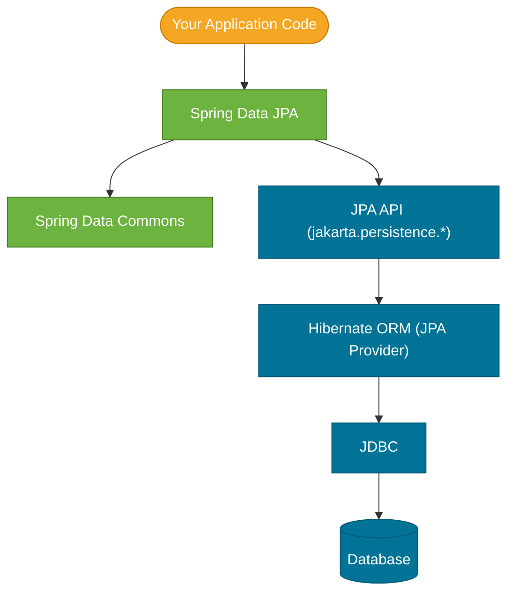

# JPA vs Hibernate vs Spring Data vs Spring Data JPA

> These four terms are used interchangeably in conversation but mean very different things — understanding how they relate is the first thing to get right before working with any of them.

## What Problem Does It Solve?

Reading job postings, Hibernate docs, Spring Boot guides, and Stack Overflow answers, you'll see these four names mixed together. Developers often say "JPA" when they mean "Hibernate", or "Spring Data" when they mean "Spring Data JPA". This causes real confusion when:

- You see `@Entity` and wonder: is that JPA or Hibernate?
- You import `Session` and wonder: why is that different from `EntityManager`?
- You read "use Spring Data repositories" and wonder: what does that have to do with JPA?

The answer is a clean layered model — each term occupies a specific level.

## The Four Layers



*Your code talks to Spring Data JPA. Spring Data JPA talks to the JPA API. Hibernate implements that API. Hibernate talks to the DB via JDBC.*

### Layer 1 — JPA (Jakarta Persistence API)

JPA is a **specification** — a set of interfaces and annotations that define *how* Java objects should be mapped to relational tables and how persistent operations (save, find, update, delete) should work. It lives in the `jakarta.persistence` package.

JPA defines:
- Annotations: `@Entity`, `@Id`, `@OneToMany`, `@ManyToOne`, `@GeneratedValue`, `@Column`
- The `EntityManager` API: `persist()`, `find()`, `merge()`, `remove()`, `createQuery()`
- The JPQL query language
- The transaction demarcation contract

JPA does **not** contain any SQL-generating code. It is purely a specification. You cannot run a JPA-only application — you need an implementation.

### Layer 2 — Hibernate ORM

Hibernate is the most widely used **implementation** of JPA. When you add `spring-boot-starter-data-jpa`, Hibernate is pulled in as a dependency and registered as the JPA provider.

Hibernate *implements* every JPA interface and *also* provides its own native API (`Session`, `SessionFactory`, `HQL`) with features beyond the JPA spec (second-level cache, batch fetching, `@BatchSize`, etc.).

The relationship: **all JPA code runs on Hibernate** (in a Spring Boot default setup). Every `EntityManager` is a Hibernate `Session` underneath.

```
JPA                    Hibernate native equivalent
─────────────────────  ──────────────────────────────
EntityManagerFactory   SessionFactory
EntityManager          Session
@NamedQuery (JPQL)     HQL (Hibernate Query Language)
EntityTransaction      Transaction (org.hibernate)
```

Other JPA implementations exist (EclipseLink, OpenJPA) but Hibernate is the default in Spring Boot and by far the most common in industry.

### Layer 3 — Spring Data Commons

Spring Data Commons is the **foundation** library of the Spring Data project. It defines the core `Repository`, `CrudRepository`, and `PagingAndSortingRepository` interfaces that all Spring Data modules build on. It also provides the query method derivation engine (parsing `findByStatusAndPriceGreaterThan` into a query).

It is not tied to any database or persistence technology.

### Layer 4 — Spring Data JPA

Spring Data JPA is the module that bridges Spring Data Commons with JPA. It:
- Extends `CrudRepository` / `PagingAndSortingRepository` with `JpaRepository`
- Generates JPQL or native SQL from derived method names (via the Commons infrastructure + JPA specifics)
- Implements `@Query`, `@Modifying`, `@EntityGraph`, Specification/Predicate support
- Manages `EntityManager` lifecycle (obtaining it from the JPA `EntityManagerFactory`)
- Delegates transaction management to Spring's `PlatformTransactionManager` (`JpaTransactionManager` wraps Hibernate's transaction infrastructure)

Spring Data JPA is what you interact with directly in application code — the `JpaRepository` interface and its annotations.

## Visual Summary

| Term | Type | What it gives you | Who writes it |
|---|---|---|---|
| **JPA** | Specification | Annotations (`@Entity`, `@Id`), `EntityManager` API | Jakarta EE / Eclipse Foundation |
| **Hibernate** | JPA Implementation | SQL generation, dirty checking, caching, `Session` API | Red Hat / Hibernate team |
| **Spring Data Commons** | Library | `CrudRepository`, query derivation engine | VMware / Spring team |
| **Spring Data JPA** | Library (JPA module) | `JpaRepository`, `@Query`, `@EntityGraph`, Specification API | VMware / Spring team |

## What You Actually Write

In a typical Spring Boot application:

```java
// ← @Entity is JPA annotation (jakarta.persistence)
@Entity
public class Product {
    @Id @GeneratedValue   // ← JPA annotations
    private Long id;
    private String name;
}

// ← JpaRepository is Spring Data JPA
// ← under the hood, Spring Data JPA uses EntityManager (JPA API)
// ← EntityManager is implemented by Hibernate's Session
public interface ProductRepository extends JpaRepository<Product, Long> {
    List<Product> findByName(String name);  // ← Spring Data query derivation
}

@Service
@Transactional     // ← Spring Framework annotation — uses JpaTransactionManager
public class ProductService {
    private final ProductRepository repo;  // ← Spring Data JPA repository
    public Product getProduct(Long id) {
        return repo.findById(id).orElseThrow();   // ← Spring Data → JPA → Hibernate → SQL
    }
}
```

You almost never import from `org.hibernate.*` directly. The chain is invisible:

```
ProductRepository.findByName()
  → Spring Data JPA generates JPQL
  → EntityManager.createQuery()     (JPA API)
  → Hibernate executes SQL          (JPA implementation)
  → JDBC driver sends to DB
```

## Other Spring Data Modules

Spring Data JPA is one of many Spring Data modules — same `CrudRepository` interface, different backing store:

| Module | Backing Store |
|---|---|
| Spring Data JPA | Relational DB via JPA/Hibernate |
| Spring Data MongoDB | MongoDB |
| Spring Data Redis | Redis |
| Spring Data Elasticsearch | Elasticsearch |
| Spring Data JDBC | Relational DB via plain JDBC (no ORM) |
| Spring Data R2DBC | Reactive relational DB access |

All share the same `findBy...` query method syntax and `@Query` annotation because they share Spring Data Commons. The only difference is what's behind the repository interface.

## Common Misconceptions

**"I'm using Hibernate" vs "I'm using JPA"**
If you're coding to `@Entity` and `EntityManager`, you're coding to the JPA API — even if Hibernate is running underneath. You're "using Hibernate" only if you drop to `Session` / `SessionFactory` directly (which is rarely needed in Spring Boot).

**"Spring Data manages transactions"**
Spring *Framework* manages transactions (via `PlatformTransactionManager`). Spring Data JPA's repositories are `@Transactional` by default, but the actual begin/commit/rollback runs through Spring's AOP transaction infrastructure, which delegates to Hibernate's `Transaction` API.

**"JPQL = Hibernate HQL"**
JPQL (Java Persistence Query Language, part of the JPA spec) was inspired by and is nearly identical to HQL (Hibernate Query Language). The JPA spec standardized a subset of HQL. In practice they look the same, but HQL has extra features not in the JPA spec (e.g., HQL `TREAT`, `ELEMENTS`, `INDICES` functions).

## Best Practices

- **Code to JPA annotations and `EntityManager`** — not to native Hibernate APIs. This keeps your entity code portable (theoretically) and idiomatic.
- **Never import from `org.hibernate.*` in entity classes** — use `jakarta.persistence.*` annotations unless you have an explicit reason (e.g., `@BatchSize` which has no JPA equivalent).
- **Use Spring Data JPA repositories for all standard CRUD** — reserve `@Query` with JPQL or native SQL for complex cases.
- **Understand the seam between Spring Data and JPA** — Hibernate session lifecycle, dirty checking, and first-level cache are still in effect even when using Spring Data repositories.

## Interview Questions

### Beginner

**Q:** What is the difference between JPA and Hibernate?
**A:** JPA is a specification — a set of interfaces and annotations (`@Entity`, `@Id`, `EntityManager`) that define how Java objects should map to relational tables. Hibernate is an *implementation* of that specification. JPA defines *what* should work; Hibernate defines *how* it works. In Spring Boot, every JPA operation is executed by Hibernate under the hood.

**Q:** What is Spring Data JPA and how is it different from JPA?
**A:** Spring Data JPA is a Spring library that wraps the JPA API to provide zero-boilerplate repository interfaces (`JpaRepository`), automatic query generation from method names, `@Query` annotations, and declarative transaction management. JPA is a raw specification — it defines the API but not the convenience layer. Spring Data JPA is the convenience layer that lets you write `findByStatus(String status)` instead of writing `EntityManager.createQuery(...)` by hand.

### Intermediate

**Q:** If I use Spring Data JPA, am I also using Hibernate even if I never write Hibernate code?
**A:** Yes. In a default Spring Boot setup, `spring-boot-starter-data-jpa` pulls in Hibernate as the JPA provider. Every `EntityManager` in your code is a Hibernate `Session` internally. Every `@Transactional` boundary triggers a Hibernate transaction. Even though you only see Spring Data annotations and JPA interfaces, Hibernate is generating and executing all SQL. You can confirm this by enabling `spring.jpa.show-sql=true` and observing Hibernate-generated SQL in the logs.

### Advanced

**Q:** Can you replace Hibernate with a different JPA provider in a Spring Boot application?
**A:** Yes, but it requires explicit configuration. Exclude Hibernate from `spring-boot-starter-data-jpa` and add EclipseLink (or another provider) instead. Set `spring.jpa.provider: org.eclipse.persistence.jpa.PersistenceProvider` and provide a `persistence.xml` if needed. In practice this is rarely done — Hibernate has the richest feature set, best Spring Boot integration, and is the industry standard.

## Further Reading

- [Jakarta Persistence Specification](https://jakarta.ee/specifications/persistence/) — the JPA spec itself
- [Hibernate ORM User Guide](https://docs.jboss.org/hibernate/orm/6.4/userguide/html_single/Hibernate_User_Guide.html) — Hibernate architecture and features
- [Spring Data JPA Reference](https://docs.spring.io/spring-data/jpa/reference/) — Spring Data JPA official docs

## Related Notes

- [Hibernate Basics](./hibernate-basics.md) — the Hibernate-specific concepts (Session, SessionFactory, thread safety, first-level cache) that run underneath every Spring Data JPA call
- [JPA Basics](./jpa-basics.md) — the JPA annotations and `@Entity` mapping model built on the JPA spec described here
- [Spring Data Repositories](./spring-data-repositories.md) — the Spring Data JPA repository layer in detail
