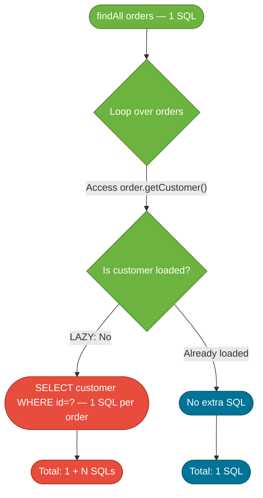

# The N+1 Query Problem

> The N+1 problem occurs when loading a list of N entities triggers N additional queries to load each entity's association, turning one logical "fetch" into N+1 database round trips.

## What Problem Does It Solve?

JPA is convenient — it maps object relationships to SQL automatically. But that convenience can silently devastate performance. The following code looks innocent:

```java
List<Order> orders = orderRepo.findAll();     // ← query 1: SELECT * FROM orders
for (Order order : orders) {
    System.out.println(order.getCustomer().getName()); // ← query per customer? YES.
}
```

If `findAll()` returns 100 orders, Hibernate issues **1 query to load orders + 100 queries to load each customer** = **101 SQL statements** for what should be a single join.

This is the N+1 problem, and it's usually invisible in development (small datasets) but catastrophic in production (thousands of records).

## Analogy: The Indecisive Librarian

Imagine a librarian asked to list all books and their authors. Instead of looking up all books and authors together in one sweep, they:
1. Get the full list of books (1 query).
2. For each book, walk back to the author index to look up that author (N queries).

A smart librarian does a **JOIN** — one trip where books and authors are fetched together. Hibernate's LAZY loading default behaves like the indecisive librarian.

## How It Arises — LAZY vs EAGER

JPA `@ManyToOne` and `@OneToOne` associations default to **EAGER** loading. `@OneToMany` and `@ManyToMany` default to **LAZY** loading.

| Association | JPA Default | Risk |
|---|---|---|
| `@ManyToOne` | `EAGER` | N+1 when loading a collection of owners |
| `@OneToOne` | `EAGER` | Same as `@ManyToOne` |
| `@OneToMany` | `LAZY` | `LazyInitializationException` if accessed outside TX |
| `@ManyToMany` | `LAZY` | Same as `@OneToMany` |

**EAGER is not the fix.** Every `findAll()` or `findById()` will always join the association, even when you don't need it. LAZY is the right default; the fix is to load associations *explicitly when you need them*.



*LAZY loading defers SQL until access — great for cases where the association isn't used. Problem: when every entity needs the association, it fires N individual queries.*

## Diagnosing It

Enable Hibernate SQL logging to see individual queries:

```yaml
# application.yml
spring:
  jpa:
    show-sql: true
    properties:
      hibernate:
        format_sql: true
logging:
  level:
    org.hibernate.SQL: DEBUG
    org.hibernate.type.descriptor.sql: TRACE   # ← log bind parameters too
```

Then count the `SELECT` statements. If you see the same query repeated with different `id` values, you have N+1.

For a more explicit count in tests, use the **datasource-proxy** library or [Hypersistence Utils](https://vladmihalcea.com/hypersistence-utils/):

```java
// Using Hypersistence Utils in a test
@SQLStatementCountValidator
@Test
void loadOrders_shouldUseOneQuery() {
    List<Order> orders = orderRepo.findAllWithCustomers(); // our fix
    assertSelectCount(1);   // ← assert exactly 1 SELECT was issued
}
```

## Fix 1 — JOIN FETCH in JPQL

The most direct fix: tell JPQL to join the association in a single query.

```java
@Repository
public interface OrderRepository extends JpaRepository<Order, Long> {

    @Query("SELECT o FROM Order o JOIN FETCH o.customer")  // ← one SQL with JOIN
    List<Order> findAllWithCustomers();

    @Query("SELECT o FROM Order o JOIN FETCH o.customer JOIN FETCH o.items WHERE o.status = :status")
    List<Order> findByStatusWithDetails(@Param("status") OrderStatus status);
}
```

Generated SQL:
```sql
SELECT o.*, c.* FROM orders o INNER JOIN customers c ON o.customer_id = c.id
```

:::warning
`JOIN FETCH` with `@OneToMany` (a collection) + `setMaxResults()`/`Pageable` causes Hibernate to load **all rows into memory** and paginate in Java. Hibernate logs a warning: `HHH000104: firstResult/maxResults specified with collection fetch; applying in memory!`. For paginated collection fetches, use a different strategy (see Fix 3).
:::

## Fix 2 — `@EntityGraph`

`@EntityGraph` specifies which associations to fetch eagerly for a specific query without hard-coding JPQL.

```java
@Entity
@NamedEntityGraph(
    name = "Order.withCustomer",
    attributeNodes = @NamedAttributeNode("customer")   // ← include customer in fetch
)
public class Order {

    @ManyToOne(fetch = FetchType.LAZY)      // ← keep LAZY as the default
    private Customer customer;
    // ...
}
```

```java
@Repository
public interface OrderRepository extends JpaRepository<Order, Long> {

    @EntityGraph(attributePaths = {"customer"})         // ← ad-hoc entity graph (no @NamedEntityGraph needed)
    List<Order> findByStatus(OrderStatus status);

    @EntityGraph(value = "Order.withCustomer")          // ← reference named graph
    Optional<Order> findWithCustomerById(Long id);
}
```

`@EntityGraph` is cleaner than `JOIN FETCH` for simple cases — it doesn't require custom JPQL and works directly on derived query methods.

## Fix 3 — Batch Fetching

For `@OneToMany` collections, batch fetching groups the N individual queries into ceil(N/batchSize) queries — not perfect, but far better than N.

```java
@Entity
public class Order {

    @OneToMany(mappedBy = "order", fetch = FetchType.LAZY)
    @BatchSize(size = 25)               // ← Hibernate hint: fetch up to 25 collections per query
    private List<OrderItem> items;
}
```

With `@BatchSize(size = 25)`, loading 100 orders' items costs 4 queries instead of 100. Alternatively, set globally:

```yaml
spring:
  jpa:
    properties:
      hibernate:
        default_batch_fetch_size: 25
```

This is ideal when you *sometimes* access the collection and don't want to always join it.

## Fix 4 — DTO Projections

If you only need a subset of data, avoid loading full entities at all. Use a DTO projection to project exactly what you need in a single query (see the [Projections note](./projections.md)):

```java
public interface OrderSummary {
    Long getId();
    String getCustomerName();       // ← derives from order.customer.name automatically
    BigDecimal getTotalAmount();
}

@Repository
public interface OrderRepository extends JpaRepository<Order, Long> {
    List<OrderSummary> findAllProjectedBy();  // ← Spring Data generates optimal SQL
}
```

DTO projections often produce the most efficient SQL because Spring Data generates a tailored `SELECT` instead of loading full entity graphs.

## Fix Comparison

| Fix | Best for | Pagination safe? | Code overhead |
|---|---|---|---|
| `JOIN FETCH` | One-to-one or many-to-one | ✅ (single-valued) | Medium (custom JPQL) |
| `@EntityGraph` | Simple attribute fetch without custom JPQL | ✅ (single-valued) | Low |
| `@BatchSize` | Large `@OneToMany` collections | ✅ | Very low |
| DTO Projection | Read-only list/summary views | ✅ | Low–Medium |

## Best Practices

- **Always use `FetchType.LAZY` on all associations by default.** Change to EAGER only when you have a measured reason; EAGER is the source of most N+1 bugs, not the cure.
- **Never iterate over a lazy collection outside a transaction.** Do the traversal inside the service/repository layer where the Hibernate session is active.
- **Test for N+1 explicitly** in integration tests using SQL statement count assertions — it's almost never visible in unit tests.
- **Use `@EntityGraph` for simple, query-method-level fetch control**; use `JOIN FETCH` when the query is complex or when you need to filter by the joined association.
- **Use `@BatchSize` or `default_batch_fetch_size` globally** as a low-effort safety net for collection fetches.
- **Avoid EAGER default on `@ManyToOne` in list queries** — even "one" join per entity becomes N joins across a list.

## Common Pitfalls

**Switching to EAGER "to fix" N+1**
This doesn't fix N+1 — it makes every query always pay the join cost even when you don't need the data. Use LAZY + explicit fetch.

**`JOIN FETCH` + `Pageable` on a collection**
Hibernate cannot do database-level pagination when the result set is multiplied by a `@OneToMany` join. It loads everything into memory and paginates there. For paginated collection fetches: paginate the root entity (e.g., orders), then use `@BatchSize` or separate queries to load collections.

**Multiple `JOIN FETCH` on different collections (`bagFetchException`)**
Hibernate doesn't support two simultaneous `JOIN FETCH` on `@OneToMany` bags (unordered lists) in the same query. Fix: use `Set` instead of `List`, or use `@BatchSize`, or split into separate queries.

**Forgetting that `findById()` in Spring Data is `@Transactional(readOnly = true)`**
This is fine for loading by ID. But if you return the entity to a non-transactional context and then access a LAZY association, the session is already closed. Fetch everything you need in the same transaction.

## Interview Questions

### Beginner

**Q:** What is the N+1 query problem in JPA?
**A:** When loading a list of N entities that have an association (e.g., orders with customers), JPA issues 1 query for the list and then 1 additional query for each entity's association — a total of N+1 queries. This is caused by LAZY loading, where associations are fetched on demand when first accessed rather than in the initial query.

**Q:** How do you detect N+1 queries?
**A:** Enable `spring.jpa.show-sql=true` and inspect the logs. If you see the same `SELECT` repeated many times with different IDs, you have N+1. In tests, use SQL count assertion libraries like Hypersistence Utils or datasource-proxy to assert exactly how many SQL statements were issued.

### Intermediate

**Q:** How does `JOIN FETCH` solve N+1?
**A:** `JOIN FETCH` in JPQL tells Hibernate to load the root entity and its association in a single SQL JOIN, rather than deferring the association to separate lazy queries. `SELECT o FROM Order o JOIN FETCH o.customer` produces one SQL with an `INNER JOIN`, cutting 101 queries down to 1.

**Q:** What is the difference between `JOIN FETCH` and `@EntityGraph`?
**A:** Both force eager loading for a specific query. `JOIN FETCH` embeds the join in a JPQL string (more explicit, works with filtering/ordering on the joined table). `@EntityGraph` specifies fetch paths declaratively without JPQL; it attaches to query methods including derived queries. `@EntityGraph` is cleaner for simple cases; `JOIN FETCH` is necessary when the query is complex.

**Q:** Why can't you use `JOIN FETCH` with `Pageable` on a `@OneToMany`?
**A:** A `@OneToMany` JOIN multiplies the result rows (each order appears once per item). `LIMIT` / `OFFSET` on those multiplied rows would paginate incorrectly. Hibernate falls back to in-memory pagination, loading the entire unjoined result set and slicing in Java. Use `@BatchSize` or a separate query to load collections when the root query is paginated.

### Advanced

**Q:** What is the `@BatchSize` strategy and when should you use it?
**A:** `@BatchSize(size = N)` tells Hibernate to collect up to N unloaded collection IDs and fetch them together in one `IN (...)` query. Instead of 100 individual `SELECT * FROM order_items WHERE order_id = ?` queries, it issues 4 batches of 25. It's not as efficient as `JOIN FETCH` but requires no custom JPQL and is safe with pagination. Ideal as a global safety net via `default_batch_fetch_size` in application properties.

**Q:** How do DTO projections address N+1 differently from `JOIN FETCH`?
**A:** `JOIN FETCH` fetches full entity graphs — Hibernate tracks all fields in the session. DTO projections instruct Spring Data to generate a `SELECT` returning only the specified fields; no entity is tracked by the persistence context. This produces leaner SQL, avoids dirty checking, and returns an immutable view. For read-only list/summary screens, this is usually the most efficient solution and avoids the N+1 issue entirely because the projection query fetches all needed columns in one call.

## Further Reading

- [Hibernate Fetching Strategies User Guide](https://docs.jboss.org/hibernate/orm/6.4/userguide/html_single/Hibernate_User_Guide.html#fetching) — official Hibernate documentation on LAZY/EAGER, JOIN FETCH, batch fetching
- [Baeldung: Spring Data JPA — Named Entity Graphs](https://www.baeldung.com/spring-data-jpa-named-entity-graphs) — step-by-step `@EntityGraph` guide

## Related Notes

- [JPA Basics](./jpa-basics.md) — `FetchType.LAZY` vs `FetchType.EAGER` are defined as part of relationship annotations; understanding them is prerequisite to diagnosing N+1
- [Transactions](./transactions.md) — `LazyInitializationException` (the partner symptom of LAZY loading) is directly related to session/transaction lifecycle
- [Projections](./projections.md) — DTO projections are one of the cleanest N+1 fixes for read-only views
