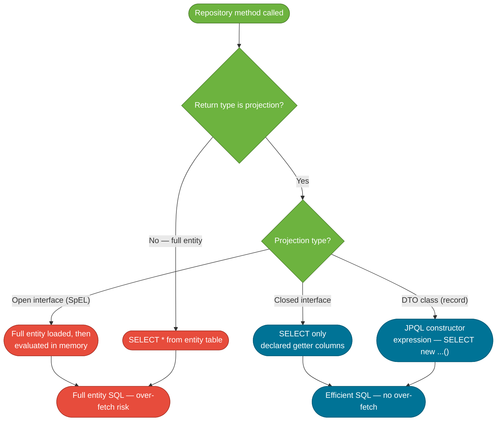

# Spring Data Projections

> A Spring Data projection is a mechanism to select only a specific subset of an entity's fields, returning a shaped view rather than the full entity object.

## What Problem Does It Solve?

Every `findAll()` or `findById()` loads the entire entity — all columns — even when a REST endpoint only needs one or two fields. This causes:

- **Over-fetching**: loading large `BLOB`/`TEXT` columns (e.g., product descriptions, file content) that are never used.
- **N+1 risk**: full entity loading triggers LAZY associations even when the caller only needs a summary.
- **Leaking internal fields**: returning full entities to an API surface exposes audit fields, version columns, and internal IDs.

Projections solve this by generating targeted `SELECT col1, col2 FROM ...` queries instead of `SELECT *`.

## What Are Projections?

A projection describes the *shape* of data you want back. Spring Data JPA supports three projection styles:

| Style | Return type | How it works | Performance |
|---|---|---|---|
| **Closed interface** | Interface with getters | Spring generates a proxy; SQL selects only mapped fields | Best |
| **Open interface** | Interface with `@Value` / SpEL | Proxy with computed fields; may load full entity | Good |
| **DTO (class-based)** | POJO or `record` | Constructor expression in query | Best |
| **Dynamic** | Generic `<T>` | Projection type passed at call time | Varies |

## Closed Interface Projections

The most common form. Define an interface with getter methods whose names match the entity field names.

```java
// The full entity
@Entity
public class Product {
    @Id private Long id;
    private String name;
    private BigDecimal price;
    private String description;    // ← large field, often unneeded
    private byte[] thumbnail;      // ← binary, expensive to load
}
```

```java
// Closed projection — only name and price
public interface ProductSummary {
    Long getId();
    String getName();
    BigDecimal getPrice();
}
```

```java
@Repository
public interface ProductRepository extends JpaRepository<Product, Long> {

    List<ProductSummary> findAllProjectedBy();   // ← Spring Data infers projection from return type

    Optional<ProductSummary> findProjectedById(Long id);

    List<ProductSummary> findByPriceLessThan(BigDecimal maxPrice);
}
```

Generated SQL (only selected columns):
```sql
SELECT p.id, p.name, p.price FROM product p
```

`description` and `thumbnail` are not fetched — even if they are mapped on the entity.

## Nested Interface Projections

You can include associated entity fields by nesting projection interfaces.

```java
public interface OrderSummary {
    Long getId();
    String getStatus();
    CustomerInfo getCustomer();   // ← nested projection for the associated Customer

    interface CustomerInfo {      // ← inner interface for the nested association
        String getName();
        String getEmail();
    }
}
```

```java
@Repository
public interface OrderRepository extends JpaRepository<Order, Long> {
    List<OrderSummary> findByStatus(String status);
}
```

Generated SQL (single JOIN query — no N+1):
```sql
SELECT o.id, o.status, c.name, c.email
FROM orders o
INNER JOIN customers c ON o.customer_id = c.id
WHERE o.status = ?
```

This is both N+1-safe and over-fetch-safe.

## Open Interface Projections (`@Value` + SpEL)

Open projections allow computed/derived fields using Spring Expression Language (SpEL):

```java
public interface ProductView {
    String getName();

    @Value("#{target.price * 1.2}")          // ← target is the full entity instance
    BigDecimal getPriceWithTax();

    @Value("#{target.name + ' (' + target.id + ')'}")
    String getDisplayLabel();
}
```

:::warning
Open projections may force Hibernate to load the **full entity** into memory so SpEL can evaluate `target.*` fields. Use only when you truly need a derived field and understand the performance trade-off.
:::

## DTO (Class-Based) Projections

A DTO projection is a plain Java class or `record` with a constructor. Spring Data JPA maps query result columns to constructor parameters by position and type.

```java
// DTO as a Java record (Java 16+)
public record ProductPriceInfo(Long id, String name, BigDecimal price) {}
```

```java
// DTO as a regular class
public class ProductPriceInfo {
    private final Long id;
    private final String name;
    private final BigDecimal price;

    public ProductPriceInfo(Long id, String name, BigDecimal price) { // ← constructor required
        this.id = id;
        this.name = name;
        this.price = price;
    }
    // getters...
}
```

```java
@Repository
public interface ProductRepository extends JpaRepository<Product, Long> {

    @Query("SELECT new com.example.dto.ProductPriceInfo(p.id, p.name, p.price) FROM Product p")
    List<ProductPriceInfo> findAllPriceInfo();  // ← JPQL constructor expression
}
```

DTO projections are not tracked by the Hibernate persistence context — they're immutable views. No dirty checking, no session overhead.

## Dynamic Projections

Spring Data supports a generic type parameter to select the projection at call time:

```java
@Repository
public interface ProductRepository extends JpaRepository<Product, Long> {
    <T> List<T> findByCategory(String category, Class<T> type);  // ← type chosen by caller
}
```

```java
// Caller chooses what shape they need
List<ProductSummary> summaries = productRepo.findByCategory("electronics", ProductSummary.class);
List<Product> fullEntities = productRepo.findByCategory("electronics", Product.class);
```

This is useful when a single repository method serves multiple consumers with different data needs.

## How Spring Data Chooses the SQL



*Closed interfaces and DTO projections produce targeted SQL. Open projections and full entities always load all columns.*

## Code Examples

### Complete REST endpoint pattern

```java
// Entity (full — kept for writes/updates)
@Entity
public class Customer {
    @Id @GeneratedValue
    private Long id;
    private String firstName;
    private String lastName;
    private String email;
    private String passwordHash;   // ← should NEVER appear in API response
    private LocalDateTime createdAt;
}

// Closed projection for list responses
public interface CustomerListItem {
    Long getId();
    String getFirstName();
    String getLastName();
    String getEmail();
}

// DTO record for detail view
public record CustomerDetail(Long id, String firstName, String lastName, String email) {}

@Repository
public interface CustomerRepository extends JpaRepository<Customer, Long> {

    List<CustomerListItem> findAllProjectedBy(); // ← list: projected, efficient

    @Query("SELECT new com.example.dto.CustomerDetail(c.id, c.firstName, c.lastName, c.email)" +
           " FROM Customer c WHERE c.id = :id")
    Optional<CustomerDetail> findDetailById(@Param("id") Long id); // ← detail: DTO projection
}

@RestController
@RequestMapping("/customers")
public class CustomerController {

    private final CustomerRepository repo;

    @GetMapping
    public List<CustomerListItem> listCustomers() {
        return repo.findAllProjectedBy(); // ← passwordHash never loaded or exposed
    }

    @GetMapping("/{id}")
    public ResponseEntity<CustomerDetail> getCustomer(@PathVariable Long id) {
        return repo.findDetailById(id)
                   .map(ResponseEntity::ok)
                   .orElse(ResponseEntity.notFound().build());
    }
}
```

## Best Practices

- **Default to closed interface projections for read-only list endpoints** — they're the least code and generate the most efficient SQL.
- **Use DTO records for complex projections or cross-module DTOs** — records are immutable and serialization-friendly.
- **Avoid open projections in performance-sensitive paths** — they often defeat the purpose by loading the full entity.
- **Keep projection interfaces as inner interfaces of the repository or close to it** — they're query-tuning artifacts, not domain objects.
- **Never use full entity return types in list/search endpoints** — prevents accidental over-fetch and sensitive field leakage.
- **Nested projections for associations** eliminate N+1 without needing custom JPQL or `@EntityGraph`.

## Common Pitfalls

**Getter names must match entity field names**
Closed interface projections derive SQL columns from getter names. `getFullName()` does not map to `firstName` — Hibernate will attempt to find a `fullName` column and fail. Use `@Value` (open projection) for derived/computed fields.

**DTO constructor parameter order must match the JPQL `SELECT` order**
In `SELECT new com.example.Dto(p.name, p.id)`, the DTO constructor must accept `(String name, Long id)` in that exact order. Mismatch causes a runtime error, not a compile error.

**Dynamic projections with SpEL break type safety**
Passing `Class<T>` at runtime bypasses compile-time validation. The generic method accepts `Product.class` and any projection interface — a wrong type causes a runtime failure.

**Using projections for writes**
Projections are read-only views. If you modify fields on a projected interface return value, nothing persists. Use the full entity for updates.

## Interview Questions

### Beginner

**Q:** What is a Spring Data projection?
**A:** A projection is a way to select only a subset of an entity's fields from the database, rather than loading the entire entity. You define an interface or DTO with just the fields you want, and Spring Data JPA generates a `SELECT` statement with only those columns. This prevents over-fetching and keeps sensitive fields out of API responses.

### Intermediate

**Q:** What is the difference between a closed interface projection and a DTO projection?
**A:** A closed interface projection is an interface whose getter names match entity fields; Spring generates a proxy implementing it and produces `SELECT` for only those columns. A DTO projection uses a plain class or record with a JPQL constructor expression (`SELECT new ClassName(...)`). Both are efficient. Closed interfaces require less code; DTOs are better when you need immutability, serialization, or the type crosses module boundaries.

**Q:** When would you use a nested projection instead of `@EntityGraph`?
**A:** Nested projections and `@EntityGraph` both avoid N+1 for associations, but nested projections also prevent over-fetching — they generate a `SELECT` with only the projection fields across the join. `@EntityGraph` fetches the full associated entity. Use nested projections for read-only API responses; use `@EntityGraph` when you need the full association and may modify it.

### Advanced

**Q:** Why do open projections (with `@Value` SpEL) sometimes load the full entity?
**A:** SpEL expressions evaluate against `target`, which is the full entity instance. Spring Data may need to hydrate the entire entity into the Hibernate session to supply it as the SpEL target, depending on how the projection query is resolved. This means open projections can produce `SELECT *` instead of a column-subset query. Closed interfaces and DTOs avoid this because Spring Data can statically analyze the fields needed at query generation time.

**Q:** Can you use projections with `@Query` native SQL?
**A:** Yes, but with a caveat: closed interface projections work with native SQL when column aliases match the getter names. For example, `SELECT p.first_name AS firstName, p.email AS email FROM products p` maps to `interface ProductView { String getFirstName(); String getEmail(); }`. DTO constructor expressions (`SELECT new DTO(...)`) do NOT work with native SQL — they require JPQL.

## Further Reading

- [Spring Data JPA — Projections Reference](https://docs.spring.io/spring-data/jpa/reference/repositories/projections.html) — official docs covering all projection types with examples
- [Baeldung: Spring Data JPA Projections](https://www.baeldung.com/spring-data-jpa-projections) — practical guide comparing all projection styles

## Related Notes

- [N+1 Query Problem](./n-plus-one-problem.md) — DTO and nested projections are a primary fix for N+1; both topics address the same over-querying root cause
- [Spring Data Repositories](./spring-data-repositories.md) — projections are return types on repository methods; understanding query derivation and `@Query` is prerequisite
- [JPA Basics](./jpa-basics.md) — entity fields and associations are what projections select from; understanding `@OneToMany` and `@ManyToOne` is necessary context
