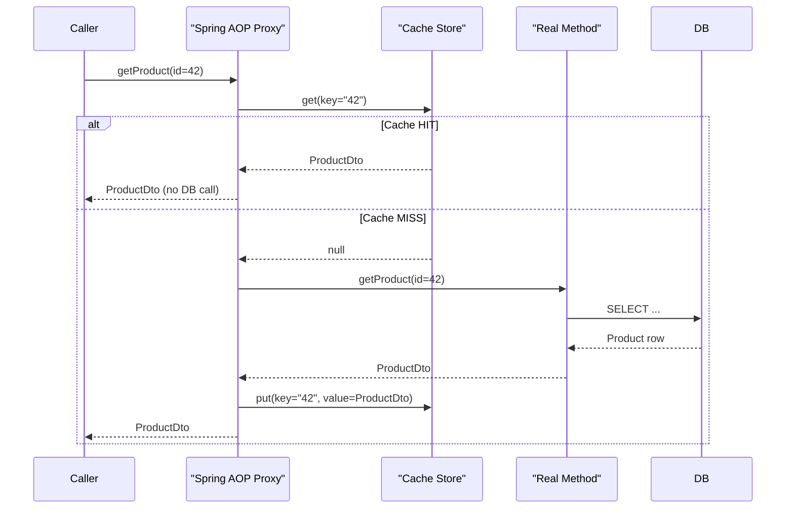

# Spring Data Caching

> Spring's cache abstraction lets you add caching to any Spring bean method with a single annotation — the result of an expensive operation is stored after the first call, and subsequent calls with the same arguments return the cached value without re-executing the method body.

## What Problem Does It Solve?

Some operations are by nature expensive and repeated:

- Loading a product catalogue from a database — 50ms each call, same data for hours.
- Calling a slow external pricing API — 300ms, result valid for minutes.
- Computing a complex report — CPU-intensive, called by many users simultaneously.

Without caching, the database or service handles every duplicate request. With caching, the result is stored after the first call and served from memory (or a cache server) for subsequent identical calls — cutting response times and reducing load on downstream systems.

## Analogy: The Post Room Memo

Imagine every employee asks the post room "What's tomorrow's lunch menu?" The post room calls the canteen each time, even though the answer doesn't change until tomorrow. A smarter post room would note down the answer on a memo, hand that to subsequent requesters, and only call the canteen again when the memo expires. Spring's `@Cacheable` is that memo system.

## How Spring Caching Works

Spring's cache abstraction is transport-agnostic — it defines a standard API (`CacheManager`, `Cache`) and plugs in any backing store (in-memory, Redis, Ehcache, Caffeine, etc.) via auto-configuration.



*On a cache hit, the method body never executes. On a miss, the method runs normally and the result is stored for future calls.*

## Enabling Caching

Add `@EnableCaching` to a configuration class (Spring Boot auto-detects it, but you still need it explicitly):

```java
@SpringBootApplication
@EnableCaching      // ← activates the cache AOP proxy infrastructure
public class Application { ... }
```

Spring Boot auto-configures a `CacheManager` based on what's on the classpath:
- No cache library → `ConcurrentHashMap` (simple, in-memory, no TTL)
- `caffeine` on classpath → `CaffeineCacheManager`
- `spring-data-redis` on classpath → `RedisCacheManager`

## Core Annotations

### `@Cacheable` — Cache the result

```java
@Service
public class ProductService {

    @Cacheable(cacheNames = "products", key = "#id")   // ← cache name + key expression
    public ProductDto getProduct(Long id) {
        log.debug("Loading product {} from DB", id);   // ← only printed on cache miss
        return productRepo.findById(id).map(ProductDto::from).orElseThrow();
    }

    @Cacheable(
        cacheNames = "productSearch",
        key = "#category + '_' + #page",
        condition = "#page < 10",                       // ← only cache first 10 pages
        unless = "#result.isEmpty()"                    // ← don't cache empty results
    )
    public Page<ProductDto> searchByCategory(String category, int page) { ... }
}
```

Key expressions use [Spring Expression Language (SpEL)](https://docs.spring.io/spring-framework/reference/core/expressions.html): `#paramName` for method parameters, `#result` for the return value (`unless` only).

### `@CacheEvict` — Remove from cache

```java
@Transactional
@CacheEvict(cacheNames = "products", key = "#id")         // ← remove one entry
public ProductDto updateProduct(Long id, ProductRequest req) { ... }

@CacheEvict(cacheNames = "products", allEntries = true)   // ← clear entire cache
public void bulkUpdate(List<ProductRequest> updates) { ... }
```

### `@CachePut` — Update the cache without skipping the method

Unlike `@Cacheable`, `@CachePut` always executes the method and updates the cache with the result:

```java
@Transactional
@CachePut(cacheNames = "products", key = "#result.id")   // ← #result = method return value
public ProductDto saveProduct(ProductRequest req) {
    Product saved = productRepo.save(new Product(req));
    return ProductDto.from(saved);
    // ← method always runs AND cache is updated
}
```

Use `@CachePut` on create/update operations when you want to prime the cache with the freshest data immediately.

### `@Caching` — Combine multiple cache operations

```java
@Caching(
    evict = {
        @CacheEvict(cacheNames = "products", key = "#id"),
        @CacheEvict(cacheNames = "productSearch", allEntries = true)   // ← clear search cache too
    }
)
public void deleteProduct(Long id) {
    productRepo.deleteById(id);
}
```

## Choosing a Cache Backend

### Caffeine (in-memory, single node)

Best for single-instance applications or L1 caches that don't need to survive restarts.

```xml
<!-- pom.xml -->
<dependency>
    <groupId>com.github.ben-manes.caffeine</groupId>
    <artifactId>caffeine</artifactId>
</dependency>
```

```yaml
# application.yml
spring:
  cache:
    type: caffeine
    caffeine:
      spec: maximumSize=500,expireAfterWrite=10m   # ← max 500 entries, TTL 10 minutes
```

No extra configuration class needed — Spring Boot reads the `spec` string and wires up `CaffeineCacheManager` automatically.

### Redis (distributed, multi-node)

For applications running multiple replicas where all instances must share the same cache.

```xml
<dependency>
    <groupId>org.springframework.boot</groupId>
    <artifactId>spring-boot-starter-data-redis</artifactId>
</dependency>
```

```yaml
spring:
  data:
    redis:
      host: localhost
      port: 6379
  cache:
    type: redis
    redis:
      time-to-live: 10m          # ← global TTL for all caches
      cache-null-values: false   # ← don't cache null results
```

Custom TTL per cache name:

```java
@Configuration
public class CacheConfig {

    @Bean
    public RedisCacheManagerBuilderCustomizer redisCacheManagerCustomizer() {
        return builder -> builder
            .withCacheConfiguration("products",
                RedisCacheConfiguration.defaultCacheConfig()
                    .entryTtl(Duration.ofMinutes(30))        // ← 30-minute TTL for products
                    .disableCachingNullValues())
            .withCacheConfiguration("productSearch",
                RedisCacheConfiguration.defaultCacheConfig()
                    .entryTtl(Duration.ofMinutes(5)));       // ← 5-minute TTL for search
    }
}
```

## Key Generation

Spring uses the method parameters to generate a cache key by default. The default key is generated from all parameters combined. You can customize this:

```java
// Explicit SpEL key
@Cacheable(cacheNames = "products", key = "#id")
public ProductDto getProduct(Long id) { ... }

// Composite key
@Cacheable(cacheNames = "priceList", key = "#region + ':' + #currency")
public List<PriceEntry> getPrices(String region, String currency) { ... }

// Custom KeyGenerator bean
@Cacheable(cacheNames = "products", keyGenerator = "myKeyGenerator")
public ProductDto getProduct(Long id) { ... }
```

:::tip
For objects used as keys (not primitives), ensure `equals()` and `hashCode()` are correctly implemented — the default `SimpleKeyGenerator` relies on them.
:::

## Best Practices

- **Cache computed or DB-fetched results, not logic results that vary by user state** — caching should be for data that is stable across callers with the same input.
- **Always set a TTL** — without expiry, stale data accumulates indefinitely. Even a long TTL (e.g., 1 hour) is better than none.
- **Use `@CacheEvict` on write operations** to keep the cache consistent with the database. The pattern: `@Cacheable` on reads, `@CacheEvict` on write/delete, `@CachePut` on update.
- **Avoid caching large objects** — serializing large entities (especially with LAZY associations still attached) to Redis can be slow and fill memory quickly. Cache DTOs or projections.
- **For Redis, ensure all cached types are serializable** — use Jackson serialization (`GenericJackson2JsonRedisSerializer`) rather than Java serialization for readability and cross-version compatibility.
- **Test cache behaviour explicitly** — use `@DirtiesContext` or `CacheManager.clear()` in integration tests to ensure test isolation.

## Common Pitfalls

**Self-invocation bypasses caching**
Same as `@Transactional` — `@Cacheable` is AOP-based. `this.getProduct(id)` inside the same class bypasses the proxy and skips the cache check entirely.

**`@Cacheable` on `void` methods does nothing**
Caching requires a return value to store. Annotating a `void` method with `@Cacheable` compiles fine but has no effect. Use `@CacheEvict` for side-effect methods.

**Not evicting on updates**
Updating a database record without a corresponding `@CacheEvict` leaves stale cached data. Callers will see the old value until TTL expires.

**Caching null values**
By default, Spring *does* cache `null` returns. If a product is deleted and `getProduct` returns `null`, subsequent calls return the cached `null` without hitting the database — even after data is restored. Use `unless = "#result == null"` or set `cache-null-values: false` in Redis config.

**Not accounting for cache aside vs write-through**
Spring's `@Cacheable` is **cache aside** (read-through + lazy population). The database is the source of truth; the cache is a shortcut. Multi-step update logic (read → modify → save) can cause race conditions with cache. For critical consistency, consider transactional writes + explicit evict, or accept eventual consistency with TTL.

## Interview Questions

### Beginner

**Q:** How do you enable caching in a Spring Boot application?
**A:** Add `@EnableCaching` to a configuration class or main application class. Spring Boot will auto-configure a `CacheManager` based on what's on the classpath. Then annotate service methods with `@Cacheable` (read), `@CacheEvict` (delete), or `@CachePut` (update) to mark caching boundaries.

**Q:** What is the difference between `@Cacheable` and `@CachePut`?
**A:** `@Cacheable` skips the method body entirely on a cache hit — the cached value is returned immediately. `@CachePut` always executes the method but stores the result in the cache afterward. Use `@CachePut` on write/save operations when you want to populate the cache with fresh data without preventing the database write.

### Intermediate

**Q:** When would you use Caffeine vs Redis as a cache backend in Spring Boot?
**A:** Caffeine is an in-memory cache — fast, zero network overhead, but local to each JVM. It's ideal for single-instance apps or as an L1 cache. Redis is a distributed cache — shared across all instances, survives restarts, supports TTL and eviction policies. Use Redis when running multiple replicas (e.g., Kubernetes deployment) where all instances need a consistent view of cached data.

**Q:** How do you evict a cache when a record is deleted?
**A:** Use `@CacheEvict` on the delete method: `@CacheEvict(cacheNames = "products", key = "#id")`. If the delete invalidates a search cache too, use `@Caching` to combine multiple `@CacheEvict` operations. For safety, you can also use `allEntries = true` to clear an entire cache name.

### Advanced

**Q:** How would you handle cache consistency in a distributed system using Spring's cache abstraction?
**A:** Spring's `@Cacheable` follows the cache-aside pattern — the cache is eventually consistent with the database. For strict consistency: 1) use `@CacheEvict` on all write paths including batch operations, 2) set a reasonable TTL so stale entries expire even if an evict is missed, 3) use Redis atomic operations (transactions or Lua scripts) if multiple services share a cache. For critical financial/inventory data, consider not caching the final state and instead caching only read-heavy, low-volatility data.

**Q:** What happens if you serialize an entity with uninitialized LAZY associations into Redis?
**A:** Hibernate's proxy for an uninitialized LAZY association will attempt to access the database during serialization — but the Hibernate session may already be closed at the point of serialization. This causes `LazyInitializationException`. The fix is to always cache DTOs or projections (plain Java objects with no Hibernate proxies), not managed entities. Ensure that any object stored in a distributed cache is a simple POJO fully populated before caching.

## Further Reading

- [Spring Cache Abstraction Reference](https://docs.spring.io/spring-framework/reference/integration/cache.html) — official docs covering all annotations, key generation, and CacheManager configuration
- [Spring Boot Caching](https://docs.spring.io/spring-boot/docs/current/reference/html/io.html#io.caching) — Spring Boot auto-configuration and supported providers

## Related Notes

- [Spring Data Repositories](./spring-data-repositories.md) — repositories are the usual source of data that caching wraps; understanding query methods is prerequisite
- [Transactions](./transactions.md) — caching and transactions interact on writes; `@CacheEvict` should accompany `@Transactional` update methods to maintain consistency
- [N+1 Query Problem](./n-plus-one-problem.md) — caching and fetch optimization are complementary performance tools; projections cached efficiently solve both over-fetch and repeat-query problems
