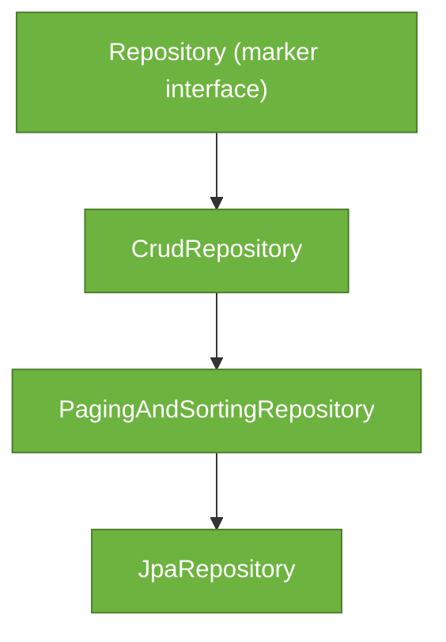

# Spring Data Repositories

> Spring Data repositories turn a Java interface into a fully functional DAO — query methods are derived from method names, custom queries are declared with `@Query`, and all the CRUD boilerplate is generated at startup with zero implementation code.

## What Problem Does It Solve?

Every data access layer in a Java application historically required a DAO class — a `UserDao`, `OrderDao`, `ProductDao` — each implementing the same pattern: `findById`, `save`, `delete`, `findAll`. The implementation differed only in the entity type. This was pure boilerplate.

Spring Data eliminates it. You declare a repository interface that extends `JpaRepository<EntityType, IdType>`, add any custom query methods by naming them according to a convention, and Spring generates the implementation proxy at application startup. No `SessionFactory`, no `EntityManager` injections, no transaction management by hand.

## Repository Hierarchy



*The hierarchy adds capability at each level. In most Spring Boot projects, `JpaRepository` is the right choice.*

| Interface | Key adds | Use when |
|---|---|---|
| `CrudRepository<T,ID>` | `save`, `findById`, `findAll`, `delete`, `count`, `existsById` | Non-JPA Spring Data modules (MongoDB, Redis) |
| `PagingAndSortingRepository<T,ID>` | `findAll(Pageable)`, `findAll(Sort)` | Need pagination without JPA specifics |
| `JpaRepository<T,ID>` | `saveAll`, `flush`, `saveAndFlush`, `deleteAllInBatch`, `getReferenceById` | JPA/Hibernate — use this in Spring Boot apps |

## Declaring a Repository

```java
public interface OrderRepository extends JpaRepository<Order, Long> {
    // Spring generates: findById, findAll, save, delete, count, ...
    // just by extending JpaRepository
}
```

```java
@Service
public class OrderService {

    private final OrderRepository repo;           // ← inject as normal Spring bean

    public OrderService(OrderRepository repo) {
        this.repo = repo;
    }

    public Order getOrder(Long id) {
        return repo.findById(id)                  // ← returns Optional<Order>
            .orElseThrow(() -> new EntityNotFoundException("Order not found: " + id));
    }
}
```

Spring Boot's auto-configuration (`JpaRepositoriesAutoConfiguration`) detects all interfaces extending `Repository` and creates implementation proxies automatically. No `@EnableJpaRepositories` annotation needed unless you use a non-default base package.

## Query Method Derivation

Spring Data parses method names and generates the JPQL automatically. The method name is a mini-query language.

### Subject keywords

| Keyword | Example method | Meaning |
|---|---|---|
| `findBy` | `findByEmail(String email)` | SELECT WHERE email = ? |
| `findAllBy` | `findAllByStatus(Status s)` | SELECT * WHERE... |
| `countBy` | `countByStatus(Status s)` | COUNT WHERE... |
| `existsBy` | `existsByEmail(String email)` | EXISTS WHERE... |
| `deleteBy` | `deleteByStatus(Status s)` | DELETE WHERE... |

### Predicate keywords

| Keyword | Example | SQL equivalent |
|---|---|---|
| `And` | `findByFirstNameAndLastName` | `WHERE first_name=? AND last_name=?` |
| `Or` | `findByEmailOrPhone` | `WHERE email=? OR phone=?` |
| `Like` | `findByNameLike(String pattern)` | `WHERE name LIKE ?` (you supply %) |
| `Containing` | `findByNameContaining(String s)` | `WHERE name LIKE %?%` |
| `StartingWith` | `findByNameStartingWith(String s)` | `WHERE name LIKE ?%` |
| `Between` | `findByCreatedAtBetween(LocalDate, LocalDate)` | `WHERE created_at BETWEEN ? AND ?` |
| `LessThan` | `findByPriceLessThan(BigDecimal max)` | `WHERE price < ?` |
| `GreaterThanEqual` | `findByQuantityGreaterThanEqual(int n)` | `WHERE quantity >= ?` |
| `In` | `findByStatusIn(List<Status>)` | `WHERE status IN (...)` |
| `IsNull` | `findByDeletedAtIsNull()` | `WHERE deleted_at IS NULL` |
| `OrderBy` | `findByStatusOrderByCreatedAtDesc` | `ORDER BY created_at DESC` |

```java
public interface ProductRepository extends JpaRepository<Product, Long> {

    // Derived query: SELECT p FROM Product p WHERE p.category = ?1 AND p.price < ?2
    List<Product> findByCategoryAndPriceLessThan(String category, BigDecimal maxPrice);

    // Contain check with pagination
    Page<Product> findByNameContaining(String keyword, Pageable pageable); // ← paginated

    // Existence check — no SELECT * needed
    boolean existsBySkuCode(String skuCode);
}
```

## Pagination and Sorting

`JpaRepository` supports paginated and sorted queries via `Pageable`:

```java
// In the repository:
Page<Order> findByCustomerId(Long customerId, Pageable pageable);

// In the service:
public Page<Order> getOrdersForCustomer(Long customerId, int page, int size) {
    Pageable pageable = PageRequest.of(
        page, size,
        Sort.by(Sort.Direction.DESC, "createdAt")  // ← sort newest first
    );
    return orderRepo.findByCustomerId(customerId, pageable);
}

// Page<T> contains:
//   page.getContent()      — the List<Order> for this page
//   page.getTotalElements() — total rows matching the filter
//   page.getTotalPages()   — total page count
//   page.hasNext()         — is there a next page?
```

## `@Query` — Custom JPQL and Native SQL

When the derived method name becomes unwieldy or you need aggregation, joins, or database-specific SQL, use `@Query`:

### JPQL query (database-independent)

```java
public interface OrderRepository extends JpaRepository<Order, Long> {

    // JPQL: works against the entity model, not table names
    @Query("SELECT o FROM Order o WHERE o.customer.id = :customerId AND o.status = :status")
    List<Order> findByCustomerAndStatus(
        @Param("customerId") Long customerId,
        @Param("status") OrderStatus status
    );

    // Aggregation
    @Query("SELECT COUNT(o) FROM Order o WHERE o.status = 'PENDING'")
    long countPendingOrders();

    // JOIN FETCH to solve N+1 (loads customer in same query)
    @Query("SELECT o FROM Order o JOIN FETCH o.customer WHERE o.id = :id")
    Optional<Order> findByIdWithCustomer(@Param("id") Long id);
}
```

### Native SQL query

```java
// nativeQuery = true: writes SQL against table names, not entity names
@Query(
    value = "SELECT * FROM orders WHERE status = 'PENDING' AND created_at < NOW() - INTERVAL '1 day'",
    nativeQuery = true
)
List<Order> findStaleOrders();

// Native SQL with pagination requires a separate count query
@Query(
    value = "SELECT * FROM orders WHERE customer_id = :id ORDER BY created_at DESC",
    countQuery = "SELECT COUNT(*) FROM orders WHERE customer_id = :id",
    nativeQuery = true
)
Page<Order> findByCustomerIdNative(@Param("id") Long id, Pageable pageable);
```

### Modifying queries (`@Modifying`)

```java
@Modifying                                       // ← required for UPDATE and DELETE
@Transactional                                   // ← modifying queries must run in a transaction
@Query("UPDATE Order o SET o.status = :status WHERE o.id = :id")
int updateOrderStatus(@Param("id") Long id, @Param("status") OrderStatus status);
```

## Specification API — Dynamic Queries

When filter criteria are optional (search forms, filter dropdowns), build queries dynamically with the `Specification` API:

```java
public interface OrderRepository extends JpaRepository<Order, Long>,
    JpaSpecificationExecutor<Order> { }   // ← adds findAll(Specification)
```

```java
public class OrderSpecifications {

    // Each method returns a reusable predicate
    public static Specification<Order> hasStatus(OrderStatus status) {
        return (root, query, cb) ->          // ← root = FROM, query = SELECT, cb = CriteriaBuilder
            status == null ? null : cb.equal(root.get("status"), status);
    }

    public static Specification<Order> createdAfter(LocalDate date) {
        return (root, query, cb) ->
            date == null ? null : cb.greaterThanOrEqualTo(root.get("createdAt"), date);
    }
}

// In service — compose only the non-null criteria:
Specification<Order> spec = Specification
    .where(OrderSpecifications.hasStatus(filter.getStatus()))
    .and(OrderSpecifications.createdAfter(filter.getFrom()));

List<Order> results = orderRepo.findAll(spec);
```

## Best Practices

- **Use `JpaRepository` by default** — it includes the most useful methods and JPA-specific utilities.
- **Prefer derived query methods** for simple queries; switch to `@Query` once the method name exceeds 3–4 keywords.
- **Return `Optional<T>` from `findBy` methods** that may return zero results — makes null-handling explicit at the call site.
- **Use `Pageable` for any `findAll` on large tables** — unbounded `findAll()` on a million-row table will OOM the JVM.
- **Avoid `findAll()` for existence checks** — use `existsBy...` which generates `SELECT 1 WHERE...` instead of loading entities.
- **Always add `@Transactional` to `@Modifying` queries** — omitting it throws `InvalidDataAccessApiUsageException`.
- **Use the `Specification` API for optional filter criteria** rather than building JPQL strings with string concatenation.

## Common Pitfalls

**Method name silently loading everything**
`findAll()` has no WHERE clause. In production with millions of rows, this causes an OOM or a very long GC pause. Always use `findAll(Pageable)` for unbounded lists.

**`@Transactional` on repository is read-only by default**
Spring Data JPA repositories default to `@Transactional(readOnly = true)` for read operations. Custom `@Query` methods that do writes need an explicit `@Transactional` on the service or the repository method.

**Positional parameters `?1` vs named parameters `:name`**
Both work, but named parameters (`@Param("name")`) are much more readable and safe for refactoring. Positional parameters break silently if you reorder method arguments.

**Derived method names generating unexpected queries**
Spring Data parses camelCase field names. `findByCustomerId` finds by the `id` field of the `customer` association — not by a raw `customerId` column. If your entity has a `customerId` Long field (not a relationship), the name is the same but the SQL differs. Verify generated SQL with `spring.jpa.show-sql=true`.

:::warning
Never call `findAll()` without a `Pageable` on any table that will grow beyond a few thousand rows. The entire result set is loaded into JVM heap, which leads to OOM errors in production.
:::

## Interview Questions

### Beginner

**Q:** What is the difference between `CrudRepository` and `JpaRepository`?
**A:** `CrudRepository` provides the basic `save`, `findById`, `findAll`, `delete`, and `count` operations — it is generic across all Spring Data modules (MongoDB, Redis, etc.). `JpaRepository` extends `PagingAndSortingRepository` (adds pagination and sorting) and adds JPA-specific methods like `flush`, `saveAndFlush`, and `deleteAllInBatch`. In a Spring Boot/JPA project, always extend `JpaRepository`.

**Q:** How does Spring Data know what SQL to generate from a method name like `findByEmailAndActive`?
**A:** Spring Data parses the method name at startup using a keyword-based convention. It strips the `findBy` prefix, then reads `Email` and `Active` as field names on the entity. `And` becomes `WHERE email = ? AND active = ?`. The JPQL is generated, wrapped in a query, and the method is backed at runtime by a proxy that executes that query with the argument values.

### Intermediate

**Q:** When would you use `@Query` instead of a derived method?
**A:** Derived methods are readable up to ~3 conditions. Use `@Query` when: the derived method name becomes unreadably long; you need aggregation (`COUNT`, `SUM`); you need a JOIN FETCH to prevent N+1; you need database-specific SQL (`nativeQuery = true`); or you need a projection rather than a full entity.

**Q:** What does `@Modifying` do on a `@Query` method?
**A:** It tells Spring Data that this query modifies data (UPDATE or DELETE) rather than reading it. Without `@Modifying`, Spring Data assumes the query is SELECT-only and wraps it in a read-only context. Modifying queries also need `@Transactional` — either on the repository method or on the calling service.

**Q:** How do you implement dynamic query filtering (optional search parameters)?
**A:** Use the `Specification` API. Have the repository extend `JpaSpecificationExecutor<T>`. Create static factory methods returning `Specification<T>` for each filter criterion, returning `null` when the criterion is absent (Spring Data skips null specs). Compose them with `Specification.where(...).and(...)` and call `repo.findAll(spec)`.

### Advanced

**Q:** What is the difference between `getReferenceById(id)` and `findById(id)`?
**A:** `findById(id)` immediately executes a SELECT, returns `Optional<T>`, and throws nothing if the entity doesn't exist. `getReferenceById(id)` (formerly `getOne`) returns a Hibernate proxy with no SELECT — the proxy is resolved lazily. It is useful for setting a FK reference without loading the entity (e.g., `order.setCustomer(customerRepo.getReferenceById(id))`). But accessing any field on the proxy outside a transaction throws `EntityNotFoundException` if the row doesn't exist.

**Q:** How does Spring Data JPA handle transaction management in repositories?
**A:** Spring Data repositories are themselves `@Transactional`. Read methods are `@Transactional(readOnly = true)`, which tells Hibernate to skip dirty checking and flush before commit — improving performance. Write methods are `@Transactional`. When you call a repository from a service that has an existing `@Transactional` transaction, the repository participates in that outer transaction (default propagation `REQUIRED`). This means all repository calls in one service method share the same session and can see each other's unsaved changes.

## Further Reading

- [Spring Data JPA Repositories Reference](https://docs.spring.io/spring-data/jpa/docs/current/reference/html/#repositories) — official reference for all query method keywords and repository features
- [Baeldung: Spring Data JPA @Query](https://www.baeldung.com/spring-data-jpa-query) — practical guide with JPQL, native, and modifying query examples

## Related Notes

- [JPA Basics](./jpa-basics.md) — entity mapping and relationships; repositories query these entities
- [Transactions](./transactions.md) — `@Transactional` propagation rules determine how repository calls participate in service-layer transactions
- [N+1 Query Problem](./n-plus-one-problem.md) — `@Query` with `JOIN FETCH` and `@EntityGraph` are the solutions to N+1; knowing repositories is prerequisite
