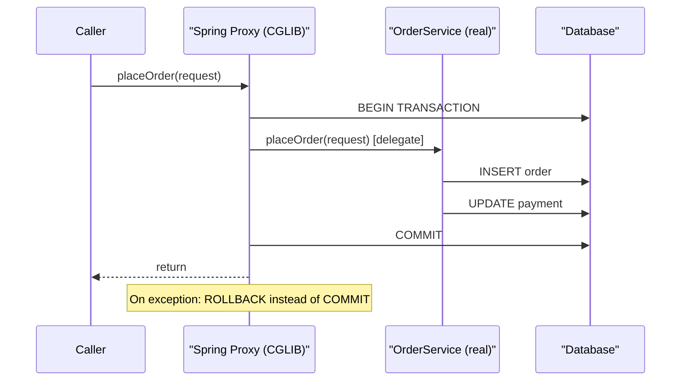
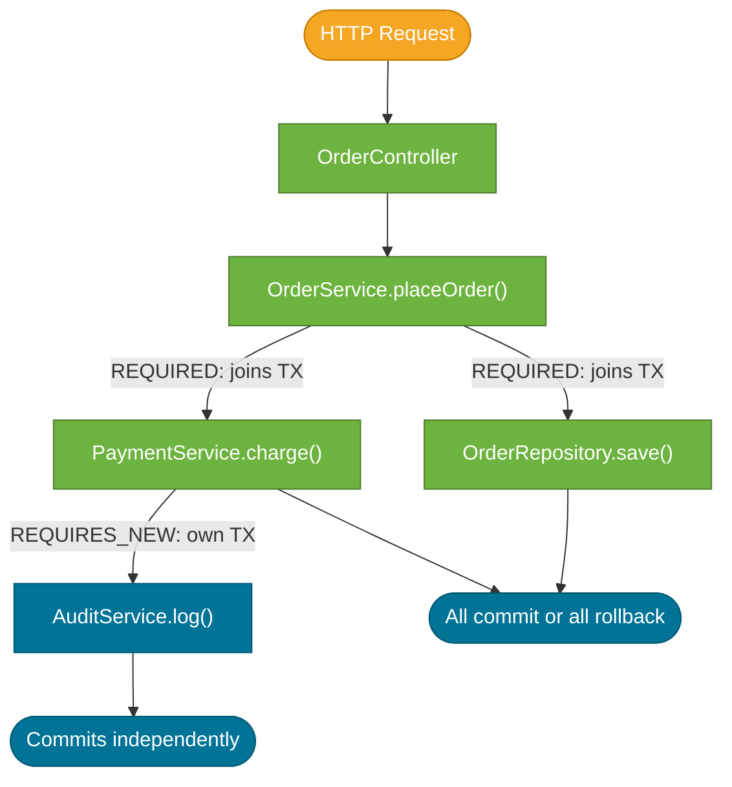

# Transactions and `@Transactional`

> `@Transactional` is a declarative boundary annotation: you tell Spring *where* a transaction should start and end, and Spring's AOP proxy handles the `begin`, `commit`, and `rollback` calls so your business code stays free of transaction management.

## What Problem Does It Solve?

Without `@Transactional`, every database operation needs manual transaction management:

```java
// Without @Transactional — painful boilerplate
EntityTransaction tx = em.getTransaction();
try {
    tx.begin();
    repo.save(order);
    paymentService.charge(order);   // ← if this throws, order is saved but payment isn't charged
    tx.commit();
} catch (Exception e) {
    tx.rollback();
    throw e;
}
```

With `@Transactional`, the proxy wraps this for you:

```java
@Transactional
public void placeOrder(OrderRequest request) {
    repo.save(order);                // ← same transaction
    paymentService.charge(order);   // ← if this throws, both are rolled back atomically
}
```

The key benefit: if anything throws, both operations are rolled back together. The database stays consistent.

## How It Works — AOP Proxy

`@Transactional` works through a Spring AOP proxy. When you inject a `@Service` bean, you receive a proxy that wraps the real object. Calls to `@Transactional` methods go through the proxy, which starts a transaction before delegating and commits (or rolls back) after.



*Spring wraps your bean in a proxy. All transaction management happens in the proxy — your service code never touches the transaction API.*

## The Self-Invocation Trap

**This is the most common Spring bug.** Because `@Transactional` works through a proxy, calling a `@Transactional` method *from within the same class* bypasses the proxy entirely — the call goes to `this` directly.

```java
@Service
public class OrderService {

    @Transactional
    public void processAll(List<Long> ids) {
        for (Long id : ids) {
            processSingle(id);       // ← PROBLEM: calls this.processSingle(), not the proxy
        }
    }

    @Transactional(propagation = Propagation.REQUIRES_NEW)
    public void processSingle(Long id) { // ← this @Transactional is IGNORED on self-call
        // ...
    }
}
```

Fix options:
1. **Extract to a separate `@Service`** — inject and call through that bean instead.
2. **Self-inject the bean** — `@Autowired private OrderService self; self.processSingle(id);` (Spring Boot supports this).
3. **Programmatic transaction** — use `TransactionTemplate` directly for fine-grained control.

## Propagation Levels

Propagation controls what happens when a `@Transactional` method is called from another `@Transactional` method.

| Propagation | Behaviour | Common use |
|---|---|---|
| `REQUIRED` (default) | Join existing TX; create new one if none exists | 99% of cases — the default |
| `REQUIRES_NEW` | Always suspend existing TX and start a new one | Audit logging that must commit even if outer TX rolls back |
| `NESTED` | Create a savepoint in the existing TX | Partial rollback within an outer transaction |
| `SUPPORTS` | Join existing TX if present; run without TX if not | Read-only queries that work both inside and outside a TX |
| `NOT_SUPPORTED` | Always suspend any existing TX | Non-transactional operations (file I/O) within a TX boundary |
| `MANDATORY` | Must be called within an existing TX; throw if not | Internal methods that must always be part of a TX |
| `NEVER` | Must NOT be called within a TX; throw if one exists | Non-transactional-only operations |

```java
@Service
public class AuditService {

    @Transactional(propagation = Propagation.REQUIRES_NEW)  // ← always a new, separate TX
    public void logAuditEvent(String event) {
        auditRepo.save(new AuditEntry(event));     // ← committed independently of outer TX
    }                                              // ← even if caller rolls back, audit entry is saved
}
```

## Isolation Levels

Isolation determines what a transaction can *see* from other concurrent transactions.

| Isolation | Dirty Read | Non-Repeatable Read | Phantom Read | Default for |
|---|---|---|---|---|
| `READ_UNCOMMITTED` | Possible | Possible | Possible | — |
| `READ_COMMITTED` | Prevented | Possible | Possible | Most databases (PostgreSQL, Oracle) |
| `REPEATABLE_READ` | Prevented | Prevented | Possible | MySQL InnoDB |
| `SERIALIZABLE` | Prevented | Prevented | Prevented | — (very slow) |
| `DEFAULT` | Defers to DB default | — | — | Spring default |

```java
@Transactional(isolation = Isolation.READ_COMMITTED)  // ← explicit is better than DEFAULT
public List<Order> getPendingOrders() { ... }
```

**In practice**: use `DEFAULT` for most cases and let the database manage isolation. Override to `REPEATABLE_READ` or `SERIALIZABLE` only when you have a concrete concurrency bug to fix — higher isolation = more locking = less throughput.

## `readOnly = true`

Marking a transaction as read-only is an important optimization:

```java
@Transactional(readOnly = true)       // ← tells Hibernate: no writes expected
public List<Order> getOrderHistory(Long customerId) { ... }
```

What Hibernate does differently for `readOnly = true`:
- Skips the dirty-checking flush before commit (no full entity scan).
- Some JDBC drivers or connection pools can route the connection to a replica.
- Hibernate can skip first-level cache write tracking.

Spring Data JPA's `findBy` methods are already `@Transactional(readOnly = true)` by default. Set it explicitly on your service's read methods to retain that optimization when calling through the service layer.

## Rollback Rules

By default, Spring rolls back on **unchecked exceptions** (`RuntimeException` and `Error`) and commits on **checked exceptions**.

```java
@Transactional(rollbackFor = IOException.class)           // ← also roll back on checked Exception
public void exportOrders() throws IOException { ... }

@Transactional(noRollbackFor = OptimisticLockException.class) // ← commit despite this exception
public void tryUpdateOrder(Long id) { ... }
```

:::warning
A checked exception thrown from a `@Transactional` method **does NOT roll back** by default. This is a frequent surprise. If your service throws a checked exception and you want atomic rollback, you must add `rollbackFor = YourException.class`.
:::

## Transaction Boundaries in Practice



*`OrderService.placeOrder()` is the transaction boundary. Repository and `PaymentService` join it. `AuditService.log()` uses `REQUIRES_NEW` to commit independently.*

## Code Examples

### Full service example with all key attributes

```java
@Service
@Transactional(readOnly = true)              // ← class-level default: all methods read-only
public class OrderService {

    private final OrderRepository repo;
    private final AuditService auditService;

    // Constructor injection...

    @Transactional                           // ← overrides class-level; this method needs write TX
    public Order placeOrder(OrderRequest req) {
        Order order = new Order(req.productId(), req.quantity());
        Order saved = repo.save(order);      // ← save within TX
        auditService.logAuditEvent("ORDER_PLACED"); // ← commits in its own REQUIRES_NEW TX
        return saved;
    }

    // readOnly = true inherited — no @Transactional needed here
    public Optional<Order> findOrder(Long id) {
        return repo.findById(id);
    }

    @Transactional(rollbackFor = PaymentException.class) // ← checked exception → also rollback
    public void processPayment(Long orderId) throws PaymentException {
        // ...
    }
}
```

### Programmatic transaction with `TransactionTemplate`

For fine-grained control that declarative annotations can't express (e.g., varying rollback per loop iteration):

```java
@Service
public class BulkOrderService {

    private final TransactionTemplate txTemplate;
    private final OrderRepository repo;

    public BulkOrderService(PlatformTransactionManager txManager, OrderRepository repo) {
        this.txTemplate = new TransactionTemplate(txManager); // ← wrap the platform TX manager
        this.repo = repo;
    }

    public void processOrders(List<Order> orders) {
        for (Order order : orders) {
            try {
                txTemplate.execute(status -> {   // ← each order in its own TX
                    repo.save(order);
                    return null;
                });
            } catch (Exception e) {
                log.error("Failed to process order {}", order.getId(), e);
                // continue processing others rather than aborting the batch
            }
        }
    }
}
```

## Best Practices

- **Put `@Transactional` on the service layer**, not the repository or controller. Service methods represent a logical unit of work.
- **Class-level `@Transactional(readOnly = true)`, then override with `@Transactional` on write methods** — this pattern makes read vs. write intent explicit at a glance.
- **Never catch and swallow exceptions inside a `@Transactional` method** — swallowing the exception causes Hibernate to commit a partially-executed transaction silently.
- **Prefer `REQUIRED` (default propagation) and change only when you have a concrete reason** — `REQUIRES_NEW` and `NESTED` are specialized tools, not defaults.
- **Use `rollbackFor` for checked exceptions** if your method throws them and atomicity is required.
- **When in doubt, verify with `TransactionSynchronizationManager.isActualTransactionActive()`** — add a log line during debugging to confirm you're in a transaction.

## Common Pitfalls

**Self-invocation (`this.method()`) bypasses the proxy**
Covered above — the most common Spring bug. Extract the method to a separate bean to restore proxy interception.

**`@Transactional` on a `private` method does nothing**
Spring's CGLIB proxy can only intercept `public` (and `protected` in some configurations) methods. Annotating a `private` method with `@Transactional` compiles fine but is silently ignored.

**`EntityManager` closed after returning from `@Transactional` method**
If a service returns an entity with LAZY associations, the caller accesses the association after the transaction (and Hibernate session) has closed — this causes `LazyInitializationException`. Fix: load the association within the transaction, use a DTO projection, or use `@Transactional` on the calling layer.

**Large transactions holding locks**
Long-running methods annotated with `@Transactional` hold database locks for their entire duration. A slow external HTTP call inside a transaction blocks a DB connection. Fix: complete external calls outside the transaction boundary; only wrap the DB writes.

## Interview Questions

### Beginner

**Q:** What does `@Transactional` do in Spring?
**A:** It marks a method (or class) as a transactional boundary. Spring wraps the bean in an AOP proxy that starts a database transaction before the method executes and commits it on success or rolls it back on exception. This means all database operations within the method run atomically — they either all succeed or all fail.

**Q:** On what type of exception does Spring roll back by default?
**A:** Spring rolls back on `RuntimeException` (and its subclasses) and `Error` by default. Checked exceptions (`IOException`, custom checked exceptions) cause the transaction to *commit* by default. Add `rollbackFor = MyCheckedException.class` to change this behavior.

### Intermediate

**Q:** What is the self-invocation problem in Spring transactions?
**A:** `@Transactional` works through a proxy. When a bean calls another `@Transactional` method on itself (`this.method()`), the call goes directly to the real object, bypassing the proxy — and thus bypassing all transaction management. The annotation on the called method is silently ignored. The fix is to extract the method to a separate Spring bean and inject that bean, so calls go through the proxy.

**Q:** What is the difference between `REQUIRED` and `REQUIRES_NEW` propagation?
**A:** `REQUIRED` (default) joins an existing transaction or creates a new one if none exists. `REQUIRES_NEW` always suspends the existing transaction and starts a brand-new, independent one. The new transaction commits or rolls back independently of the outer one. Use `REQUIRES_NEW` when you need work to be committed regardless of what the outer transaction does — audit logging is the classic example.

**Q:** Why would you use `@Transactional(readOnly = true)`?
**A:** It signals to Hibernate that no writes will occur. Hibernate skips its dirty-checking flush phase before commit (no full entity scan), reducing CPU overhead. Some connection pools or JDBC drivers route read-only transactions to read replicas. On services with many read-heavy methods, applying this at the class level and overriding with plain `@Transactional` on writes is a clean and performant pattern.

### Advanced

**Q:** How does `@Transactional` interact with the Hibernate session?
**A:** Spring binds the Hibernate `Session` to the current thread when the transaction starts and unbinds it when the transaction commits or rolls back. All repository and `EntityManager` calls within the same transaction share this single session — enabling first-level cache (identity map), dirty tracking, and deferred flush. When the transaction ends and the session closes, any LAZY association accessed after that point throws `LazyInitializationException`.

**Q:** When would you use `TransactionTemplate` instead of `@Transactional`?
**A:** `TransactionTemplate` gives programmatic, fine-grained control that declarative annotations cannot provide. Use it when: the transaction boundary varies per loop iteration (e.g., process each batch item in its own TX and continue on failure); when you need to call a method marked `NEVER` or `NOT_SUPPORTED` conditionally; or inside non-Spring-managed code (e.g., a Quartz job not running in a Spring proxy). For all typical business service code, `@Transactional` is simpler and clearer.

## Further Reading

- [Spring Transaction Management Reference](https://docs.spring.io/spring-framework/reference/data-access/transaction.html) — official docs covering all propagation levels, isolation, and programmatic TX
- [Baeldung: Spring Transactional — Propagation & Isolation](https://www.baeldung.com/spring-transactional-propagation-isolation) — practical guide with code examples for every propagation level

## Related Notes

- [Spring Data Repositories](./spring-data-repositories.md) — repositories are already `@Transactional`; understanding propagation explains how service calls interact with repository calls
- [N+1 Query Problem](./n-plus-one-problem.md) — `LazyInitializationException` (a side effect of closed transactions) and N+1 are closely related JPA problems
- [JPA Basics](./jpa-basics.md) — entity lifecycle and the Hibernate session that `@Transactional` manages
