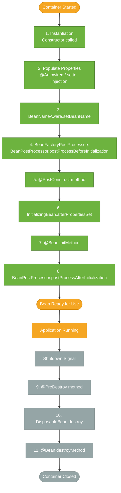

# Bean Lifecycle

> Every Spring bean goes through a predictable set of phases — creation, dependency injection, initialization, use, and destruction — and Spring provides well-defined hooks at each stage.

## What Problem Does It Solve?

Many real-world beans need to perform work *after* they're fully constructed but *before* they can safely handle requests: opening a connection pool, validating configuration values, warming up a cache, or registering a listener. Symmetrically, they need to release those resources cleanly on shutdown — closing connections, flushing writes, unregistering handles.

Without lifecycle hooks you'd have to do this work in the constructor (but dependencies may not be injected yet), or hope your framework calls some `init()` method, or register a JVM shutdown hook manually. Spring solves this with a well-defined lifecycle with dedicated extension points at every stage.

## The Bean Lifecycle Phases

A Spring singleton bean goes through these phases:



*Full bean lifecycle — from instantiation to destruction. Most applications only need @PostConstruct and @PreDestroy (phases 5 and 9).*

The lifecycle has two natural groups:
- **Initialization** (phases 1–9): starts at container startup, before the bean is usable
- **Destruction** (phases 9–11): triggered by `context.close()` or JVM shutdown hook

Prototype-scoped beans go through the initialization phases **but not destruction** — the container creates and injects them but does not track them for cleanup.

## Initialization Callbacks

You have three ways to hook into post-initialization. All three run after all dependencies are injected.

### 1. `@PostConstruct` (Recommended)

```java
@Component
public class CacheWarmer {

    private final ProductRepository repo;
    private Map<Long, Product> cache;

    public CacheWarmer(ProductRepository repo) {
        this.repo = repo;
        // repo is not injected yet if you tried to use it here
    }

    @PostConstruct                              // ← called after repo is injected
    public void warmUp() {
        cache = repo.findAll()
                    .stream()
                    .collect(Collectors.toMap(Product::getId, p -> p));
        System.out.println("Cache loaded: " + cache.size() + " products");
    }
}
```

Part of Jakarta EE (`jakarta.annotation.PostConstruct`). **Preferred** because:
- Standard annotation — not tied to Spring interfaces
- Class remains testable: you can call `warmUp()` directly in a unit test

### 2. `InitializingBean` Interface

```java
@Component
public class DataSourceValidator implements InitializingBean {

    private final DataSource dataSource;

    public DataSourceValidator(DataSource dataSource) {
        this.dataSource = dataSource;
    }

    @Override
    public void afterPropertiesSet() throws Exception {    // ← Spring calls this
        try (Connection c = dataSource.getConnection()) {
            System.out.println("DataSource connection OK");
        }
    }
}
```

Works, but couples your class to the Spring API. Use `@PostConstruct` instead unless you need `afterPropertiesSet`'s checked-exception propagation in an older codebase.

### 3. `@Bean(initMethod = "...")`

```java
// Third-party class you cannot annotate
public class LegacyConnectionPool {
    public void open() { /* opens connections */ }
    public void close() { /* releases connections */ }
}

@Configuration
public class InfraConfig {

    @Bean(initMethod = "open", destroyMethod = "close")  // ← method names as strings
    public LegacyConnectionPool connectionPool() {
        return new LegacyConnectionPool();
    }
}
```

Use this when integrating **third-party classes** you can't annotate.

## Destruction Callbacks

Symmetric to initialization — three options in reverse priority:

### 1. `@PreDestroy` (Recommended)

```java
@Component
public class ScheduledJobManager {

    private ScheduledExecutorService scheduler;

    @PostConstruct
    public void start() {
        scheduler = Executors.newSingleThreadScheduledExecutor();
        scheduler.scheduleAtFixedRate(this::runJob, 0, 1, TimeUnit.MINUTES);
    }

    @PreDestroy                                    // ← called before container closes
    public void stop() {
        scheduler.shutdown();
        System.out.println("Scheduler stopped cleanly");
    }

    private void runJob() { /* do work */ }
}
```

### 2. `DisposableBean` Interface

```java
@Override
public void destroy() throws Exception {
    // mirror of InitializingBean — works but couples to Spring
}
```

### 3. `@Bean(destroyMethod = "...")`

Already shown above with `LegacyConnectionPool`. Spring Boot adds a convenience: if no `destroyMethod` is set, it auto-detects `close()` or `shutdown()` methods on the bean and calls them — this is why `HikariCP` connections close cleanly without explicit config.

## Execution Order When Multiple Mechanisms Exist

If a bean accidentally implements both `@PostConstruct` and `InitializingBean`, the order is:

1. `@PostConstruct` method
2. `InitializingBean.afterPropertiesSet()`
3. `@Bean(initMethod)`

Destruction runs in reverse order. In practice, pick **one mechanism per bean**.

## `BeanPostProcessor` — Container-Level Hook

`BeanPostProcessor` is a framework extension point, not an application-level API. It runs for **every bean in the container** before and after initialization. Spring itself uses it heavily: `AutowiredAnnotationBeanPostProcessor` processes `@Autowired`, and `CommonAnnotationBeanPostProcessor` processes `@PostConstruct`/`@PreDestroy`.

```java
@Component
public class LoggingBeanPostProcessor implements BeanPostProcessor {

    @Override
    public Object postProcessBeforeInitialization(Object bean, String beanName) {
        System.out.println("Before init: " + beanName);
        return bean;                             // ← must return the bean (or a wrapper)
    }

    @Override
    public Object postProcessAfterInitialization(Object bean, String beanName) {
        System.out.println("After init: " + beanName);
        return bean;
    }
}
```

:::warning
`BeanPostProcessor` runs for every bean in the context. Returning `null` from either method breaks the context. Always return the `bean` argument (or a valid proxy of it).
:::

## Code Examples

### Complete Bean with Init and Destroy

```java
@Component
@Slf4j
public class WebSocketClient {

    private final String serverUrl;
    private Session session;                    // ← not set by Spring; set in @PostConstruct

    public WebSocketClient(@Value("${ws.server-url}") String serverUrl) {
        this.serverUrl = serverUrl;
    }

    @PostConstruct
    public void connect() throws Exception {
        session = ContainerProvider.getWebSocketContainer()
                      .connectToServer(this, URI.create(serverUrl));
        log.info("Connected to WebSocket: {}", serverUrl);
    }

    @PreDestroy
    public void disconnect() throws Exception {
        if (session != null && session.isOpen()) {
            session.close();
            log.info("WebSocket session closed");
        }
    }
}
```

### Verifying Lifecycle in a Test

```java
@SpringBootTest
class CacheWarmerTest {

    @Autowired
    CacheWarmer cacheWarmer;

    @Test
    void cache_is_populated_after_startup() {
        // @PostConstruct ran before this test method
        assertThat(cacheWarmer.getCache()).isNotEmpty(); // ← bean is already initialized
    }
}
```

## Best Practices

- **Use `@PostConstruct` for initialization and `@PreDestroy` for cleanup** — they are standard Jakarta EE annotations, not Spring-specific
- **Never rely on constructor injection order alone** — if you need all dependencies before doing work, use `@PostConstruct`; the constructor runs before injection completes for setter/field-injected fields
- **Keep `@PostConstruct` methods fast** — they run synchronously at startup; slow init delays the first request in a Spring Boot app
- **Register shutdown hooks in Spring Boot apps** — `SpringApplication.run()` registers a JVM shutdown hook by default, so `@PreDestroy` fires automatically; in plain `ApplicationContext`, call `ctx.registerShutdownHook()`
- **Use `@Bean(destroyMethod)` for third-party resources** — especially when wrapping libraries like connection pools or thread executors that have explicit `close()` or `shutdown()` methods

## Common Pitfalls

- **Using `this` in the constructor to start threads** — at constructor time, dependencies injected by setter/field have not been set. Use `@PostConstruct` instead
- **`@PreDestroy` not firing** — this happens with **prototype-scoped beans** (Spring does not track them for destruction) or when `context.close()` is never called. In Spring Boot, the shutdown hook handles `close()` automatically
- **Exceptions in `@PostConstruct`** — a runtime exception causes the application context to fail to start. Catch and handle or rethrow as a descriptive `ApplicationContextException`
- **Forgetting `ctx.registerShutdownHook()`** in a plain `ApplicationContext` (non-Spring-Boot) app — `@PreDestroy` and `DisposableBean.destroy()` are never called if the JVM exits normally without the hook

## Interview Questions

### Beginner

**Q:** What is the order of events in a Spring bean's lifecycle?
**A:** Constructor → property/field injection → `@PostConstruct` → bean is ready → `@PreDestroy` → container closes. The initialization callbacks guarantee that all injected dependencies are available by the time your code runs.

**Q:** What is the difference between `@PostConstruct` and a constructor?
**A:** A constructor runs before Spring injects dependencies (for setter/field injection). `@PostConstruct` runs after all dependencies are injected, so it is the right place to use injected collaborators for setup work like opening connections or warming a cache.

### Intermediate

**Q:** What are the three ways to hook into bean initialization and in what order do they run?
**A:** `@PostConstruct` method runs first, then `InitializingBean.afterPropertiesSet()`, then the `initMethod` declared in `@Bean`. The same three mechanisms exist for destruction in reverse order. In practice, pick `@PostConstruct` and `@PreDestroy` — they're standard and non-invasive.

**Q:** Why doesn't `@PreDestroy` fire for prototype-scoped beans?
**A:** The container creates prototype beans and hands them to the requester but does not keep a reference to them afterward. Without a reference, it cannot call lifecycle callbacks at shutdown. The responsibility for cleanup shifts to the code that requested the prototype instance.

### Advanced

**Q:** What is `BeanPostProcessor` and how does Spring use it internally?
**A:** `BeanPostProcessor` is a container extension point whose `postProcessBeforeInitialization` and `postProcessAfterInitialization` methods are called for every bean after dependency injection. Spring uses it extensively: `AutowiredAnnotationBeanPostProcessor` drives `@Autowired`, `CommonAnnotationBeanPostProcessor` handles `@PostConstruct`/`@PreDestroy`, and AOP auto-proxy creators return a CGLIB proxy instead of the original bean from `postProcessAfterInitialization`. Any `BeanPostProcessor` registered early enough in the context can replace a bean with a proxy transparently.

**Q:** How would you run some work once the entire `ApplicationContext` is fully refreshed (all beans initialized)?
**A:** Implement `ApplicationListener<ContextRefreshedEvent>` or `ApplicationRunner` / `CommandLineRunner` (in Spring Boot). These are notified *after* the full context is ready — unlike `@PostConstruct`, which runs bean-by-bean during initialization. This is useful for seeding a database or starting an async background task that depends on multiple beans being ready.

## Further Reading

- [Spring Beans — Lifecycle Callbacks](https://docs.spring.io/spring-framework/reference/core/beans/factory-nature.html) — official reference for `@PostConstruct`, `InitializingBean`, and `BeanPostProcessor`
- [Spring Bean Lifecycle (Baeldung)](https://www.baeldung.com/spring-bean-lifecycle) — detailed walkthrough with diagrams and runnable examples

## Related Notes

- [IoC Container](./ioc-container.md) — the container that drives the lifecycle; the full context of how beans are created and destroyed lives there
- [Dependency Injection](./dependency-injection.md) — injection (phase 2 of the lifecycle) happens before `@PostConstruct` fires; understanding injection order prevents null-pointer bugs
- [Bean Scopes](./bean-scopes.md) — scope affects lifecycle; prototype beans skip the destruction phase entirely
