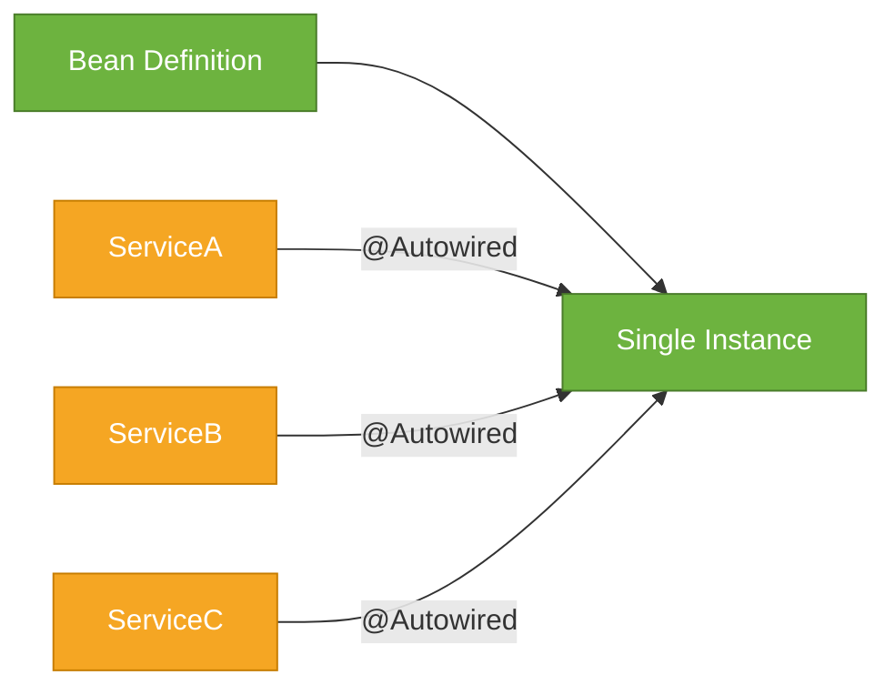
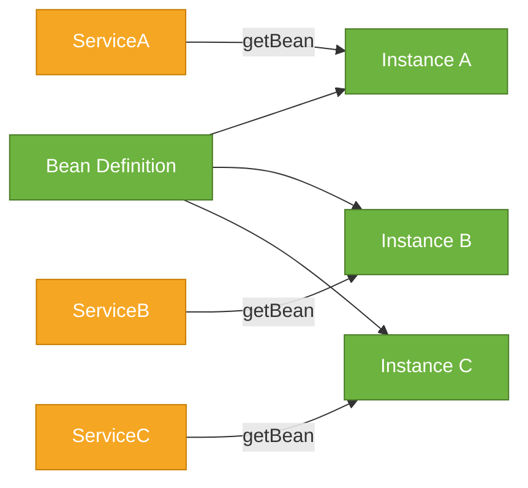
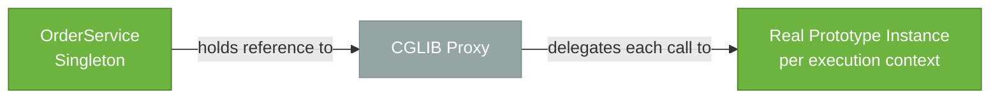

# Bean Scopes

> A bean scope defines how many instances the Spring container creates for a given bean definition and for how long each instance lives.

## What Problem Does It Solve?

Most beans in a Spring application should be shared — a `UserService` is stateless and safe to reuse across thousands of concurrent requests. But some objects are inherently stateful and per-request: a shopping cart, a user session, or a request-scoped security context. And some need to be freshly created every time they're requested — for example, a command object that accumulates state during processing.

If every bean were a singleton, stateful per-request data would leak between users. If every bean were a new instance, you'd waste memory and lose the performance benefits of shared services. Bean scopes give you a spectrum from "one forever" to "one per request" to "one per injection point."

## The Available Scopes

| Scope | When created | How many instances | When destroyed |
|-------|-------------|-------------------|----------------|
| `singleton` | At container startup (eager) | One per `ApplicationContext` | When context closes |
| `prototype` | Each time `getBean()` is called | Unlimited | Never by the container |
| `request` | Each HTTP request | One per request | When request ends |
| `session` | Each HTTP session | One per session | When session expires |
| `application` | `ServletContext` lifecycle | One per `ServletContext` | When `ServletContext` shuts down |

Web scopes (`request`, `session`, `application`) are only available in a Spring MVC / web-aware `ApplicationContext`.

## Singleton Scope (Default)

The default scope. The container creates one instance and returns the same reference to every `getBean()` call or injection point.

```java
@Component
// @Scope("singleton") ← implicit; you never need to write this
public class PriceCalculator {

    public BigDecimal calculate(Product product) {
        return product.getBasePrice().multiply(BigDecimal.valueOf(1.1));
    }
}
```



*Singleton: all injection points share the exact same object reference.*

:::warning
**Singleton beans must be thread-safe.** Because many threads access the same instance concurrently, any shared mutable state (instance fields that change after initialization) causes race conditions. The safest singleton is one with no mutable state at all — pure functions on injected, also-stateless collaborators.
:::

## Prototype Scope

A new instance is created every time the bean is requested from the container.

```java
@Component
@Scope("prototype")
public class OrderCommand {

    private final List<LineItem> items = new ArrayList<>();  // ← fresh list each time

    public void addItem(Product p, int qty) {
        items.add(new LineItem(p, qty));
    }

    public List<LineItem> getItems() { return Collections.unmodifiableList(items); }
}
```



*Prototype: each requestor gets a distinct instance.*

:::info
Because the container hands off prototype beans and does not track them, **`@PreDestroy` is never called** on prototype beans. If the prototype holds resources (threads, connections), the code that requested it is responsible for cleanup.
:::

## Web Scopes — `request` and `session`

Web-scoped beans are created per HTTP request or session and destroyed when that request/session ends. They're ideal for objects that carry request-specific state through a processing pipeline.

```java
@Component
@RequestScope                          // ← shorthand for @Scope("request")
public class RequestContext {

    private String correlationId;
    private User authenticatedUser;

    // getters and setters
}
```

```java
@Component
@SessionScope                          // ← shorthand for @Scope("session")
public class ShoppingCart {

    private final List<CartItem> items = new ArrayList<>();

    public void add(Product p, int qty) { items.add(new CartItem(p, qty)); }
    public List<CartItem> getItems() { return Collections.unmodifiableList(items); }
}
```

## The Singleton-into-Shorter-Scope Injection Problem

This is the most common scope-related bug. A singleton bean cannot hold a direct reference to a shorter-lived bean, because the singleton is created once — the prototype/request/session bean injected into it becomes effectively a singleton too:

```java
@Service   // singleton
public class OrderService {

    @Autowired
    private OrderCommand command;      // ← WRONG: same OrderCommand instance forever!
}
```

### Solution 1: `ObjectFactory<T>` / `ObjectProvider<T>`

```java
@Service
public class OrderService {

    private final ObjectProvider<OrderCommand> commandProvider; // ← lazy factory

    public OrderService(ObjectProvider<OrderCommand> commandProvider) {
        this.commandProvider = commandProvider;
    }

    public void processOrder(List<CartItem> items) {
        OrderCommand command = commandProvider.getObject(); // ← fresh instance each call
        items.forEach(i -> command.addItem(i.getProduct(), i.getQuantity()));
        // process command...
    }
}
```

### Solution 2: Scoped Proxy

```java
@Component
@Scope(value = "prototype", proxyMode = ScopedProxyMode.TARGET_CLASS)
public class OrderCommand { ... }

@Service
public class OrderService {

    private final OrderCommand command;  // ← looks like direct injection, but it's a proxy

    public OrderService(OrderCommand command) {
        this.command = command;          // ← Spring injects a CGLIB proxy
    }

    public void processOrder(List<CartItem> items) {
        // Every access to `command` goes through the proxy, which fetches the
        // real prototype instance for the current execution context
        command.addItem(...);
    }
}
```

The proxy acts as a thin shell. Every method call on it is delegated to the *actual* bean appropriate for the current context (current thread, request, session). This is the same mechanism used by `@RequestScope` and `@SessionScope` beans injected into singletons.



*Scoped proxy: the singleton holds a stable proxy reference; each invocation routes to the right real instance.*

## Code Examples

### Request-Scoped Bean Injected Into a Singleton Controller (Safe Pattern)

```java
@Component
@RequestScope
public class RequestAuditContext {

    private String userId;
    private Instant requestedAt = Instant.now();

    public void setUserId(String userId) { this.userId = userId; }
    public String getUserId() { return userId; }
    public Instant getRequestedAt() { return requestedAt; }
}

@RestController
@RequestMapping("/orders")
public class OrderController {

    private final OrderService orderService;
    private final RequestAuditContext auditContext; // ← Spring injects a scoped proxy automatically for @RequestScope

    public OrderController(OrderService orderService,
                           RequestAuditContext auditContext) {
        this.orderService = orderService;
        this.auditContext = auditContext;
    }

    @PostMapping
    public ResponseEntity<OrderResponse> placeOrder(@RequestBody OrderRequest req,
                                                     Principal principal) {
        auditContext.setUserId(principal.getName()); // ← sets data on the current request's instance
        return ResponseEntity.ok(orderService.process(req));
    }
}
```

### Prototype Via `ObjectProvider`

```java
@Component
@Scope("prototype")
public class CsvExporter {

    private final List<String[]> rows = new ArrayList<>();

    public void addRow(String... cells) { rows.add(cells); }

    public void writeTo(OutputStream out) throws IOException {
        // write CSV...
    }
}

@Service
public class ReportService {

    private final ObjectProvider<CsvExporter> exporterProvider;

    public ReportService(ObjectProvider<CsvExporter> exporterProvider) {
        this.exporterProvider = exporterProvider;
    }

    public void exportReport(List<ReportRow> rows, OutputStream out) throws IOException {
        CsvExporter exporter = exporterProvider.getObject(); // ← new instance every call
        rows.forEach(r -> exporter.addRow(r.toArray()));
        exporter.writeTo(out);
    }
}
```

## Trade-offs & When To Use / Avoid

| Scope | Use When | Avoid When |
|-------|----------|-----------|
| `singleton` | Bean is stateless or immutable after init | Bean holds mutable per-request state |
| `prototype` | Each caller needs isolated state; short-lived command/builder objects | Bean is expensive to create (e.g., DB connection) — use a pool instead |
| `request` | Carrying per-request data (audit context, correlation ID) through a call chain | Outside a web context; for truly stateless data — use method parameters instead |
| `session` | User-specific state that spans multiple requests (shopping cart, preferences) | Long-lived sessions with large state — risks memory pressure under load |

## Common Pitfalls

- **Mutable state in a singleton** — the most common Spring concurrency bug; instance fields changed at request time cause race conditions
- **Injecting a prototype into a singleton directly** — the prototype is created once and never refreshed; use `ObjectProvider<T>` or a scoped proxy
- **Calling `@PreDestroy` cleanup on a prototype** — it never fires; manage cleanup yourself or use `ObjectProvider.destroy(instance)`
- **Using `@SessionScope` beans without serialization** — session-scoped beans are serialized if the session is persisted (e.g., in Redis-backed sessions); ensure the bean and all its fields implement `Serializable`
- **Forgetting `proxyMode` when injecting a shorter-scope bean into a singleton via field/constructor** — without a proxy, Spring fails at startup with a scope mismatch error for web scopes, or silently gives you a single instance for prototype scopes

## Interview Questions

### Beginner

**Q:** What is the default scope for a Spring bean?
**A:** `singleton` — one instance per `ApplicationContext`. The container creates it at startup and returns the same reference every time it's injected or retrieved.

**Q:** What is the difference between singleton and prototype scope?
**A:** Singleton creates one shared instance for the lifetime of the container. Prototype creates a new instance each time the bean is requested. Use prototype for stateful, short-lived objects; singleton for stateless services.

### Intermediate

**Q:** Why is it a problem to inject a prototype-scoped bean into a singleton?
**A:** The singleton is instantiated once, so its constructor or injection point is invoked once — meaning the prototype dependency is set once and the same instance is reused for the singleton's entire lifetime. The bean effectively becomes a singleton, defeating the purpose of the prototype scope. The fix is to use `ObjectProvider<T>` or a scoped proxy.

**Q:** How do `@RequestScope` and `@SessionScope` work under the hood?
**A:** Spring registers a CGLIB proxy as the injection-point value. Each time a method is called on the proxy, it looks up the real bean from a thread-local request/session storage. For `@RequestScope`, the real instance is stored in the `HttpServletRequest` attributes; for `@SessionScope`, in the `HttpSession`. The proxy transparently routes calls to the correct real instance for the current request or session.

### Advanced

**Q:** How does `ScopedProxyMode.TARGET_CLASS` differ from `ScopedProxyMode.INTERFACES`?
**A:** `INTERFACES` generates a JDK dynamic proxy, which only works if the bean implements at least one interface. `TARGET_CLASS` generates a CGLIB subclass proxy, which works for any class (including concrete ones). In Spring Boot's default setup, CGLIB is always available, so `TARGET_CLASS` is the safer default. Use `INTERFACES` only when the bean is accessed through its interface and you want to avoid the CGLIB classpath dependency.

**Q:** A `@SessionScope` bean holds a large in-memory data structure. How would you troubleshoot memory pressure from this under high load?
**A:** First, profile active sessions and their sizes (Spring Actuator's `/sessions` endpoint if Spring Session is used). Then consider: (1) moving bulky data out of the session and fetching it on demand from a database or cache; (2) reducing session timeout; (3) externalizing sessions to Redis to offload JVM heap; (4) splitting the large structure into smaller lazy-loaded parts.

## Further Reading

- [Spring Bean Scopes](https://docs.spring.io/spring-framework/reference/core/beans/factory-scopes.html) — the official reference covering all five scopes and the scoped proxy mechanism
- [Spring Bean Scopes (Baeldung)](https://www.baeldung.com/spring-bean-scopes) — walkthrough with runnable examples for all scopes

## Related Notes

- [IoC Container](./ioc-container.md) — the container enforces scope rules; understanding how the container registers and retrieves beans clarifies how scopes are implemented
- [Dependency Injection](./dependency-injection.md) — injection of shorter-scoped beans into singletons is the canonical scope pitfall; the DI note explains how `ObjectProvider` and `@Qualifier` fit in
- [Bean Lifecycle](./bean-lifecycle.md) — scope determines which lifecycle phases run; prototype beans skip the destruction phase entirely
