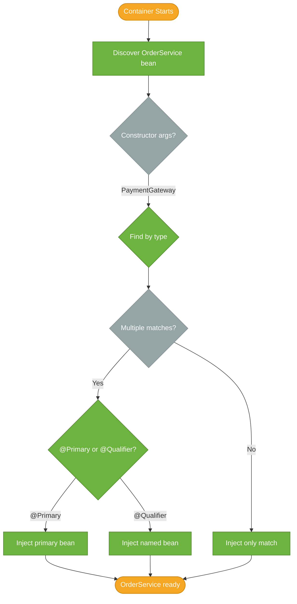

# Dependency Injection

> Dependency Injection (DI) is the technique Spring uses to provide a bean's dependencies automatically — removing the need for manual `new` calls and decoupling classes from each other's concrete implementations.

## What Problem Does It Solve?

Without dependency injection, every class creates the objects it needs:

```java
public class OrderService {
    private final PaymentGateway gateway = new StripeGateway(); // ← hardcoded
    private final NotificationService notifications = new EmailService(); // ← hardcoded
}
```

This hard-coding creates three problems:

1. **Testability**: you cannot swap `StripeGateway` for a mock in a unit test without changing source code.
2. **Flexibility**: switching from `EmailService` to `SmsService` means hunting down every `new EmailService()` callsite.
3. **Lifecycle ownership**: the `OrderService` is now responsible for creating and managing the lifecycle of its dependencies — that's not its job.

DI separates *what a class needs* from *how those needs are satisfied*. The Spring container satisfies them at runtime by injecting the right implementation.

## What Is Dependency Injection?

Dependency Injection means that a class receives its dependencies — the objects it needs to work — from an external source rather than creating them itself. The Spring IoC container is that external source.

There are three injection styles:

| Style | Annotation | When to use |
|-------|-----------|-------------|
| **Constructor injection** | (none needed; or `@Autowired` on constructor) | Default — use for required dependencies |
| **Setter injection** | `@Autowired` on setter method | Optional dependencies or circular dependency workaround |
| **Field injection** | `@Autowired` on field | Convenient but avoid in production code |

## How It Works

When the IoC container wires a bean, it:

1. Reads the bean's constructor signature (or `@Autowired`-marked method/field)
2. Searches its registry for a matching bean by **type**
3. If multiple candidates exist, narrows by **name** or the `@Primary`/`@Qualifier` hint
4. Injects the resolved dependency



*Spring resolves the correct implementation at startup using type matching, then qualifier hints.*

### Constructor Injection (Recommended)

```java
@Service
public class OrderService {

    private final PaymentGateway gateway;          // ← final: guaranteed non-null
    private final NotificationService notifications;

    // Single constructor — @Autowired is optional since Spring 4.3
    public OrderService(PaymentGateway gateway,
                        NotificationService notifications) {
        this.gateway = gateway;
        this.notifications = notifications;
    }
}
```

The Spring team and *Effective Java* both recommend constructor injection because:
- Dependencies are **explicit** — visible in the signature
- Fields can be `final` — the bean is **immutable** after construction
- The bean is **always fully initialized** — no null-check required
- **Testable without Spring** — just `new OrderService(mockGateway, mockNotifier)`

### Setter Injection

```java
@Service
public class ReportService {

    private EmailService emailService;

    @Autowired                                      // ← marks for injection
    public void setEmailService(EmailService emailService) {
        this.emailService = emailService;
    }
}
```

Use setter injection only when the dependency is **optional** (can remain null) or when you must break a circular dependency. For optional injection, prefer `@Autowired(required = false)` or `Optional<T>`.

### Field Injection (Avoid in Production)

```java
@Service
public class ProductService {

    @Autowired
    private ProductRepository repo;               // ← Spring sets this via reflection
}
```

Field injection is concise but has real downsides: you can't make the field `final`, you can't write a plain constructor in tests, and the dependency is hidden from users of the class.

:::warning
**Avoid field injection in production code.** Popular IDEs (IntelliJ, VS Code) flag `@Autowired` on fields with a warning for this reason. Use constructor injection instead.
:::

## Resolving Multiple Candidates

When the container finds more than one bean of the same type, it needs a tiebreaker.

### `@Primary`

Mark one implementation as the default choice:

```java
@Primary
@Component
public class StripeGateway implements PaymentGateway { ... }

@Component
public class PayPalGateway implements PaymentGateway { ... }

// OrderService receives StripeGateway because it is @Primary
@Service
public class OrderService {
    public OrderService(PaymentGateway gateway) { ... }
}
```

### `@Qualifier`

Name a specific bean at the injection point:

```java
@Service
public class OrderService {

    private final PaymentGateway gateway;

    public OrderService(@Qualifier("payPalGateway") PaymentGateway gateway) { // ← exact bean name
        this.gateway = gateway;
    }
}
```

The default bean name is the class name with a lowercased first letter — `PayPalGateway` → `"payPalGateway"`. You can set a custom name with `@Component("myCustomName")`.

:::tip
Prefer `@Primary` when one implementation is usually the right choice. Use `@Qualifier` when the choice depends on the injection site (e.g., different strategies for different services).
:::

### Injecting a List of All Implementations

```java
@Service
public class NotificationDispatcher {

    private final List<NotificationService> services; // ← inject ALL implementations

    public NotificationDispatcher(List<NotificationService> services) {
        this.services = services;
    }

    public void notifyAll(String event) {
        services.forEach(s -> s.send(event));
    }
}
```

Spring automatically assembles the list from all beans of type `NotificationService`. The order can be controlled with `@Order` or by implementing `Ordered`.

## Code Examples

### Minimal Constructor Injection with Interface

```java
// Interface
public interface PaymentGateway {
    void charge(String customerId, BigDecimal amount);
}

// Implementation
@Component
public class StripeGateway implements PaymentGateway {
    @Override
    public void charge(String customerId, BigDecimal amount) {
        System.out.println("Charging " + customerId + " via Stripe: " + amount);
    }
}

// Consumer — no @Autowired needed on single constructor since Spring 4.3
@Service
public class CheckoutService {

    private final PaymentGateway gateway;

    public CheckoutService(PaymentGateway gateway) {
        this.gateway = gateway;   // ← Spring passes StripeGateway here
    }

    public void checkout(String customerId, BigDecimal total) {
        gateway.charge(customerId, total);
    }
}
```

### Unit Test Without the Container

```java
class CheckoutServiceTest {

    @Test
    void charges_customer() {
        PaymentGateway mockGateway = mock(PaymentGateway.class); // ← no Spring context needed
        CheckoutService service = new CheckoutService(mockGateway);

        service.checkout("cust-1", new BigDecimal("99.99"));

        verify(mockGateway).charge("cust-1", new BigDecimal("99.99"));
    }
}
```

Constructor injection makes this test possible without loading Spring at all — 10× faster than a `@SpringBootTest`.

### Optional Dependency with `@Autowired(required = false)`

```java
@Service
public class AuditService {

    private final AuditLogger logger;

    @Autowired(required = false)           // ← no failure if no bean found
    public AuditService(AuditLogger logger) {
        this.logger = logger;              // ← may be null if not configured
    }

    public void log(String event) {
        if (logger != null) logger.record(event);
    }
}
```

## Best Practices

- **Use constructor injection for all required dependencies** — it is the official Spring recommendation as of Spring 5+
- **Program to interfaces** — inject `PaymentGateway`, not `StripeGateway`; this is what makes swapping implementations easy
- **Keep constructors short** — if a constructor takes more than 3–4 arguments, the class probably has too many responsibilities (Single Responsibility Principle)
- **Avoid `@Autowired` on fields** — use it only in test classes annotated with `@SpringBootTest` where conciseness is acceptable
- **Name beans explicitly when there are multiple implementations** — `@Component("stripeGateway")` rather than relying on the default lowercased class name
- **Prefer `@Primary` over `@Qualifier` at the consumer** — the consumer should not need to know the specific implementation name

## Common Pitfalls

- **`NoSuchBeanDefinitionException`** — the requested type has no registered bean; check that the implementation class has a stereotype annotation (`@Component`, etc.) and is within the scanned package
- **`NoUniqueBeanDefinitionException`** — multiple beans of the same type and no `@Primary` or `@Qualifier` to disambiguate; add one
- **Circular dependency with constructor injection** — `A` needs `B` in its constructor and `B` needs `A`; Spring 6 throws at startup. Refactor the design: extract a shared dependency, use an event, or use setter injection for one side as a last resort
- **Field injection hides required dependencies** — when a bean is created without Spring (e.g., in a unit test), `@Autowired` fields are never set, and the bean silently has `null` fields
- **Using `@Qualifier` with wrong names** — the string must match the bean name exactly (case-sensitive); a typo fails at startup with `NoSuchBeanDefinitionException`

## Interview Questions

### Beginner

**Q:** What is dependency injection and why does Spring use it?
**A:** Dependency injection means a class receives its collaborators from outside rather than creating them itself. Spring uses it to decouple classes, making them easier to test (you can supply mock dependencies), easier to reconfigure (swap implementations without changing application code), and easier to manage lifecycle (the container owns creation and destruction).

**Q:** What are the three types of dependency injection in Spring?
**A:** Constructor injection (dependencies passed as constructor parameters), setter injection (`@Autowired` on a setter method), and field injection (`@Autowired` directly on a field). Constructor injection is recommended for required dependencies.

### Intermediate

**Q:** Why is constructor injection preferred over field injection?
**A:** Constructor injection makes dependencies explicit in the class API, allows fields to be `final` (immutability), and enables testing without the Spring container — you simply call `new MyService(mockDep)`. Field injection requires Spring's reflective machinery to set private fields, hides dependencies from the caller, and cannot make fields `final`.

**Q:** How does Spring resolve which bean to inject when multiple implementations exist?
**A:** Spring first tries to match by type. If multiple candidates exist, it checks whether one is marked `@Primary`. If not, it falls back to matching the field or parameter name against bean names. If `@Qualifier` is present, it uses the specified name directly. If none of these resolve to a single bean, startup fails with `NoUniqueBeanDefinitionException`.

### Advanced

**Q:** How would you inject different implementations of the same interface in two different services, without touching the implementations?
**A:** Use `@Qualifier` at the injection point in each service, naming the specific bean needed (`@Qualifier("stripeGateway")` in `CheckoutService`, `@Qualifier("payPalGateway")` in `SubscriptionService`). This keeps the implementations free of any knowledge about who consumes them — only the injection site declares the preference.

**Q:** What happens when a singleton bean depends on a prototype-scoped bean injected via constructor injection?
**A:** The singleton is created once, so its constructor runs once — meaning the prototype dependency is injected exactly once, effectively making it behave like a singleton inside that bean. To get a new prototype instance each time, inject `ObjectFactory<MyPrototype>` or `Provider<MyPrototype>` instead, and call `.getObject()` / `.get()` when a new instance is needed.

## Further Reading

- [Spring DI — Dependencies](https://docs.spring.io/spring-framework/reference/core/beans/dependencies/factory-collaborators.html) — official reference for constructor, setter, and method injection
- [Constructor Injection in Spring (Baeldung)](https://www.baeldung.com/constructor-injection-in-spring) — comparison of injection styles with runnable examples

## Related Notes

- [IoC Container](./ioc-container.md) — the container that performs DI; understanding the container is a prerequisite for understanding how injection works
- [Bean Lifecycle](./bean-lifecycle.md) — what happens between injection and the first use of a bean
- [Bean Scopes](./bean-scopes.md) — scope interacts with DI; singleton-into-prototype injection is a classic pitfall documented there
