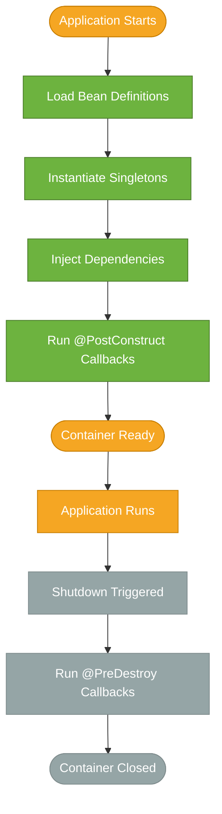

# IoC Container

> Spring's IoC container is the engine that creates objects, wires their dependencies, and manages their entire lifecycle — so you never call `new` directly for application components.

## What Problem Does It Solve?

In a traditional Java application, every class is responsible for instantiating the objects it depends on. A `UserService` might call `new UserRepository()`, which calls `new DataSource()`, which reads from a config file it must locate itself. The result is tightly coupled code: you can't swap a `UserRepository` for a mock in tests, you can't change database settings without touching source code, and object creation logic is scattered across the codebase.

As the application grows, managing these object graphs by hand becomes brittle. Replace one implementation and you must hunt down every `new SomeClass()` callsite. Add caching or transaction management and you start wrapping objects in wrapper objects — all manually.

Spring's IoC container solves this by **inverting the flow of control**: instead of your code creating and connecting objects, the container does it. You describe *what* you need (via annotations or XML), and the container assembles the object graph and delivers the right instance to the right place at startup.

## What Is the IoC Container?

The IoC container is a runtime component in the Spring Framework that:

1. **Reads bean definitions** — from annotations (`@Component`, `@Bean`), Java config classes, or XML
2. **Instantiates beans** — creates objects in the correct order, respecting dependencies
3. **Injects dependencies** — wires constructor arguments, setter values, or field references
4. **Manages lifecycle** — calls initialization/destruction callbacks and enforces scope rules

The central interface representing the container is `ApplicationContext`. It extends a simpler interface, `BeanFactory`, and adds enterprise features like event publishing, internationalization, and eager singleton initialization.

:::info
**Inversion of Control** is the general principle: control over object creation is transferred from your code to a framework. **Dependency Injection** (DI) is the specific technique the container uses to wire objects together. IoC is the principle; DI is the mechanism.
:::

## Analogy

Think of the IoC container as a **staffing agency for your application's objects**. You don't hire workers (instantiate objects) yourself — you post job descriptions (bean definitions) saying "I need an accountant who knows Excel." The agency finds the right person, checks that they have the right tools, and delivers them to your desk (injects them into your class). You don't care where they came from or how they were found.

## How It Works

The container lifecycle has four stages:



*The IoC container lifecycle: from reading definitions to running shutdown hooks.*

### Step 1 — Loading Bean Definitions

When you call `new AnnotationConfigApplicationContext(AppConfig.class)` or let Spring Boot bootstrap, the container scans the classpath for classes annotated with `@Component`, `@Service`, `@Repository`, `@Controller`, and `@Configuration`. It also processes `@Bean` methods. Each discovered class becomes a **BeanDefinition** — a recipe that records the class name, scope, constructor args, and any property settings.

```java
@Configuration
@ComponentScan("com.example")          // ← scan this package and sub-packages
public class AppConfig {

    @Bean
    public DataSource dataSource() {   // ← explicit bean definition via factory method
        return new EmbeddedDatabaseBuilder()
            .setType(EmbeddedDatabaseType.H2)
            .build();
    }
}
```

### Step 2 — Instantiation and Dependency Resolution

The container builds a dependency graph. Beans with no dependencies are created first. For each bean, it resolves constructor arguments, setter values, or `@Autowired` fields by looking up other beans in the registry. Circular dependencies (A → B → A) are detected at startup and throw a `BeanCurrentlyInCreationException`.

### Step 3 — Initialization Callbacks

After injection, the container calls any `@PostConstruct` method. This is the right place to validate configuration or warm up a cache.

### Step 4 — Shutdown and Destruction

When the container is closed (on JVM shutdown or explicitly via `context.close()`), it calls `@PreDestroy` methods on singleton beans in reverse creation order.

## `ApplicationContext` vs. `BeanFactory`

| Feature | `BeanFactory` | `ApplicationContext` |
|---------|--------------|----------------------|
| Bean instantiation | Lazy (on first `getBean()`) | **Eager** for singletons at startup |
| Internationalization (`MessageSource`) | No | Yes |
| Event publishing (`ApplicationEventPublisher`) | No | Yes |
| AOP integration | Manual | Built-in |
| Typical use | Embedded / resource-constrained | All production Spring apps |

In practice, **always use `ApplicationContext`** — specifically `AnnotationConfigApplicationContext` in standalone apps, or let Spring Boot's `SpringApplication` create it for you.

## `@ComponentScan`

`@ComponentScan` tells the container which package subtree to scan for stereotype annotations. Without it, only beans defined in the `@Configuration` class itself are registered.

```java
@Configuration
@ComponentScan(
    basePackages = "com.example",                      // ← scan root
    excludeFilters = @ComponentScan.Filter(
        type = FilterType.ANNOTATION,
        classes = Repository.class                      // ← exclude @Repository beans
    )
)
public class AppConfig {}
```

:::tip
In Spring Boot, `@SpringBootApplication` already includes `@ComponentScan` scoped to the package of the main class. Class placement matters — keep your main class at the root of the application package.
:::

## Code Examples

### Creating a Container Directly (Plain Spring)

```java
// Define a bean
@Component
public class GreetingService {
    public String greet(String name) {
        return "Hello, " + name;
    }
}

// Bootstrap the container
AnnotationConfigApplicationContext ctx =
    new AnnotationConfigApplicationContext("com.example"); // ← scan this package

GreetingService svc = ctx.getBean(GreetingService.class); // ← retrieve by type
System.out.println(svc.greet("World"));

ctx.close(); // ← triggers @PreDestroy callbacks
```

### Reading Multiple Configuration Classes

```java
// You can pass multiple @Configuration classes or scan multiple packages
AnnotationConfigApplicationContext ctx =
    new AnnotationConfigApplicationContext(AppConfig.class, InfraConfig.class);
```

### Accessing the Container from a Bean (avoid in production)

```java
@Component
public class DynamicBeanLookup implements ApplicationContextAware {

    private ApplicationContext ctx;

    @Override
    public void setApplicationContext(ApplicationContext ctx) {
        this.ctx = ctx;               // ← Spring calls this automatically
    }

    public Object getBean(String name) {
        return ctx.getBean(name);     // ← programmatic lookup — use sparingly
    }
}
```

:::warning
Programmatic `ApplicationContext.getBean()` lookups inside application code defeat the purpose of DI, making beans harder to test and reason about. Prefer letting the container inject dependencies automatically.
:::

## Best Practices

- **Prefer constructor injection** over field injection — makes dependencies explicit and enables immutable beans (see [Dependency Injection](./dependency-injection.md))
- **Keep `@Configuration` classes focused** — one per logical layer (web, data, security) rather than one giant class
- **Scan only the packages you own** — broad `@ComponentScan("com")` accidentally picks up third-party components on the classpath
- **Never use `ApplicationContextAware` for normal DI** — only use it in framework-level infrastructure code where you genuinely need runtime lookups
- **Let Spring Boot manage the container** — in a Boot app you rarely create `ApplicationContext` manually; rely on `SpringApplication.run()`
- **Test with `@SpringExtension`** (JUnit 5) or `@SpringBootTest` to get a real container in integration tests — don't stub the entire container

## Common Pitfalls

- **Forgetting `@ComponentScan`** — your `@Component` classes silently don't get registered; Spring Boot avoids this by scanning from the main-class package
- **Circular dependencies** — `A @Autowired B` and `B @Autowired A` causes a startup failure with constructor injection (and a subtle proxy issue with field injection); refactor to break the cycle
- **Expecting prototype beans to behave like singletons** — calling `ctx.getBean(MyPrototype.class)` twice gives two distinct objects; injecting a prototype into a singleton gives you one instance forever (use a scoped proxy or `ObjectFactory<>` to escape this)
- **Calling `new MyBean()` alongside the container** — the resulting object is not managed; `@Autowired` fields are null, lifecycle callbacks are never fired
- **Missing `@Configuration` on a `@Bean` method class** — if you annotate a class with only `@Component` instead of `@Configuration`, inter-bean `@Bean` method calls create new instances instead of returning the container-managed singleton

## Interview Questions

### Beginner

**Q:** What is the IoC container in Spring?
**A:** It is a runtime component that reads bean definitions (from annotations, Java config, or XML), instantiates all the application objects, injects their dependencies, and manages their lifecycle. You describe *what* you need; the container decides *how* to build and wire the object graph.

**Q:** What is the difference between `BeanFactory` and `ApplicationContext`?
**A:** `BeanFactory` is the basic container that creates beans lazily on first access. `ApplicationContext` extends it and adds eager singleton initialization, event publishing, internationalization, and AOP integration. In production code you always use `ApplicationContext`.

### Intermediate

**Q:** What happens internally when Spring Boot starts an application?
**A:** `SpringApplication.run()` creates an `AnnotationConfigServletWebServerApplicationContext` (for web apps), triggers classpath scanning under the main-class package, processes all `@Configuration` and `@Component` classes, instantiates singleton beans in dependency order, runs `@PostConstruct` callbacks, then starts the embedded server. The whole process happens before your first HTTP request arrives.

**Q:** How does `@ComponentScan` work and what are its pitfalls?
**A:** It directs the container to scan the specified package subtrees for stereotype annotations (`@Component`, `@Service`, `@Repository`, `@Controller`, `@Configuration`). The pitfall is scanning too broad a package — you can accidentally register beans from third-party libraries, or scanning too narrow a package and missing your own beans.

### Advanced

**Q:** What is a `BeanDefinition` and how is it used at runtime?
**A:** A `BeanDefinition` is the metadata record the container creates for each candidate bean before instantiation. It stores the class name, scope, constructor argument values, property values, lazy-init flag, and init/destroy method names. The container uses it as a "recipe" when `getBean()` is called. You can manipulate bean definitions programmatically via a `BeanDefinitionRegistryPostProcessor` to dynamically register beans at startup.

**Q:** How would you register a bean conditionally at runtime?
**A:** Use a `@Conditional` annotation (or its specializations like `@ConditionalOnProperty`, `@ConditionalOnClass`). At startup, the container evaluates the `Condition.matches()` method on each conditional candidate and only registers the bean definition if the condition returns true. This is the same mechanism Spring Boot uses for all its auto-configuration.

## Further Reading

- [Spring Core — The IoC Container](https://docs.spring.io/spring-framework/reference/core/beans.html) — the official reference for `ApplicationContext`, `BeanDefinition`, and lifecycle callbacks
- [BeanFactory vs ApplicationContext (Baeldung)](https://www.baeldung.com/spring-ioc-beanfactory-vs-applicationcontext) — practical comparison with runnable examples

## Related Notes

- [Dependency Injection](./dependency-injection.md) — DI is the mechanism the IoC container uses to wire beans together; understand the container first, then the injection styles
- [Bean Lifecycle](./bean-lifecycle.md) — detailed coverage of `@PostConstruct`, `@PreDestroy`, and the full set of lifecycle extension points
- [Bean Scopes](./bean-scopes.md) — how scope rules (singleton, prototype, request) interact with the container's instantiation strategy
