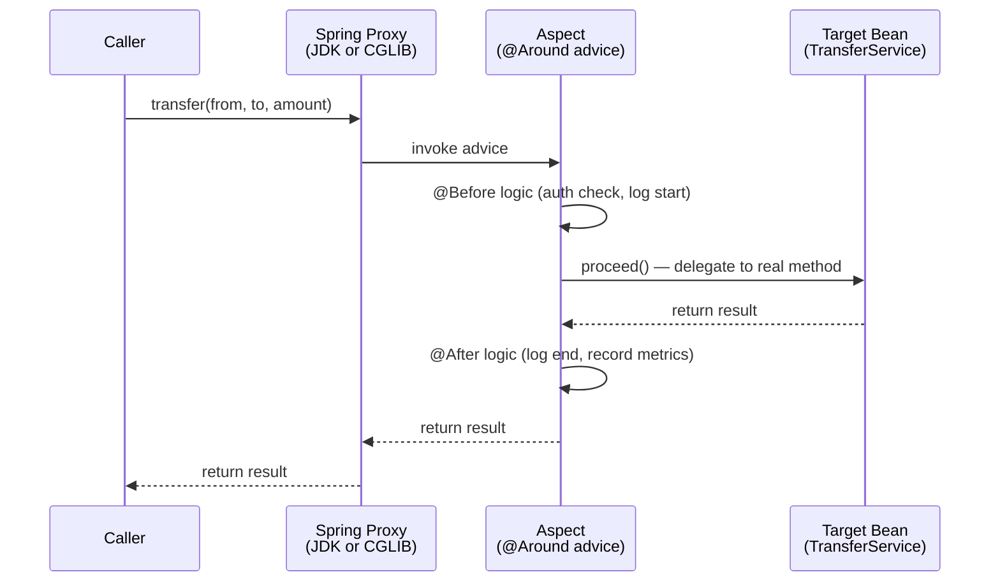
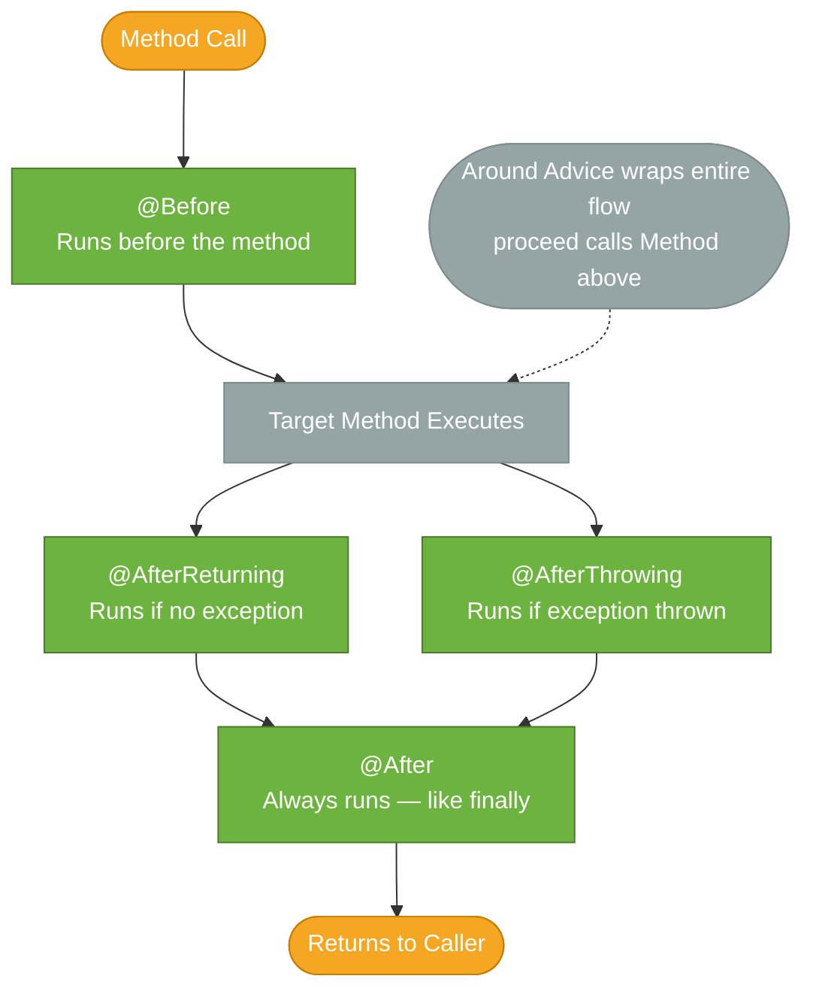

# Spring AOP

> Spring AOP lets you separate cross-cutting concerns — logging, security, transactions, caching — from business logic by applying behaviour around methods via proxies, without modifying the target class.

## What Problem Does It Solve?

Consider a service method that transfers money between accounts. The core logic is three lines: debit one account, credit another, and save. But in production you also need to:

- Start and commit (or roll back) a database transaction
- Check that the caller has the `ROLE_BANKER` permission
- Write an audit log entry with the caller's identity and timestamp
- Record a metrics timer for monitoring dashboards

Without AOP, you'd embed all of this inside the method. The three lines of business logic become 30 lines of infrastructure boilerplate — and you repeat the same pattern in every service method. When the logging format changes or the security check evolves, you must update dozens of methods.

AOP solves this by letting you write each concern once, in a dedicated class called an **Aspect**, and declaratively say *when* and *where* it applies using a **pointcut expression**. The business logic stays clean; the infrastructure concerns are woven in at the proxy level.

## Core Concepts

| Term | Meaning |
|------|---------|
| **Aspect** | A class annotated `@Aspect` that bundles concern logic (like an audit logger) |
| **Advice** | The code to run — annotated with `@Before`, `@After`, `@Around`, etc. |
| **Pointcut** | An expression that matches method signatures — says *where* to apply advice |
| **Join point** | A specific method execution that the pointcut matched |
| **Target object** | The original bean whose method is being intercepted |
| **Proxy** | The wrapper Spring creates around the target to intercept calls |
| **Weaving** | The process of linking aspects to targets — Spring does this at runtime via proxies |

## How Spring AOP Works

Spring AOP is **proxy-based**. The container wraps the target bean in either a JDK dynamic proxy or a CGLIB subclass proxy. Callers interact with the proxy, which intercepts the method call, runs the advice, and then delegates to the real method.



*Every call goes through the proxy, which routes to the aspect's advice and then to the real method.*

### JDK Dynamic Proxy vs. CGLIB

| | JDK Dynamic Proxy | CGLIB |
|--|-------------------|-------|
| Requirement | Target must implement an interface | Works on any concrete class |
| How it works | `java.lang.reflect.Proxy` implements the same interfaces | Generates a subclass of the target at runtime |
| Spring Boot default | CGLIB for all `@Service`/`@Component` beans | ← (same row) |
| When JDK proxy is used | When target only has an interface and `proxyTargetClass = false` | N/A |

:::info
Spring Boot 2+ defaults to CGLIB (`spring.aop.proxy-target-class=true`). You rarely need to configure this manually. CGLIB doesn't require interfaces, which simplifies configuration.
:::

## Advice Types



| Advice | Annotation | Typical use |
|--------|-----------|-------------|
| Before | `@Before` | Auth checks, validation, logging entry |
| After returning | `@AfterReturning` | Log success result, publish event |
| After throwing | `@AfterThrowing` | Error logging, alert on exception type |
| After (finally) | `@After` | Resource cleanup, audit stamp |
| Around | `@Around` | Transactions, caching, retry, full control |

`@Around` is the most powerful — it controls whether the target method is called at all (by not calling `proceed()`), and can modify arguments or return values.

## Pointcut Expressions

Pointcuts use AspectJ expression language:

```
execution(modifiers? return-type declaring-type? method-name(params) throws?)
```

Examples:

```java
// All public methods in service layer
"execution(public * com.example.service.*.*(..))"

// All methods in any class annotated with @Service
"@within(org.springframework.stereotype.Service)"

// Methods annotated with @Transactional (wherever they are)
"@annotation(org.springframework.transaction.annotation.Transactional)"

// All methods whose first argument is a String
"execution(* *(String, ..))"
```

Named pointcuts are reusable:

```java
@Aspect
@Component
public class ServiceAspect {

    @Pointcut("execution(* com.example.service.*.*(..))")
    public void serviceLayer() {}              // ← reusable pointcut name

    @Before("serviceLayer()")
    public void logEntry(JoinPoint jp) {
        System.out.println("Entering: " + jp.getSignature().getName());
    }

    @After("serviceLayer()")
    public void logExit(JoinPoint jp) {
        System.out.println("Exiting: " + jp.getSignature().getName());
    }
}
```

## Code Examples

### Audit Logging Aspect

```java
@Aspect
@Component
@Slf4j
public class AuditAspect {

    @Around("@annotation(com.example.annotation.Audited)")  // ← intercept @Audited methods
    public Object audit(ProceedingJoinPoint pjp) throws Throwable {
        String method = pjp.getSignature().toShortString();
        Object[] args = pjp.getArgs();

        log.info("AUDIT: {} called with args {}", method, args);
        long start = System.currentTimeMillis();

        try {
            Object result = pjp.proceed();        // ← call the real method
            long elapsed = System.currentTimeMillis() - start;
            log.info("AUDIT: {} returned in {}ms", method, elapsed);
            return result;
        } catch (Exception ex) {
            log.error("AUDIT: {} threw {}", method, ex.getMessage());
            throw ex;                              // ← re-throw so callers see the exception
        }
    }
}
```

```java
// Custom marker annotation
@Target(ElementType.METHOD)
@Retention(RetentionPolicy.RUNTIME)
public @interface Audited {}

// Usage in business code — clean, no logging logic here
@Service
public class TransferService {

    @Audited
    public void transfer(String from, String to, BigDecimal amount) {
        // business logic only
    }
}
```

### `@AfterThrowing` for Exception Alerting

```java
@Aspect
@Component
@Slf4j
public class ErrorAlertAspect {

    @AfterThrowing(
        pointcut = "execution(* com.example.service.*.*(..))",
        throwing  = "ex"                      // ← binds the exception to this parameter name
    )
    public void alertOnException(JoinPoint jp, RuntimeException ex) {
        log.error("Service exception in {}: {}",
                  jp.getSignature().getName(), ex.getMessage());
        // send PagerDuty alert, publish metric, etc.
    }
}
```

## The Self-Invocation Trap

The most important limitation of proxy-based AOP: **calling a method on `this` bypasses the proxy**.

```java
@Service
public class OrderService {

    @Transactional
    public void placeOrder(Order order) {
        validateOrder(order);          // ← direct call on 'this'; proxy is bypassed!
        saveOrder(order);
    }

    @Transactional(propagation = Propagation.REQUIRES_NEW)   // ← NEVER runs in its own tx!
    public void saveOrder(Order order) {
        repo.save(order);
    }
}
```

When `placeOrder()` calls `saveOrder()`, it calls `this.saveOrder()` — the call never goes through the Spring proxy, so `@Transactional(REQUIRES_NEW)` has no effect.

**Fix**: Extract `saveOrder` into a separate Spring-managed bean so the call goes through a proxy.

:::danger
The self-invocation trap affects `@Transactional`, `@Cacheable`, `@Async`, and any other Spring annotation backed by AOP. Always call annotated methods through a Spring-managed bean — not through `this`.
:::

## Best Practices

- **Use `@Around` sparingly** — it is the most powerful advice but also the most prone to mistakes (forgetting `proceed()` silently swallows the method call)
- **Prefer annotation-based pointcuts** (`@annotation(...)`) over package-path patterns — they are explicit, refactor-safe, and document intent at the method level
- **Extract complex pointcut expressions into named `@Pointcut` methods** — named pointcuts are composable (`serviceLayer() && !readOnly()`) and readable
- **Do not modify return values in `@AfterReturning`** — use `@Around` if you need to change what the caller receives
- **Log aspect invocations at `TRACE` level** — AOP aspects fire on every matching method; `DEBUG` or higher flooding logs is a common mistake

## Common Pitfalls

- **Self-invocation** — `this.myAnnotatedMethod()` bypasses the proxy; the annotation has no effect (see above)
- **Aspect not applied to `@Configuration` beans** — if an aspect targets `@Bean` factory methods inside `@Configuration`, the result depends on whether proxyMode is on; use `@Conditional` or `@EventListener` for config-level concerns
- **Forgetting `@Component` on the `@Aspect` class** — an aspect without a stereotype annotation is not detected by component scan and simply does nothing
- **Pointcut too broad** — `"execution(* *.*(..))"`  matches Spring's own infrastructure beans and can cause stack overflows or unexpected behavior; always scope to your application packages
- **`@Around` without `proceed()`** — if `pjp.proceed()` is never called, the real method body is silently skipped; always call `proceed()` unless you explicitly want to prevent execution (e.g., caching logic that returns a cached value)

## Interview Questions

### Beginner

**Q:** What is AOP and why is it useful in Spring?
**A:** Aspect-Oriented Programming is a technique for separating cross-cutting concerns — code that spans many classes, like logging, security, and transaction management — into standalone modules called aspects. In Spring, AOP lets you apply these behaviours to methods declaratively (via annotations or pointcut expressions) without cluttering your business logic with infrastructure code.

**Q:** What is the difference between `@Before` and `@Around` advice?
**A:** `@Before` runs before the method executes and cannot prevent the method from running or change its return value. `@Around` wraps the entire execution: it runs before *and* after the method, can prevent execution by not calling `proceed()`, modify arguments, change the return value, or swallow/transform exceptions.

### Intermediate

**Q:** What is the self-invocation problem in Spring AOP?
**A:** Spring AOP is proxy-based — a CGLIB or JDK proxy wraps the target bean and intercepts calls. When a method in the bean calls another method on `this`, the internal call bypasses the proxy and no advice runs. This breaks `@Transactional`, `@Cacheable`, and `@Async` annotations on the internally called method. The fix is to extract the callee into a separate Spring bean so all calls go through a proxy.

**Q:** How does Spring choose between JDK dynamic proxy and CGLIB?
**A:** If `proxyTargetClass = true` (the Spring Boot default), CGLIB is always used, creating a subclass of the target. If `proxyTargetClass = false`, Spring uses a JDK dynamic proxy when the target bean implements at least one interface, and falls back to CGLIB otherwise. CGLIB works on concrete classes; JDK proxy requires interfaces.

### Advanced

**Q:** How would you implement a retry aspect that retries a method up to 3 times on `TransientDataAccessException`?
**A:** Use `@Around` advice, call `proceed()` inside a loop, catch the target exception type, and only re-throw it after the max attempts are exceeded. The aspect state (attempt counter) must be local to the advice invocation — not stored as an aspect field — so concurrent calls don't interfere.

```java
@Around("@annotation(Retryable)")
public Object retry(ProceedingJoinPoint pjp) throws Throwable {
    int maxAttempts = 3;
    for (int attempt = 1; attempt <= maxAttempts; attempt++) {
        try {
            return pjp.proceed();
        } catch (TransientDataAccessException ex) {
            if (attempt == maxAttempts) throw ex;
        }
    }
    throw new IllegalStateException("unreachable");
}
```

**Q:** What is the difference between Spring AOP and full AspectJ?
**A:** Spring AOP runs at runtime using proxies — it can only intercept Spring-managed bean method calls. Full AspectJ uses compile-time or load-time weaving to intercept *any* method call, field access, constructor execution, or static method — including calls on non-Spring-managed objects and calls to `this`. Spring AOP covers 95% of enterprise use cases; AspectJ is needed for exotic scenarios like intercepting field gets or constructor execution.

## Further Reading

- [Spring AOP Reference](https://docs.spring.io/spring-framework/reference/core/aop.html) — official reference covering all advice types, pointcut syntax, and proxy configuration
- [Intro to Spring AOP (Baeldung)](https://www.baeldung.com/spring-aop) — practical guide with complete runnable examples for each advice type

## Related Notes

- [IoC Container](./ioc-container.md) — Spring AOP is implemented through the bean post-processor mechanism; understanding the container explains how proxies are created transparently
- [Spring Events](./spring-events.md) — events are an alternative to `@AfterReturning` advice for decoupled post-action notification, without the self-invocation limitation
- [Dependency Injection](./dependency-injection.md) — the self-invocation trap and its fix (injecting a bean into itself via constructor) make more sense with a solid understanding of how DI and proxies interact
